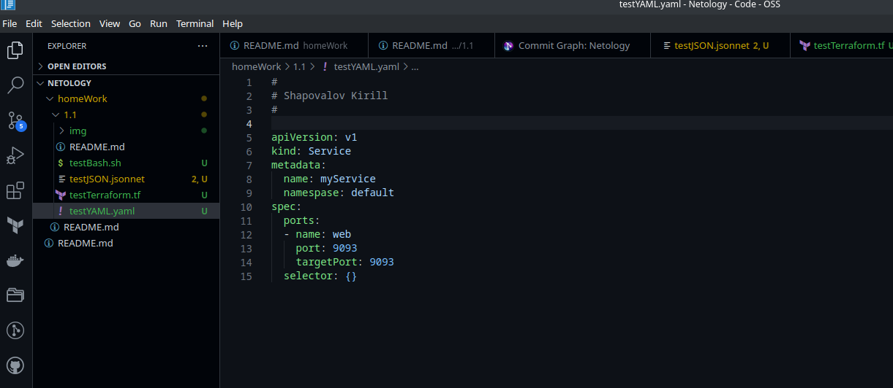
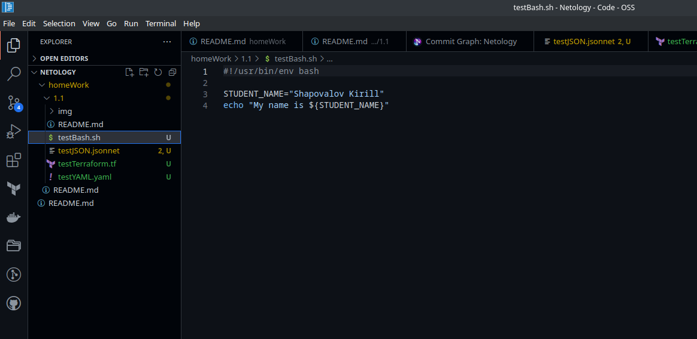
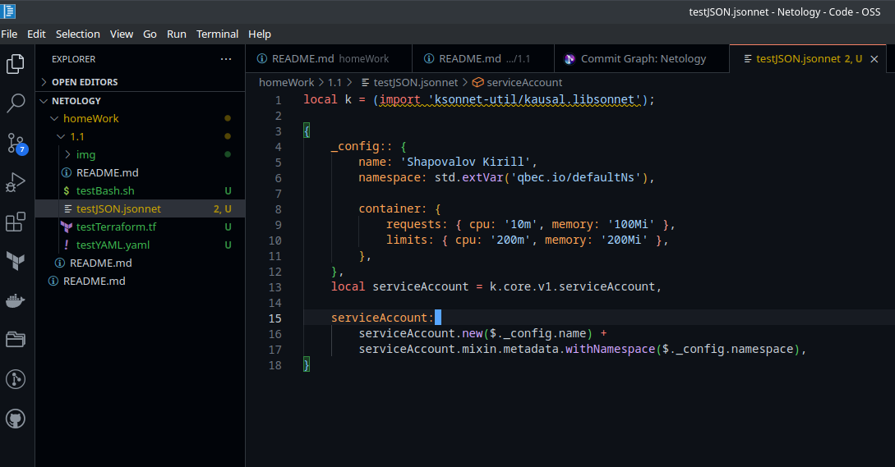
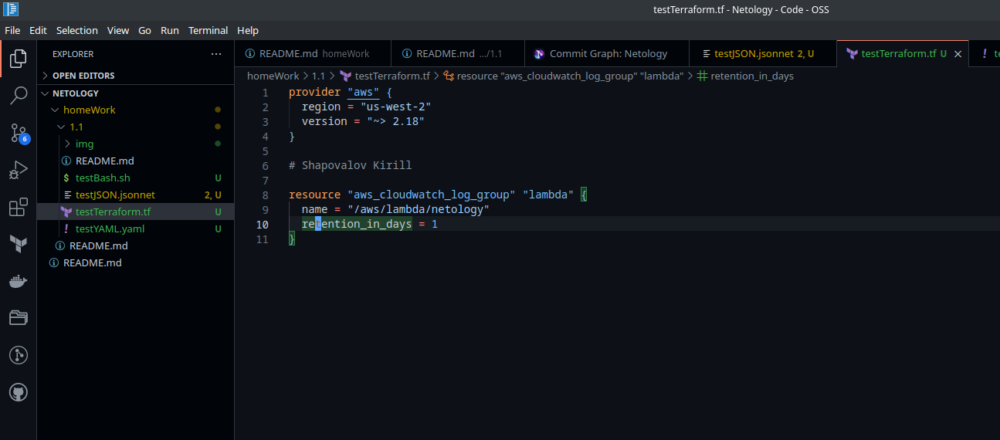
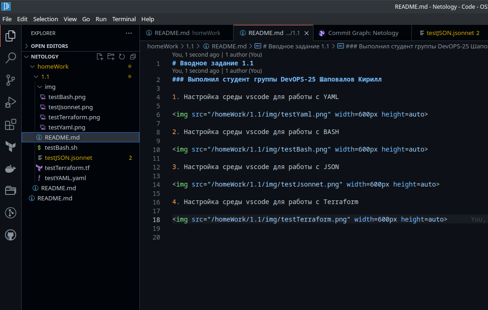

# Вводное задание 1.1
### Выполнил студент группы DevOPS-25 Шаповалов Кирилл

1. Настройка среды vscode для работы с YAML

2. Настройка среды vscode для работы с BASH

3. Настройка среды vscode для работы с JSON

4. Настройка среды vscode для работы с Terraform

5. Настройка среды vscode для работы с MarkDown

