# Выполнение домашнего задания к занятию "3.1. Работа в терминале. Лекция 1"

### Выполнил студент группы DevOps-25 Шаповалов Кирилл


> Введение

Для начала расскажу немного о среде, в которой я работаю и выполняю ДЗ по данному курсу. В качестве основной рабочей машины используется ноутбук с установленной ОС Arch Linux

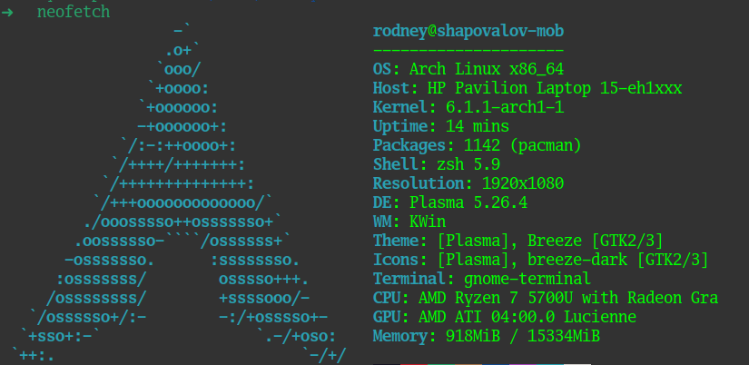

В рабочем окружении также присутствует несколько виртуальных машин с различными ОС. Я выбрал машину с UbuntuServer 22.04 для выполнения данного ДЗ. Доступ к машине настроен через SSH с использованием SSL-ключа.

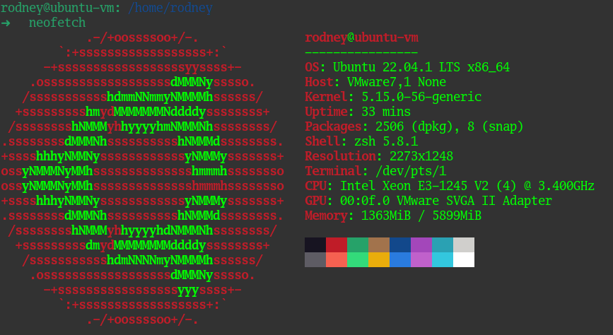
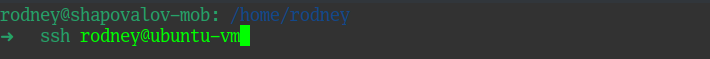

На данной машине установлен гипервизор VMWare Workstation Pro 17 и все дальнейшие манипуляции с Vagrant будут выполняться на данном гипервизоре без установки VirtualBox (хотя это тоже было бы не сложно :) )

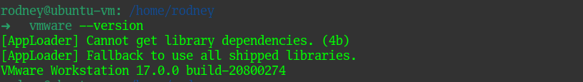

Обычно, на прод и девелоп серверах окружение и оболочки я не меняю и не настраиваю, работаю с тем, что есть из коробки, в своем рабочем окружении использую программную оболочку `zsh` с установленной модификацией `oh-my-zsh` - все это можно видеть на скринах выше.

> 01. Установка Hashicorp Vagrant, инициализация, создание первой ВМ.

С установкой всех компонентов Vagrant проблем не возникло, также не было проблем с доступом до vagrantcloud, для работы есть ВПН.


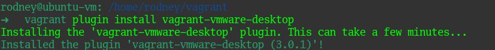
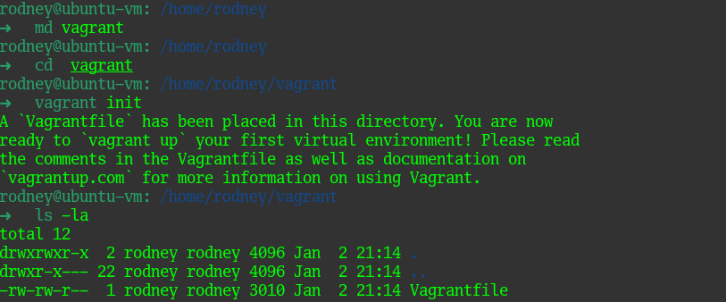

Содержимое файла Vagrant заменено на следующее:

```
 Vagrant.configure("2") do |config|
 	config.vm.box = "bento/ubuntu-20.04"
 end
```
Запуск первой виртуальной машины:

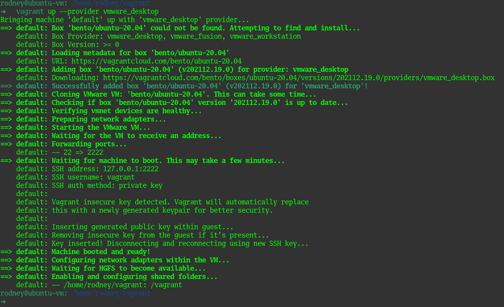

> 02. Знакомство с ресурсами машины, созданной Vagrant по умолчанию.

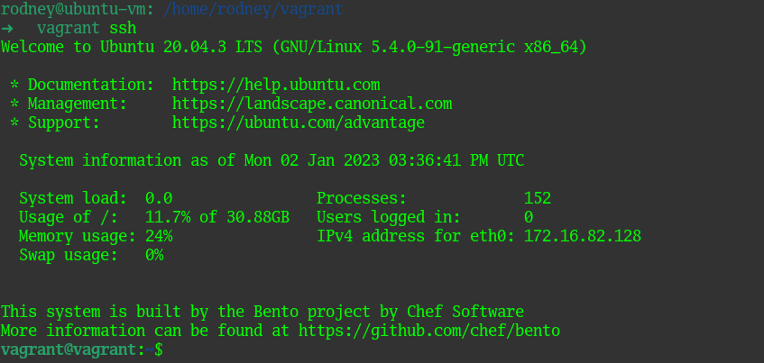
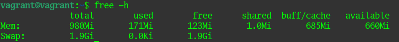
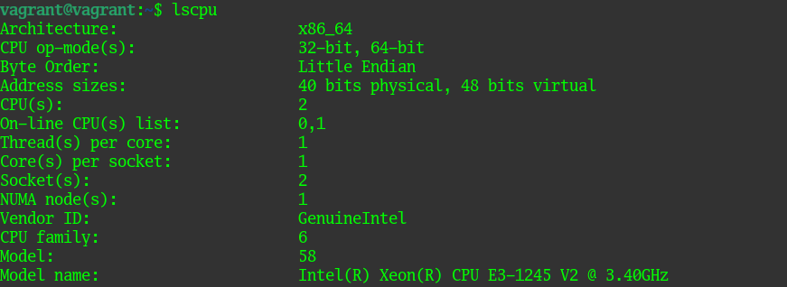

Как видно, Vagrant создал виртуальную машину с 2 vCPU и с 1Гб оперативной памяти.

> 03. Знакомство с документацией Vagrant. Модификация Vagranfile.

Ознакомившись с документацией Vagrant по VMWare - привел содержимое файла Vagrant к следующему виду:

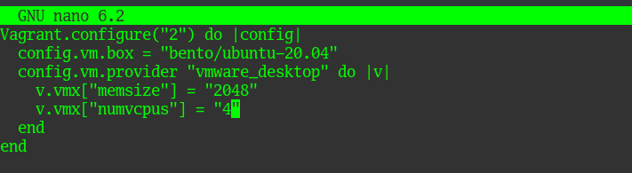

Запустил ВМ. Проверил ресурсы.

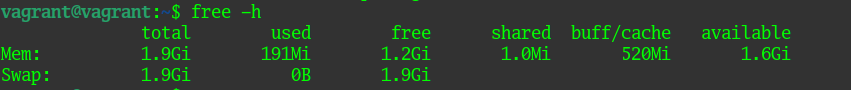
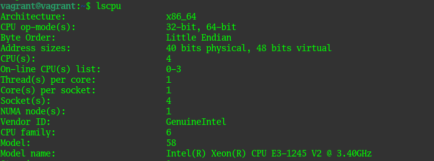

Как видно, машина создана с параметрами, указанными в Vagrantfile.

> 04. Подключение по SSH и уничтожение машины.

Во всех случаях, описанных выше, я подключался к виртуальной машине Vagrant через SSH. Попрактиковавшись, можно уничтожить созданную виртуальную машину, так как больше она мне не понадобится. Все следующие задания я буду выполнять на самом сервере UbuntuServer 22.04

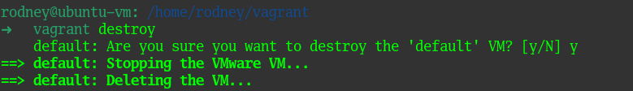

> 05. Ознакомиться с man самого bash.

Команда `man bash` вызовет справочную информацию по оболочке bash, перенаправим вывод данной команды в другой редактор с отображением нумерации строк командой `man bash | less -N`

"Какой переменной можно задать длину журнала `history` и на какой строчке мануала это описано?"

Длина журнала истории и размер файла задается в файле `~/.bashrc` следующими переменными
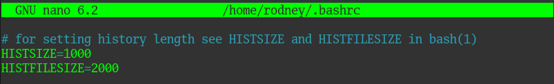

В мануале это указано в 670-683 строках.

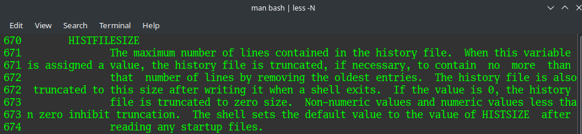
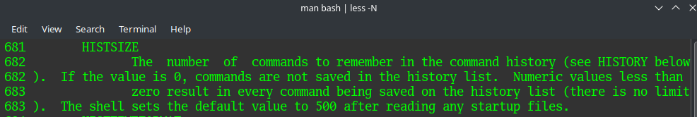

"Что делает директива `ignoreboth` в bash?"

Данная директива является сокращением для ignorespaces и ignoredups. если будет указана данная директива, то в журнале истории не будут сохранены команды, начинающиеся с пробела и команды, совпадающие с последней введенной командой и записанной в журнал истории.


> 06. В каких сценариях применимы скобки `{}` и на какой строчке мануала это написано

Данные скобки применяются при указании условий в циклах, а также при выполнении листа команд (строки 274-279)

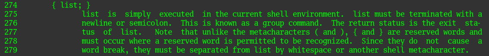

> 07. С учётом ответа на предыдущий вопрос, как создать однократным вызовом `touch` 100000 файлов? Получится ли аналогичным образом создать 300000? Если нет, то почему?

100000 файлов создать получается, а вот 300000 - уже нет, слишком длинный список аргументов для команды `touch`

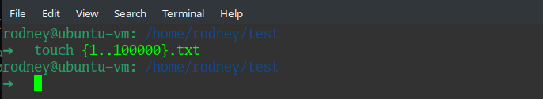


> 08. В man bash поищите по `/\[\[`. Что делает конструкция `[[ -d /tmp ]]`

Данная конструкция возвращает 0 или 1 в зависимости от выполняемой команды внутри квадратных скобок (строка мануала 286-292)

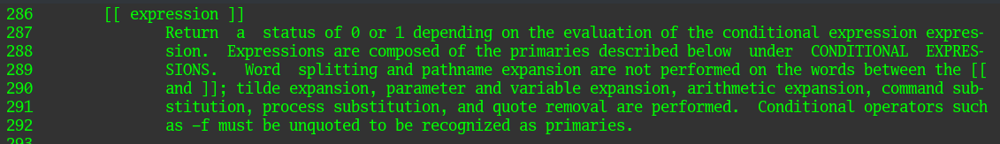
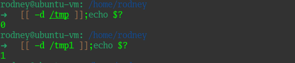
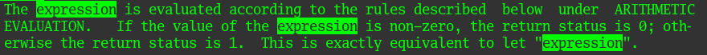

Конструкция `[[ -d /tmp ]]` вернет `1` если каталог `/tmp` отсутствует и `0` - если такой каталог есть. Иными словами - это проверка наличия каталога `/tmp`.

> 09. Сделайте так, чтобы в выводе команды `type -a bash` первым стояла запись с нестандартным путем, например bash is ... Используйте знания о просмотре существующих и создании новых переменных окружения, обратите внимание на переменную окружения PATH

Создадим новый путь для оболочки bash и отредактируем системную переменную PATH, добавив в нее новый путь до оболочки

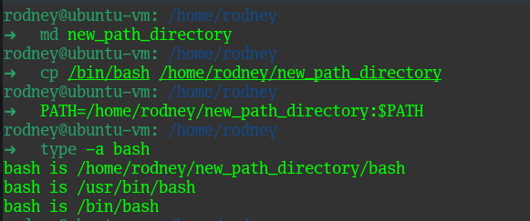

> 10. Чем отличается планирование команд с помощью `batch` и `at`?

Команда `at` запускает действие к определенному времени.

Команда `batch` запускает действие, когда заугрзка системы это позволит, а именно - когда среднее значение загрузки системы упадет ниже 1,5 или ниже значения, указанного при вызове команды `atd`.