# Выполнение домашнего задания к занятию "3.2. Работа в терминале. Лекция 2"

### Выполнил студент группы DevOps-25 Шаповалов Кирилл

> 01. Какого типа команда `cd`? Попробуйте объяснить, почему она именно такого типа: опишите ход своих мыслей, если считаете, что она могла бы быть другого типа.

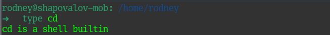

Команда `cd` относится к внутренним командам оболочки. И это логично, так как данная команда осуществляет переход между папками. Если бы данная команда была бы внешней - на каждый вызов данной команды формировался бы отдельный процесс, чего делать не очень логично.

> 02. Какая альтернатива без pipe команде `grep <some_string> <some_file> | wc -l`?

Необходимо обратится к мануалам используемых команд:

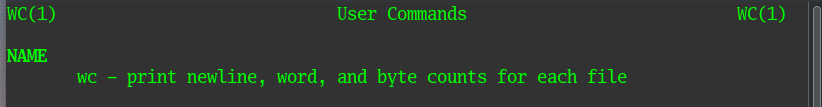


Получается, команда `wc -l` с полученным на вход результатом работы команды `grep` вернет числовое значение количества строк, где встречается требуемое совпадение. Нужно найти подобную опцию в мануале на команду `grep`:

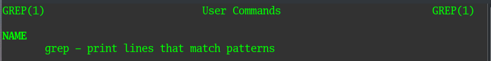
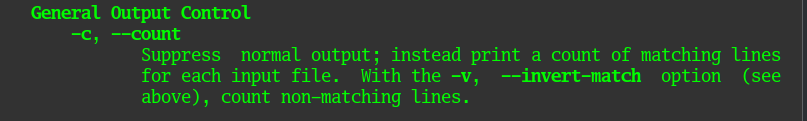

Итого, `grep -c` даст нужный результат. Проверим:


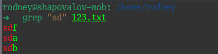
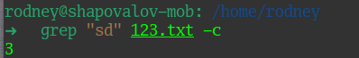

> 03. Какой процесс с PID `1` является родителем для всех процессов в вашей виртуальной машине Ubuntu 20.04?


Родителем всех процессов является процесс `systemd` с PID `1`.

> 04. Как будет выглядеть команда, которая перенаправит вывод `stderr ls` на другую сессию терминала?

В качестве подготовки к выполнению задания создал текстовый файл от имени sudo в папке /root/. Открыл две сессии в разных окнах псевдотерминала.

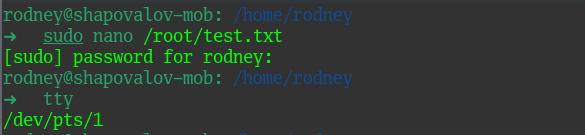
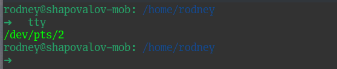

В первом окне терминала попытался удалить данный текстовый файл без применения sudo, вывод `stderr` был перенаправлен во вторую сессию.

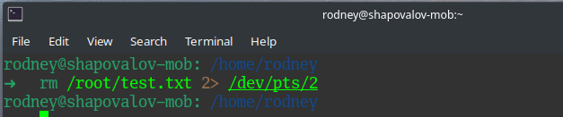
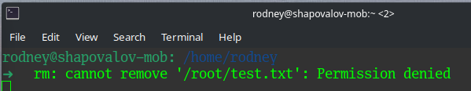

Немного запутал сам себя в данном задании и показал пример с выводом `stderr` при команде `rm`. Однако, построение команды будет точно таким же и при `ls`, например `ls /root 2> /dev/pts/2`.

> 05. Получится ли одновременно передать команде файл на `stdin` и вывести ее `stdout` в другой файл? Приведите работающий пример.

Да, это возможно.

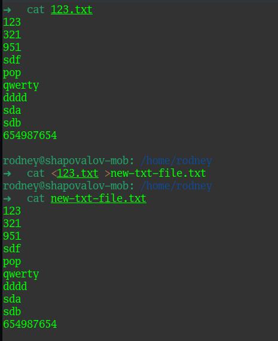

Командой `cat <123.txt >new-txt-file.txt` одновременно получили на вход содержимое файла 123.txt и записали вывод команды в новый текстовый файл. При сравнении содержимое первоначального файла и нового - абсолютно одинаковое.

> 06. Получится ли, находясь в графическом режиме, вывести данные из PTY в какой-либо из эмуляторов TTY? Сможете ли вы наблюдать выводимые данные?

Если про передачу команд между двумя PTY все понятно - результат будет виден сразу, то с передачей команд между PTY и эмулятором TTY не так все просто.

Для того, чтобы открыть эмулятор TTY используем сочетание клавиш `Ctrl+Alt+F2` и авторизуемся в открывшемся консольном режиме в новой сессии. Вернемся в графический режим сочетанием клавиш `Ctrl+Alt+F1` и отправим что-нибудь в сессию на эмуляторе TTY

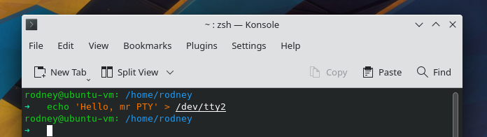

Без повторного перехода в режим эмулятора TTY нельзя увидеть никакого результата. Это аналогично работает и в обратную сторону - пока мы находимся в эмуляторе терминала - мы не видим ничего, что происходит в графической оболочке. Перейдем в эмулятор еще раз и проверим - пришло ли наше сообщение:

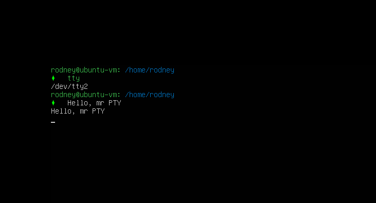

> 07. Выполните команду `bash 5>&1`. К чему она приведет? Что будет, если вы выполните `echo netology > /proc/$$/fd/5?` Почему так происходит?

Команда `bash 5>&1` перенаправляет произвольный дескриптор `5` в стандартный поток вывода.

Команда `echo netology > /proc/$$/fd/5?` перенаправит результат `echo netology` в новый дескриптор `5` в текущей сессии bash (переменная $$), а затем результат отобразится на экране в текущей сессии, так как ранее дескриптор `5` был перенаправлен в `stdout`. 

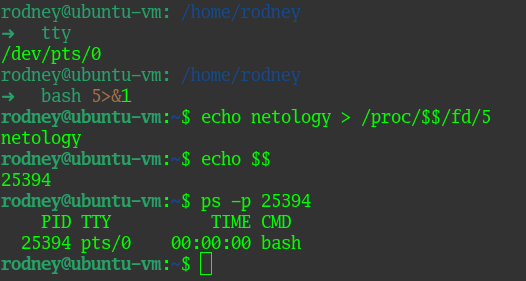

Если открыть новую сессию оболочки - все то же самое работать уже не будет. Так как дескриптор `5` в данной сесси не существует (отличаются PID процессов).

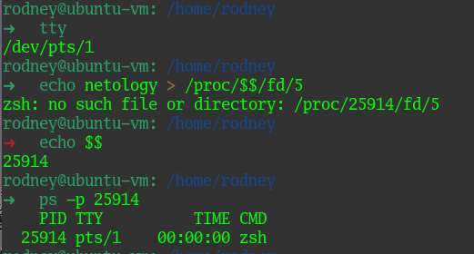

> 08. Получится ли в качестве входного потока для pipe использовать только stderr команды, не потеряв при этом отображение stdout на pty?

Используя знания, полученные в предыдущем пункте - поменяем местами стандартные потоки через произвольный промежуточный дескриптор.

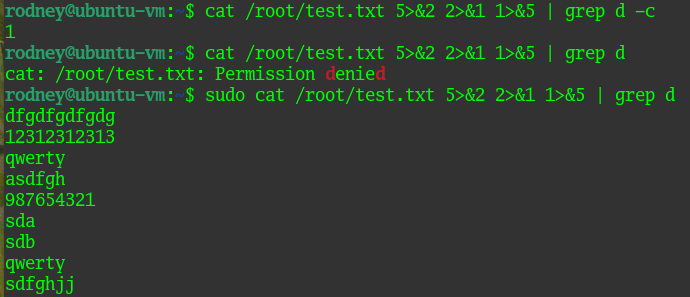

Получили вывод и stdout и stderr в одном потоке.

> 09. Что выведет команда `cat /proc/$$/environ?` Как еще можно получить аналогичный по содержанию вывод?

Данная команда выведет переменные окружения для текущей сессии в одну строку:

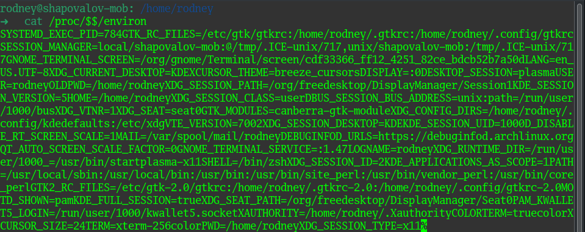

Команды `env` и `printenv` сделают то же самое, но с разбивкой по строкам:

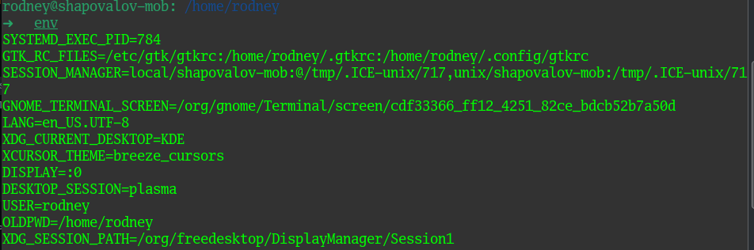
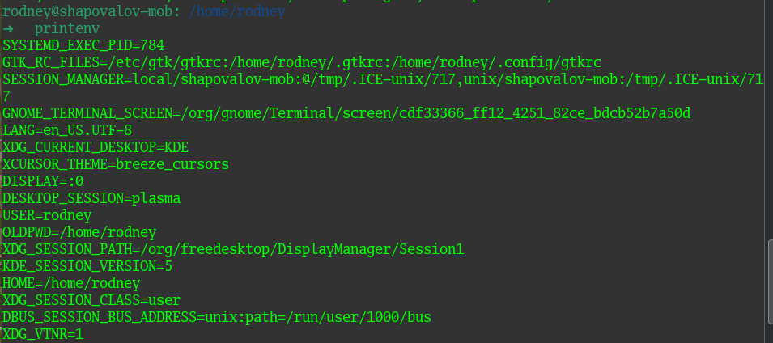

> 10. Используя man, опишите что доступно по адресам `/proc/<PID>/cmdline`, `/proc/<PID>/exe`.

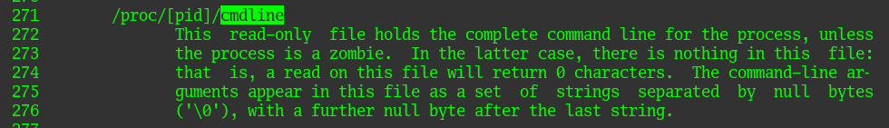

По адресу `/proc/<PID>/cmdline` расположен исполняемый файл процесса PID, пока процесс не станет зомби.

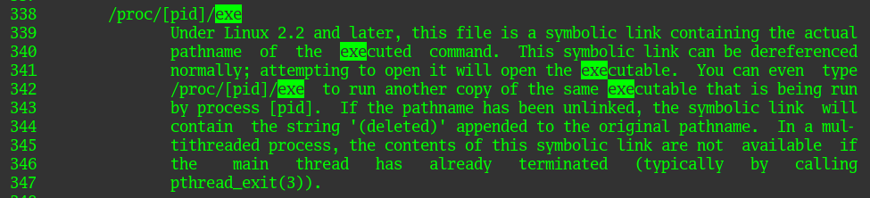

По адресу `/proc/<PID>/exe` содержится полное имя выполняемого файла для процесса PID.

> 11. Узнайте, какую наиболее старшую версию набора инструкций SSE поддерживает ваш процессор с помощью `/proc/cpuinfo`.

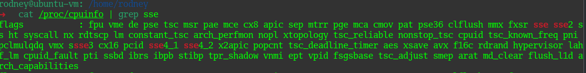

Самая старшая версия SSE для моего процессора - SSE 4.2

> 12. При открытии нового окна терминала и vagrant ssh создается новая сессия и выделяется pty. Это можно подтвердить командой tty, которая упоминалась в лекции 3.2.

```
vagrant@netology1:~$ ssh localhost 'tty'
not a tty
```
При данной команде происходит SSH подключение внутри уже установленного SSH подключения. По умолчанию при такой ситуации tty не выделяется. Исправить ситуацию можно ключем -t для принудительного выделения tty.

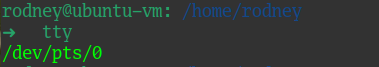
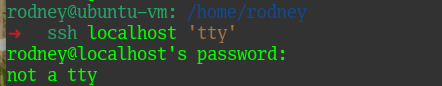
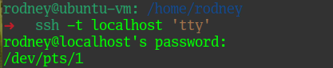

> 13. Бывает, что есть необходимость переместить запущенный процесс из одной сессии в другую. Попробуйте сделать это, воспользовавшись `reptyr`. Например, так можно перенести в screen процесс, который вы запустили по ошибке в обычной SSH-сессии.

Поначалу запутался с работой данной утилиты. Никогда не пользовался ей до этого, пришлось поразбираться :)

В одном окне терминала открыл на редактирование файл с помощью nano и отправил его в замороженное состояние.

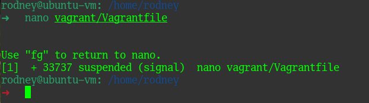

Используя команду reptyr с ключем -T для PID замороженного процесса в новом окне терминала вернул файл на редактирование:

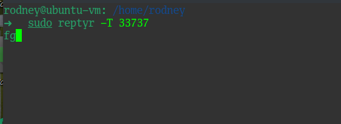
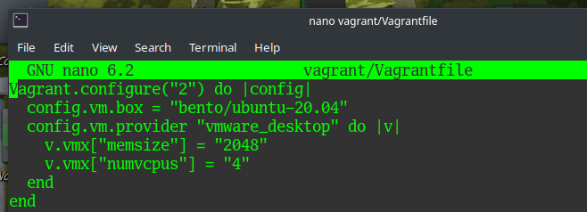

> 14. `sudo echo string > /root/new_file` не даст выполнить перенаправление под обычным пользователем, так как перенаправлением занимается процесс shell'а, который запущен без sudo под вашим пользователем. Для решения данной проблемы можно использовать конструкцию `echo string | sudo tee /root/new_file`. Узнайте? что делает команда `tee` и почему в отличие от `sudo echo` команда с `sudo tee` будет работать.

Согласно мануалу `tee - read from standard input and write to standard output and files`.

В случае с `sudo echo string > /root/new_file` от имени sudo выполняется только вывод в stdout результата команды echo, а перенаправлением занимается сама оболочка, запущенная не от имени sudo.

В случае с `echo string | sudo tee /root/new_file` перенаправляет полученный на вход stdout от команды echo в новый файл утилита `tee`, которая выполняется от имени sudo. Поэтому все будет работать.