# Выполнение домашнего задания к занятию "Домашнее задание к занятию "3.3. Операционные системы. Лекция 1""

### Выполнил студент группы DevOps-25 Шаповалов Кирилл

> 01. Какой системный вызов делает команда `cd`?

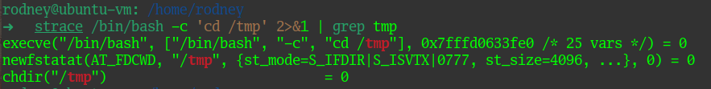

Команда `cd` выполняет системный вызов `chdir`.

> 02. Попробуйте использовать команду `file` на объекты разных типов в файловой системе. Используя `strace` выясните, где находится база данных `file`, на основании которой она делает свои догадки.

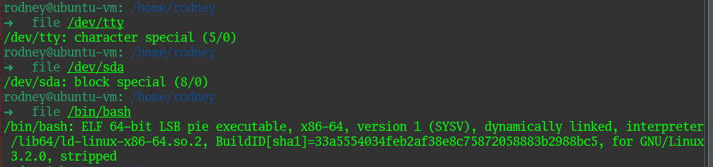

Чтобы понять что делает команда `file`, обратился к `man file`.

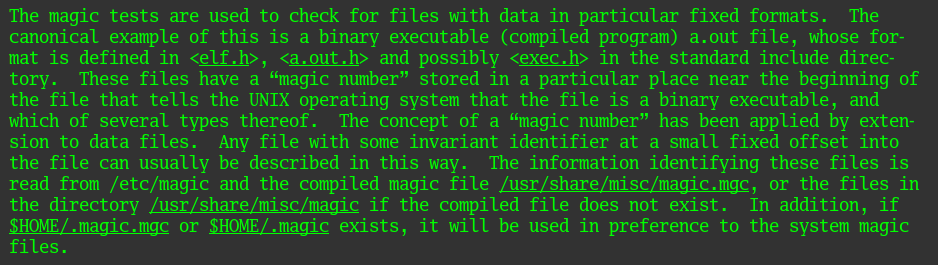

Из этого следует, что данная команда определяет тип файла на основании так называемого "магического числа", содержащегося в начале файла. Информация, которая позволяет идентифицировать файл, находится в `/etc/magic`, и в файле `/usr/share/misc/magic.mgc`, а если такого файла нет, то по пути `/usr/share/misc/magic`. Так же, если созданы файлы `.magic.mgc, .magic` в домашних каталогах пользователей, такие файлы будут рассматриваться в приоритете.

Закрепим на практике

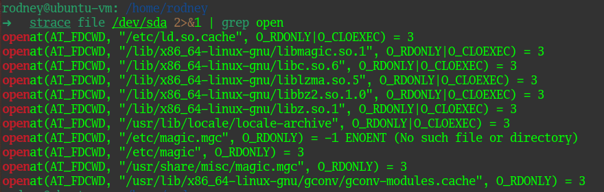

> 03. Предположим, приложение пишет лог в текстовый файл. Этот файл оказался удален (deleted в lsof), однако возможности сигналом сказать приложению переоткрыть файлы или просто перезапустить приложение – нет. Так как приложение продолжает писать в удаленный файл, место на диске постепенно заканчивается. Основываясь на знаниях о перенаправлении потоков предложите способ обнуления открытого удаленного файла (чтобы освободить место на файловой системе).

Для выполнения данного задания подготовил небольшой простой скрипт

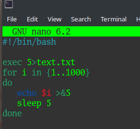

Данный скрипт определяет дескриптор 5 для файла text.txt и пишет в данный дескриптор числа от 1 до 1000 с интервалом в 5 секунд.

С помощью команды `sudo chmod +x test.sh` делаем файл исполняемым и выполняем в фоне - `./test.sh &`

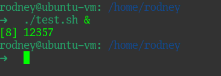

Видим, какой PID получил наш процесс в фоне. С помощью команды `lsof` по известному PID процесса определяем, что наш текстовый файл открылся и используется нашим скриптом.

Удаляем файл `rm text.txt` и проверяем.

Убедимся, что файл продолжает расти в объеме:

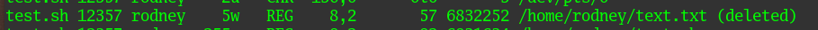

Размер у файла был 36, а стал 57. Файл растет, даже после удаления. Обнулим наш файл, отправив ничего в дескриптор `5` процесса `12357` - команда `echo " " > /proc/12357/fd/5`.

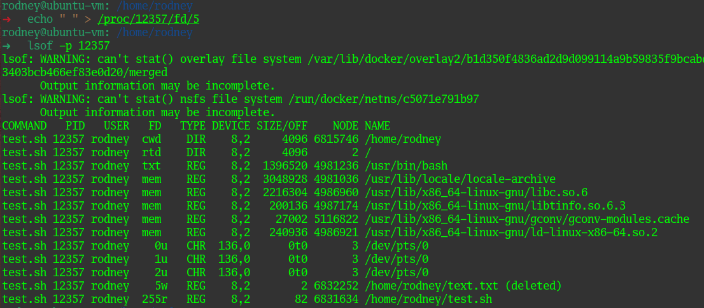

Как видно, размер файла обнулился. Задача обнуления выполнена.

> 04. Занимают ли зомби-процессы какие-то ресурсы в ОС (CPU, RAM, IO)?

Зомби-процессы не занимают никаких ресурсов в ОС (CPU, RAM, IO), однако не освобождают PID в таблице процессов.

> 05. На какие файлы вы увидели вызовы группы open за первую секунду работы утилиты? Воспользуйтесь пакетом `bpfcc-tools` для Ubuntu 20.04. 

На машине с Ubuntu 22.04 пакет `bpfcc-tools` установился без дополнительных танцев в одну команду `sudo apt install bpfcc-tools`.

Чтобы понять, что делает команда `opensnoop` обратился к ее мануалу.

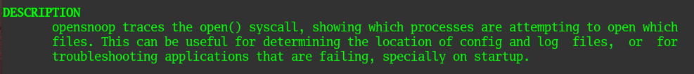

в хелпе по данной команде указано, что если запустить команду с ключем `-d`, то можно указать время, которое отработает утилита. Выполнил так `sudo opensnoop-bpfcc -d 1`.

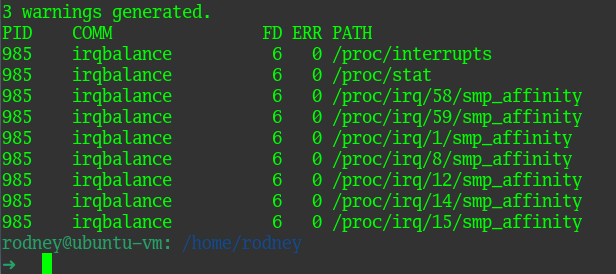

> 06. Какой системный вызов использует `uname -a`? Приведите цитату из `man` по этому системному вызову, где описывается альтернативное местоположение в `/proc`, где можно узнать версию ядра и релиз ОС.

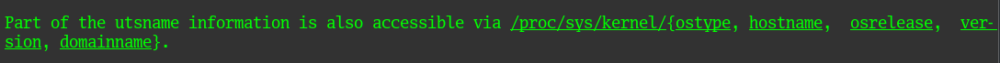

> 07. Чем отличается последовательность команд через `;` и через `&&` в bash? Есть ли смысл использовать в bash `&&`, если применить `set -e`?

В `man bash` найдем информацию по операторам `;` и `&&`

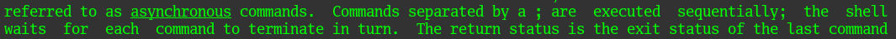

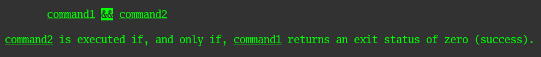

Таким образом, команды через `;` выполняются последовательно друг за другом. Команды через `&&` будут выполнены тогда и только тогда, когда команда до символа `&&` вернет код выполнения `0`.

Команду `set -e` имеет смысл использовать, поскольку при `&&` выход из скрипта будет только по последней команде, если она завершится с кодом `1`. Команда `set -e` завершит выполнение на любом шаге, если получит в качестве кода выхода `1`.

> 08. Из каких опций состоит режим bash `set -euxo pipefail` и почему его хорошо было бы использовать в сценариях?

`-e` - завершает выполнение на любом шаге если получит код, отличный от `0`

`-u` - завершает выполнение и выдает сообщение об ошибке, если использовалась подстановка несуществующей переменной

`-x` - включает дебаг-режим, то есть выводит результат выполнения каждой команды

`-o pipefail` - если задано, выведет результат выполнения последней команды, если он будет отличен от `0`

Данный режим очень хорош в сценариях для дебага, так как позволяет останавливать выполнение по любой ошибке и отображать это.

> 09. Используя `-o stat` для `ps`, определите, какой наиболее часто встречающийся статус у процессов в системе. В `man ps` ознакомьтесь (/PROCESS STATE CODES) что значат дополнительные к основной заглавной буквы статуса процессов. Его можно не учитывать при расчете (считать S, Ss или Ssl равнозначными).

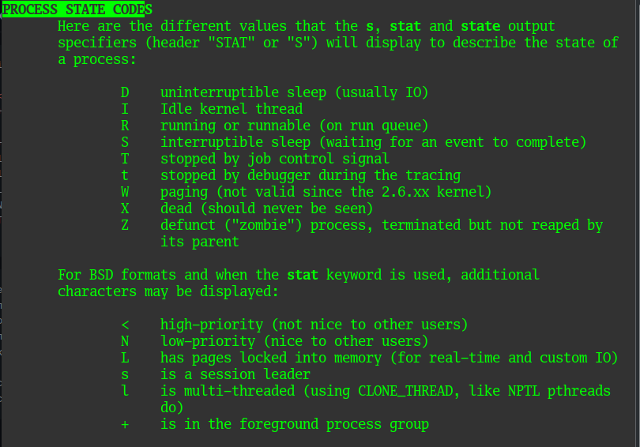

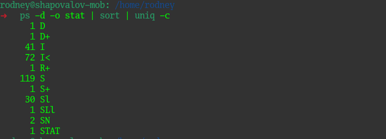

Как видно, больше всего процессов с кодами I и S, это процессы ожидания ядра и спящие прерываемые процессы соответственно.