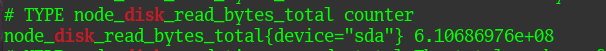

# Выполнение домашнего задания к занятию "Домашнее задание к занятию "3.3. Операционные системы. Лекция 2"

### Выполнил студент группы DevOps-25 Шаповалов Кирилл

> 01. На лекции мы познакомились с `node_exporter`. В демонстрации его исполняемый файл запускался в background. Этого достаточно для демо, но не для настоящей production-системы, где процессы должны находиться под внешним управлением. Используя знания из лекции по systemd, создайте самостоятельно простой unit-файл для `node_exporter`.

Весь процесс установки, настройки и запуска будет на скриншотах ниже

Для запуска утилиты в качестве службы создал файл `/lib/systemd/system/node_exporter.service` со следующим содержанием

После `sudo systemctl daemon-reload` включил автозапуск сервиса после перезагрузки, попытался запустить - поймал ошибку.

Почитав `journalctl` понял, что причина проста - забыл создать файл с опциями `/etc/default/node_exporter`. После создания данного файла сервис без проблем запустился.

Убедился, что сервис слушает необходимый порт.

После этого можно смело говорить, что данный сервис готов к работе.

> 02. Ознакомьтесь с опциями node_exporter и выводом `/metrics` по-умолчанию. Приведите несколько опций, которые вы бы выбрали для базового мониторинга хоста по CPU, памяти, диску и сети.

Если `node_exporter` развернут на машине в локальной сети (как делал я), то к его метрикам можно обратиться через браузер по адресу `http://ip_addr:9100/metrics`. Через терминал можно сделать то же самое командой `curl http://ip_addr:9100/metrics`. Ниже привел некоторые метрики, которые можно замониторить в качестве базового варианта мониторинга.

-

-

-

> 03. Установите в свою виртуальную машину Netdata. Воспользуйтесь готовыми пакетами для установки.

Netdata успешно установлена. Убедился, что служба находится на нужном порту:

Ну и зашел по нужному адресу с другой машины в локальной сети. Походил по ссылкам, посмотрел какие метрики собирает Netdata, как это вообще выглядит, познакомился с данным инструментом (ранее его не использовал никогда).

> 04. Можно ли по выводу `dmesg` понять, осознает ли ОС, что загружена не на настоящем оборудовании, а на системе виртуализации?

Да, можно.

> 05. Как настроен `sysctl fs.nr_open` на системе по-умолчанию? Определите, что означает этот параметр. Какой другой существующий лимит не позволит достичь такого числа (ulimit --help)?

В данном случае видим системное ограничение по умолчанию на количество открытых файлов (файловых дескрипторов). Данное ограничение можно просмотреть в файле:

Однако, данного ограничения все равно достичь не получится, так как есть жесткие и мягкие ограничения для пользовательских сессий.

В данном случае видно ограничение открытых файлов для текущей пользовательской сессии. Мягкое ограничение будет совпадать с этим числом, его получить можно командой `ulimit -Sn`. Жесткое ограничение можно увидеть командой `ulimit -Hn`

Отдельно можно задавать постоянные ограничения в файлах `/etc/security/limits.conf` и `/etc/security/limits.d/nofile`. Здесь можно задать ограничения на пользователей или группы.

> 06. Запустите любой долгоживущий процесс (не ls, который отработает мгновенно, а, например, sleep 1h) в отдельном неймспейсе процессов; покажите, что ваш процесс работает под PID 1 через nsenter.

> 07. Найдите информацию о том, что такое `:(){ :|:& };:`. Запустите эту команду в своей виртуальной машине Vagrant с Ubuntu 20.04 (это важно, поведение в других ОС не проверялось). Некоторое время все будет "плохо", после чего (минуты) – ОС должна стабилизироваться. Вызов dmesg расскажет, какой механизм помог автоматической стабилизации. Как настроен этот механизм по-умолчанию, и как изменить число процессов, которое можно создать в сессии?

Данная команда представляет из себя так называемую "форк-бомбу". Она представляет собой функцию, которая вызывает себя дважды - на переднем плане и в фоне, после чего каждый экзепляр функции проделывает это снова и снова, пока операционной системе не становится плохо от нехватки ресурсов.

Для начала я пробовал запустить данную конструкцию в виртуальной машине Ubuntu 22.04. На данной машине достаточное количество ресурсов ЦПУ и ОЗУ. Стабилизации данной виртуальной машины достичь не удалось за час работы команды.

После запуска команды можно посмотреть на мониторинг машины через Netdata:

Это еще на старте работы функции, позднее и память ушла за 90%.

После этого была запущена виртуальная машина Vagrant Ubuntu 20.04 с ограничением ресурсов в 2 ядра и 1Гб оперативной памяти. Работа утилиты была проверена в ней.

В ней спустя какое-то время работа машины действительно стабилизировалась. Лог `dmesg` показал, что стабилизировало машину:

`cgroup: fork rejected by pids controller in /user.slice/user-1000.slice/session-4.scope` - и был тем самым механизмом, стабилизировавшим машину.

Как сказано в мануале по cgroup - это технология ядра linux, которая позволяет организовывать процессы в иерархические группы, в которых затем она может ограничивать и контролировать использование ресурсов.

Чтобы недопустить подобного поведения для текущей оболочки - можно задать ограничение по количеству запускаемых процессов, напримем, командой `ulimit -n 500`. Для более существенных и постоянных ограничений нужно отредактировать файл `/etc/security/limits.conf`.