# Домашнее задание к занятию "3.5. Файловые системы"

### Выполнил студент группы DevOps-25 Шаповалов Кирилл

> 01. Узнайте о `sparse` (разрежённых) файлах

Разрежённый файл это такой файл, в котором последовательность нулевых байтов заменена на информацию об этой последовательности - дыру. А дыра это как раз и есть та самая последовательность, которая не записывается на диск. Информация о дрыах хранится в метаданных файловой системы и используется при выполнении операций с файлами. Таким образом, разрежённый файл занимает меньше места на диске, обеспечивая более эффективное использование дискового пространства.

> 02. Могут ли файлы, являющиеся жесткой ссылкой на один объект, иметь разные права доступа и владельца? Почему?

Нет, не могут. Жесткие ссылки ссылаются (масло масляное :)) на inode объекта, в котором хранится вся метаинформация, потому и сам объект, и все жесткие ссылки на него обладают одними и теми же правами.

> 03. Сделайте vagrant destroy на имеющийся инстанс Ubuntu. Замените содержимое Vagrantfile следующим...

Все дальнейшие задания выполнены в виртуальной машине VMWare Ubuntu 22.04. К ней добавлены два диска размером по 2,5Гб (диски `sdb` и `sdc`).

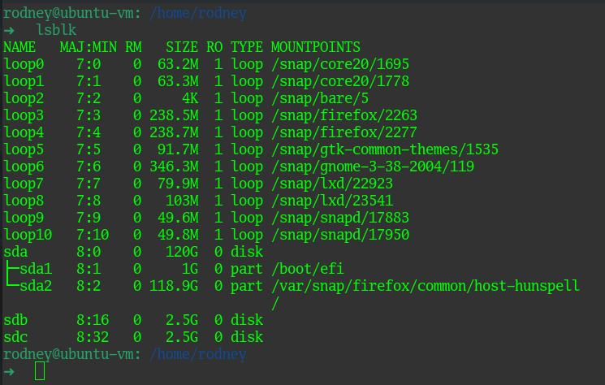

> 04. Используя `fdisk`, разбейте первый диск на 2 раздела: 2 Гб, оставшееся пространство.

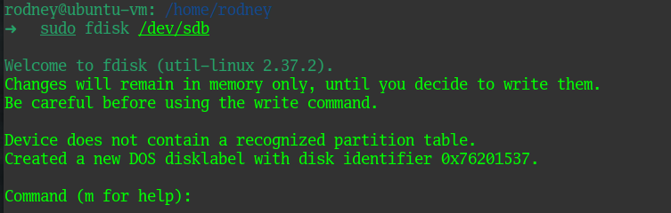

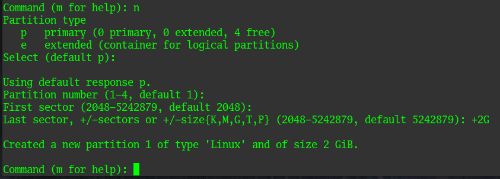

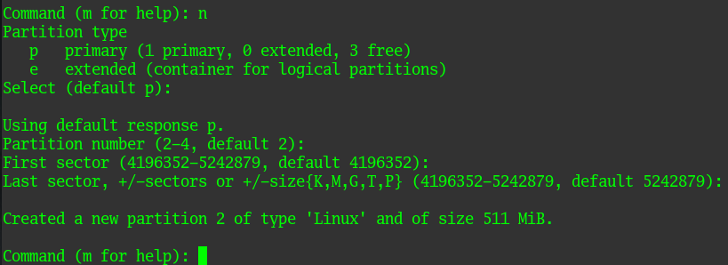

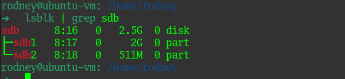

> 05. Используя `sfdisk`, перенесите данную таблицу разделов на второй диск.

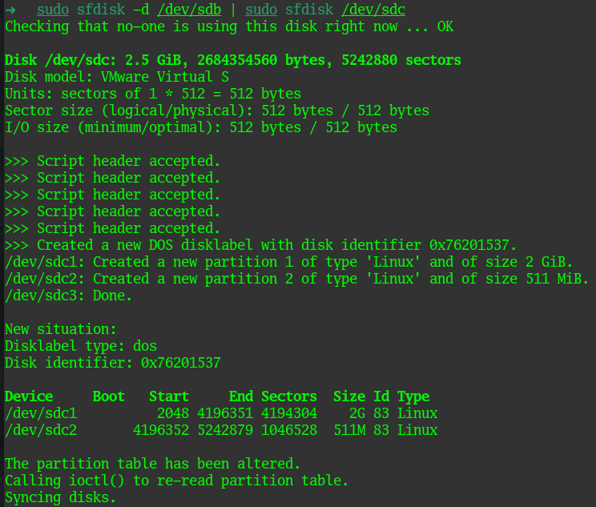

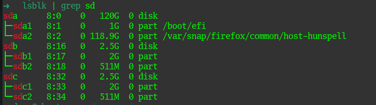

> 06. Соберите `mdadm` RAID1 на паре разделов 2 Гб.

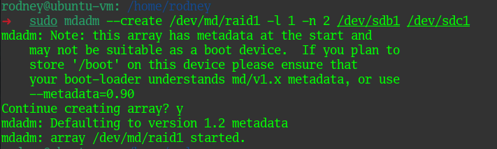

> 07. Соберите `mdadm` RAID0 на второй паре маленьких разделов.

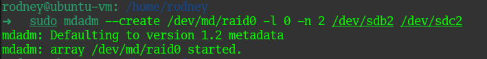

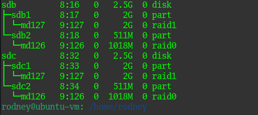

> 08. Создайте 2 независимых PV на получившихся md-устройствах.

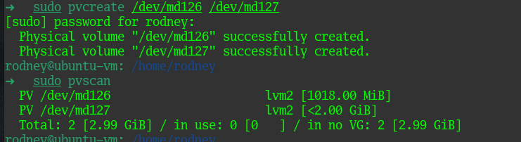

> 09. Создайте общую volume-group на этих двух PV.

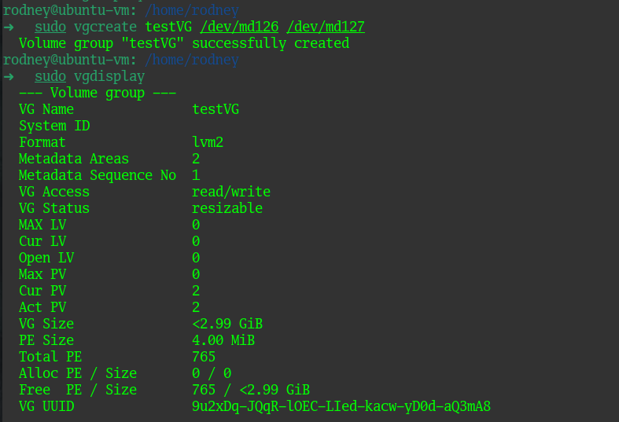

> 10. Создайте LV размером 100 Мб, указав его расположение на PV с RAID0.

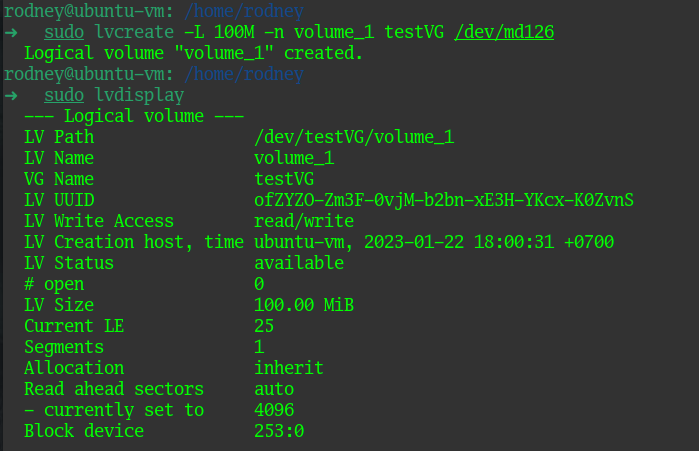

> 11. Создайте `mkfs.ext4` ФС на получившемся LV.

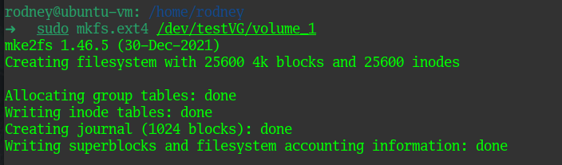

> 12. Смонтируйте этот раздел в любую директорию, например, `/tmp/new`.

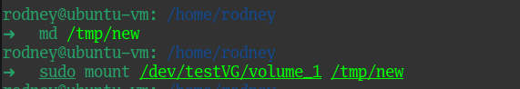

> 13. Поместите туда тестовый файл, например `wget https://mirror.yandex.ru/ubuntu/ls-lR.gz -O /tmp/new/test.gz`.

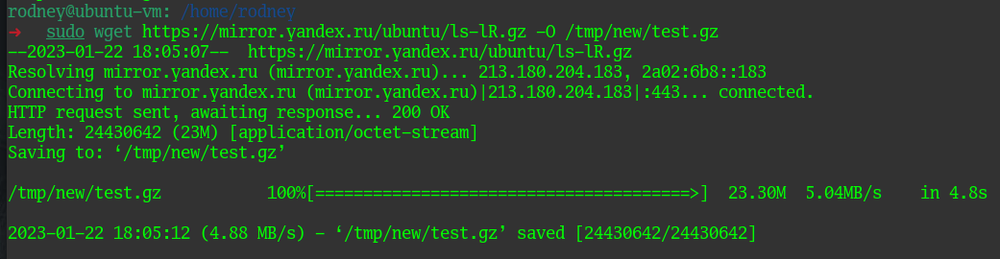

> 14. Прикрепите вывод `lsblk`.

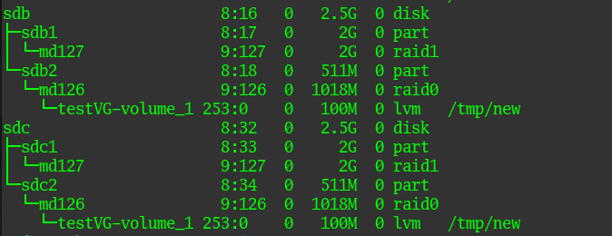

> 15. Протестируйте целостность файла.

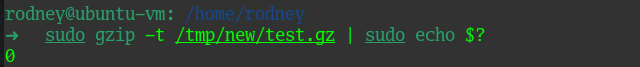

> 16. Используя `pvmove`, переместите содержимое PV с RAID0 на RAID1.

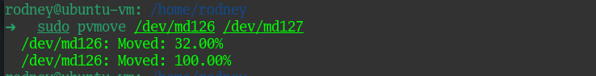

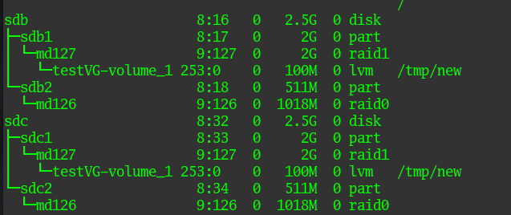

> 17. Сделайте `--fail` на устройство в вашем RAID1 md.

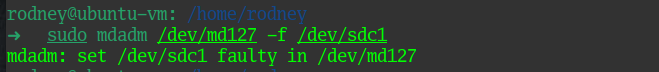

> 18. Подтвердите выводом `dmesg`, что RAID1 работает в деградированном состоянии.

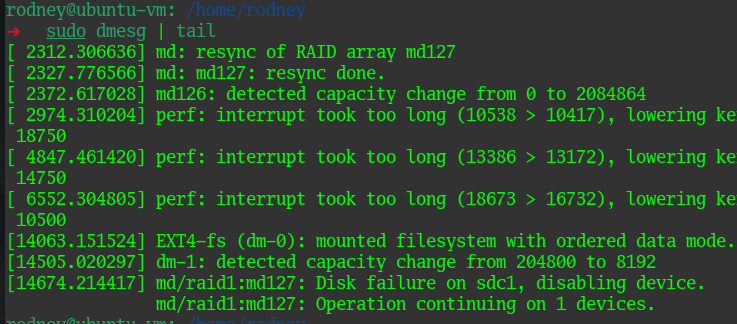

> 19. Протестируйте целостность файла, несмотря на "сбойный" диск он должен продолжать быть доступен.

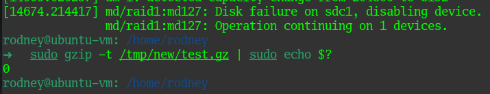