# Домашнее задание к занятию "Компьютерные сети. Лекция 2"

### Выполнил студент группы DevOps-25 Шаповалов Кирилл

> 01. Проверьте список доступных сетевых интерфейсов на вашем компьютере. Какие команды есть для этого в Linux и в Windows?

В Windows самым простым способом посмотреть сетевые интерфейсы является команда `ipconfig /all`. Есть еще возможность сделать это powershell запросом.

В Linux набор команд побогаче:

`ip -br a` - вывод краткой информации о доступных сетевых интерфейсах

`ip a` - вывод полной информации о доступных сетевых интерфейсах

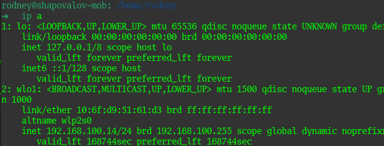

`ifconfig` - так же выведет подробную информацию о доступных интерфейсах

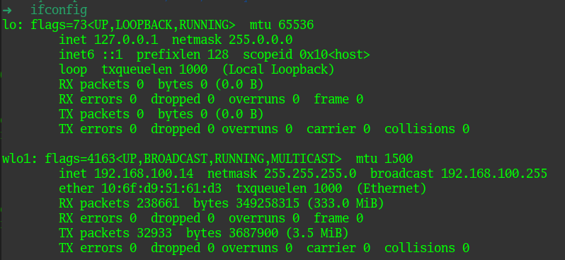

`netstat -i` - выведет список доступных интерфейсов со статистикой по пакетам

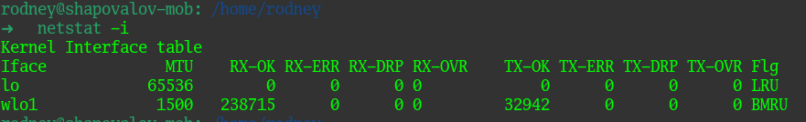

> 02. Какой протокол используется для распознавания соседа по сетевому интерфейсу? Какой пакет и команды есть в Linux для этого?

LLDP (Link Layer Discovery Protocol, стандарт 802.1ab) - протокол канального уровня, позволяющий коммутатору оповещать устройства в сети о своем существовании, передавать сведения и характеристики и получать аналогичные данные от сетевых устройств.

Для отображения соседа по сетевому интерфейсу в Linux нужно установить пакет `lldpd` и воспользоваться командой `lldpctl`:

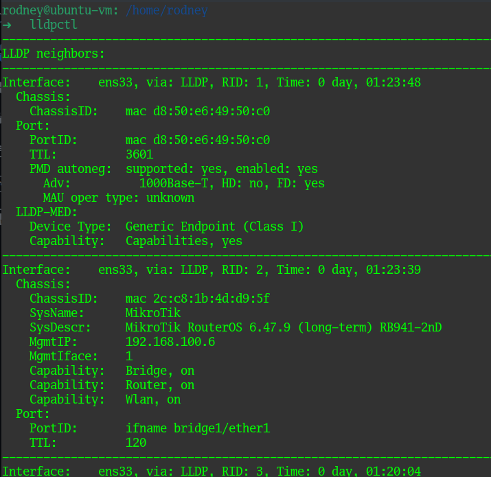

> 03. Какая технология используется для разделения L2 коммутатора на несколько виртуальных сетей? Какой пакет и команды есть в Linux для этого? Приведите пример конфига.

Для разделения коммутатора на несколько виртуальных сетей используется технология VLAN. Для Ubuntu используется пакет `vlan`.

Рассмотрим конфиг-файл для сети с вланами на примере `netplan` в Ubuntu 22.04

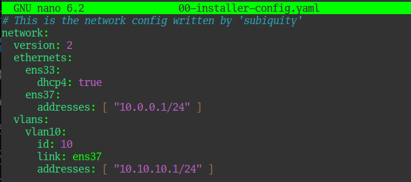

Здесь на базе интерфейса `ens37` будет работать еще и влан с id = 10. Что изменилось в выводе `ip a`:

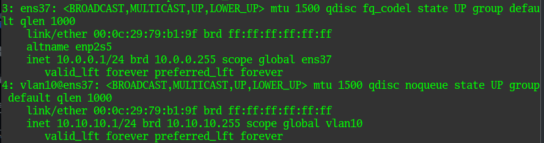

Добавился новый виртуальный сетевой интерфейс `vlan10@ens37` со своей адресацией.

> 04. Какие типы агрегации интерфейсов есть в Linux? Какие опции есть для балансировки нагрузки? Приведите пример конфига.

В Linux существует два типа агрегации интерфейсов - Bonding и Teaming.
Предполгается, что тиминг пришел на смену бондингу, но по факту используют и то и другое. Режимы работы у них плюс/минус одинаковые или очень похожие. На примере Bonding это выглядит так:

`mode = 0` - balance-rr - режим работы по умолчанию. Пакеты передаются последовательно по кругу на все сетевые интерфейсы. Если один из интерфейсов выходит из строя - пакеты передаются на остальные, минуя вышедший из строя. Режим обеспечивает балансировку и отказоустойчивость.

`mode = 1` - active backup - в этом режиме работы пакеты передаются на один сетевой интерфейс, в то время как второй находится в резерве. При выходе из строя первого интерфейса задействуется второй.

`mode = 2` - balance-xor - в этом режиме передача пакетов распределяется по типу входящего и исходящего трафика по формуле `((MAC src) XOR (MAC dest)) % число интерфейсов`. В данном режиме так же достогается балансировка и отказойстойчивость.

`mode = 3` - broadcast - этот режим отправляет все пакеты во все объединенные порты.

`mode = 4` - 802.3ad dynamic link aggregation - динамическое объединение одинаковых портов с одинаковыми параметрами скорости, дуплекса и т.д. Позволяет значительно расширить пропускную способность, но требуется поддержка стандарта и дополнительная настройка на уровне коммутатора.

`mode = 5` - balance-tlb - исходящий трафик распределяется в соответствии с загрузкой каждого сетевого интерфейса, а входящий принимается только активным. Специальной настройки на коммутаторе не требуется.

`mode = 6` - balance-alb - по сравнению с пятым режимом здесь балансируется и исходящий и входящий трафик. Балансировка входящего трафика достигается путем ARP-согласования. Специальной настройки на коммутаторе также не требуется.

Изменим конфиг netplan из предыдущего пункта для бондинга. Для этого в виртуальную машину добавил еще один сетевой адаптер.

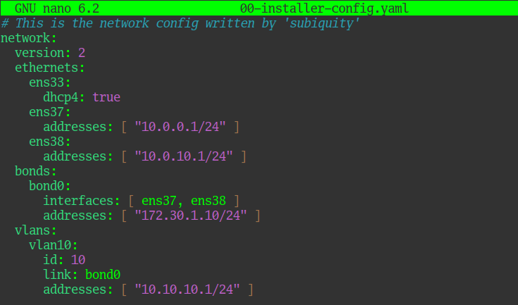

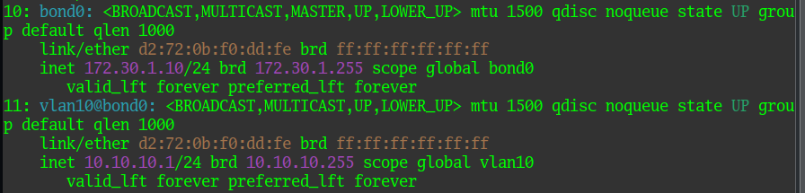

Как видно, появился интерфейс bond0 со своей адресацией, а влан с id=10 теперь работает поверх данного bond-интерфейса.

> 05. Сколько IP адресов в сети с маской /29 ? Сколько /29 подсетей можно получить из сети с маской /24. Приведите несколько примеров /29 подсетей внутри сети 10.10.10.0/24.

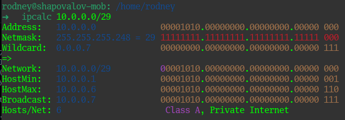

В сети с 29 маской имеется 8 IP-адресов, однако для хостов доступно только 6. Один адрес зарезервирован под адрес подсети, второй является широковещательным.

В сети с маской /24 можно создать 32 подсети с маской /29.

Примеры подсетей:

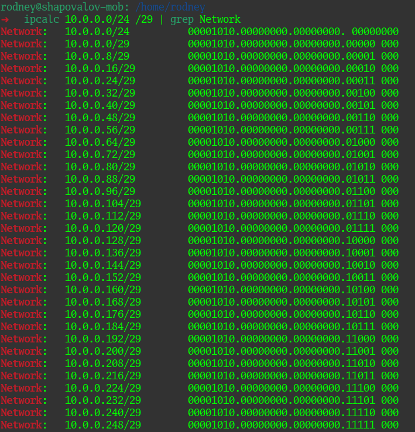

> 06. Задача: вас попросили организовать стык между 2-мя организациями. Диапазоны 10.0.0.0/8, 172.16.0.0/12, 192.168.0.0/16 уже заняты. Из какой подсети допустимо взять частные IP адреса? Маску выберите из расчета максимум 40-50 хостов внутри подсети.

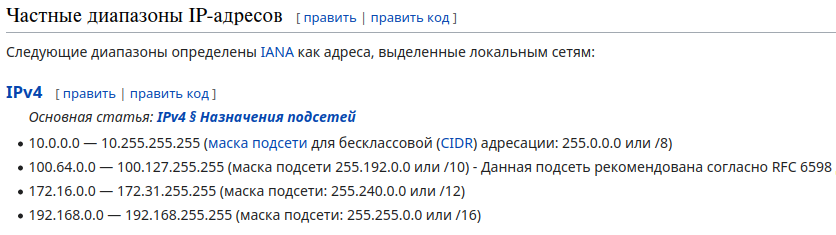

Из всех диапазонов частных сетей - 3 уже заняты, остается диапазон `100.64.0.0/10`. С ним и будем работать.

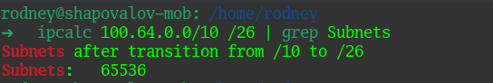

В данном диапазоне доступно 65536 вариантов подсетей с маской /26 (именно данная маска удовлетворяет условию - 40-50 хостов в подсети). Можно взять любой из этих вариантов, например:

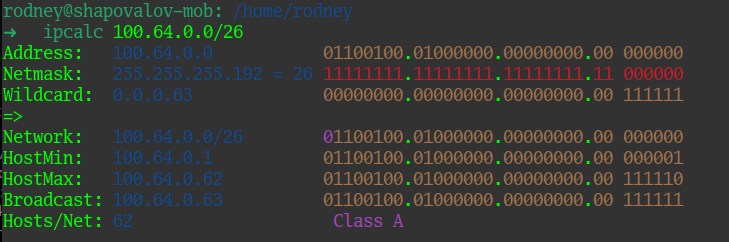

> 07. Как проверить ARP таблицу в Linux, Windows? Как очистить ARP кеш полностью? Как из ARP таблицы удалить только один нужный IP?

В Linux можно несколькими способами посмотреть ARP-таблицу, например:

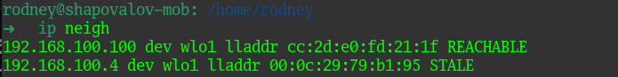

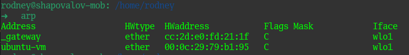

В Windows ARP таблицу можно просмотреть командой `arp -a`.

Чтобы очистить ARP кеш в Windows можно выполнить команду `arp -d` или воспользоваться командой `netsh interface IP delete arpcache`, а удалить конкретную запись можно командой `arp -d <host>`.

В Linux очистить ARP кеш полностью можно командой `sudo ip -s neigh flush all` или можно это сделать для конкретного интерфейса `sudo ip -s neigh flush dev ens33`. 

Удалить конкретную запись можно командой `sudo ip -s neigh dev ens33 to 192.168.100.4`.