# Домашнее задание к занятию «Обновление приложений»

## Выполнил студент группы DevOps-25 Шаповалов Кирилл

<br />

## Цель задания

Выбрать и настроить стратегию обновления приложения.

<br />

## Чеклист готовности к домашнему заданию

1. Кластер K8s.


Задание 1. Выбрать стратегию обновления приложения и описать ваш выбор
----------

    1. Имеется приложение, состоящее из нескольких реплик, которое требуется обновить.
    2. Ресурсы, выделенные для приложения, ограничены, и нет возможности их увеличить.
    3. Запас по ресурсам в менее загруженный момент времени составляет 20%.
    4. Обновление мажорное, новые версии приложения не умеют работать со старыми.
    5. Вам нужно объяснить свой выбор стратегии обновления приложения.

Решение:
--------

Самым простым решением данной задачи будет являться `type: Recreate`. Если тем более согласовано время простоя (т.е. окно обновления), то вообще никаких проблем. Recreate решает все проблемы. При использовании данной стратегии запас ресурсов можно не учитывать, так как в момент обновления будут удалены все старые поды и созданы все новые, приложение со старой версией будет неработоспособным а на выходе пользователи получат полноценное приложение с новой мажорной версией.

Однако, здесь можно применить и `type: RollingUpdate`, но чтоб оценить возможность применения данной стратегии обновления, нужно больше входных данных, например каков изначальный объем приложения, должно ли приложение оставаться доступно или же есть согласованное окно обновления. Например, если мы будем считать что у нас есть 5 реплик приложения, а само приложение должно оставаться доступным в каком-либо виде, то при обновлении можно задать примерно следующие параметры:

```yaml
strategy:
  type: RollingUpdate
  rollingUpdate:
    maxSurge: 100%
    maxUnavailable: 4
```

Данные параметры позволят запустить одновременное обновление всех 5 реплик приложения, при этом останется доступен 1 под со старой версией приложения на всякий случай. Таким образом будет задействован запас ресурсов в 20%, поскольку в момент обновления будет создано 6 подов - 1 останется со старой версией, 5 - будет создаваться с обновленной версией. Также будет сохранена доступность приложения.

Blue-green deployment не подойдет точно, поскольку запаса ресурсов нет на создание полной копии приложения с новой версией.

<br />

Задание 2. Обновить приложение
---------

    1. Создать deployment приложения с контейнерами nginx и multitool. 
       Версию nginx взять 1.19. Количество реплик — 5.
    2. Обновить версию nginx в приложении до версии 1.20, сократив время обновления до минимума. 
       Приложение должно быть доступно.
    3. Попытаться обновить nginx до версии 1.28, приложение должно оставаться доступным.
    4. Откатиться после неудачного обновления.

Решение:
-------

Если честно, не совсем понял зачем нужно создавать приложение именно из двух контейнеров, если обновление по сути затрагивает только один, второй остается неизменным. Но нужно так нужно :)

**1. Написал манифест на создание всей структуры приложения - <a href="./01-deployment.yaml">ссылка</a>**

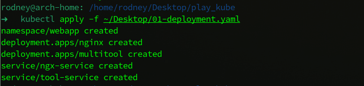

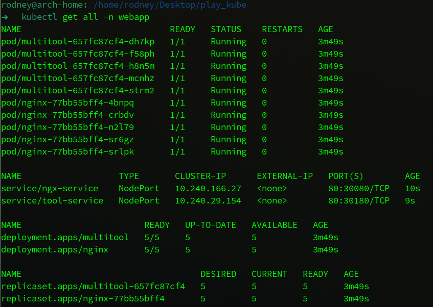


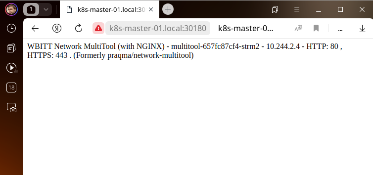


**2. Для соблюдения условий задания были указаны следующие параметры:**

```yaml
spec:
  replicas: 5
  strategy:
    type: RollingUpdate
    rollingUpdate:
      maxSurge: 100%
      maxUnavailable: 4
```

В данном случае будет запущено обновление сразу всех 5 подов, однако приложение останется доступным, так как указано, что максимальное число недоступных реплик не должно быть больше 4-х. То есть одна реплика всегда будет оставаться живой в процессе обновления и доступность приложения не будет нарушена.

Изначальная версия nginx для приложения была указана 1.19:

```yaml
   spec:
      containers:
        - name: nginx
          image: nginx:1.19
```

Смотрим, что версия действительно та, что была указана:

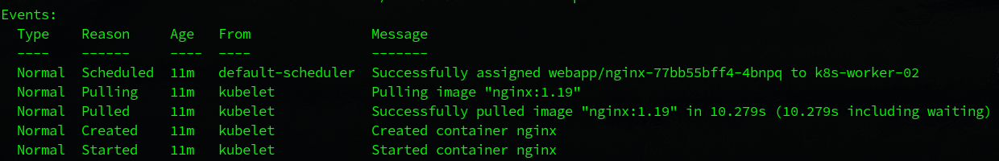

**3. Модифицировал манифест, указав версию nginx 1.20**

```yaml
   spec:
      containers:
        - name: nginx
          image: nginx:1.20
```

<details><summary>Ход обновления</summary>

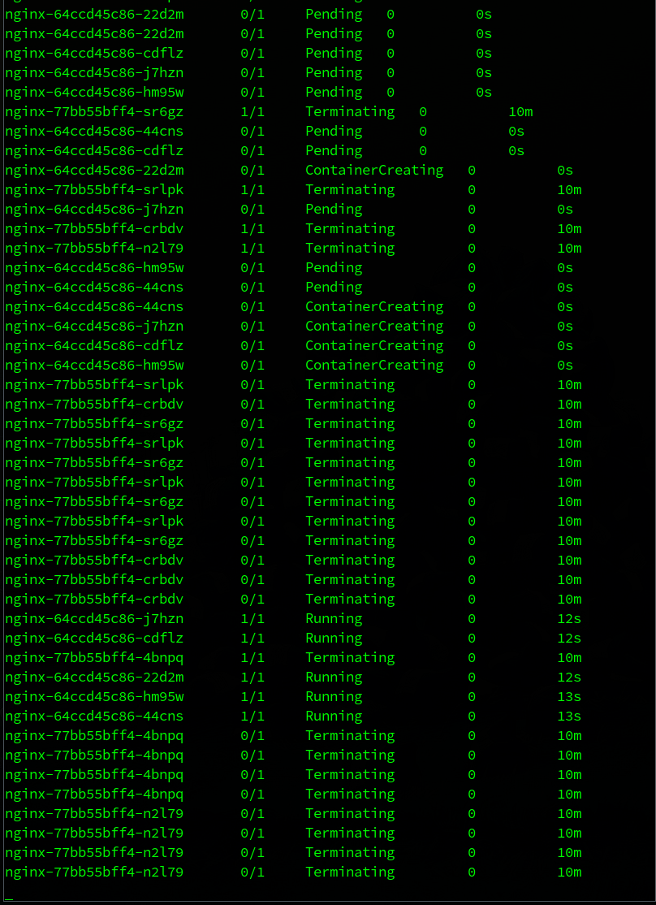

</details>

<br />

В ходе обновления видно, что создается одновременно 5 новых подов. При этом приложение остается доступно, так как 1 под остается со старой версией:

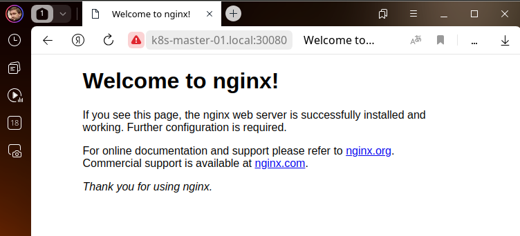

После создания новых подов проверяю версию приложения, чтоб убедиться, что обновление прошло успешно:

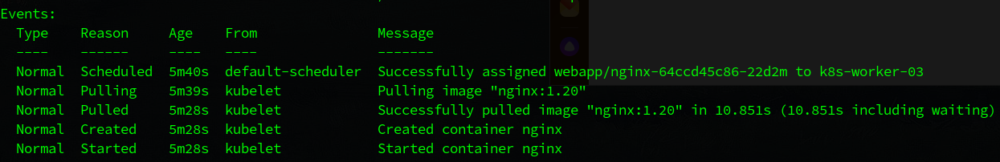

Приложение обновлено, простоя не было.

**4. Попытался выполнить обновление до версии 1.28**

```yaml
   spec:
      containers:
        - name: nginx
          image: nginx:1.28
```

<details><summary>Ход обновления</summary>

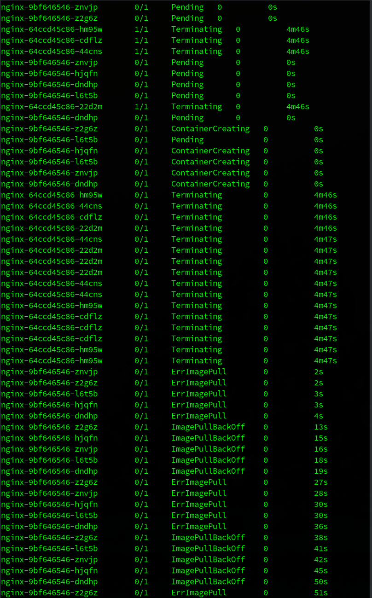

</details>

<br />

Как видно, в ходе обновления 5 подов зациклены в ошибке при попытке скачать несуществующий образ приложения.

Проверил, что происходит с подами:

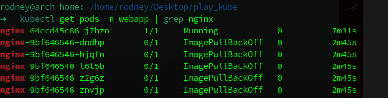

Видно, что 5 подов находятся в ошибке при обновлении и не запущены, но остается один работающий под с версией `nginx:1.20`, что обеспечивает доступность приложения и достигается отказоустойчивость.

**5. Проверил наличие ревизий приложения и выполнил откат на необходимую ревизию**

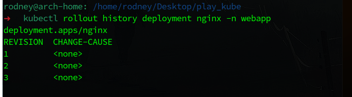

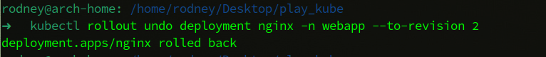

<details><summary>Ход отката</summary>

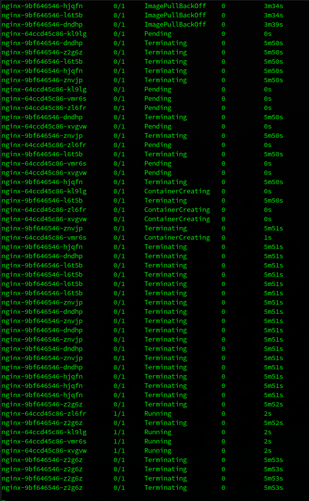

</details>

<br />

Как видно, в ходе отката поды вышли из состояния ошибки скачивания образа, были удалены лишние поды и корректно запущены все 5 подов.

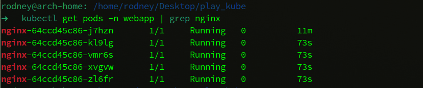

Здесь видно, что у одного пода аптайм больше, чем у остальных 4-х, это объясняется тем, что он не пересоздавался при откате на указанную ревизию, так как он уже существовал в рамках этой ревизии.

Ну и проверяем, что внутри пода нужная версия приложения:

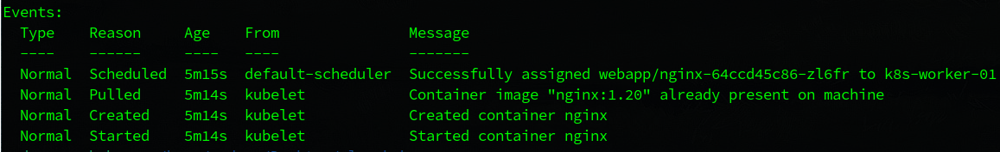

**Откат успешно выполнен.**