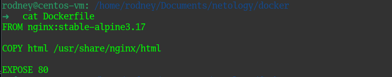
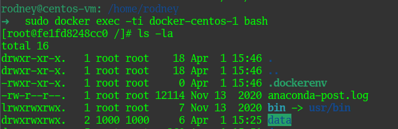

# Домашнее задание к занятию 3. «Введение. Экосистема. Архитектура. Жизненный цикл Docker-контейнера»

### Выполнил студент группы DevOps-25 Шаповалов Кирилл


> 01. Задача 1. Создайте свой репозиторий на https://hub.docker.com. Выберите любой образ nginx. Создайте свой fork образ. Реализуйте функциональность: запуск веб-сервера в фоне с индекс-страницей, содержащей HTML-код.

Создайте свой репозиторий на https://hub.docker.com


<a href="https://hub.docker.com/r/r0dney/netology/" target=_blank>Ссылка на репозиторий</a>

Воспользуемся образом `nginx:stable-alpine3.17`. 
   
Создал Dockerfile, а рядом с ним - папку html, куда положил файл `index.html` с нужным содержанием. Далее все действия видно по скриншотам:

В докерфайле указал, какой начальный образ использовать, какую папку и куда скопировать в новый образ и какой порт использовать для запуска приложения в контейнере.



Создал свой образ под названием `custom_nginx`.


Запустил контейнер из полученного образа, прокинув хостовой порт 8080 как 80 в контейнере.


Проверяем работу приложения в браузере:


Видим проблему с кодировкой :) Которая, однако же, на демонстрацию работы самого приложения никак не влияет.

Логинимся в докерхаб:


Форматируем имя нашего образа по нужному шаблону и пушим его в репозиторий:


Проверяем, что в репозитории появился новый образ - homework 6.3:


> 02. Задача 2. Посмотрите на сценарий ниже и ответьте на вопрос: «Подходит ли в этом сценарии использование Docker-контейнеров или лучше подойдёт виртуальная машина, физическая машина? Может быть, возможны разные варианты?» Детально опишите и обоснуйте свой выбор.

```
Сценарии:

a) высоконагруженное монолитное Java веб-приложение;
b) Nodejs веб-приложение;
c) мобильное приложение c версиями для Android и iOS;
d) шина данных на базе Apache Kafka;
e) Elasticsearch-кластер для реализации логирования продуктивного веб-приложения — три ноды elasticsearch, два logstash и две ноды kibana;
f) мониторинг-стек на базе Prometheus и Grafana;
g) MongoDB как основное хранилище данных для Java-приложения;
h) Gitlab-сервер для реализации CI/CD-процессов и приватный (закрытый) Docker Registry.
```

Если рассматривать, что большинство компаний не может отдать полноценный современный физический сервер под какое-либо одно приложение, остаются два возможных варианта виртуализация или контейнеризация.

1. Высоконагруженное монолитное Java веб-приложение разумно разметить на виртуальной машине. Хотя, при возможности выделить физический сервер под такое приложение - лучше сделать так, чтобы ресурсы сервера использовались приложением напрямую, а не через гипервизор.
2. Для NodeJS веб-приложения предпочтительней использовать Docker-контейнеры из-за простоты управления, возможности масштабирования и скорости развертки.
3. Мобильное приложение с версиями для Android и iOS - опять же, скорей всего в Docker, по тем же причинам. Самое главное в тестировании различных версий приложения - скорость, а докер дает возможность поднимать разные версии приложения очень быстро.
4. Шина данных на базе Apache Kafka - слабо знаком с этим сервисом, но как говорят знатоки на хабре - лучше использовать докер. Поскольку при использовании Kafka как правило идет обвязка с еще кучей сервисов - Авторизация, Прокси, Балансировщики. Все это обычно должно масштабироваться, быстро работать и легко управляться, итог - Докер.
5. Elasticsearch-кластер для реализации логирования продуктивного веб-приложения — три ноды elasticsearch, два logstash и две ноды kibana - однозначно Докер, любые мануалы в интернете говорят, что строить подобные системы нужно именно в докере. Оптимально - использование кластера Docker Swarm для надежности.
6. Мониторинг-стек на базе Prometheus и Grafana - так же Докер. Разворачивал сам подобный стек, прекрасно работает при использовании общего хранилища. Быстро, просто, надежно. Поставил, настроил и забыл, а оно просто работает.
7. MongoDB как основное хранилище данных для Java-приложения - наверное, тоже докер, по тем же причинам. Если конфигурации и файлы БД держать на хостовой системе, прокидывая в контейнер как общее хранилище - контейнер всегда можно легко и быстро пересоздать, в отличие от установки и настройки приложения в виртуальной машине.
8. Gitlab-сервер для реализации CI/CD-процессов и приватный (закрытый) Docker Registry - наверное, здесь лучше использовать виртуальные машины. С разделением под разные процессы. Хотя возможно и Докер-контейнеры будут стабильно работать при использовании общих хранилищ больших объемов. Тут точно сказать не могу, опыта разворачивания таких систем не имею.


> 03. Задача 3. Проверка работы с общим хранилищем разных контейнеров.


1. Запустите первый контейнер из образа centos c любым тегом в фоновом режиме, подключив папку /data из текущей рабочей директории на хостовой машине в /data контейнера.
2. Запустите второй контейнер из образа debian в фоновом режиме, подключив папку /data из текущей рабочей директории на хостовой машине в /data контейнера.
   
Решил запустить сразу оба контейнера с помощью Docker Compose.

Листинг файла docker-compose.yml:


Командой `docker compose up` запустил оба контейнера:


Подключился в первый контейнер, с ОС CentOS, проверил, что папка `/data` успешно смонитрована, создал тестовый файл в данной папке:




Смотрим, что изменилось в локальной папке `/data` на хостовой системе:


В папке появился созданный в контейнере файл и содержание его именно такое, какое я записал в контейнере. Создаем тестовый файл на хостовой машине:


Подключаемся к контейнеру с Debian и проверяем папку `/data` там:


Как видно, все замечательно работает! :)