# Домашнее задание к занятию 4. «Оркестрация группой Docker-контейнеров на примере Docker Compose»

### Выполнил студент группы DevOps-25 Шаповалов Кирилл

> 01. Задача 1. Создайте собственный образ любой операционной системы (например ubuntu-20.04) с помощью Packer (инструкция).

Создал json файл для создания образа:

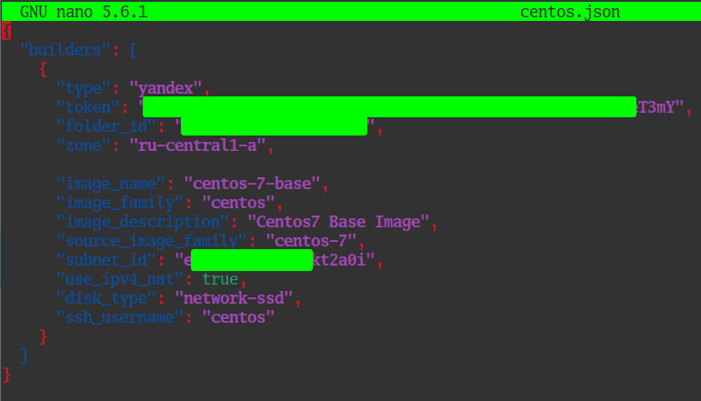

Проверка на валидность пройдена:

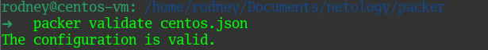

Командой `packer build centos.json` запустил создание образа. Образ появился в консоли Yandex.Cloud:

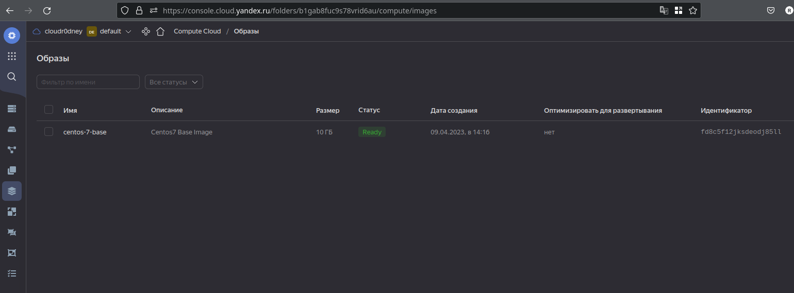

> 02. Задача 2.

2.1. Создайте вашу первую виртуальную машину в YandexCloud с помощью web-интерфейса YandexCloud.

В интерфейсе задал необходимые параметры, машина создается по принципу "Далее, Далее, Готово":

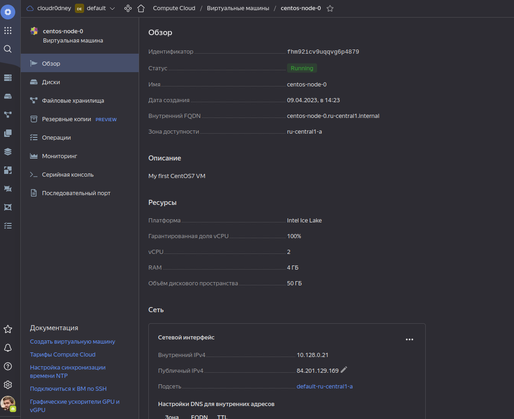

2.2.* Создайте вашу первую виртуальную машину в YandexCloud с помощью Terraform (вместо использования веб-интерфейса YandexCloud).

Листинг файла Terraform прикладываю к файлу readme (main.tf). Штука очень классная, мне понравилась, раньше опыта общения с ней не было, сейчас наверстываю :)

Частичный вывод команды `terraform apply`:

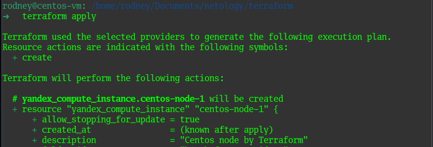

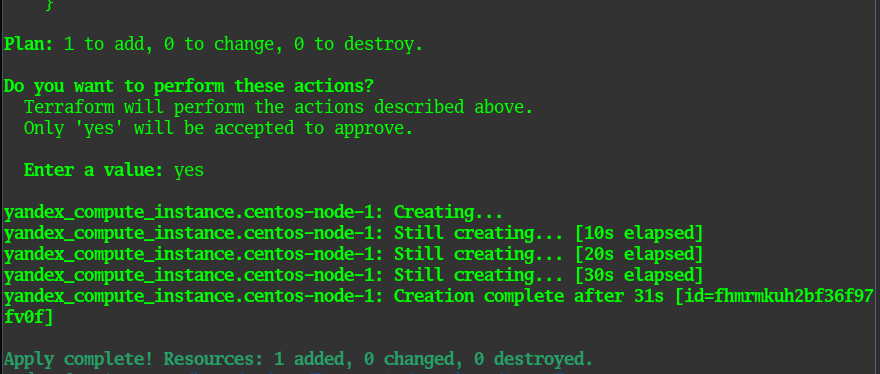

Ну и сама машина в интерфейсе Yandex.Cloud

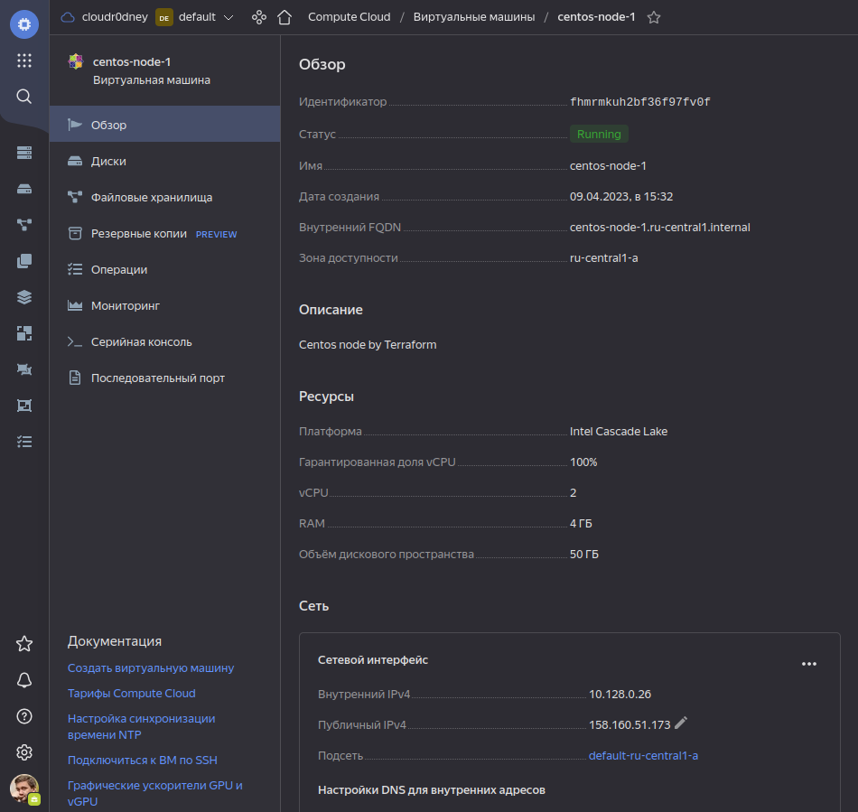

> 03. Задача 3. С помощью Ansible и Docker Compose разверните на виртуальной машине из предыдущего задания систему мониторинга на основе Prometheus/Grafana.

Так как большого практического опыта общения с Ansible у меня тоже не было, помучался с данной задачей достаточно приличное время... Но оно того стоило. Итоговый листинг файла `playbook.yml` прикладываю к заданию. 

Результат выполнения плейбука ниже:

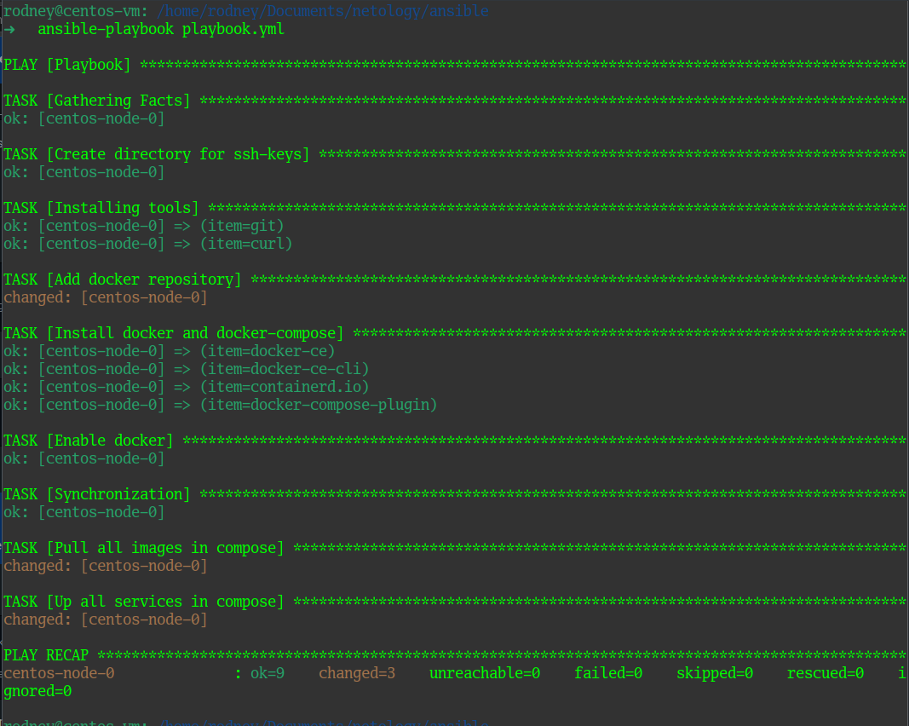

Проверяем, что все контейнеры стартанули внутри нашей машины в облаке:

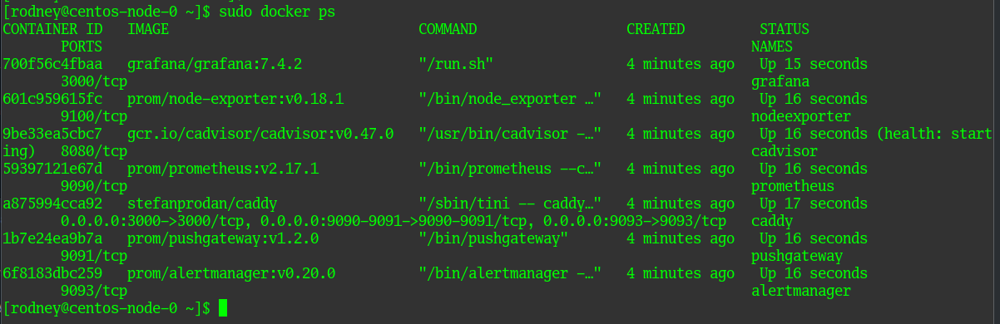

Базовая система мониторинга готова.

> 04. Задача 4. Проверка работы системы мониторинга.

Подождав небольшое количество времени, проверяю в браузере:

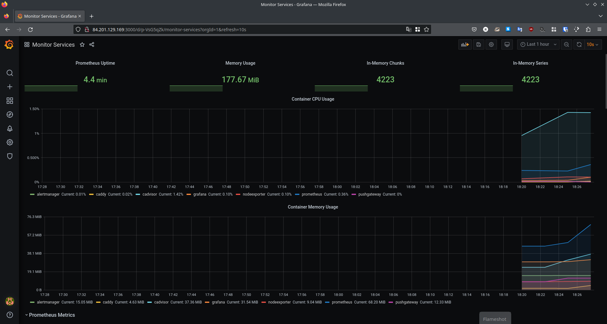

И второй дашборд:

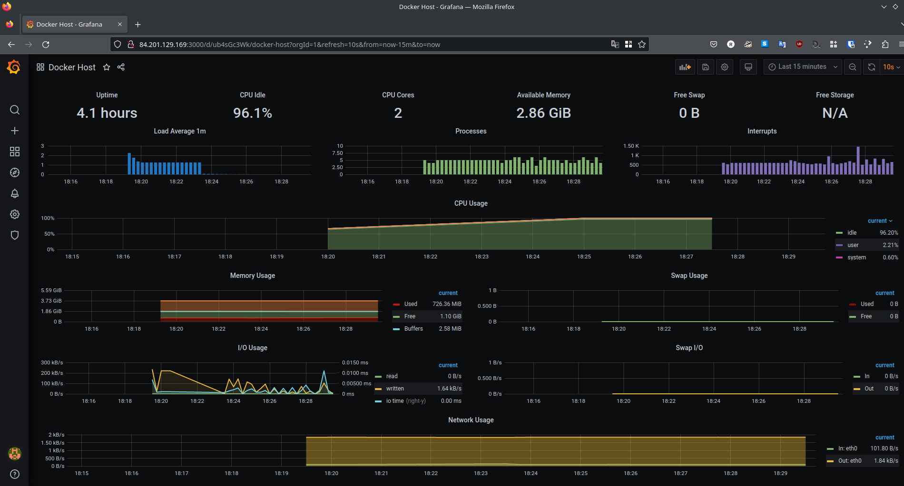

В пятой задаче особо сложного ничего нет, добавляется просто еще одна нода в файле Прометеуса, а на саму ноду нужно например поставить node_exporter. Но уже ниасилил выполнить практически :)