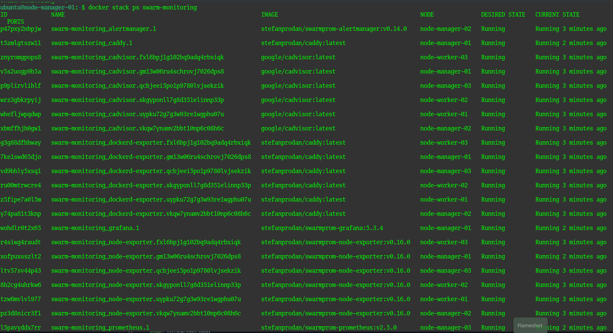

# Домашнее задание к занятию 5. «Оркестрация кластером Docker контейнеров на примере Docker Swarm»

### Выполнил студент группы DevOps-25 Шаповалов Кирилл

> 01. Задача 1. Дайте письменные ответы на вопросы.

`В чём отличие режимов работы сервисов в Docker Swarm-кластере: replication и global?`

Режим работы `global` (в файле yml указывается так - `mode: global`) говорит о том, что наш сервис будет запущен в одном экземпляре на каждой ноде в кластере. Когда в кластер добавляется новая нода, оркестратор создает задачу, а планировщик назначает эту задачу новой ноде.

Режим работы `replication` (в файле yml указывается так - `mode: replicated` с обязательным указанием количества реплик - `replicas: 4`) говорит о том, что для данного сервиса будет запущено n-ное количество контейнеров на каждой ноде кластера, где количество контейнеров как раз определяется параметром `replicas`.

`Какой алгоритм выбора лидера используется в Docker Swarm-кластере?`

За выбор лидера в кластере Docker Swarm отвечает алгоритм RAFT. Это алгоритм поддержания консенсуса в кластере. Если вдруг в кластере была потеряна связь с Manager Node, у которой была роль Лидера, по прошествии определенного времени, определяемого случайным образом для каждой из оставшихся нод (150-300 мс), та нода, у которой таймер закончится раньше - перейдет в режим Кандидата и отправит всем остальным нодам запрос голосования. Получив ответ от большинства нод - она станет новым лидером. В том случае, когда по окончании таймера две ноды перейдут в состояние кандидата, голосование будет продолжаться до тех пор, пока одна из нод не наберет большее количество голосов. Когда будет выбран новый лидер - он отправляет всем остальным нодам так называемый запрос heartbeat, который будет обнулять таймеры на нодах и сообщать о том, что Лидер в кластере есть.

`Что такое Overlay Network?`

Если коротко, Network Overlay это создание виртуальной сети поверх другой сети, чаще всего - поверх физической. У разных поставщиков услуг виртуализации используются разные технологии, например VMWare Distributed Switch, или OpenSwitch. Если рассматривать на примере кластера Docker Swarm - используется технология vxlan для создания единой виртуальной сети для взаимодействия контейнеров, расположенных на разных нодах, расположенных на разных нодах.

> 02. Задача 2. Создайте ваш первый Docker Swarm-кластер в Яндекс Облаке.

Воспользовался файлами с листингом кода из каталога `/src`, изменений там было незначительно с моей стороны, потому не вижу смысла приводить здесь листинг. Рассмотрим сразу результаты.

С помощью Terraform развернул все нужные машины: 

С помощью Ansible развернул все необходимое ПО и затем создал кластер Docker Swarm:

> 03. Задача 3. Развернуть в кластере подготовленный к использованию стэк микросервисов для мониторинга

Так же воспользовался каталогом `/src` для развертывания всех сервисов:

Ну и посмотрим на результат в браузере:

> 04. Задача 4*. Выполните на лидере Docker Swarm-кластера команду, указанную ниже, и дайте письменное описание её функционала — что она делает и зачем нужна.

Согласно документации, данная команда включает возможность автоматически зашифровать ключ для шифровки логов RAFT и TLS-ключ, используемый при взаимодействии нод внутри swarm кластера. При перезагрузке кластера необходимо будет ввести полученный ключ для разблокировки работы всего кластера, но при добавлении новой ноды в кластер дополнительных действий не потребуется, так как менеджер-нода распространит данный ключ через TLS обмен.

В общем, данная функция необходима для обеспечения большей безопасности.