# Домашнее задание к занятию 2. «SQL»

### Выполнил студент группы DevOps-25 Шаповалов Кирилл


> 01. Задача 1. Используя Docker, поднимите инстанс PostgreSQL (версию 12) c 2 volume, в который будут складываться данные БД и бэкапы.

Файл docker-compose.yml лежит здесь же в папке ДЗ. Листинг ниже:

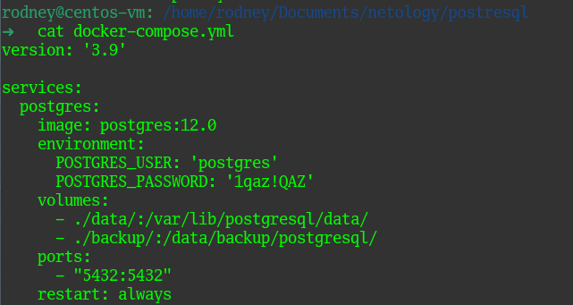

Запустим контейнер командой `docker-compose up -d`:

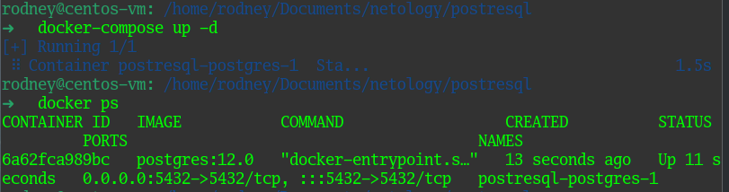

Командой `docker ps` убедился, что контейнер успешно запустился.


> 02. Задача 2. Поработать с БД в контейнере из задачи 1.

```
- создайте пользователя test-admin-user и БД test_db;
- в БД test_db создайте таблицу orders и clients (спeцификация таблиц ниже);
- предоставьте привилегии на все операции пользователю test-admin-user на таблицы БД test_db;
- создайте пользователя test-simple-user;
- предоставьте пользователю test-simple-user права на SELECT/INSERT/UPDATE/DELETE этих таблиц БД test_db.
```

Все действия выполнялись после подключения в контейнер командой `docker exec`, последовательность команд на скринах ниже.

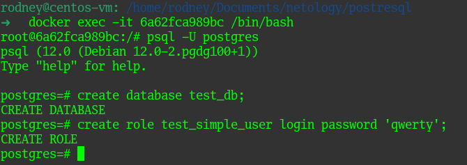

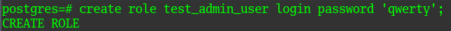

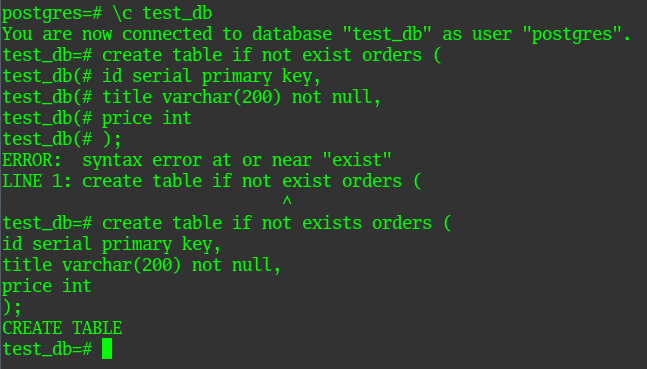

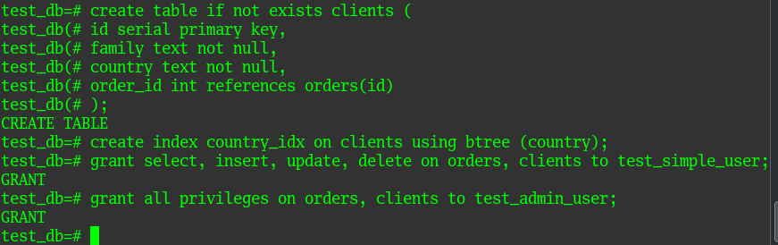

Приведите:

- итоговый список БД после выполнения пунктов выше:

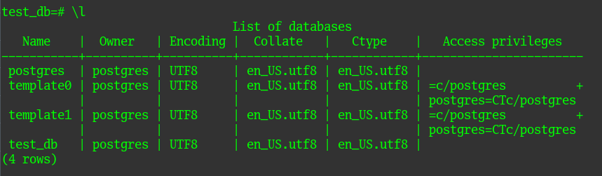

- описание таблиц (describe):

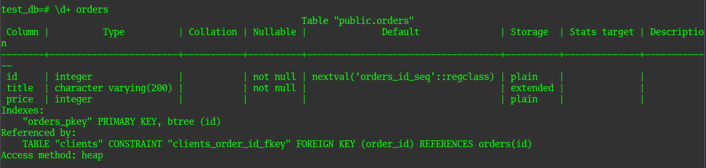

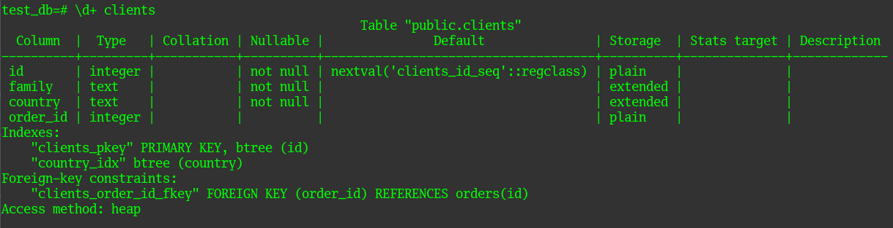

- SQL-запрос для выдачи списка пользователей с правами над таблицами test_db и список пользователей с правами над таблицами test_db:

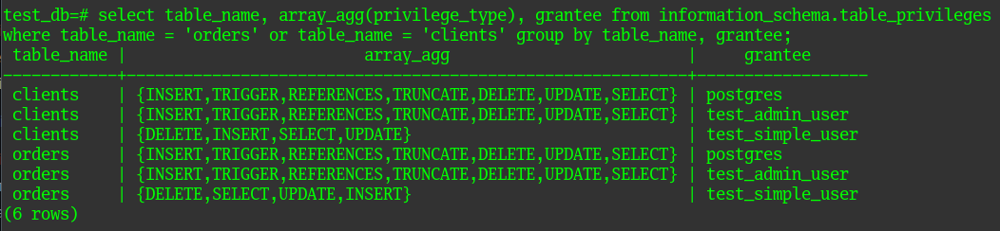


> 03. Задача 3. Используя SQL-синтаксис, наполните таблицы тестовыми данными.

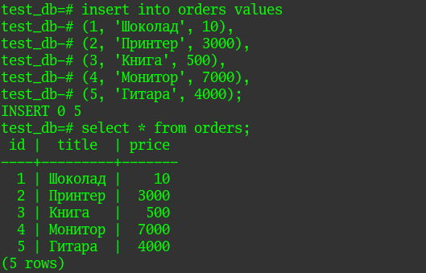

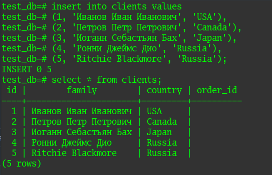

В принципе, в случае небольшой таблицы, как в нашем примере, количество записей выведет даже запрос `select * from table_name;`, однако в случае больших таблиц лучше воспользоваться другим запросом:

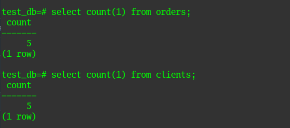

> 04. Задача 4. Часть пользователей из таблицы clients решили оформить заказы из таблицы orders. Используя foreign keys, свяжите записи из таблиц.

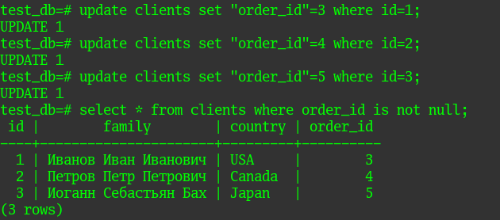

> 05. Получите полную информацию по выполнению запроса выдачи всех пользователей из задачи 4 (используя директиву EXPLAIN). Приведите получившийся результат и объясните, что значат полученные значения.

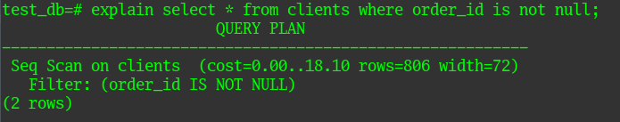

Результаты выполнения запроса показывают, что был применен простой план последовательного сканирования с применением фильтра (в запросе указано `WHERE`). Значения в скобках означают следующее:

- cost=0.00..18.10 - примерная стоимость запуска и примерная общая стоимость, измеряется в произвольных единицах, определяемых стоимостными параметрами планировщика. Примерная стоимость запуска показывает время, которое пройдет до момента начала стадии вывода, примерная общая стоимость отображает сколько пройдет времени до конца выполнения запроса.
- rows=806 - примерное количество строк, которые по мнению postresql должны быть прочитаны. Данное число является ооооооочень приблизительным и может быть оооооооочень неточным.
- width=72 - расчетная средняя ширина строки (в байтах).


> 06. Задача 6. Бэкапы и восстановление.

Создал бэкап БД в контейнере на подключенный в docker-compose файле раздел, командой `ls` проверил, что бэкап создался и находится в нужном месте:

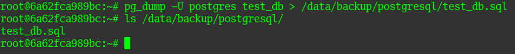

Далее немного переделал Compose-файл под условия изменившейся задачи:

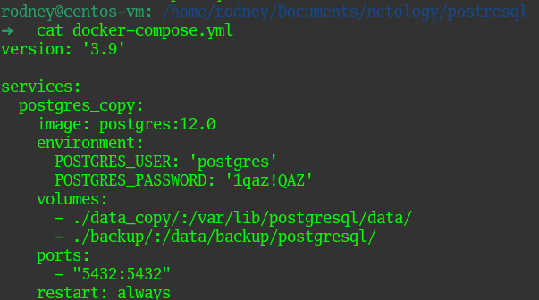

Запустил:

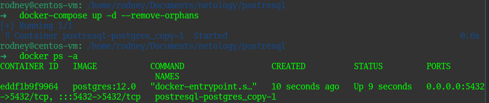

Далее зашел в новый контейнер командой `docker exec`, создал БД и всех пользователей, затем выполнил восстановление дампа БД в созданную базу:

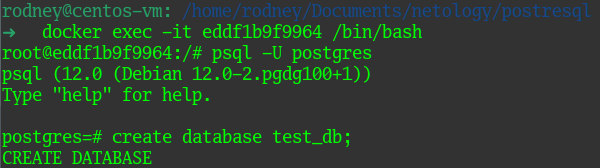

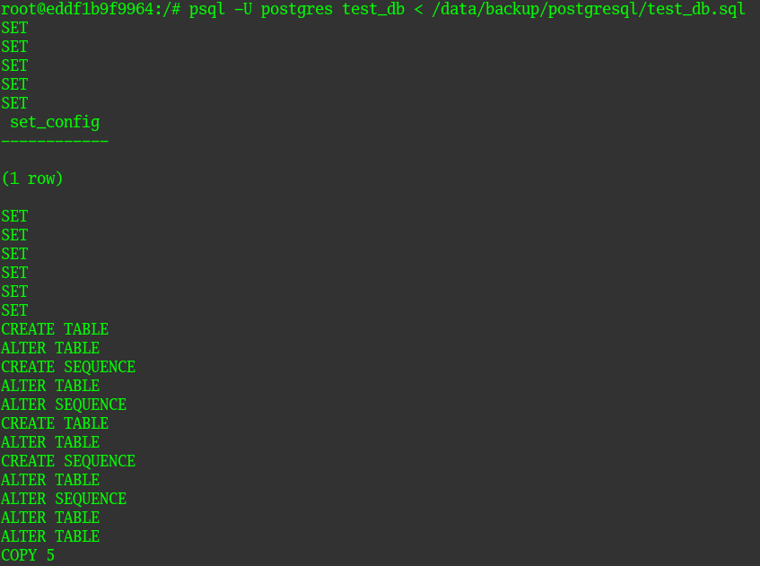

Проверяем и убеждаемся, что наше восстановление прошло успешно:

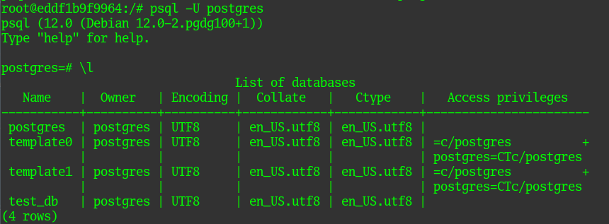

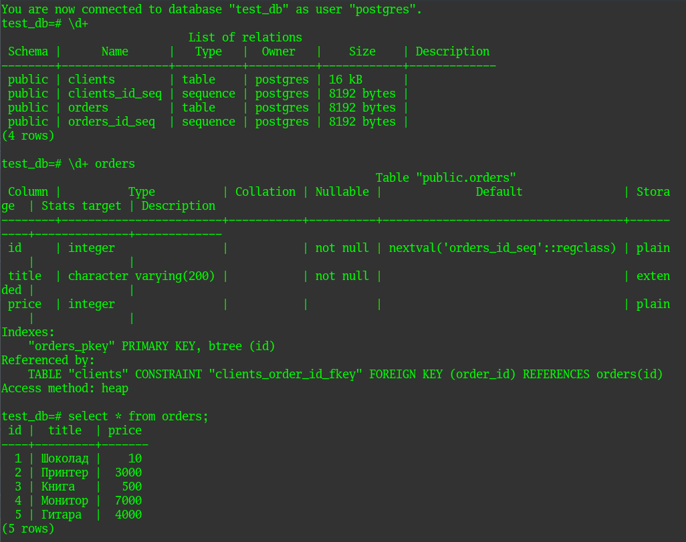

Как видно, все наши таблицы, индексы и ключи были успешно восстановлены в базу данных. Восстановление прошло успешно.