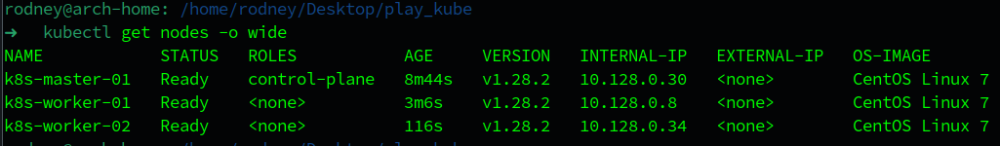
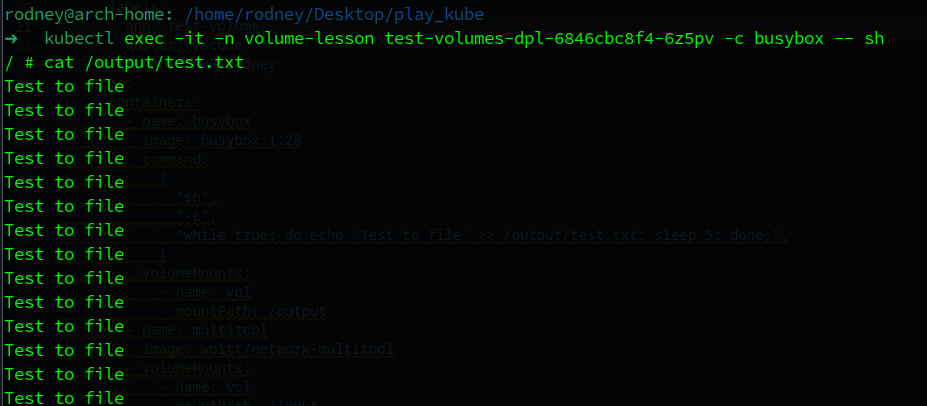
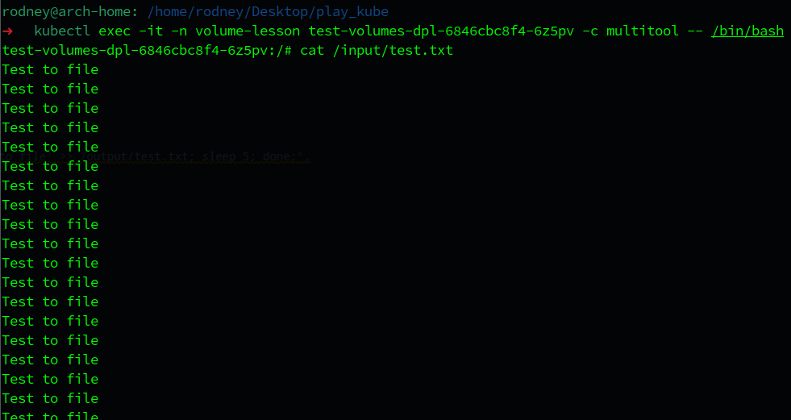
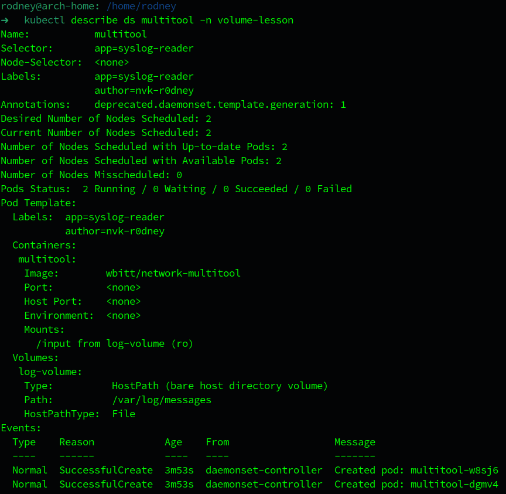
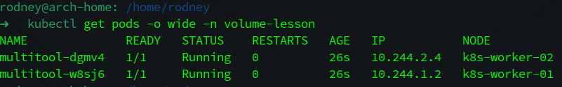
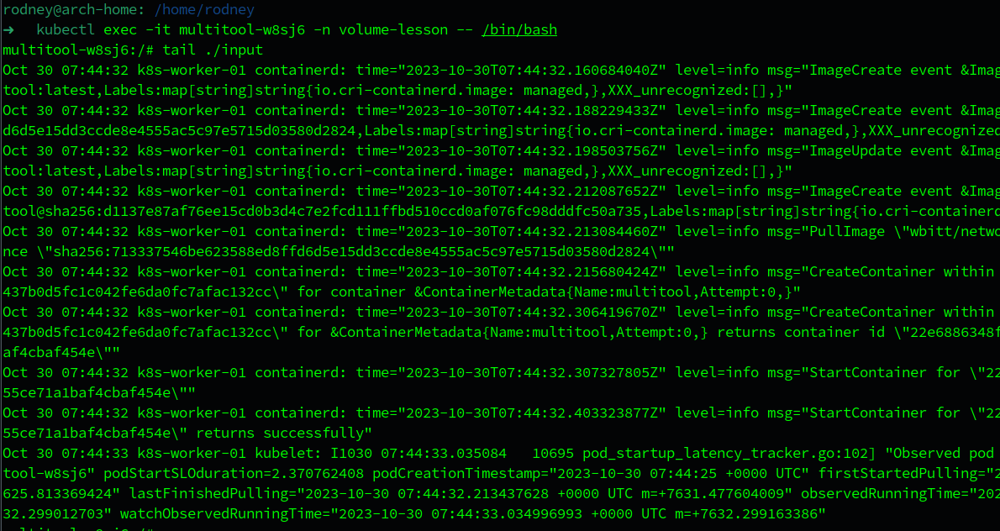
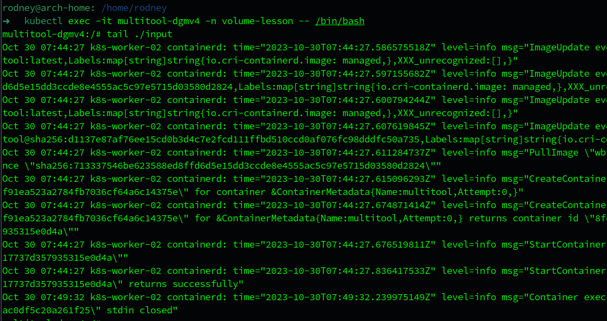

# Домашнее задание к занятию «Хранение в K8s. Часть 1»

## Выполнил студент группы DevOps-25 Шаповалов Кирилл

<br />

Чеклист готовности к домашнему заданию
--------------------------------------

Как и в предыдущих заданиях всю работу буду выполнять в полноценном кластере k8s, используя локальный kubectl



<br />

Задание 1. Создать Deployment приложения, состоящего из двух контейнеров и обменивающихся данными.
----------------------------

    1. Создать Deployment приложения, состоящего из контейнеров busybox и multitool.
    2. Сделать так, чтобы busybox писал каждые пять секунд в некий файл в общей директории.
    3. Обеспечить возможность чтения файла контейнером multitool.
    4. Продемонстрировать, что multitool может читать файл, который периодоически обновляется.
    5. Предоставить манифесты Deployment в решении, а также скриншоты или вывод команды из п. 4.

### Решение

1. Написал манифест, создающий Namespace к заданию и Deployment приложения, состоящего из двух контейнеров - <a href="./01-deployment-pods.yaml">Ссылка</a>. Сам манифест лежит в папке с выполненным ДЗ.

<details><summary>Манифест</summary>

```yaml
apiVersion: v1
kind: Namespace
metadata:
  name: volume-lesson
---
apiVersion: apps/v1
kind: Deployment
metadata:
  name: test-volumes-dpl
  namespace: volume-lesson
  labels:
    app: test-volume
spec:
  replicas: 1
  selector:
    matchLabels:
      app: test-volume
  template:
    metadata:
      labels:
        app: test-volume
        editor: vscode
        author: nvk-r0dney
    spec:
      containers:
        - name: busybox
          image: busybox:1.28
          command:
            [
              "sh",
              "-c",
              "while true; do echo 'Test to file' >> /output/test.txt; sleep 5; done;",
            ]
          volumeMounts:
            - name: vol
              mountPath: /output
        - name: multitool
          image: wbitt/network-multitool
          volumeMounts:
            - name: vol
              mountPath: /input
      volumes:
        - name: vol
          emptyDir: {}
```

</details>

<br>

2. Применил манифест в текущем кластере K8s:


3. Проверил, что `busybox` реально пишет данные в указанный файл:



Отлично, данные пишутся в файл. Нужно проверить из другого контейнера, что данные доступны для чтения.

4. Подключился ко второму контейнеру в поде и проверил данные в файле:



Данные доступны из второго контейнера, что означает, что оба контейнера используют общее хранилище, смонтированное по разным путям в каждом из контейнеров.

**Итог: Написан манифест, в котором создается Deployment приложения, в котором два контейнера - busybox пишет данные в файл на Volume с интервалом в 5 секунд, а multitool может эти данные прочитать. Задание выполнено.**

<br />

Задание 2. Создать DaemonSet приложения, которое может прочитать логи ноды.
----------------------------

    1. Создать DaemonSet приложения, состоящего из multitool.
    2. Обеспечить возможность чтения файла /var/log/syslog кластера MicroK8S.
    3. Продемонстрировать возможность чтения файла изнутри пода.
    4. Предоставить манифесты Deployment, а также скриншоты или вывод команды из п. 2.

### Решение

1. Написал манифест, создающий Namespace к заданию и DaemonSet приложения Multitool - <a href="./02-daemonset.yaml">Ссылка</a>. Сам манифест лежит в папке с выполненным ДЗ.

<details><summary>Манифест</summary>

```yaml
apiVersion: v1
kind: Namespace
metadata:
  name: volume-lesson
---
apiVersion: apps/v1
kind: DaemonSet
metadata:
  name: multitool
  namespace: volume-lesson
  labels:
    app: syslog-reader
    author: nvk-r0dney
spec:
  selector:
    matchLabels:
      app: syslog-reader
  template:
    metadata:
      labels:
        app: syslog-reader
        author: nvk-r0dney
    spec:
      containers:
        - name: multitool
          image: wbitt/network-multitool
          volumeMounts:
            - name: log-volume
              readOnly: true
              mountPath: /input
      volumes:
        - hostPath:
            path: /var/log/messages
            type: File
          name: log-volume
```

</details>

<br>

Так как мой кластер функционирует на операционной системе CentOS 7, здесь аналог файла `syslog` - файл `/var/log/messages`, поэтому будем рассматривать именно его. Обязательно нужно подключать такие вещи, как хостовые логи, только в **readOnly** режиме.

2. Применил написанный манифест:


3. Проверил созданный DaemonSet:



Как видно, DaemonSet сам поднял нужное количество подов - по одному на каждой ноде кластера. Проверяем:



Все создалось как нужно. 

4. Проверил лог на первой воркер-ноде:



Как видно на скриншоте, в под смонтировался файл `/var/log/messages` и под может его прочитать.

5. Проверил лог на второй воркер-ноде:



На второй ноде файл также успешно смонтирован и контейнер в поде может его прочитать.

**Итог: файл логов с хостовой ноды успешно смонтирован в контейнер пода DaemonSet'а, а сам контейнер может его прочитать. Задание выполнено.**