# Домашнее задание к занятию «Конфигурация приложений»

## Выполнил студент группы DevOps-25 Шаповалов Кирилл

<br />

Чеклист готовности к домашнему заданию
--------------------------------------

Как и в предыдущих заданиях всю работу буду выполнять в полноценном кластере k8s, используя локальный kubectl

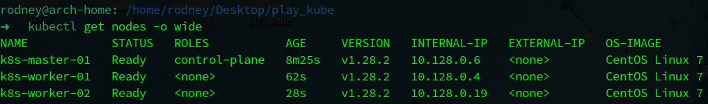

<br />

Задание 1. Создать Deployment приложения и решить возникшую проблему с помощью ConfigMap. Добавить веб-страницу
------------------

    1. Создать Deployment приложения, состоящего из контейнеров nginx и multitool.
    2. Решить возникшую проблему с помощью ConfigMap.
    3. Продемонстрировать, что pod стартовал и оба конейнера работают.
    4. Сделать простую веб-страницу и подключить её к Nginx с помощью ConfigMap. 
       Подключить Service и показать вывод curl или в браузере.
    5. Предоставить манифесты, а также скриншоты или вывод необходимых команд.

### Решение

1. Для решения проблемы с портами в контейнерах, а также для подключения кастомной страницы в nginx - написал простенький `configMap` (*листинг ниже*), файл манифеста находится рядом с выполненным ДЗ:

<details><summary>Манифест</summary>

```yaml
apiVersion: v1
kind: ConfigMap
metadata:
  name: myconfigmap-01
  namespace: config-lesson
data:
  multitool-port: "8080"
  index.html: |
    <html>
      <body>
        <h1>Simple page of Netology Education</h1>
        <p>This is a simple page for Netology Kubernetes education</p>
      </body>
    </html>
```

</details>

<br />

Применил манифест, результат - создан configMap в указанном Namespace:

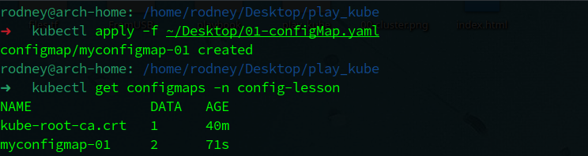

<br />

2. Написал манифест с деплойментом приложения, состоящего из двух контейнеров - `nginx` и `multitool`. Использвоал созданный configMap, сразу получилось продемонстрировать подключение configMap'а и в качестве env и в качестве volume. Листинг манифеста ниже, сам файл находится рядом с выполненным ДЗ. Чтобы не включать port-forwarding - сервис создал с типом NodePort.

<details><summary>Манифест</summary>

```yaml
apiVersion: apps/v1
kind: Deployment
metadata:
  name: nginx-deployment
  namespace: config-lesson
  labels:
    app: nginx
    author: nvk-r0dney
spec:
  replicas: 2
  selector:
    matchLabels:
      app: nginx
  template:
    metadata:
      labels:
        app: nginx
    spec:
      containers:
        - name: nginx
          image: nginx:latest
          ports:
            - containerPort: 80
              name: http-port
              protocol: TCP
          volumeMounts:
            - name: configmap-volume
              mountPath: /usr/share/nginx/html
        - name: multitool
          image: wbitt/network-multitool
          env:
            - name: HTTP_PORT
              valueFrom:
                configMapKeyRef:
                  name: myconfigmap-01
                  key: multitool-port
          ports:
            - containerPort: 8080
              name: tool-http
              protocol: TCP
      volumes:
        - name: configmap-volume
          configMap:
            name: myconfigmap-01
---
apiVersion: v1
kind: Service
metadata:
  name: svc-web-nginx
  namespace: config-lesson
  labels:
    author: nvk-r0dney
spec:
  type: NodePort
  selector:
    app: nginx
  ports:
    - port: 80
      name: svc-nginx-port
      nodePort: 30080
      targetPort: http-port
    - port: 8080
      name: svc-tool-port
      nodePort: 30180
      targetPort: tool-http
```

</details>

<br />

Применил манифест, результат ниже:

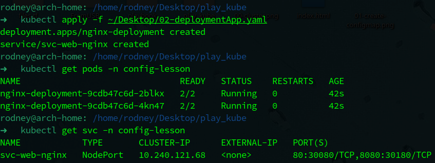

Как видно на скриншоте, созданы две реплики пода с двумя контейнерами, оба контейнера успешно запустились.

<br />

3. Проверил `multitool`, следуя configMap - он должен ответить на 8080 порту, в который перенаправит сервис NodePort по порту 30180:

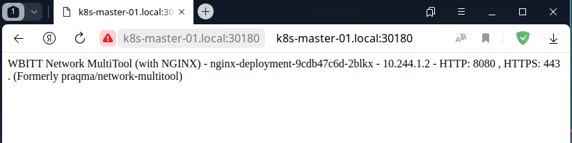

Отлично, Мультитул отвечает.

4. Проверил nginx, он отвечает на стандартном 80 порту, в который перенаправляет сервис по порту 30080, но должен открыть кастомную страницу:

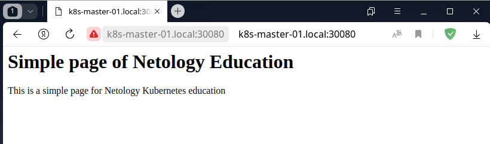

Отлично, nginx доступен на 80 порту и открывает кастомную страницу.

**Итог: приложение успешно функционирует, все параметры, указанные в configMap - успешно переданы в контейнеры. Задание выполнено**

<br />

Задание 2. Создать приложение с вашей веб-страницей, доступной по HTTPS
-------------------

    1. Создать Deployment приложения, состоящего из Nginx.
    2. Создать собственную веб-страницу и подключить её как ConfigMap к приложению.
    3. Выпустить самоподписной сертификат SSL. Создать Secret для использования сертификата.
    4. Создать Ingress и необходимый Service, подключить к нему SSL в вид. 
       Продемонстировать доступ к приложению по HTTPS.
    5. Предоставить манифесты, а также скриншоты или вывод необходимых команд.

### Решение

1. Подключил ingress-контроллер, используя манифест из официальной документации.

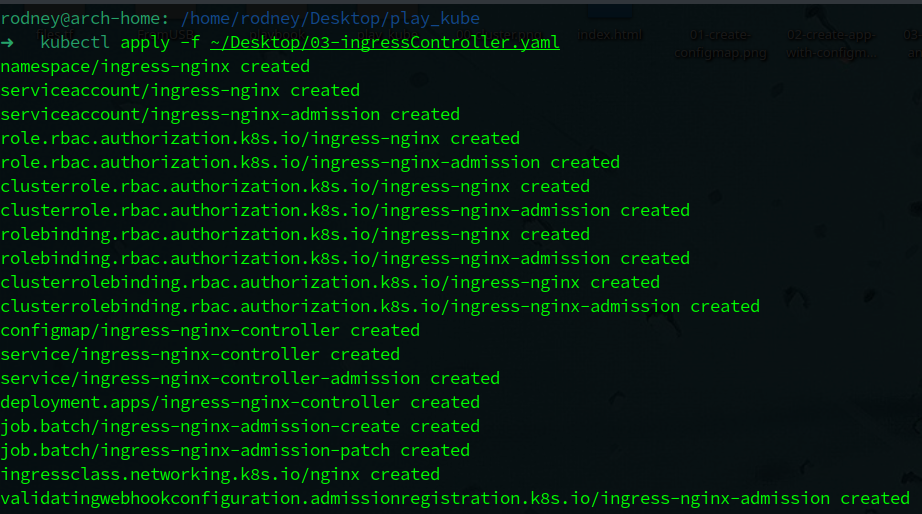

<br />

2. Веб-страницу будем передавать в ранее созданном configMap (*Задание 1*)
3. Сгенерировал самоподписанный сертификат:

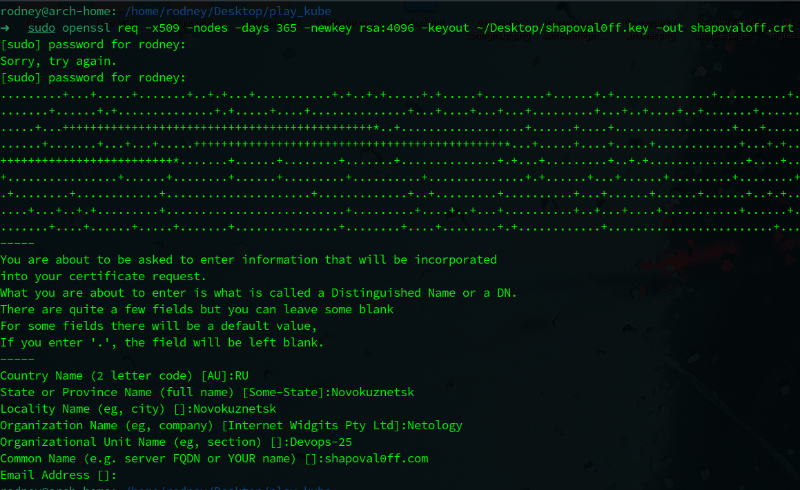

<br />

4. Написал манифест для создания Secret с типом tls (*листинг ниже*). Файл манифеста находится рядом с ДЗ.

<details><summary>Манифест</summary>

```yaml
apiVersion: v1
kind: Secret
metadata:
  name: webapp-cert
  namespace: config-lesson
type: kubernetes.io/tls
data:
  tls.crt: |
    MIIF2TCCA8GgAwIBAgIURw+tOPU0iNo3LANWg4oWXRRRu3UwDQYJKoZIhvcNAQEL
    BQAwfDELMAkGA1UEBhMCUlUxFTATBgNVBAgMDE5vdm9rdXpuZXRzazEVMBMGA1UE
    BwwMTm92b2t1em5ldHNrMREwDwYDVQQKDAhOZXRvbG9neTESMBAGA1UECwwJRGV2
    b3BzLTI1MRgwFgYDVQQDDA9zaGFwb3ZhbDBmZi5jb20wHhcNMjMxMTA1MTYyODMw
    WhcNMjQxMTA0MTYyODMwWjB8MQswCQYDVQQGEwJSVTEVMBMGA1UECAwMTm92b2t1
    em5ldHNrMRUwEwYDVQQHDAxOb3Zva3V6bmV0c2sxETAPBgNVBAoMCE5ldG9sb2d5
    MRIwEAYDVQQLDAlEZXZvcHMtMjUxGDAWBgNVBAMMD3NoYXBvdmFsMGZmLmNvbTCC
    AiIwDQYJKoZIhvcNAQEBBQADggIPADCCAgoCggIBAK+W0BvvfLbUGa5bnGulATD1
    xH8exGiXqE0aLgjWrHJeXTN50OGiUbESTGv8SqsaM42KuLjqnpDUwbaZB3/XqxcB
    3nJk/YL64RXm04bkZ+NK9XrQECKGiNsne7X0UV/EI8qisKons/n33otRPmE7fhLP
    ECUUewizsn35Joqp3QxTxA1kjcFw61lyoWyLN35JLat69Dj4j7V/mzbMnHcAI/Qx
    OGsGJ3SBQzKZCn1MHwc+c0tDNFcrKz/bpK2YoSR6KKK40gIl0Z6XQCDWdxdtd/jQ
    5TF7k3uVZD4G3p580YPL6cgvSj9bmOBI0EGwPyrNSZnaE1jTafJ6jC51sONxqbh4
    Q8EMGG8zhodCheVJ62KvXWAjgx/TZYDxTlMMxYHfnU7P8qdotkV7S2lPWfM/WXuX
    CHps4ha3KHTpYE35ZlySD9EYBJ1pQT2m0FyV4p7Zdxfb45reSo0MbsPW8RWssolw
    KBkMwSbka4sPPXAShK0lm1bHv1jZ5sc9Akorbbpmw9FJXpq+rtRD+Es78BUJc9Qv
    ghXIclSgAoxsWzzWRlpRmw3oBUZaeN7dlyRDEjuZ7XEcy5ueRWOnNE2bQfJVN1Bc
    pqWD6N/e9L5ppmkRjN6L2VXrkw0mgiavkKpjtH59WuL1qSwSl/+RCp4nc0oNk4bO
    8OFQwE6fNQR1lmELcparAgMBAAGjUzBRMB0GA1UdDgQWBBSE0uqA4+BLfbRoBZ/z
    oThhKVDGOjAfBgNVHSMEGDAWgBSE0uqA4+BLfbRoBZ/zoThhKVDGOjAPBgNVHRMB
    Af8EBTADAQH/MA0GCSqGSIb3DQEBCwUAA4ICAQAZyGKVYCxsydIqCdnAW8ZjdwwE
    k9aamVxqJAy+BIbN34Xl1NHEqPhSHtA6YU2LSU6Bpqdnl687KZFzQMwuyKyAO6sJ
    l46YnOCC0P4TD7JSZNJ3dppd7t9aKgp4ehbZShc2YHzxEeOcGwqdTdQi5vWXHS7S
    5y55tl9krbeSARFXRCELzHMOvZbCSuCu/k1ds3ZlNL65DBX17W0cU/aNe0dLGUr5
    jMMBPBExJ99/z2n+7RmLgwcCCMQ0slASCD+PNgCZC2IaX4NMGRtFaAp9wABVJq3c
    JCj92TbDYcsV28sPYh+AeUcYYe7BmtAkmE7ZXN+mUrp7VJk0V2r7+EOfDXTq88R2
    pdzBEZCyNYQ+xWIB0tsl4VRw5/QcrG8z4QzBwnaqTzb4CxLBc6YbBYRheujtLg8t
    nj/JMtIysYKScGoPbX/RCntTdo0RtqPw7FwD4t0EbTf5HYtaJ/ChvK2z7FnZZLwE
    2smYJOsUhRAWZKH9tTCLro1YcXN0x+G7wuKdsAWe23nwZrCZQ8DB4P8ever8Y/ed
    pB11+UinlY3Dri8/7eJevP3Ml9AEFIblosy1Kq9aAHbY5PAkUN0SFR2M925IV+it
    nJJtgMswU2xvhK2wf/nb37G4G9r/CHUQcHP0VO3CAPDouXLQDrJBUbU0OFeq+28S
    O9MFMEaqdr73tWcZsQ==
  tls.key: |
    MIIJQgIBADANBgkqhkiG9w0BAQEFAASCCSwwggkoAgEAAoICAQCvltAb73y21Bmu
    W5xrpQEw9cR/HsRol6hNGi4I1qxyXl0zedDholGxEkxr/EqrGjONiri46p6Q1MG2
    mQd/16sXAd5yZP2C+uEV5tOG5GfjSvV60BAihojbJ3u19FFfxCPKorCqJ7P5996L
    UT5hO34SzxAlFHsIs7J9+SaKqd0MU8QNZI3BcOtZcqFsizd+SS2revQ4+I+1f5s2
    zJx3ACP0MThrBid0gUMymQp9TB8HPnNLQzRXKys/26StmKEkeiiiuNICJdGel0Ag
    1ncXbXf40OUxe5N7lWQ+Bt6efNGDy+nIL0o/W5jgSNBBsD8qzUmZ2hNY02nyeowu
    dbDjcam4eEPBDBhvM4aHQoXlSetir11gI4Mf02WA8U5TDMWB351Oz/KnaLZFe0tp
    T1nzP1l7lwh6bOIWtyh06WBN+WZckg/RGASdaUE9ptBcleKe2XcX2+Oa3kqNDG7D
    1vEVrLKJcCgZDMEm5GuLDz1wEoStJZtWx79Y2ebHPQJKK226ZsPRSV6avq7UQ/hL
    O/AVCXPUL4IVyHJUoAKMbFs81kZaUZsN6AVGWnje3ZckQxI7me1xHMubnkVjpzRN
    m0HyVTdQXKalg+jf3vS+aaZpEYzei9lV65MNJoImr5CqY7R+fVri9aksEpf/kQqe
    J3NKDZOGzvDhUMBOnzUEdZZhC3KWqwIDAQABAoICAEzO7+IIdMmVJla7BEWiPE8q
    cvYYg1otXRW9Kf37yhuNY7+svc61rn6CvqNODWujXoG/+OYK26oHJ2W0sy8dLF44
    FxJ7UtoE3Ik0G7uaFke69n7unOA9cYhMUTVa1m3J4s41NIp6K6Rg5RyUQXFPEOsx
    YKKXvuojkSTB5DYr7+IAknY5UjkYKBtMpYhRrci0QiIM+uAg+twuIbtq7dawXQno
    rgFDA+dW1ApCH/CHZ9tHWi/GChNHcvfQIM0/Qt4uAbCMoHEIEhYJm6fBqP66iAxz
    dI6cu/sHcn4fiypQ92Vrwawr45Krgsg5kb/qVPdoLZX7axMkB+hl6wQ3v1T+13p8
    tBVSVXNsLUHEpeSDUmuCJApDDv0I/3z18bWW4b9noe35T5B1fCSpeKECnRCsD0rw
    XH02HFjbRZ4RdPs7M0KXulc7VLzmpTOlpNf5RgUHhjfnqWjSJ5isVw+zpPXN9Thp
    x/aPhlaqAtwLvCuOeQv0F6VxF7UP8YaprUtUe7NQZ6j1FTMtcmuGCOxaSMM61yPQ
    Mnezqsq4jLBiMKJQ6fQ9XirVAEmIOUQUNkDw7Op7DSJzifeJ6jHl/QLQv3bMjcXe
    tzSsYCSgmsK6x7zpvPUwUEAXXdxeW+hcpGXnJ6dIkMDbKYGpxMYCoJyiig451MmV
    jnD192K5DQSG4w+gJu5BAoIBAQDZoWAt95zRShAS1p2hWOIAAdDXip6sdl0DIXVc
    dzibWSCLNWBRc/TX9peWCdbq67Bw5//HaYZWcuPeru8hKScX/kljsOWw9ULUwN4C
    N0XismzG2uDrbiJu0fkpVMKjhz3KpmhwGzfbQmpZ9PQojAb5N6eJ8fT61SB+Hc4j
    9MC9RFtTvjI6GVyVdEDkQxmdUGj//V9xV2n73rXI2nvhtbhSQNwqXD6Ibv8h+itX
    lJdrqcAmL4+Vu5WL/guYsFCTPIqN9RX0cmLhmZ7Eb2OUR2A2jEhjTBwCrwxplJko
    TI10cf+eMg8SLW/N8x2Mz/YMIkhcjSqkJii4Z3NoX7L1kOI5AoIBAQDOi+25EASg
    T2pGTEqcwjvrnr59bkUk0nC2yVszb+nP/PpW6CABLd1JPF125GxnANKwVG/DthTv
    dQKHuAIUgs9LBJLDL78MQQd5uO6lHkWE1JqrlD3T/u6HCk5+a2ln3p7qw02aSF2M
    TuZ/jzbqm91QU5jf4taRrYrtb2NChnF2rbR/ThvXOVa+leDzb/7tK8DYqhx6cehK
    IfkCuK+CsIUSJ6ZWAsU8NPwCY0+nUmP+VSUCW4KxniqwYqZUasX6FuXX3STMm2CW
    D7DCTdlKmtYerGJMLgxI3O/Vf3StsZvOgiWQ4XpXsUCBoXTucnUVKw+P7dps8oLp
    IIdD8G75/3ADAoIBAQCAz5lj27k/zvxwigLGqxspMenwiaWdInmvDrCuSAqDOF+g
    xbj6vQ1gfh3+ulgwt8u5KDgmSXkv1dS1ywjSsc7nzqSVkvCAqsohrv44hYqhwUXM
    9WRHNOrAeRtmsTp7G+Mg/Rm3sQSAjHDySZ/yF99QxvYtGb8Mb/VJcE7AzW7/F2SO
    znZgGP7JnwOBl42jpSJg0hEZvsmGQK2L8nV8hNhSJv2pPOvuSPRNogrhTZvKJ7EJ
    aQEteNftAjLO7xzh6OWBXFzgUIviR9DHJ77i1tRFtQZrb3Lsy7snCsMULStUjtzj
    P3HYKniQh6Mn4zcYu3nk/dENU2CqtOCEGJCN9HFRAoIBABp7oJBw+Fbht9upnot4
    8Bvm77+/asgs31zgdnwi5lTPt/16p9fe3JeuUMGUyj1uwpTvTqFGcGq/kwJ52nJs
    z01sGbFDJvjYQbAewSKUvg8o/2fuivrqngTcknHtLceuqKurPQECNFRwLWe/oif0
    sizBe0GBoUdue/izpoN6H4Q7A4CrMDCpXnDzYLN18bbRPFnLfflJL6KJtpbdvUtB
    fN52DQLMOiPdG07nEuh+TOnoWuVxfFFv2UNicrcyNY46b1/9L+G4LmsvOdfACZNi
    RQAL1FK2OMcC5RF31SsMMdEJqO1pq7kgtgeo/wgvzslXCxjGQ5JiidyAWjeg1Wni
    kacCggEARsfsGBBpVduvQzE7M2WZ7Ww/Uvuj1c34aYcMnWfE7H+10atDFY1Obzup
    07knsE3SGiq+Cly9LC3eXkc4bsa2zgkQ5QZ5sonPFOqPsIDU/nPLzXquRgB8GHNl
    BPvctW8etWWIhctmxvqb5uYmhXWqehEb1+V7uu/KKvM4yICN7QshbkUYuOBy6C38
    /P/6p1eN4Ztql0Dkk+7ZsJoGZHQKVRbmTYE2Z9Gqdr6Q40hWQJCdIqwxalgCDKts
    DJNGsItELlx0tDuo/phI4mlp67YyvGt80WywZy3u2RjiLMhGSPnjvx4llG6oqI2C
    efhzAA4F9808/9jf0jV8+fCkioxAig==
```

</details>

<br />

Применил написанный манифест. При применении возник warning, планировал бороться с ним, если это как-то повлияет на выполнение ДЗ, однако оно никак не повлияло :)

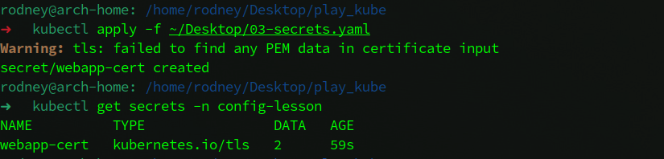

<br />

5. Объединил в один манифест создание Deployment, Service и Ingress (*листинг ниже*), файл манифеста рядом с ДЗ.

<details><summary>Манифест</summary>

```yaml
apiVersion: apps/v1
kind: Deployment
metadata:
  name: webapp-deployment
  namespace: config-lesson
  labels:
    app: webapp-nginx
    author: nvk-r0dney
spec:
  replicas: 2
  selector:
    matchLabels:
      app: webapp-nginx
  template:
    metadata:
      labels:
        app: webapp-nginx
    spec:
      containers:
        - name: webapp-nginx
          image: nginx:latest
          ports:
            - containerPort: 80
              name: http-port
              protocol: TCP
          volumeMounts:
            - name: configmap-volume
              mountPath: /usr/share/nginx/html
      volumes:
        - name: configmap-volume
          configMap:
            name: myconfigmap-01
---
apiVersion: v1
kind: Service
metadata:
  name: webapp-svc
  namespace: config-lesson
  labels:
    author: nvk-r0dney
spec:
  selector:
    app: webapp-nginx
  ports:
    - port: 80
      targetPort: http-port
      name: svc-web-port
---
apiVersion: networking.k8s.io/v1
kind: Ingress
metadata:
  name: webapp-ingress
  namespace: config-lesson
  annotations:
    nginx.ingress.kubernetes.io/rewrite-target: /$1
spec:
  ingressClassName: nginx
  rules:
    - host: shapoval0ff.com
      http:
        paths:
          - path: /
            pathType: Prefix
            backend:
              service:
                name: webapp-svc
                port:
                  name: svc-web-port
  tls:
    - hosts:
        - shapoval0ff.com
      secretName: webapp-cert
```

</details>

<br />

Применил манифест, смотрим результат:

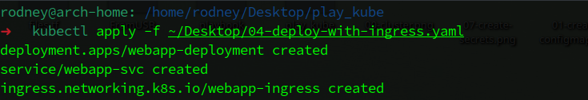

Убедился, что Ingress создался и успешно функционирует:

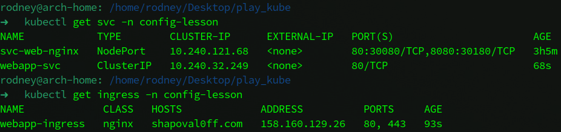

6. На локальной машине в `/etc/hosts` прописал сопоставление внешнего адреса LoadBalancer с моим вымышленным доменом. Проверяем доступ к приложению:

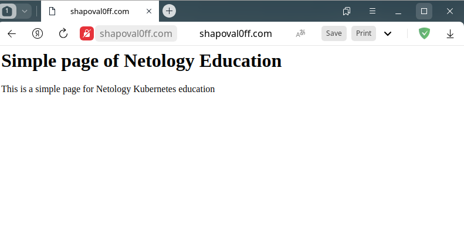

Отлично, приложение отвечает. Красный замочек показывает, что используется https с недоверенным сертификатом. Нужно убедиться, что используется мой самоподписанный сертификат:

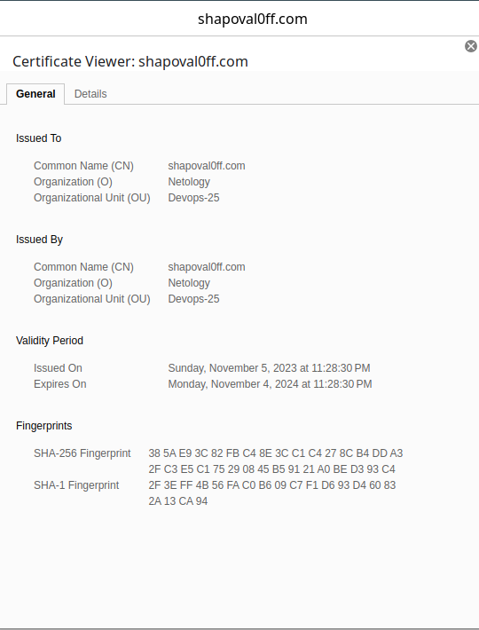

Отлично, используется именно тот сертификат, который я сгенерировал и подключил в манифесте.

**Итог: Подключил к приложению кастомный сертификат, запустил приложение, используя Ingress, получил доступ к приложению, проверил, что подключился мой кастомный сертификат и работает доступ по https. Задание выполнено.**
