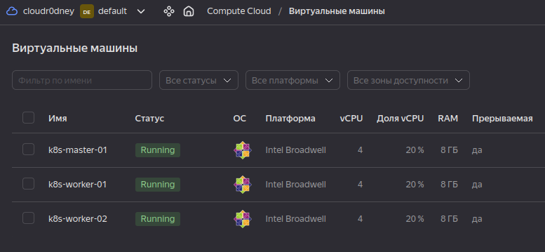
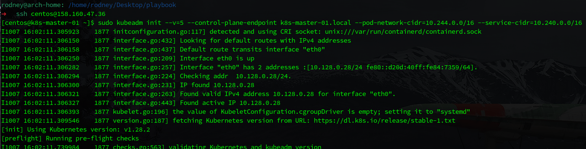
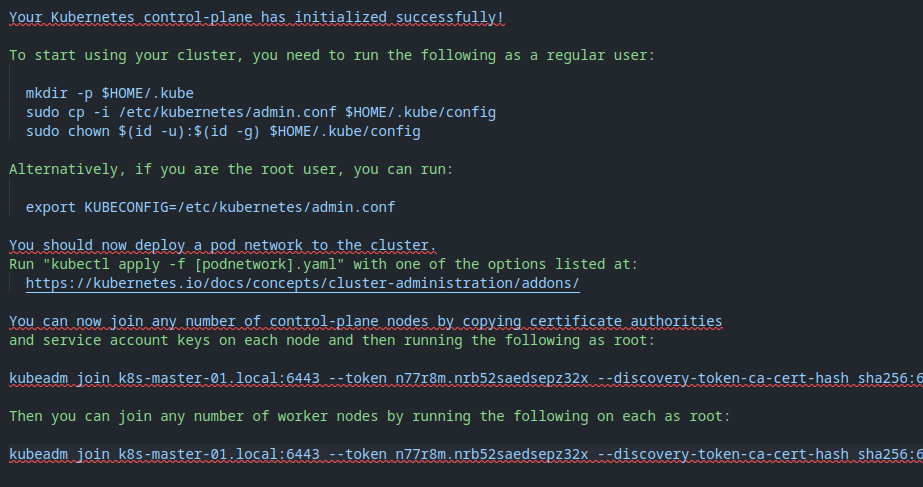
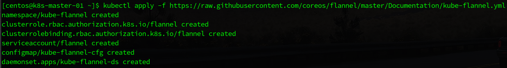
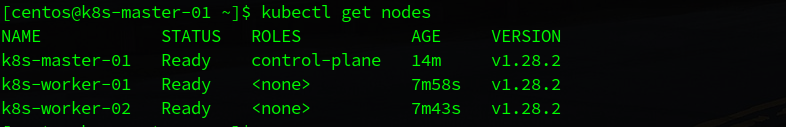
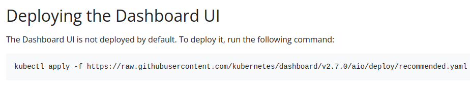
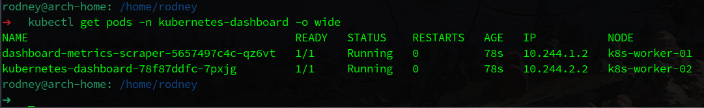
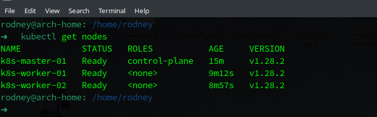
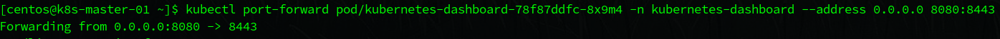
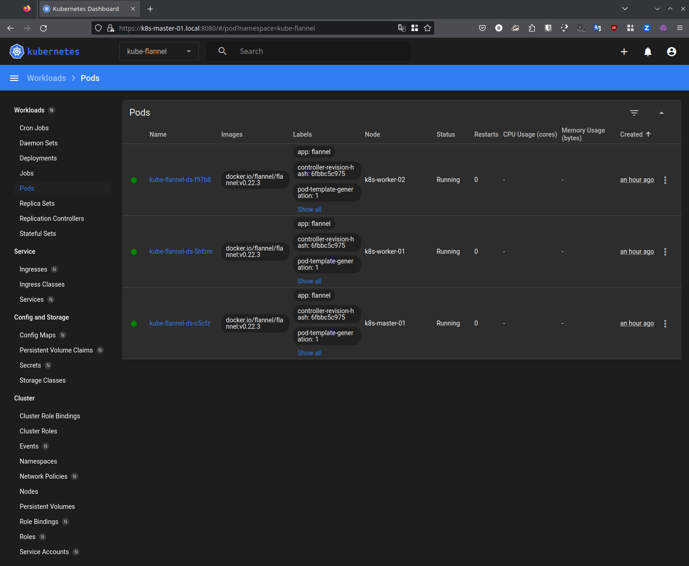

# Домашнее задание к занятию «Kubernetes. Причины появления. Команда kubectl»

## Выполнил студент группы DevOps-25 Шаповалов Кирилл

<br />

Цель задания
------------

Для экспериментов и валидации ваших решений вам нужно подготовить тестовую среду для работы с Kubernetes. Оптимальное решение — развернуть на рабочей машине или на отдельной виртуальной машине MicroK8S.

Чек-лист готовности к заданию
-----------------------------


1. Личный компьютер с ОС Linux или MacOS

или

2. ВМ c ОС Linux в облаке либо ВМ на локальной машине для установки MicroK8S

В данном случае имеется ноутбук с ОС ArchLinux на борту а также Yandex.Cloud для размещения виртуальных машин Kubernetes.

Инструкция к заданию
--------------------

Сразу остановлюсь на том, что следовать приложенной инструкции я не стал, а сразу усложнил себе жизнь :)))

Был развернут полноценный кластер Kubernetes из трех машин: Control-Plane, 2xWorker.

<br />

Задание 1. Установка Kubernetes
-------------------------------

```
1. Установить MicroK8S на локальную машину или на удалённую виртуальную машину.
2. Установить dashboard.
3. Сгенерировать сертификат для подключения к внешнему ip-адресу.
```

### Решение

**1. С помощью Terraform созданы 3 виртуальные машины в Yandex.Cloud с ОС CentOS 7.**



**2. С помощью Ansible на машины установлены Docker и все остальные его пакеты. Пакеты Kubernetes и все его конфиги пока буду создавать вручную с целью потренироваться и научиться их создавать.**

**3. На всех машинах выполнена подготовка к настройке кластера Kubernetes**

В файл `/etc/hosts` добавлены внутренние адреса всех нод:


Выполнена предварительная настройка ОС:

```bash
sudo swapoff -a
sudo setenforce 0
sudo sed -i --follow-symlinks 's/SELINUX=enforcing/SELINUX=disabled/g' /etc/sysconfig/selinux
sudo reboot

sudo tee /etc/yum.repos.d/kubernetes.repo<<EOF 
[kubernetes]
name=Kubernetes
baseurl=https://packages.cloud.google.com/yum/repos/kubernetes-el7-x86_64
enabled=1
gpgcheck=1
repo_gpgcheck=1
gpgkey=https://packages.cloud.google.com/yum/doc/yum-key.gpg https://packages.cloud.google.com/yum/doc/rpm-package-key.gpg
EOF

sudo yum update
sudo modprobe overlay
sudo modprobe br_netfilter
sudo tee /etc/sysctl.d/kubernetes.conf<<EOF
net.bridge.bridge-nf-call-ip6tables = 1
net.bridge.bridge-nf-call-iptables = 1
net.ipv4.ip_forward = 1
EOF

sudo sysctl --system
```

Установлены требуемые пакеты

```bash
sudo yum install -y kubelet kubeadm kubectl
sudo systectl enable kubelet
sudo systemctl start kubelet
```

**4. Инициализирован кластер Kubernetes на мастер ноде**



На этапе инициализации я указал доменное имя, а не адрес для обращения к кластеру - это более изящное решение, нежели с адресом, поскольку избавит от 1000 и одной проблемы в будущем, а также задал адресацию для подов и сервисов.

Кластер успешно инициализирован. Результат инициализации скопировал в файл:



**5. Установил и настроил CNI**

В качестве подопытного использовал **flannel**, тут честно немного поплясал на граблях, один раз из-за собственной невнимательности, из-за чего пересоздавал кластер разок :))



**6. Добавлены воркеры в кластер, прописан локальный конфиг, как то было указано в выводе результата инициализации кластера**

**7. Результат вывода команды kubectl на ноде кластера**



**8. Пользуясь официальной документацией - установил Дашборд**



Тут тоже пришлось поразвлекаться с созданием сервисной учетки и биндига роли для последующей авторизации в Дашборде по токену.

Дашборд запущен:



<br />

Задание 2. Установка и настройка локального kubectl
---------------------------------------------------

```
1. Установить на локальную машину kubectl.
2. Настроить локально подключение к кластеру.
3. Подключиться к дашборду с помощью port-forward.
```

### Решение

1. Установил на локальную машину `kubectl` командой `yay -S kubectl`

2. Скопировал содержимое конфиг-файла в локальный файл `~/.kube/config`. Благодаря тому, что в файле указано DNS имя кластера, а не адрес, для последующего подключения было достаточно в локальном файле `/etc/hosts` прописать NAT-адрес ВМ из облака и сопоставить его с именем Кубера. Проблема сертификата была полностью решена этим. Подключение настроено, проверяем:



3. Настроил port-forwarding до пода с дашбордом и проверил его работу




