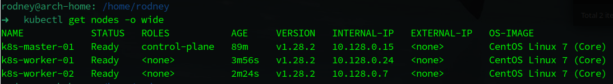
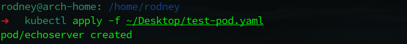
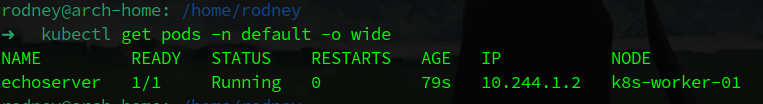
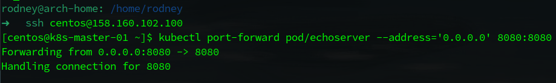
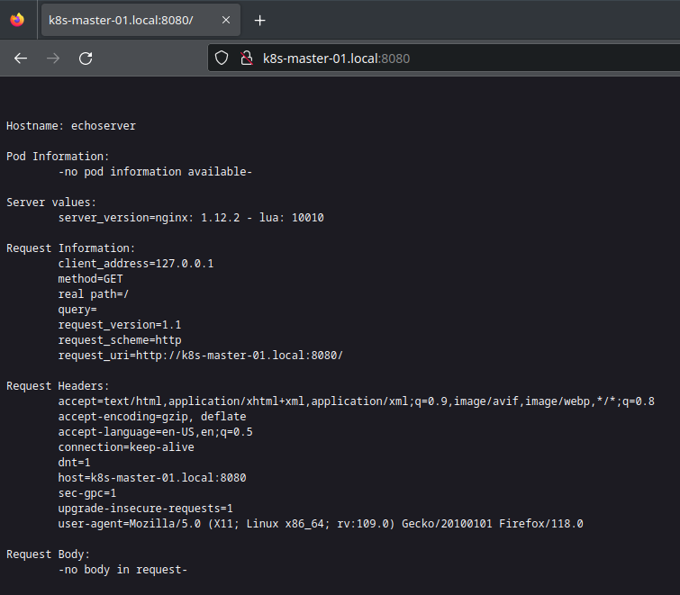
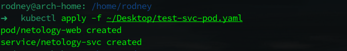
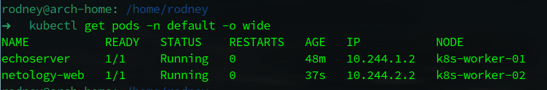
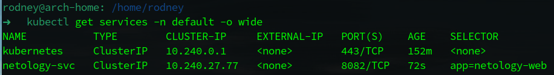
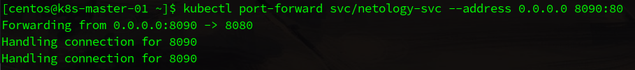
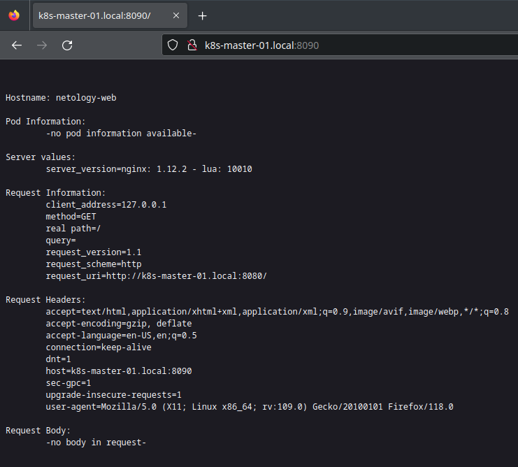

# Домашнее задание к занятию «Базовые объекты K8S»

## Выполнил студент группы DevOps-25 Шаповалов Кирилл

<br />

Цель занятия
------------

В тестовой среде для работы с Kubernetes, установленной в предыдущем ДЗ, необходимо развернуть Pod с приложением и подключиться к нему со своего локального компьютера.

Чек-лист готовности к домашнему заданию
------------

1. Установленное k8s-решение (например, MicroK8S).

Как и в прошлом задании - разворачивал полноценный кластер K8s на базе трех машин в Yandex.Cloud с ОС CentOS 7.



Единственный момент, если в первом задании я все этапы создания кластера проходил вручную, кроме создания самих ВМ, то сейчас написал небольшой плейбук, который большую часть настройки нод кластера выполняет автоматически. Все файлы плейбука находятся в каталоге <a href="./play_kube/">/play_kube/</a>

2. Установленный локальный kubectl.

Как видно на скрине консоли - я подключился локальным kubectl к K8s кластеру из трех машин.

3. Редактор YAML-файлов с подключенным Git-репозиторием.

В наличии VSCode, обвешанный всеми нужными плагинами и расширениями :)

<br />

Задание 1. Содать Pod с именем hello-world
------------------------------------------


    1. Создать манифест (yaml-конфигурацию) Pod.
    2. Использовать image - gcr.io/kubernetes-e2e-test-images/echoserver:2.2.
    3. Подключиться локально к Pod с помощью kubectl port-forward и вывести значение (curl или в браузере).

### Решение

Я немного невнимательно прочел задание, думал нужно делать под с любым именем, потому у моего пода имя не hello-world, в остальном на выполнении задания это никак не сказалось.

Сам манифест выглядит так:

```yaml
apiVersion: v1
kind: Pod
metadata:
  name: echoserver
  labels:
    app: echoserver
    author: Kirill_Shapovalov
  namespace: default
spec:
  containers:
    - name: echoserver
      image: gcr.io/kubernetes-e2e-test-images/echoserver:2.2
      ports:
        - containerPort: 8080
```

Файл с манифестом приложен к домашнему заданию.

Создал нужный под:



Проверил, что под запущен:



Настроил форвардинг до пода:



Проверил работу в браузере:



Все прекрасно работает, задание выполнено.

<br />

Задание 2. Создать Service и подключить его к Pod
-------------------------------------------------


    1. Создать Pod с именем netology-web.
    2. Использовать image — gcr.io/kubernetes-e2e-test-images/echoserver:2.2.
    3. Создать Service с именем netology-svc и подключить к netology-web.
    4. Подключиться локально к Service с помощью kubectl port-forward и вывести значение (curl или в браузере).

### Решение

Написал манифест, создающий еще один Pod, Service и устанавливающий Endpoint между ними по портам.

Текст манифеста:

```yaml
apiVersion: v1
kind: Pod
metadata:
  name: netology-web
  labels:
    app: netology-web
    author: Kirill_Shapovalov
spec:
  containers:
    - name: netology-web
      image: gcr.io/kubernetes-e2e-test-images/echoserver:2.2
      ports:
        - containerPort: 8080
          protocol: TCP
          name: web

---
apiVersion: v1
kind: Service
metadata:
  name: netology-svc
  labels:
    app: netology-svc
    author: Kirill_Shapovalov
spec:
  selector:
    app: netology-web
  ports:
    - name: svc-port
      protocol: TCP
      port: 80
      targetPort: web
```

Сам файл с манифестом так же приложен к домашнему заданию.

Выполнил указанный манифест:



Проверил список подов:



и список сервисов тоже:



Запустил форвардинг до сервиса:



Ну и проверил все это через браузер:



Все прекрасно работает, задание выполнено.

