# Домашнее задание к занятию «Запуск приложений в K8S»

## Выполнил студент группы DevOps-25 Шаповалов Кирилл

<br />

Чеклист готовности к домашнему заданию
--------------------------------------

Как и в предыдущих заданиях всю работу буду выполнять в полноценном кластере k8s, используя локальный kubectl

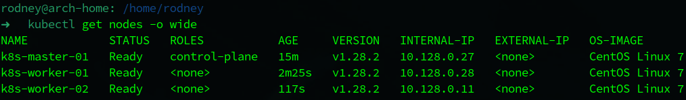

<br />

Задание 1. Создать Deployment и обеспечить доступ к репликам приложения из другого Pod
------------------------------


    1. Создать Deployment приложения, состоящего из двух контейнеров — nginx и multitool. Решить возникшую ошибку.
    2. После запуска увеличить количество реплик работающего приложения до 2.
    3. Продемонстрировать количество подов до и после масштабирования.
    4. Создать Service, который обеспечит доступ до реплик приложений из п.1.
    5. Создать отдельный Pod с приложением multitool и убедиться с помощью curl, 
    что из пода есть доступ до приложений из п.1.

### Решение

Подготовил манифест, в котором сразу описал и Deployment, и Service, и отдельный Pod с мультитулом

<details><summary>Манифест</summary>

```yaml
apiVersion: apps/v1
kind: Deployment
metadata:
  name: nginx-deployment
  labels:
    app: nginx
    author: nvk-r0dney
spec:
  replicas: 2
  selector:
    matchLabels:
      app: nginx
  template:
    metadata:
      labels:
        app: nginx
    spec:
      containers:
        - name: nginx
          image: nginx:latest
          ports:
            - containerPort: 80
              name: http-port
              protocol: TCP
        - name: multitool
          image: wbitt/network-multitool
          env:
            - name: HTTP_PORT
              value: "8080"
          ports:
            - containerPort: 8080
              name: tool-http
              protocol: TCP
---
apiVersion: v1
kind: Service
metadata:
  name: svc-web-nginx
  labels:
    author: nvk-r0dney
spec:
  selector:
    app: nginx
  ports:
    - port: 80
      name: svc-nginx-port
      targetPort: http-port
    - port: 8080
      name: svc-tool-port
      targetPort: tool-http
---
apiVersion: v1
kind: Pod
metadata:
  name: multitool-pod
  labels:
    author: nvk-r0dney
spec:
  containers:
    - image: wbitt/network-multitool
      name: multitool
```
</details>
<br />

Файл с манифестом приложен к домашнему заданию.

Изначально манифест запускался с параметром `replicas: 1`. Резльтаты ниже.

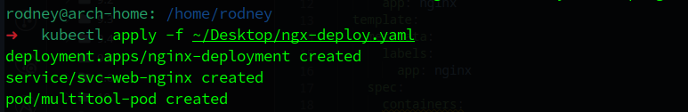


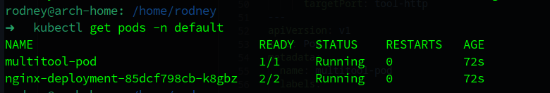

Нужно убедиться, что в нашем поде запущены 2 контейнера (проблема с запуском контейнеров решается тем, что их нужно развести по разным портам). Нужна команда `kubectl describe pod`, приведу часть вывода команды именно в блоке контейнеров:

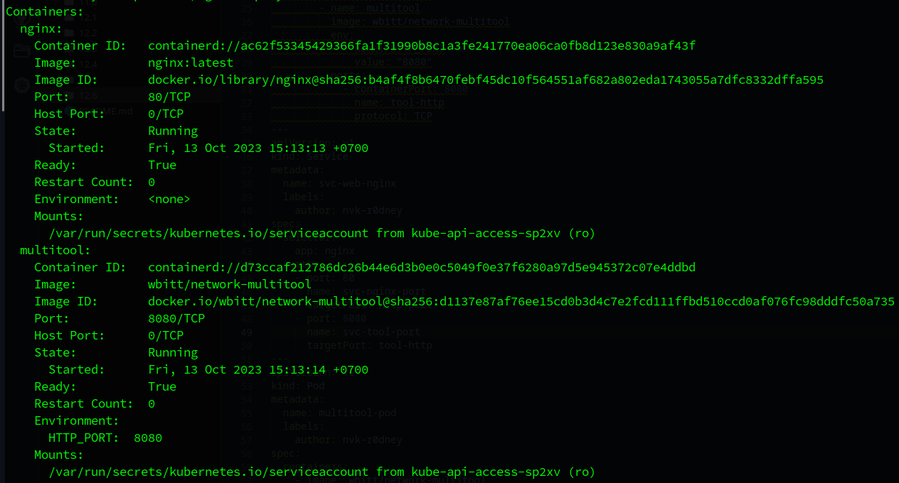

Как видно, в наличии два контейнера, приложения разведены по портам и никакого конфликта не произошло.

Проверяем наличие Service:

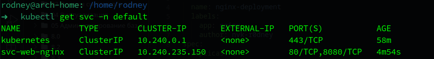

Изменил параметр `replicas: 2`. Запускаем, проверяем.

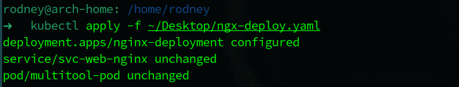

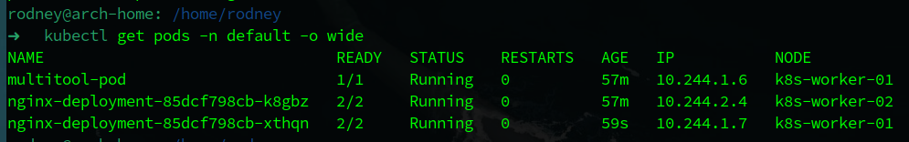

Как видно, подов добавилось. Количество реплик увеличилось до 2-х.

Нужно проверить доступ до сервисов в подах. Настроил port-forwarding, проверил через браузер:

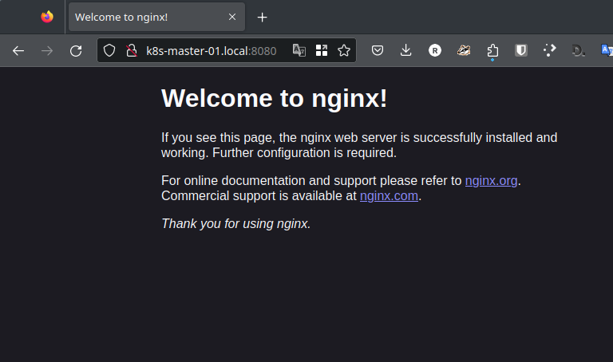

Nginx ответил, проверяем Мультитул:

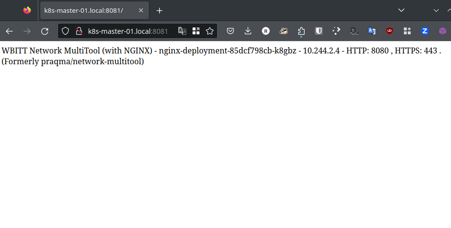

Проверим доступ до данных подов из отдельного пода с мультитулом:

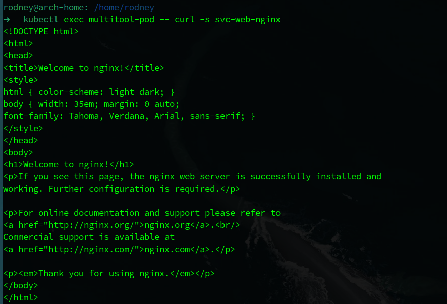

Nginx так же отвечает, проверим мультитул:

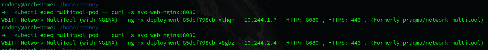

Мультитул так же ответил. Причем провел проверку дважды, как видно на скрине - ответили разные реплики приложения, отличаются адреса подов, с которых пришел ответ.

**Итог: все пункты по первому заданию выполнены, все условия соблюдены. Задание выполнено.**

<br />

Задание 2. Создать Deployment и обеспечить старт основного контейнера при выполнении условий
------------------------------------------


    1. Создать Deployment приложения nginx и обеспечить старт контейнера только после того, 
    как будет запущен сервис этого приложения.
    2. Убедиться, что nginx не стартует. В качестве Init-контейнера взять busybox.
    3. Создать и запустить Service. Убедиться, что Init запустился.
    4. Продемонстрировать состояние пода до и после запуска сервиса.

### Решение

Для решения данной задачи, чтобы соблюсти условия, написал раздельные манифесты на создание Deployment и Service.

Deployment

```yaml
apiVersion: apps/v1
kind: Deployment
metadata:
  name: second-nginx-deployment
  labels:
    app: nginx-dpl
    author: nvk-r0dney
spec:
  replicas: 1
  selector:
    matchLabels:
      app: nginx-dpl
  template:
    metadata:
      labels:
        app: nginx-dpl
        author: nvk-r0dney
    spec:
      containers:
        - name: nginx-web
          image: nginx:latest
          ports:
            - name: http-port
              containerPort: 80
              protocol: TCP
      initContainers:
        - name: init-nginx
          image: busybox:1.28
          command:
            [
              "sh",
              "-c",
              "until nslookup nginx-dpl-svc.$(cat /var/run/secrets/kubernetes.io/serviceaccount/namespace).svc.cluster.local; do echo waiting for nginx-dpl; sleep 2; done",
            ]
```

Service

```yaml
apiVersion: v1
kind: Service
metadata:
  name: nginx-dpl-svc
  labels:
    author: nvk-r0dney
spec:
  selector:
    app: nginx-dpl
  ports:
    - port: 80
      targetPort: http-port
```

<br />

Сначала выполнил манифест Deployment:

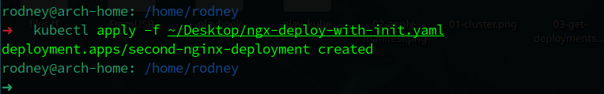

Проверяем какие поды сейчас в работе:

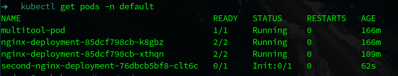

Как видно на скриншоте, контейнер с nginx не запущен, а запущен Init контейнер.

Создаем сервис из манифеста:

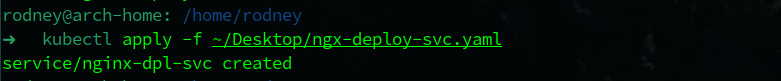

Так как Init контейнер настроен на nslookup сервиса, то как только появился сервис и контейнер его успешно зарезолвил, спустя 2 секунды он запускает основной контейнер с nginx. Убедимся, что nginx запустился:

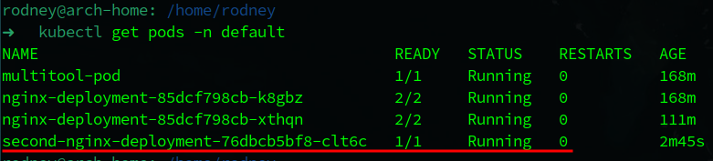

Как видно, под находится в запущенном состоянии, значит стартанул основной контейнер приложения.

**Итого: Выполнены все пункты задания, соблюдены все условия. Задание выполнено**