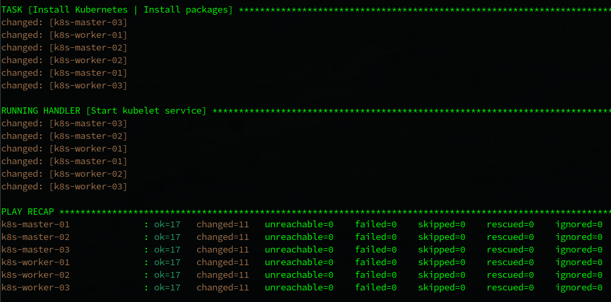
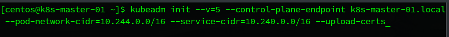
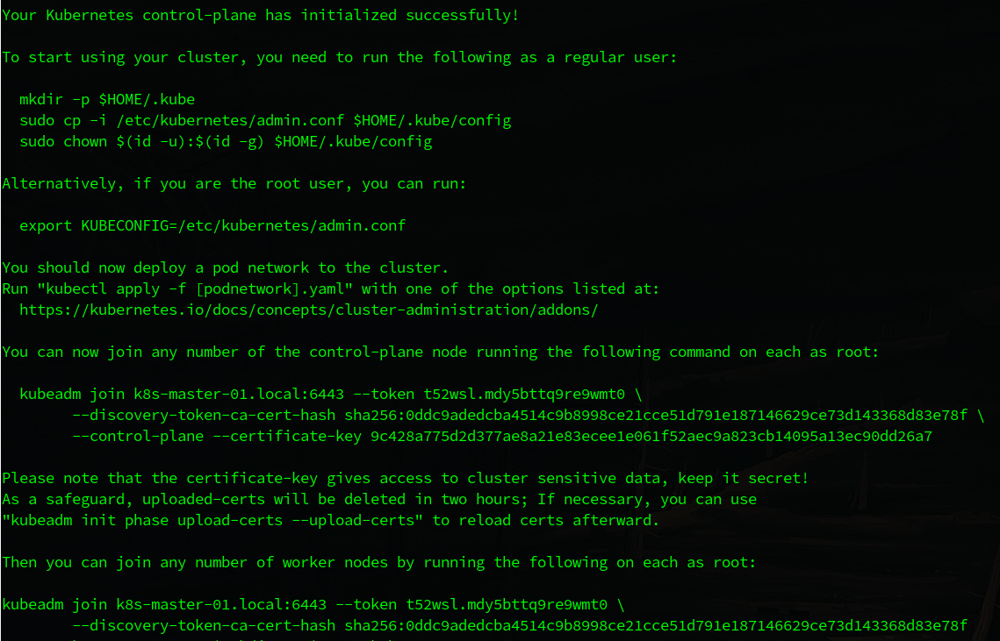
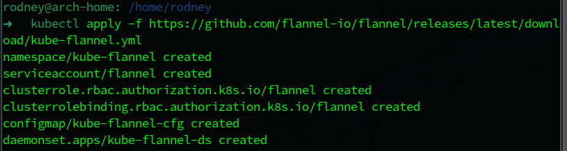
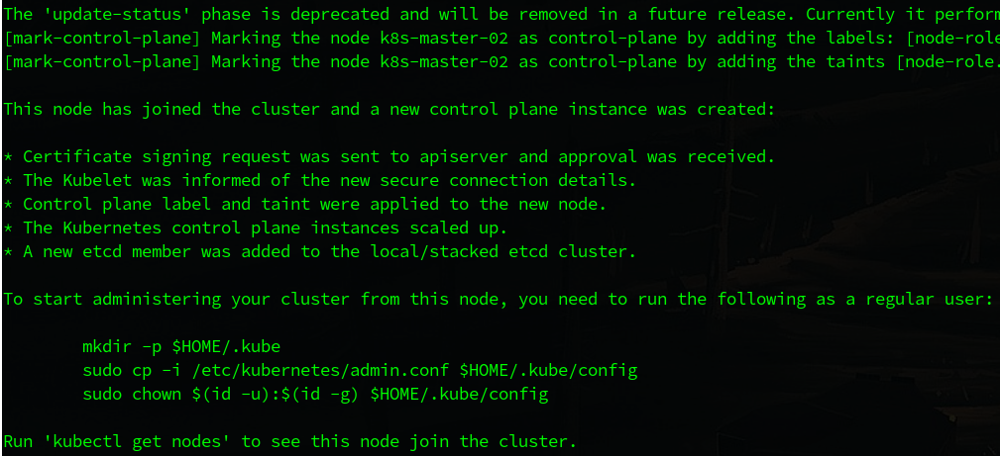
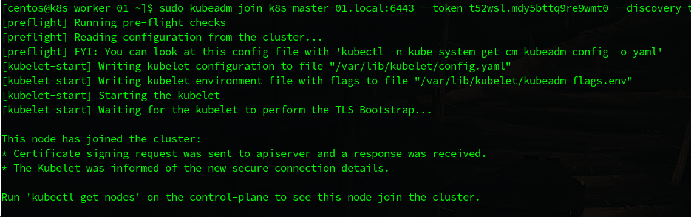
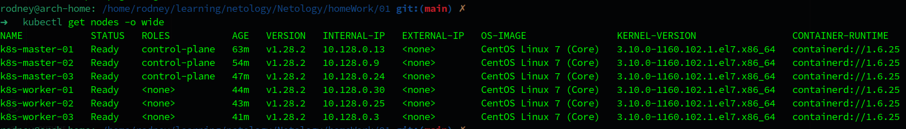

# Домашнее задание к занятию «Установка Kubernetes»

## Выполнил студент группы DevOps-25 Шаповалов Кирилл

<br />

## Цель задания

Установить кластер K8s.

<br />

Задание 1. Установить кластер k8s с 1 master node
---------

    1. Подготовка работы кластера из 5 нод: 1 мастер и 4 рабочие ноды.
    2. В качестве CRI — containerd.
    3. Запуск etcd производить на мастере.
    4. Способ установки выбрать самостоятельно.

Решение
-------

1. Создал 6 виртуальных машин с помощью Terraform в Yandex.Cloud. Изначально расчет был на три мастера и три воркера. Количество тут не принципиально, алгоритм подключения будет абсолютно идентичным хоть для 2, хоть для 15 нод.

2. Всю базовую настройку виртуальных машин выполняю с помощью Ansible Playbook (<a href="./play_kube/site.yml">ссылка</a>). Данный Playbook ставит необходимые пакеты, производит необходимые настройки. P.S.: Все домашние работы предыдущего раздела я также выполнял с реальным кластером K8s, тогда и был написан данный плейбук. 

**Итог работы Ansible:**



3. На первой мастер-ноде выполнил инициализацию кластера. В случае с несколькими мастер-нодами обязательно нужно не забыть про параметр `--upload-certs`, иначе остальные мастер-ноды не смогут подключиться к кластеру.

**Старт инициализации кластера:**



**Результат инициализации:**



Как видно, инициализация кластера успешно выполнена, остается добавить config-файл для работы kubectl под нужным пользователем и с помощью указанных команд добавить мастер-ноды и воркер-ноды в кластер.

4. Добавил сразу сеть в кластер.

**Деплой Flannel CNI:**



5. Используя команду, которую получил после инициализации кластера, добавил все оставшиеся мастер-ноды.

```bash
sudo kubeadm join k8s-master-01.local:6443 --token t52wsl.mdy5bttq9re9wmt0 \ 
     --discovery-token-ca-cert-hash sha256:0ddc9adedcba4514c9b8998ce21cce51d791e187146629ce73d143368d83e78f \ 
     --control-plane --certificate-key 9c428a775d2d377ae8a21e83ecee1e061f52aec9a823cb14095a13ec90dd26a7
```

**Результат добавления мастер-ноды:**



6. Используя команду, которую получил после инициализации кластера, добавил все воркер-ноды.

```bash
sudo kubeadm join k8s-master-01.local:6443 --token t52wsl.mdy5bttq9re9wmt0 \ 
     --discovery-token-ca-cert-hash sha256:0ddc9adedcba4514c9b8998ce21cce51d791e187146629ce73d143368d83e78f
```

**Результат добавления воркер-ноды:**



7. Наконец, когда кластер собран полностью, можно проверить его статус.

`kubectl get nodes -o wide`



<br />

**Итог: Кластер собран и готов к работе. Задание выполнено.**

<br />

Задание 2*. Установить HA кластер
-----------

    Установить кластер в режиме HA.
    Использовать нечётное количество Master-node.
    Для cluster ip использовать keepalived или другой способ.

Решение:
--------

Мой способ создания виртуальных машин, к сожалению, не предусматривает создания дополнительного сетевого адаптера в машинах, а после создания машин с помощью Terraform - добавить адаптер уже проблематично.

Опишу ход действий:

1. Созданы, например, вручную все виртуальные машины (ну либо же мне бы пришлось доделать немного мой Terraform-манифест :) ). 
2. В консоли Yandex.Cloud резервируется дополнительно внешний IP-адрес, который назначается на дополнительный адаптер мастер-ноды.
3. На все мастер-ноды кластера устанавливаются пакеты `keepalived` и `haproxy`.
4. На первой мастер-ноде keepalived конфигурируется следующим образом:

```conf
vrrp_script chk_haproxy {
  script "killall -0 haproxy"
  interval 2
  weight 2
}

vrrp_instance VI_1 {
  interface eth1
  state MASTER

  virtual_router_id 51
  priority 101

  virtual_ipaddress {
    84.252.140.89/30
  }

  track_script {
    chk_haproxy
  }
}
```
5. На оставшихся мастер-нодах настройка будет отличаться только режимом и приоритетом, нужно будет выставить `state BACKUP` и `priority 100`.
6. Нужно отредактировать конфиг-файл haproxy `/etc/haproxy/haproxy.cfg` следующим образом

```conf
global
    chroot      /var/lib/haproxy
    pidfile     /var/run/haproxy.pid
    maxconn     4000
    user        haproxy
    group       haproxy
    daemon

defaults
    log     global
    mode    tcp
    retries 2
    timeout client 30m
    timeout connect 4s
    timeout server 30m
    timeout check 5s

frontend k8s
    bind 84.252.140.89:7443
    default_backend   masters

backend masters
    balance     roundrobin
    server control1 158.160.62.140:6443 check
    server control2 158.160.116.230:6443 check
    server control3 84.201.128.208:6443 check

listen stats
    bind *:9000
    mode http
    stats enable
    stats hide-version
    stats realm Haproxy\ Statistics
    stats uri /haproxy_stats
```

Таким образом будет работать балансировка запросов tcp-подключений в соответствии с весами серверов и сохранится отказоустойчивость при выходе из строя одной из мастер-нод. Однако, выход из строя мастера - это большая проблема, и нужно приложить максимальное количество сил для скорейшего возвращения в строй мастера.