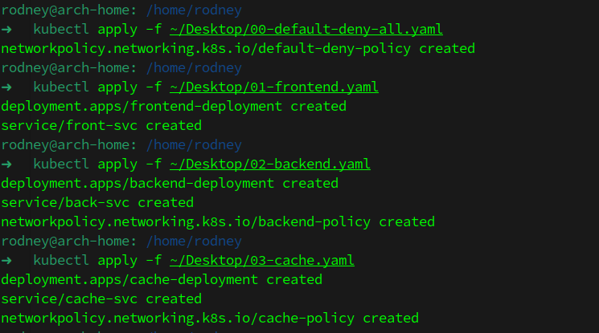

# Домашнее задание к занятию «Как работает сеть в K8s»

## Выполнил студент группы DevOps-25 Шаповалов Кирилл

<br />

## Цель задания

Настроить сетевую политику доступа к подам.

<br />

## Чеклист готовности к домашнему заданию

1. Кластер K8s с установленным сетевым плагином Calico.


Кластер с установленным плагином CNI Calico в наличии.

<br />

Задание 1. Создать сетевую политику или несколько политик для обеспечения доступа
----------

    1. Создать deployment'ы приложений frontend, backend и cache и соответсвующие сервисы.
    2. В качестве образа использовать network-multitool.
    3. Разместить поды в namespace App.
    4. Создать политики, чтобы обеспечить доступ frontend -> backend -> cache. 
       Другие виды подключений должны быть запрещены.
    5. Продемонстрировать, что трафик разрешён и запрещён.

### Решение

**1. Подготовлены манифесты, содержащие Deployment, Service и NetworkPolicy для разных приложений**

* <a href="./yaml/01-frontend.yaml">Frontend</a> 
* <a href="./yaml/02-backend.yaml">Backend</a> 
* <a href="./yaml/03-cache.yaml">Cache</a> 

Также написана политика, которая по умолчанию закрывает любой обмен между подами:

```yaml
apiVersion: networking.k8s.io/v1
kind: NetworkPolicy
metadata:
  name: default-deny-policy
  namespace: app
  labels:
    author: nvk-r0dney
spec:
  podSelector: {}
  policyTypes:
    - Ingress
```

**2. Создал namespace `app` и применил по очереди все манифесты, результаты ниже**




**3. Проверил, что все создалось и запустилось**


**4. Проверяем, насколько корректно отрабатывают политики, пропуская и запрещая обмен между подами**

* Доступ из пода Frontend в Backend:


* Доступ из пода Frontend в Cache:


Как видно, доступ из Frontend в Backend есть, а вот в Cache - ему ходить не положено, доступа нет.

* Доступ из Backend в Cache:


* Доступ из Backend во Frontend:


Из Backend доступ в Cache работает, а во Frontend - нет, как и описано в задании.

* Доступ из Cache в Backend:


* Доступ из Cache во Frontend:


Из Cache доступа нет никуда. Как и положено по условиям задачи.

<br />

**Итого: созданы манифесты трех приложений, настроены доступы с помощью NetworkPolicy, доступы работают в соответствии с условием задачи. Задание выполнено.**