# Домашнее задание к занятию «Troubleshooting»

## Выполнил студент группы DevOps-25 Шаповалов Кирилл

<br />

## Цель задания

Устранить неисправности при деплое приложения.

<br />

## Чеклист готовности к домашнему заданию

1. Кластер K8s.

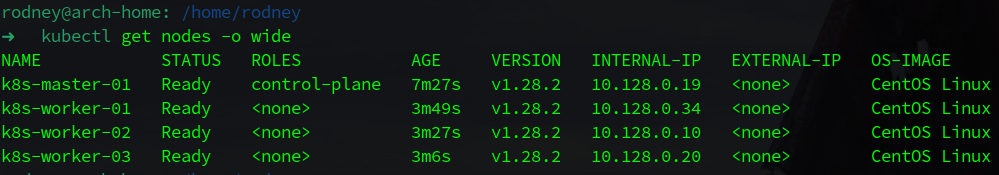

<br />

Задание. При деплое приложение web-consumer не может подключиться к auth-db. Необходимо это исправить
--------

1. Установить приложение по команде:

`kubectl apply -f https://raw.githubusercontent.com/netology-code/kuber-homeworks/main/3.5/files/task.yaml`

2. Выявить проблему и описать.
3. Исправить проблему, описать, что сделано.
4. Продемонстрировать, что проблема решена.

<br />

Решение
-------

**1. Скачал манифест себе на ПК, чтоб ознакомиться локально**

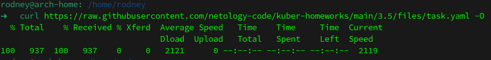

**2. Попытался применить манифест, итог - возникновение первой ошибки деплоя**

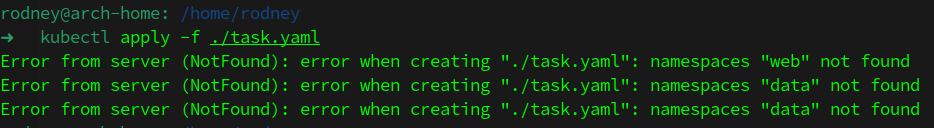

Деплой не может быть выполнен, поскольку в кластере нет нужных неймспейсов.

**3. Создал неймспейсы руками и применил манифест повторно**

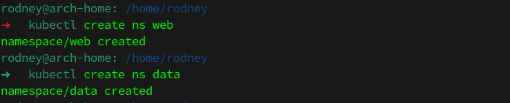

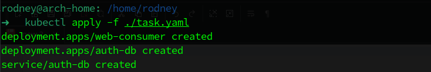

**4. Проверил, что поды успешно поднялись**

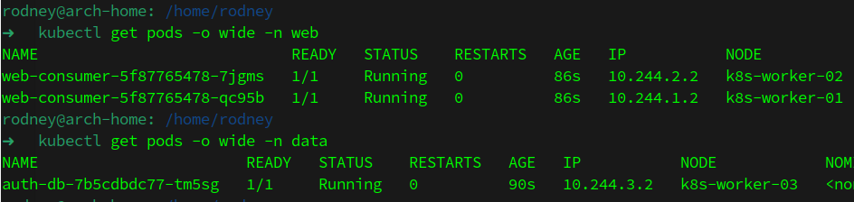

**5. Выполнил руками команду из манифеста в поде веб-приложения**

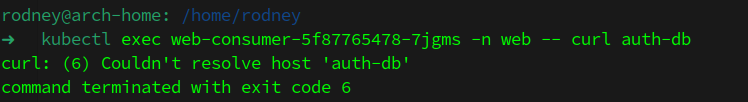

**6. Проверил логи пода веб-приложения**

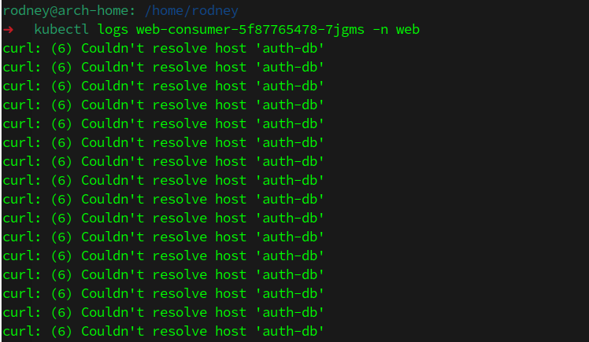

**7. Проверил в наличии ли необходимый сервис**

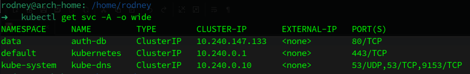

<br />

И вот тут явно видно, что поды веб-приложения находятся в неймспейсе `web`, а сервис `auth-db` - в неймспейсе `data`.

Рассмотрим синтаксис самой команды, которая выполняется в поде:

```yaml
- command:
    - sh
    - -c
    - while true; do curl auth-db; sleep 5; done
  image: radial/busyboxplus:curl
  name: busybox
```

Как видно, под пытается получить доступ на 80 порт сервиса, находящегося в другом неймспейе, в этом случае обращение должно происходить по DNS имени сервиса.

**8. Проверил решение, запустив команду вручную**

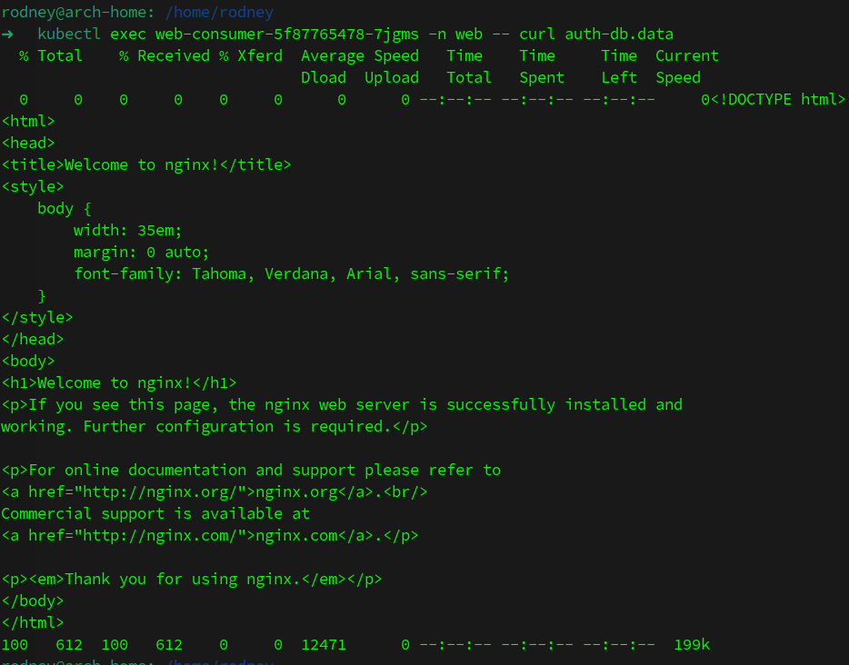

При обращении по DNS имени сервиса - запрос успешно выполняется.

**9. Доработал манифест, чтобы все выполнялось сразу в автоматическом режиме, удалил все, что было создано, проверил, что теперь все создается из манифеста**

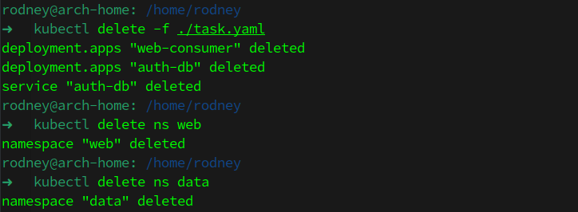

В манифест было добавлено создание неймспейсов:

```yaml
apiVersion: v1
kind: Namespace
metadata:
  name: data
---
apiVersion: v1
kind: Namespace
metadata:
  name: web
---
```

И так же была исправлена команда, выполняемая в поде:

```yaml
- command:
    - sh
    - -c
    - while true; do curl auth-db.data; sleep 5; done
  image: radial/busyboxplus:curl
  name: busybox
```

Ссылка на исправленный манифест - <a href="task.yaml">тут</a>

Теперь все успешно создается при запуске манифеста:

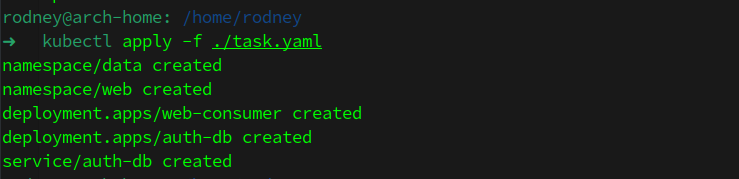

Команда в поде также успешно выполняется:

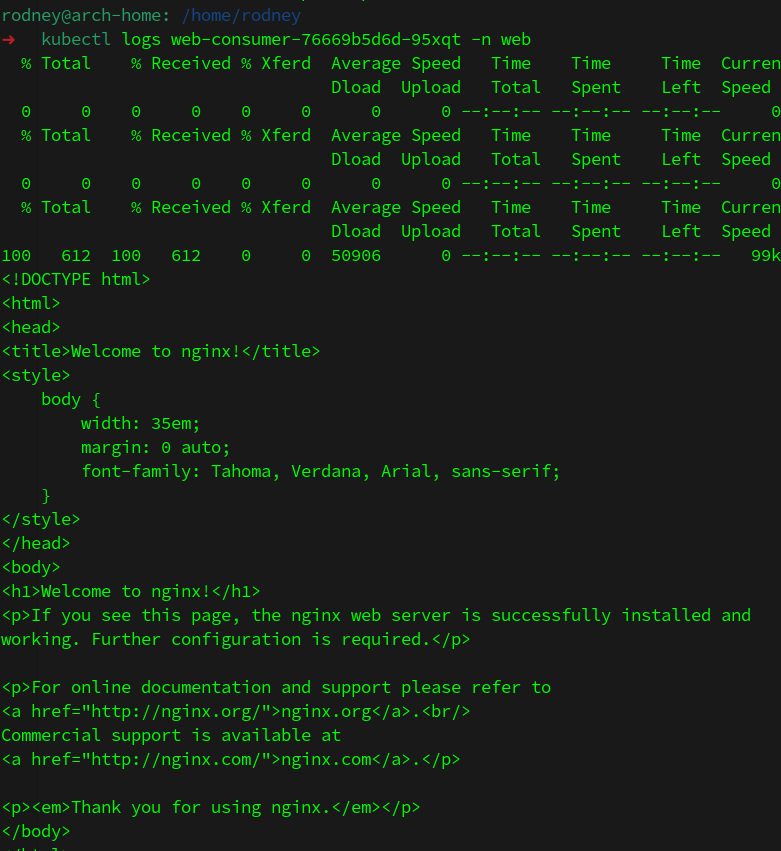

<br />

**Итог: Все проблемы, возникшие при деплое, устранены. Деплой успешно исполняется, приложения в подах успешно функционируют и работает сетевое взаимодействие. Задание выполнено.**
