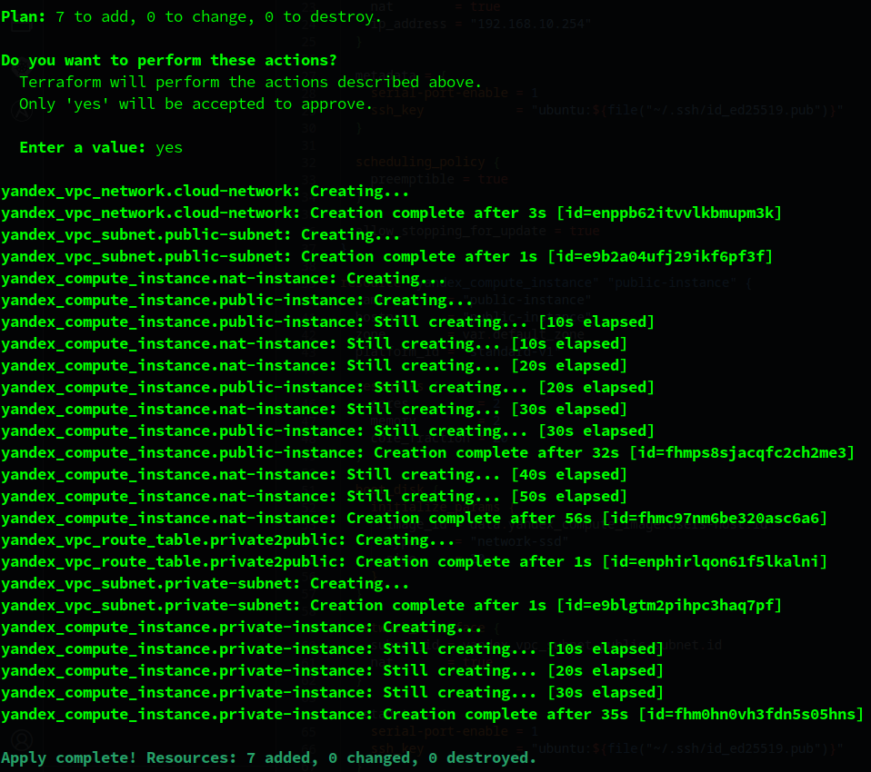
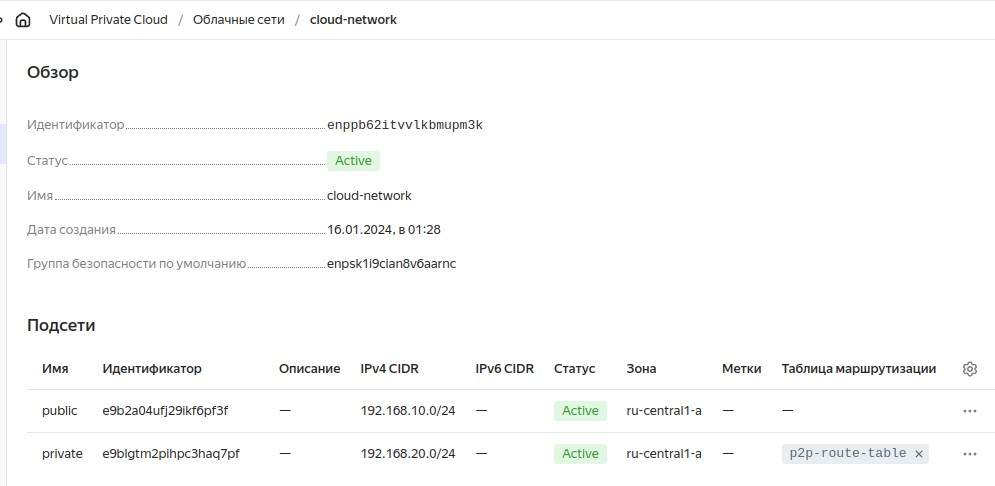
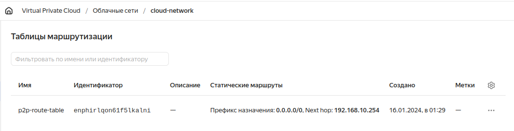
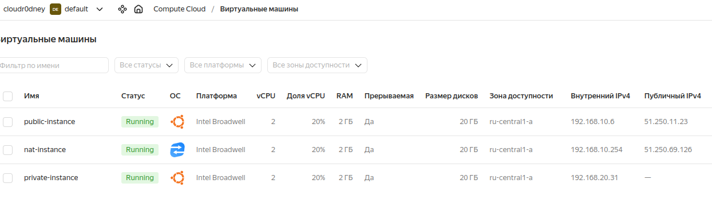
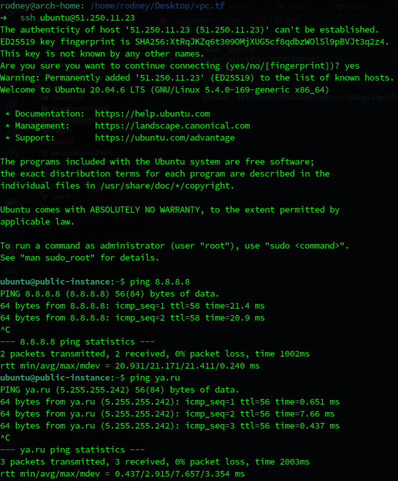
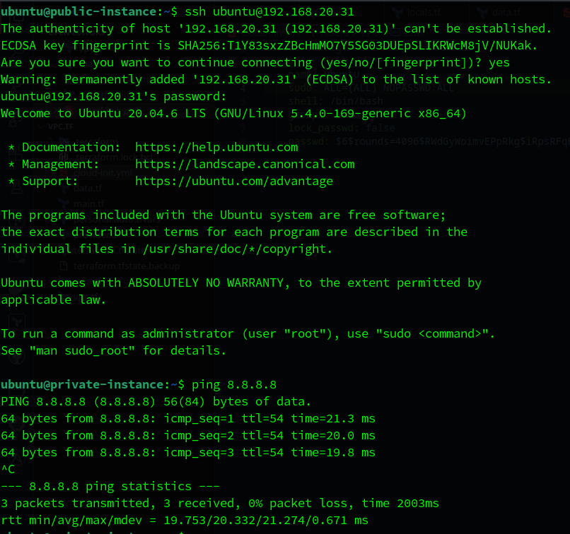
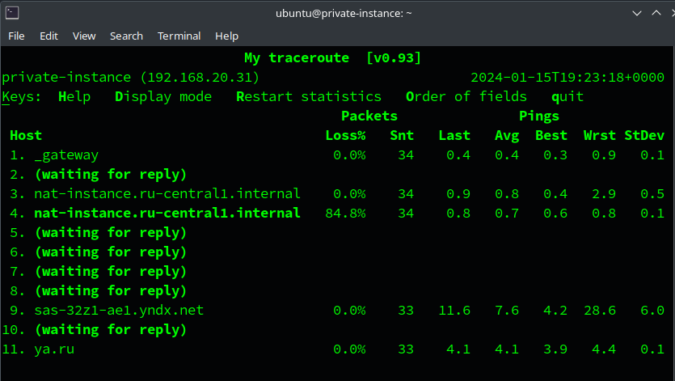
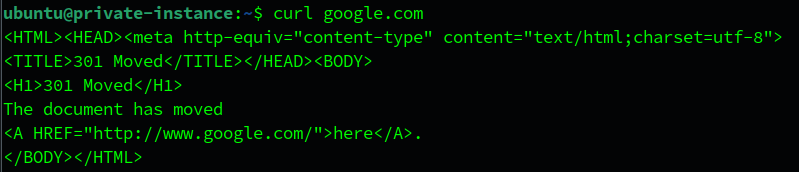

# Домашнее задание к занятию «Организация сети»

## Выполнил студент группы DevOps-25 Шаповалов Кирилл

 

Задание 1. Yandex Cloud
-----------------------

**Что нужно сделать**

Создать пустую VPC. Выбрать зону.

**Публичная подсеть.**

1. Создать в VPC subnet с названием public, сетью 192.168.10.0/24.
2. Создать в этой подсети NAT-инстанс, присвоив ему адрес 192.168.10.254. В качестве image_id использовать fd80mrhj8fl2oe87o4e1.
3. Создать в этой публичной подсети виртуалку с публичным IP, подключиться к ней и убедиться, что есть доступ к интернету.

**Приватная подсеть.**

1. Создать в VPC subnet с названием private, сетью 192.168.20.0/24.
2. Создать route table. Добавить статический маршрут, направляющий весь исходящий трафик private сети в NAT-инстанс.
3. Создать в этой приватной подсети виртуалку с внутренним IP, подключиться к ней через виртуалку, созданную ранее, и убедиться, что есть доступ к интернету.

 

### Решение

Задача решена с помощью Terraform, все файлы проекта находятся в каталоге <a href="./vpc.tf/">vpc.tf</a>

1. Результат выполнения команды `terraform apply`

Итого, созданы: сеть, в ней две подсети, таблица маршрутизации, НАТ-инстанс, инстанс в публичной подсети, инстанс в приватной подсети.

2. Проверка в консоли Yandex.Cloud - сеть и подсети

3. Проверка в консоли Yandex.Cloud - таблица маршрутизации

4. Проверка в консоли Yandex.Cloud - инстансы

5. Подключился по SSH к машине в публичной сети, проверил доступ в Интернет

Пинг проходит как до IP-адресов, так и до DNS-имен, что означает, что имена успешно резолвятся в адреса. Доступ в Интернет есть.

6. С публичной машины подключился по SSH к внутреннему адресу приватной машины (заходить надо по логину и паролю, которые указаны в cloud-init файле), проверил доступ в Интернет

7. Убедился на машине в приватной подсети, что трафик роутится на нат-инстанс с помощью команды `mtr`

Как видно, трафик направляется через nat-instance, значит таблица маршрутизации успешно работает.

8. Попробуем получить доступ к сайту

Доступ есть. Задание выполнено.

 

P.S.: После выполнения задания все ресурсы были уничтожены командой `terraform destroy`.
