# Домашнее задание к занятию 7 «Жизненный цикл ПО»

## Выполнил студент группы DevOps-25 Шаповалов Кирилл

 

Подготовка к выполнению
-----------------------

 

    1. Получить бесплатную версию Jira.

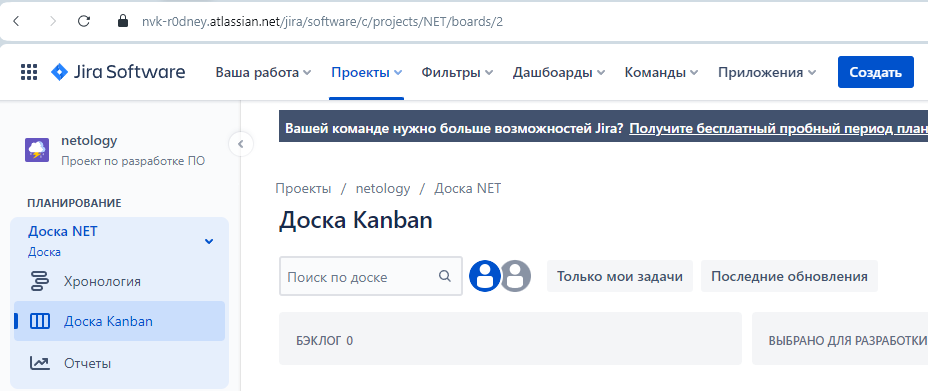

Бесплатная версия Jira получена.

    2. Настроить её для своей команды разработки.

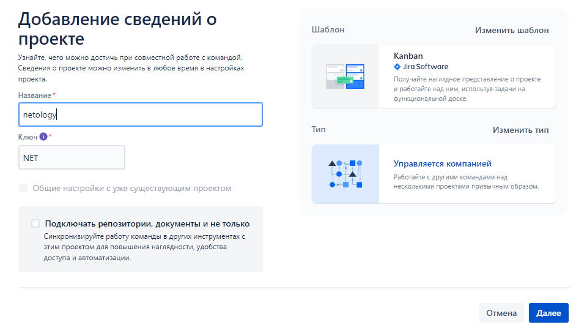

Добавлен необходимый проект. Все настройки по жизненному циклу будут вноситься в процессе выполнения основной части задания.

    3. Создать доски Kanban и Scrum.

Доски созданы.

 

Основная часть
--------------

 

Необходимо создать собственные workflow для двух типов задач: bug и остальные типы задач. Задачи типа bug должны проходить жизненный цикл:

    Open -> On reproduce.
    On reproduce -> Open, Done reproduce.
    Done reproduce -> On fix.
    On fix -> On reproduce, Done fix.
    Done fix -> On test.
    On test -> On fix, Done.
    Done -> Closed, Open.

Для данного условия настроен соответствующий Workflow с переходами:

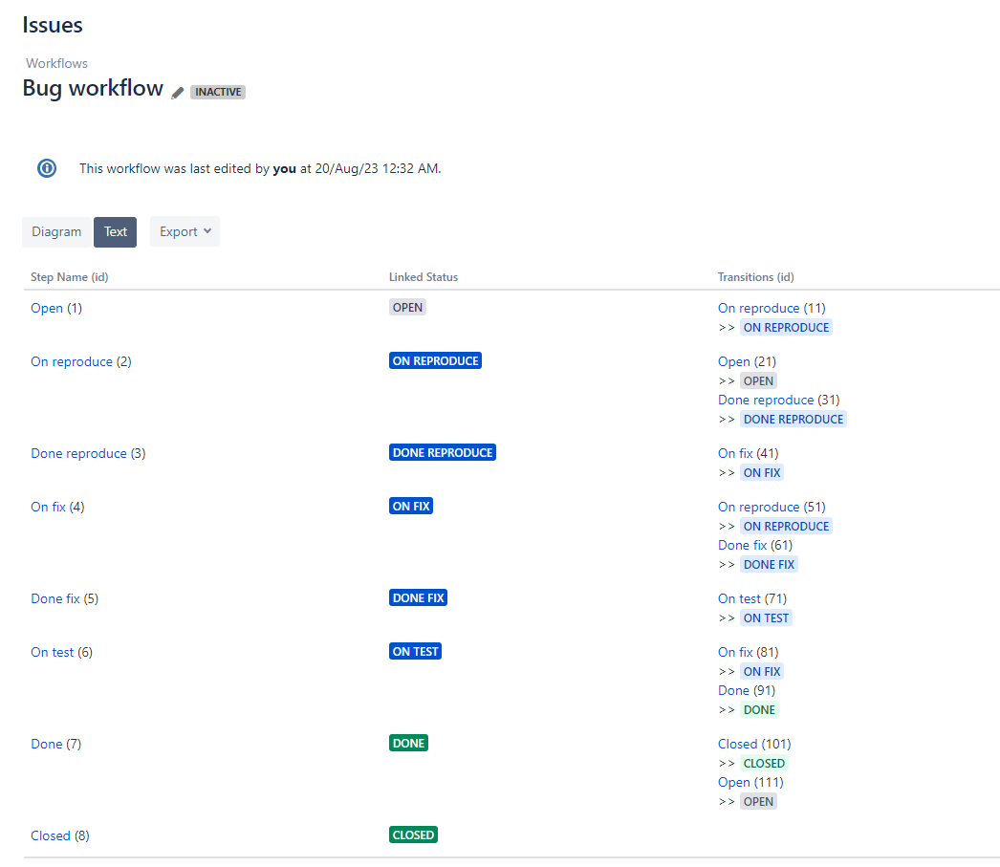

Остальные задачи должны проходить по упрощённому workflow:

    Open -> On develop.
    On develop -> Open, Done develop.
    Done develop -> On test.
    On test -> On develop, Done.
    Done -> Closed, Open.

И для данного условия настроен соответствующий Workflow с переходами:

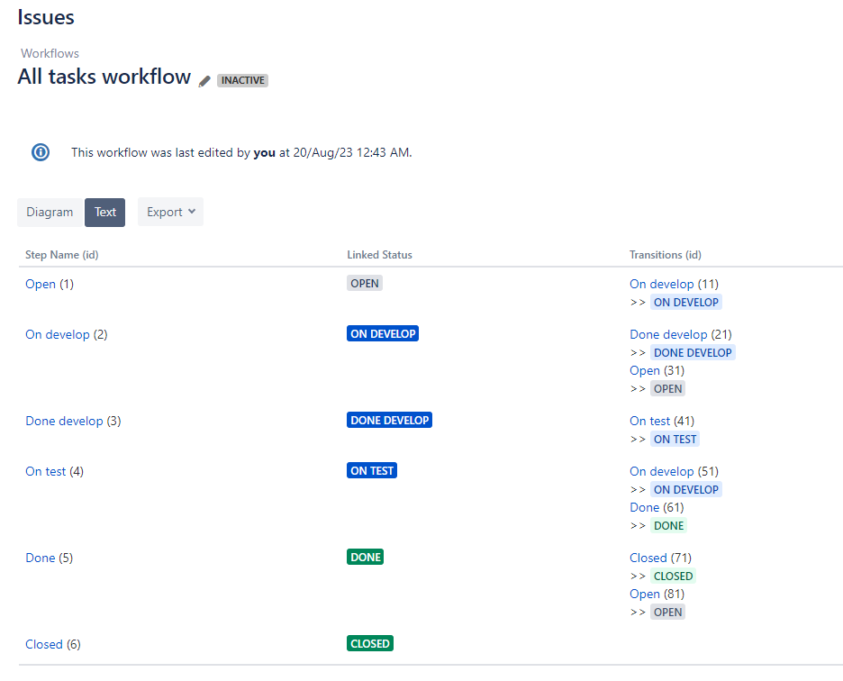

Оба Workflow ассоциированы с моим тестовым проектом:

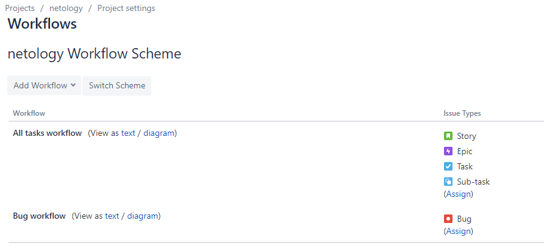

### Что нужно сделать

1. Создайте задачу с типом bug, попытайтесь провести его по всему workflow до Done.

Для примера демонстрации работы в данном случае задача типа `Bug` находится на этапе `On Test`, и из него она может быть перемещена на этапы `Done` или `On fix` (ровно как того требовало условие задачи):

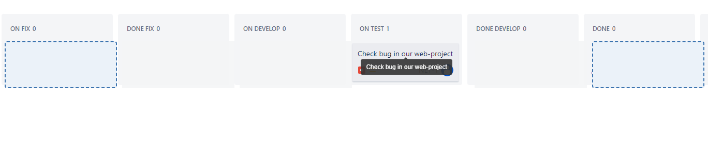

2. Создайте задачу с типом epic, к ней привяжите несколько задач с типом task, проведите их по всему workflow до Done.

Задачи со всеми остальными типами с этапа `Open` могут быть перемещены только на этап `On Develop` - как в данном случае на скриншоте (в полном соответствии с условием задачи):

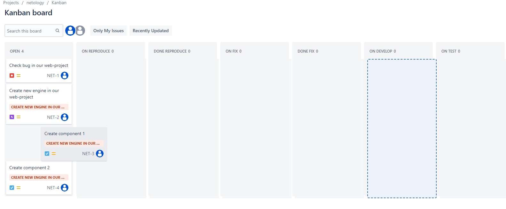

3. При проведении обеих задач по статусам используйте kanban.

Настроил вид Kanban для отображения всех этапов Workflow:

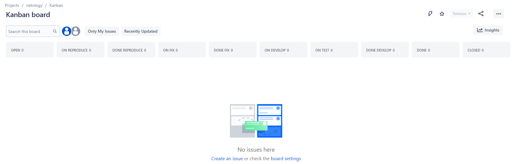

4. Верните задачи в статус Open.

После этапа `Done` вернул все таски на этап `Open`.

5. Перейдите в Scrum, запланируйте новый спринт, состоящий из задач эпика и одного бага, стартуйте спринт, проведите задачи до состояния Closed. Закройте спринт.

Создал новый спринт, так же отредактировав доску под все созданные этапы для наглядности:

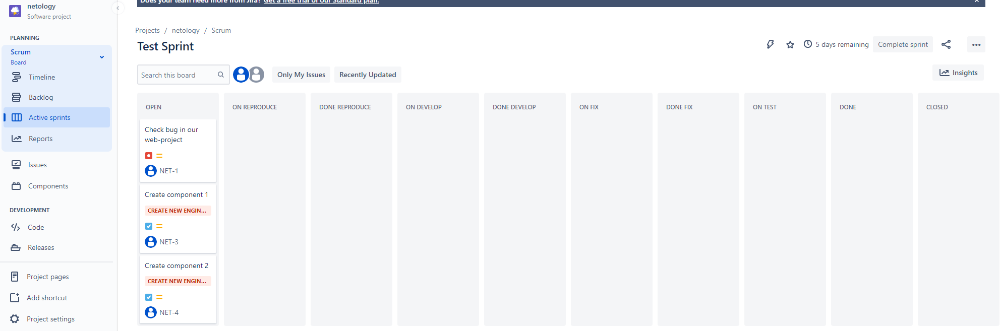

Все задачи проведены по спринту до этапа `Closed`. Спринт завершен. На выходе получен отчет о спринте:

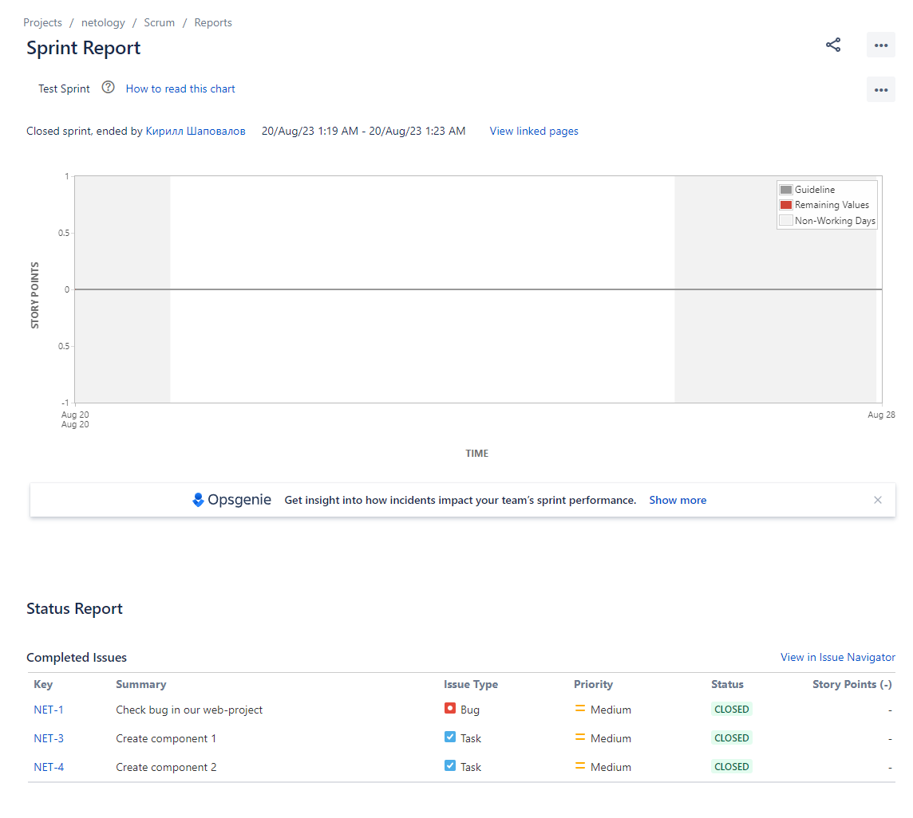

6. Если всё отработалось в рамках ожидания — выгрузите схемы workflow для импорта в XML. Файлы с workflow и скриншоты workflow приложите к решению задания.

Все отработало в рамках ожидания, ровно по той логике, которая была прописана в системе.

Схема Workflow для задач с типом `bug` выглядит так:

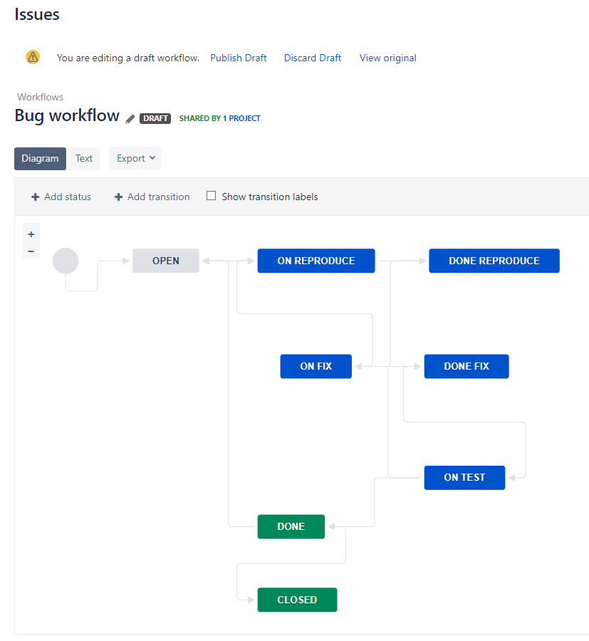

Схема для остальных задач выглядит так:

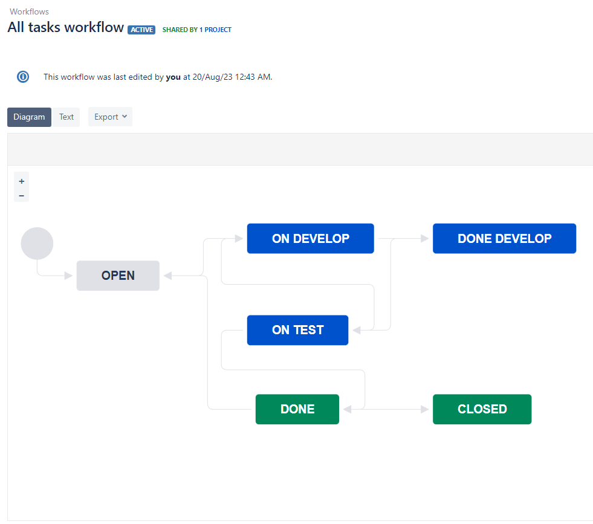

Схемы в формате `xml` выгружены и приложены к данному домашнему заданию.