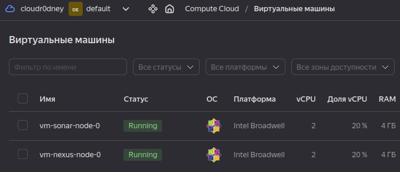
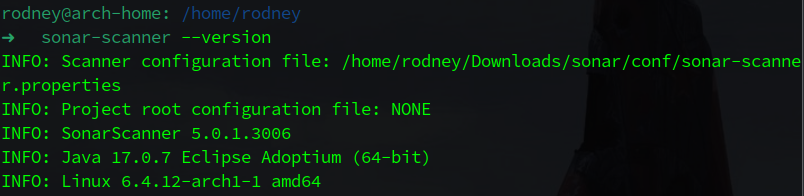

# Домашнее задание к занятию 9 «Процессы CI/CD»

## Выполнил студент группы DevOps-25 Шаповалов Кирилл

<br />

Подготовка к выполнению
-----------------------

<br />

    1. Создайте два VM в Yandex Cloud с параметрами: 2CPU 4RAM Centos7 (остальное по минимальным требованиям).

Виртуальные машины созданы с помощью Terraform, все файлы проекта находятся в папке `files.tf`.



    2. Пропишите в inventory playbook созданные хосты.

Готово.

    3. Добавьте в files файл со своим публичным ключом (id_rsa.pub). 
    Если ключ называется иначе — найдите таску в плейбуке, которая использует id_rsa.pub имя, и исправьте на своё.

Давно генерировал ключ для Yandex.Cloud в формате ED25519, ключ называется `id_ed25519.pub`, нашел использование ключа в Playbook, поменял название на свое.

    4. Запустите playbook, ожидайте успешного завершения.

Весь процесс выполнения Playbook не прикладываю, он большой, приведу только итог:


    5. Проверьте готовность SonarQube через браузер.

SonarQube готов:


    6. Зайдите под admin\admin, поменяйте пароль на свой.

Готово.

    7. Проверьте готовность Nexus через бразуер.

Nexus тоже готов, но говорит, что надо бы срочно обновиться :) Однако, для выполнения задания в рамках этого обучения это некритично.


    8. Подключитесь под admin\admin123, поменяйте пароль, сохраните анонимный доступ.

Готово.

<br />

## Знакомство с SonarQube

<br />

    1. Создайте новый проект, название произвольное.

Создал проект с именем Netology:


    2. Скачайте пакет sonar-scanner, который вам предлагает скачать SonarQube.

Скачал под операционную систему Linux. Распаковал архив по пути `~/Downloads/sonar/`

    3. Сделайте так, чтобы binary был доступен через вызов в shell 
    (или поменяйте переменную PATH, или любой другой, удобный вам способ).

`export PATH=$(pwd):$PATH`

    4. Проверьте sonar-scanner --version.



    5. Запустите анализатор против кода из директории example с дополнительным 
    ключом -Dsonar.coverage.exclusions=fail.py.

Результат выполнения тестирования под спойлером ниже: 

<details><summary>Консоль</summary>

```bash
INFO: Scanner configuration file: /home/rodney/Downloads/sonar/conf/sonar-scanner.properties
INFO: Project root configuration file: NONE
INFO: SonarScanner 5.0.1.3006
INFO: Java 17.0.7 Eclipse Adoptium (64-bit)
INFO: Linux 6.4.12-arch1-1 amd64
INFO: User cache: /home/rodney/.sonar/cache
INFO: Analyzing on SonarQube server 9.1.0
INFO: Default locale: "en_US", source code encoding: "UTF-8" (analysis is platform dependent)
INFO: Load global settings
INFO: Load global settings (done) | time=198ms
INFO: Server id: 9CFC3560-AYoyNEunERgB29qY6Zui
INFO: User cache: /home/rodney/.sonar/cache
INFO: Load/download plugins
INFO: Load plugins index
INFO: Load plugins index (done) | time=129ms
INFO: Load/download plugins (done) | time=41930ms
INFO: Process project properties
INFO: Process project properties (done) | time=4ms
INFO: Execute project builders
INFO: Execute project builders (done) | time=1ms
INFO: Project key: Netology
INFO: Base dir: /home/rodney/learning/netology/Netology/homeWork/10.3/example
INFO: Working dir: /home/rodney/learning/netology/Netology/homeWork/10.3/example/.scannerwork
INFO: Load project settings for component key: 'Netology'
INFO: Load project settings for component key: 'Netology' (done) | time=107ms
INFO: Load quality profiles
INFO: Load quality profiles (done) | time=150ms
INFO: Load active rules
INFO: Load active rules (done) | time=3484ms
INFO: Indexing files...
INFO: Project configuration:
INFO:   Excluded sources for coverage: fail.py
INFO: 1 file indexed
INFO: 0 files ignored because of scm ignore settings
INFO: Quality profile for py: Sonar way
INFO: ------------- Run sensors on module Netology
INFO: Load metrics repository
INFO: Load metrics repository (done) | time=95ms
INFO: Sensor Python Sensor [python]
WARN: Your code is analyzed as compatible with python 2 and 3 by default. This will prevent the detection of issues specific to python 2 or python 3. You can get a more precise analysis by setting a python version in your configuration via the parameter "sonar.python.version"
INFO: Starting global symbols computation
INFO: 1 source file to be analyzed
INFO: Load project repositories
INFO: Load project repositories (done) | time=95ms
INFO: 1/1 source file has been analyzed
INFO: Starting rules execution
INFO: 1 source file to be analyzed
INFO: 1/1 source file has been analyzed
INFO: Sensor Python Sensor [python] (done) | time=518ms
INFO: Sensor Cobertura Sensor for Python coverage [python]
INFO: Sensor Cobertura Sensor for Python coverage [python] (done) | time=6ms
INFO: Sensor PythonXUnitSensor [python]
INFO: Sensor PythonXUnitSensor [python] (done) | time=0ms
INFO: Sensor CSS Rules [cssfamily]
INFO: No CSS, PHP, HTML or VueJS files are found in the project. CSS analysis is skipped.
INFO: Sensor CSS Rules [cssfamily] (done) | time=1ms
INFO: Sensor JaCoCo XML Report Importer [jacoco]
INFO: 'sonar.coverage.jacoco.xmlReportPaths' is not defined. Using default locations: target/site/jacoco/jacoco.xml,target/site/jacoco-it/jacoco.xml,build/reports/jacoco/test/jacocoTestReport.xml
INFO: No report imported, no coverage information will be imported by JaCoCo XML Report Importer
INFO: Sensor JaCoCo XML Report Importer [jacoco] (done) | time=2ms
INFO: Sensor C# Project Type Information [csharp]
INFO: Sensor C# Project Type Information [csharp] (done) | time=0ms
INFO: Sensor C# Analysis Log [csharp]
INFO: Sensor C# Analysis Log [csharp] (done) | time=10ms
INFO: Sensor C# Properties [csharp]
INFO: Sensor C# Properties [csharp] (done) | time=0ms
INFO: Sensor JavaXmlSensor [java]
INFO: Sensor JavaXmlSensor [java] (done) | time=1ms
INFO: Sensor HTML [web]
INFO: Sensor HTML [web] (done) | time=2ms
INFO: Sensor VB.NET Project Type Information [vbnet]
INFO: Sensor VB.NET Project Type Information [vbnet] (done) | time=0ms
INFO: Sensor VB.NET Analysis Log [vbnet]
INFO: Sensor VB.NET Analysis Log [vbnet] (done) | time=10ms
INFO: Sensor VB.NET Properties [vbnet]
INFO: Sensor VB.NET Properties [vbnet] (done) | time=0ms
INFO: ------------- Run sensors on project
INFO: Sensor Zero Coverage Sensor
INFO: Sensor Zero Coverage Sensor (done) | time=0ms
INFO: SCM Publisher SCM provider for this project is: git
INFO: SCM Publisher 1 source file to be analyzed
INFO: SCM Publisher 0/1 source files have been analyzed (done) | time=32ms
WARN: Missing blame information for the following files:
WARN:   * fail.py
WARN: This may lead to missing/broken features in SonarQube
INFO: CPD Executor Calculating CPD for 1 file
INFO: CPD Executor CPD calculation finished (done) | time=5ms
INFO: Analysis report generated in 48ms, dir size=103.2 kB
INFO: Analysis report compressed in 7ms, zip size=14.3 kB
INFO: Analysis report uploaded in 153ms
INFO: ANALYSIS SUCCESSFUL, you can browse http://158.160.119.216:9000/dashboard?id=Netology
INFO: Note that you will be able to access the updated dashboard once the server has processed the submitted analysis report
INFO: More about the report processing at http://158.160.119.216:9000/api/ce/task?id=AYozIlGDERgB29qY6ezp
INFO: Analysis total time: 5.753 s
INFO: ------------------------------------------------------------------------
INFO: EXECUTION SUCCESS
INFO: ------------------------------------------------------------------------
INFO: Total time: 55.951s
INFO: Final Memory: 9M/48M
INFO: ------------------------------------------------------------------------

```
</details>

<br />

    6. Посмотрите результат в интерфейсе.

Общий результат:


Баги в коде:


Неиспользуемые конструкции в коде:


    7. Исправьте ошибки, которые он выявил, включая warnings.

Исправленный файл с Python-кодом выглядит так:


    8. Запустите анализатор повторно — проверьте, что QG пройдены успешно.

Запустил ту же команду тестирования, что и ранее, тест успешно отработал. QG пройдены успешно.

    9. Сделайте скриншот успешного прохождения анализа, приложите к решению ДЗ.

Результаты тестирования исправленного кода:


<br />

## Знакомство с Nexus

<br />

    1. В репозиторий maven-public загрузите артефакт с GAV-параметрами:
        - groupId: netology;
        - artifactId: java;
        - version: 8_282;
        - classifier: distrib;
        - type: tar.gz.

Загрузка артефакта:


Результат загрузки:


    2. В него же загрузите такой же артефакт, но с version: 8_102.

Загрузил второй артефакт. Скрин загрузки не делал, он идентичен первому.

    3. Проверьте, что все файлы загрузились успешно.

Обе версии артефакта успешно загружены в репозиторий:


    4. В ответе пришлите файл maven-metadata.xml для этого артефекта.

Выполнено. Файл `maven-metadata.xml` добавлен к данному домашнему заданию.

<br />

## Знакомство с Maven

### Подготовка к выполнению

    1. Скачайте дистрибутив с maven.

Скачал zip-архив, разархивировал содержимое в папку `apache-maven-3.9.4`.

    2. Разархивируйте, сделайте так, чтобы binary был доступен через вызов в shell 
    (или поменяйте переменную PATH, или любой другой, удобный вам способ).


    3. Удалите из apache-maven-<version>/conf/settings.xml упоминание о правиле, 
    отвергающем HTTP-соединение — раздел mirrors —> id: my-repository-http-unblocker.

Удалил правило, отвергающее http-соединения.

    4. Проверьте mvn --version.


    5. Заберите директорию mvn с pom.

Забрал.


### Основная часть

    1. Поменяйте в pom.xml блок с зависимостями под ваш артефакт из первого пункта задания для Nexus 
    (java с версией 8_282).

Измененный файл `pom.xml` будет выглядеть так:


    2. Запустите команду mvn package в директории с pom.xml, ожидайте успешного окончания.

Команда успешно выполнена. Приложу результат выполнения в виде скриншота:


    3. Проверьте директорию ~/.m2/repository/, найдите ваш артефакт.

Артефакт находится в локальной директории:


    4. В ответе пришлите исправленный файл pom.xml.

Исправленный файл `pom.xml` представлен в виде скриншота выше, либо же сам файл находится <a href="https://github.com/nvk-r0dney/Netology/tree/main/homeWork/10.3/mvn/pom.xml">здесь</a>.