# Домашнее задание к занятию 10 «Jenkins»

## Выполнил студент группы DevOps-25 Шаповалов Кирилл

<br />

Подготовка к выполнению
-----------------------

<br />

    1. Создать два VM: для jenkins-master и jenkins-agent.

Создал машины с помощью Terraform. Все файлы проекта размещены в каталоге `files.tf`:

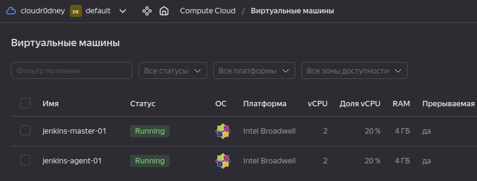

    2. Установить Jenkins при помощи playbook.

Скопировал публичные адреса машин из Yandex.Cloud, добавил их и пользователя `centos` в inventory-файл. Запустил playbook. Приведу начало работы playbook и результат:

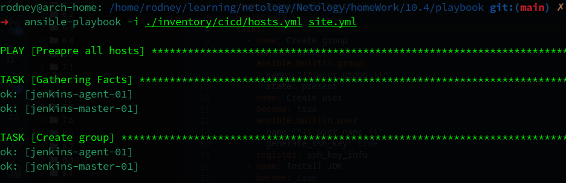

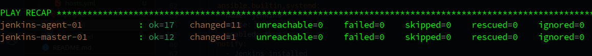

Так как пришлось немного доработать таск `Jenkins start` - запускал playbook 3 раза, потому результат первых тасков `ok`, а не `changed`.

    3. Запустить и проверить работоспособность.

Проверим работу:

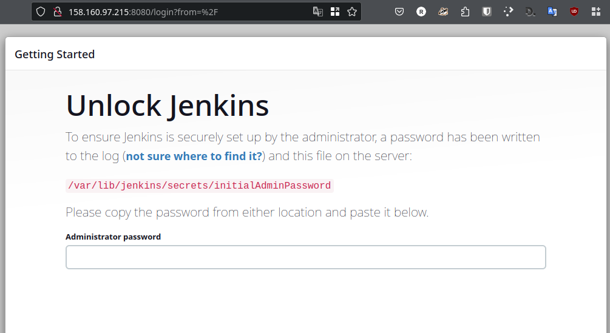

Отлично, Jenkins прекрасно работает и остается только настроить его.

    4. Сделать первоначальную настройку.

В версии Jenkins 2.414.1, которая установилась у меня, процесс настройки немного отличается от показанного в лекции, но тем не менее Jenkins настроен и готов к работе. Агент подключен, процессы исполнения на мастер-ноде отключены.

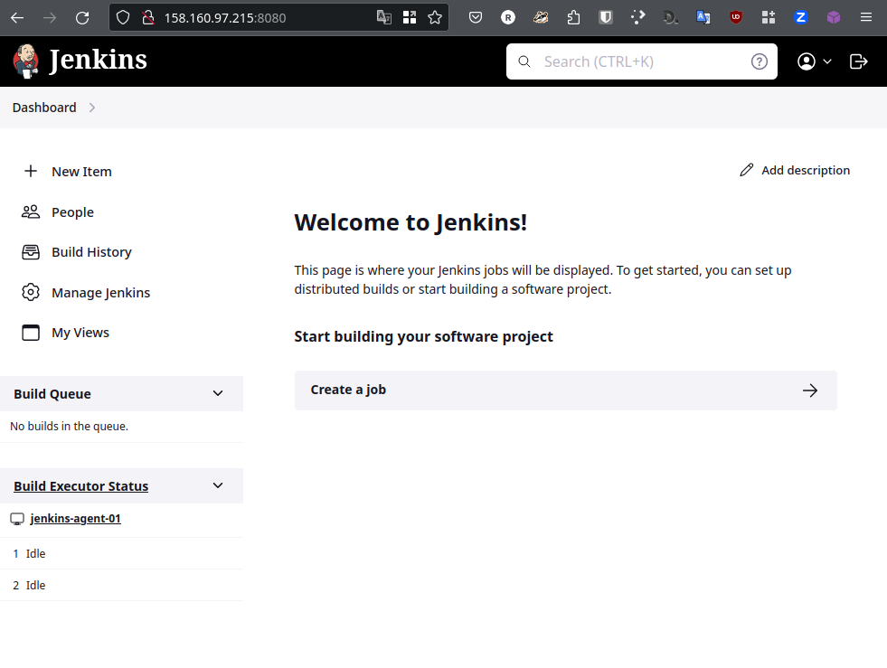

<br />

Основная часть
--------------

<br />

    1. Сделать Freestyle Job, который будет запускать molecule test из любого вашего репозитория с ролью.

Создал FreestyleJob:

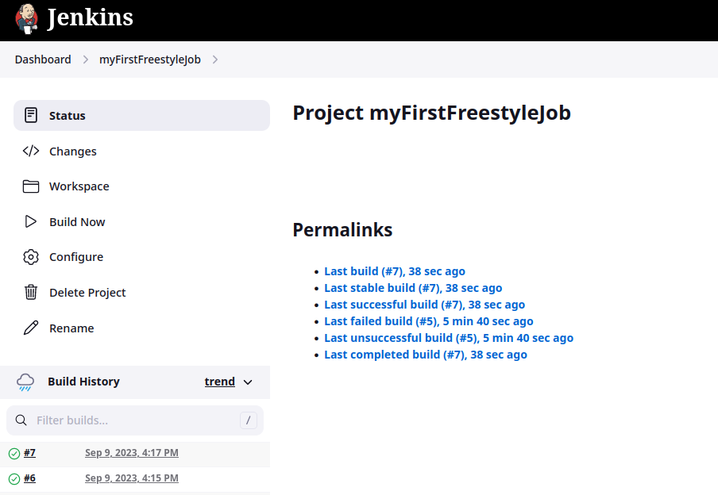

В качестве агента исполнения выбраны машины с лейблом `linux`, сам скрипт выполнения выглядит следующим образом:

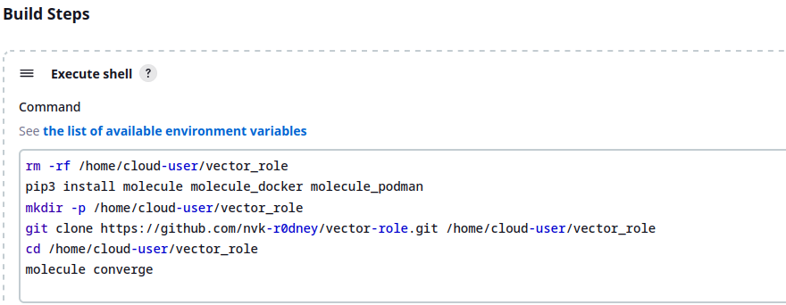

Ну и результат работы скрипта:

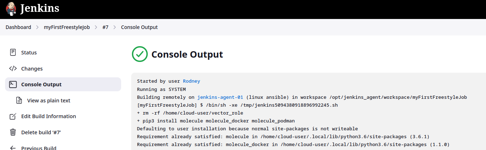

Полный вывод консоли будет под спойлером:

<details><summary>Консоль Jenkins</summary>

```bash

Started by user Rodney
Running as SYSTEM
Building remotely on jenkins-agent-01 (linux ansible) in workspace /opt/jenkins_agent/workspace/myFirstFreestyleJob
[myFirstFreestyleJob] $ /bin/sh -xe /tmp/jenkins5094380918896992245.sh
+ rm -rf /home/cloud-user/vector_role
+ pip3 install molecule molecule_docker molecule_podman
Defaulting to user installation because normal site-packages is not writeable
Requirement already satisfied: molecule in /home/cloud-user/.local/lib/python3.6/site-packages (3.6.1)
Requirement already satisfied: molecule_docker in /home/cloud-user/.local/lib/python3.6/site-packages (1.1.0)
Requirement already satisfied: molecule_podman in /home/cloud-user/.local/lib/python3.6/site-packages (1.1.0)
Requirement already satisfied: packaging in /usr/local/lib/python3.6/site-packages (from molecule) (21.3)
Requirement already satisfied: enrich>=1.2.7 in /home/cloud-user/.local/lib/python3.6/site-packages (from molecule) (1.2.7)
Requirement already satisfied: paramiko<3,>=2.5.0 in /home/cloud-user/.local/lib/python3.6/site-packages (from molecule) (2.12.0)
Requirement already satisfied: dataclasses in /home/cloud-user/.local/lib/python3.6/site-packages (from molecule) (0.8)
Requirement already satisfied: rich>=9.5.1 in /home/cloud-user/.local/lib/python3.6/site-packages (from molecule) (12.6.0)
Requirement already satisfied: pluggy<2.0,>=0.7.1 in /home/cloud-user/.local/lib/python3.6/site-packages (from molecule) (1.0.0)
Requirement already satisfied: cerberus!=1.3.3,!=1.3.4,>=1.3.1 in /home/cloud-user/.local/lib/python3.6/site-packages (from molecule) (1.3.5)
Requirement already satisfied: cookiecutter>=1.7.3 in /home/cloud-user/.local/lib/python3.6/site-packages (from molecule) (1.7.3)
Requirement already satisfied: click<9,>=8.0 in /home/cloud-user/.local/lib/python3.6/site-packages (from molecule) (8.0.4)
Requirement already satisfied: ansible-compat>=1.0.0 in /home/cloud-user/.local/lib/python3.6/site-packages (from molecule) (1.0.0)
Requirement already satisfied: click-help-colors>=0.9 in /home/cloud-user/.local/lib/python3.6/site-packages (from molecule) (0.9.2)
Requirement already satisfied: PyYAML>=5.1 in /home/cloud-user/.local/lib/python3.6/site-packages (from molecule) (6.0.1)
Requirement already satisfied: importlib-metadata in /home/cloud-user/.local/lib/python3.6/site-packages (from molecule) (4.8.3)
Requirement already satisfied: Jinja2>=2.11.3 in /home/cloud-user/.local/lib/python3.6/site-packages (from molecule) (3.0.3)
Requirement already satisfied: selinux in /usr/lib64/python3.6/site-packages (from molecule_docker) (2.9)
Requirement already satisfied: requests in /home/cloud-user/.local/lib/python3.6/site-packages (from molecule_docker) (2.27.1)
Requirement already satisfied: docker>=4.3.1 in /home/cloud-user/.local/lib/python3.6/site-packages (from molecule_docker) (5.0.3)
Requirement already satisfied: cached-property~=1.5 in /home/cloud-user/.local/lib/python3.6/site-packages (from ansible-compat>=1.0.0->molecule) (1.5.2)
Requirement already satisfied: subprocess-tee>=0.3.5 in /home/cloud-user/.local/lib/python3.6/site-packages (from ansible-compat>=1.0.0->molecule) (0.3.5)
Requirement already satisfied: six>=1.10 in /usr/lib/python3.6/site-packages (from cookiecutter>=1.7.3->molecule) (1.11.0)
Requirement already satisfied: jinja2-time>=0.2.0 in /home/cloud-user/.local/lib/python3.6/site-packages (from cookiecutter>=1.7.3->molecule) (0.2.0)
Requirement already satisfied: binaryornot>=0.4.4 in /home/cloud-user/.local/lib/python3.6/site-packages (from cookiecutter>=1.7.3->molecule) (0.4.4)
Requirement already satisfied: poyo>=0.5.0 in /home/cloud-user/.local/lib/python3.6/site-packages (from cookiecutter>=1.7.3->molecule) (0.5.0)
Requirement already satisfied: python-slugify>=4.0.0 in /home/cloud-user/.local/lib/python3.6/site-packages (from cookiecutter>=1.7.3->molecule) (6.1.2)
Requirement already satisfied: websocket-client>=0.32.0 in /home/cloud-user/.local/lib/python3.6/site-packages (from docker>=4.3.1->molecule_docker) (1.3.1)
Requirement already satisfied: MarkupSafe>=2.0 in /home/cloud-user/.local/lib/python3.6/site-packages (from Jinja2>=2.11.3->molecule) (2.0.1)
Requirement already satisfied: cryptography>=2.5 in /usr/lib64/python3.6/site-packages (from paramiko<3,>=2.5.0->molecule) (3.2.1)
Requirement already satisfied: bcrypt>=3.1.3 in /home/cloud-user/.local/lib/python3.6/site-packages (from paramiko<3,>=2.5.0->molecule) (4.0.1)
Requirement already satisfied: pynacl>=1.0.1 in /home/cloud-user/.local/lib/python3.6/site-packages (from paramiko<3,>=2.5.0->molecule) (1.5.0)
Requirement already satisfied: typing-extensions>=3.6.4 in /home/cloud-user/.local/lib/python3.6/site-packages (from importlib-metadata->molecule) (4.1.1)
Requirement already satisfied: zipp>=0.5 in /home/cloud-user/.local/lib/python3.6/site-packages (from importlib-metadata->molecule) (3.6.0)
Requirement already satisfied: idna<4,>=2.5 in /usr/lib/python3.6/site-packages (from requests->molecule_docker) (2.5)
Requirement already satisfied: certifi>=2017.4.17 in /home/cloud-user/.local/lib/python3.6/site-packages (from requests->molecule_docker) (2023.7.22)
Requirement already satisfied: urllib3<1.27,>=1.21.1 in /usr/lib/python3.6/site-packages (from requests->molecule_docker) (1.24.2)
Requirement already satisfied: charset-normalizer~=2.0.0 in /home/cloud-user/.local/lib/python3.6/site-packages (from requests->molecule_docker) (2.0.12)
Requirement already satisfied: commonmark<0.10.0,>=0.9.0 in /home/cloud-user/.local/lib/python3.6/site-packages (from rich>=9.5.1->molecule) (0.9.1)
Requirement already satisfied: pygments<3.0.0,>=2.6.0 in /home/cloud-user/.local/lib/python3.6/site-packages (from rich>=9.5.1->molecule) (2.14.0)
Requirement already satisfied: pyparsing!=3.0.5,>=2.0.2 in /usr/local/lib/python3.6/site-packages (from packaging->molecule) (3.1.1)
Requirement already satisfied: chardet>=3.0.2 in /usr/lib/python3.6/site-packages (from binaryornot>=0.4.4->cookiecutter>=1.7.3->molecule) (3.0.4)
Requirement already satisfied: cffi!=1.11.3,>=1.8 in /usr/lib64/python3.6/site-packages (from cryptography>=2.5->paramiko<3,>=2.5.0->molecule) (1.11.5)
Requirement already satisfied: arrow in /home/cloud-user/.local/lib/python3.6/site-packages (from jinja2-time>=0.2.0->cookiecutter>=1.7.3->molecule) (1.2.3)
Requirement already satisfied: text-unidecode>=1.3 in /home/cloud-user/.local/lib/python3.6/site-packages (from python-slugify>=4.0.0->cookiecutter>=1.7.3->molecule) (1.3)
Requirement already satisfied: pycparser in /usr/lib/python3.6/site-packages (from cffi!=1.11.3,>=1.8->cryptography>=2.5->paramiko<3,>=2.5.0->molecule) (2.14)
Requirement already satisfied: python-dateutil>=2.7.0 in /home/cloud-user/.local/lib/python3.6/site-packages (from arrow->jinja2-time>=0.2.0->cookiecutter>=1.7.3->molecule) (2.8.2)
+ mkdir -p /home/cloud-user/vector_role
+ git clone https://github.com/nvk-r0dney/vector-role.git /home/cloud-user/vector_role
Cloning into '/home/cloud-user/vector_role'...
+ cd /home/cloud-user/vector_role
+ molecule converge
[DEPRECATION WARNING]: Ansible will require Python 3.8 or newer on the 
controller starting with Ansible 2.12. Current version: 3.6.8 (default, Aug 10 
2023, 17:01:17) [GCC 8.5.0 20210514 (Red Hat 8.5.0-20)]. This feature will be 
removed from ansible-core in version 2.12. Deprecation warnings can be disabled
 by setting deprecation_warnings=False in ansible.cfg.
INFO     default scenario test matrix: dependency, create, prepare, converge
INFO     Performing prerun...
INFO     Set ANSIBLE_LIBRARY=/home/cloud-user/.cache/ansible-compat/3e6bf2/modules:/home/cloud-user/.ansible/plugins/modules:/usr/share/ansible/plugins/modules
INFO     Set ANSIBLE_COLLECTIONS_PATH=/home/cloud-user/.cache/ansible-compat/3e6bf2/collections:/home/cloud-user/.ansible/collections:/usr/share/ansible/collections
INFO     Set ANSIBLE_ROLES_PATH=/home/cloud-user/.cache/ansible-compat/3e6bf2/roles:/home/cloud-user/.ansible/roles:/usr/share/ansible/roles:/etc/ansible/roles
INFO     Using /home/cloud-user/.ansible/roles/my_vector_role.vector_role symlink to current repository in order to enable Ansible to find the role using its expected full name.
INFO     Running default > dependency
WARNING  Skipping, missing the requirements file.
WARNING  Skipping, missing the requirements file.
INFO     Running default > create
WARNING  Skipping, instances already created.
INFO     Running default > prepare
WARNING  Skipping, prepare playbook not configured.
INFO     Running default > converge
INFO     Sanity checks: 'docker'
[DEPRECATION WARNING]: Ansible will require Python 3.8 or newer on the 
controller starting with Ansible 2.12. Current version: 3.6.8 (default, Aug 10 
2023, 17:01:17) [GCC 8.5.0 20210514 (Red Hat 8.5.0-20)]. This feature will be 
removed from ansible-core in version 2.12. Deprecation warnings can be disabled
 by setting deprecation_warnings=False in ansible.cfg.

PLAY [Converge] ****************************************************************

TASK [Gathering Facts] *********************************************************
ok: [CentOS_8_Stream]
ok: [Ubuntu_Latest]

TASK [Include vector_role] *****************************************************

TASK [vector_role : Install Vector | Create dir for dst] ***********************
ok: [CentOS_8_Stream]
ok: [Ubuntu_Latest]

TASK [vector_role : Install Vector | Download Vector distrib] ******************
ok: [Ubuntu_Latest]
ok: [CentOS_8_Stream]

TASK [vector_role : Install Vector | Unpack Vector distrib] ********************
ok: [CentOS_8_Stream]
ok: [Ubuntu_Latest]

TASK [vector_role : Install Vector | Copy Vector.bin file] *********************
ok: [Ubuntu_Latest]
ok: [CentOS_8_Stream]

TASK [vector_role : Install Vector | Copy Vector-config file] ******************
ok: [Ubuntu_Latest]
ok: [CentOS_8_Stream]

TASK [vector_role : Install Vector | Copy Vector systemd unit file] ************
ok: [CentOS_8_Stream]
ok: [Ubuntu_Latest]

TASK [vector_role : Install Vector | Check Vector install] *********************
skipping: [CentOS_8_Stream]
skipping: [Ubuntu_Latest]

PLAY RECAP *********************************************************************
CentOS_8_Stream            : ok=7    changed=0    unreachable=0    failed=0    skipped=1    rescued=0    ignored=0
Ubuntu_Latest              : ok=7    changed=0    unreachable=0    failed=0    skipped=1    rescued=0    ignored=0

Finished: SUCCESS

```
</details>

<br />

    2. Сделать Declarative Pipeline Job, который будет запускать molecule test из любого вашего репозитория с ролью.

Создал `Declarative Pipeline Job`:

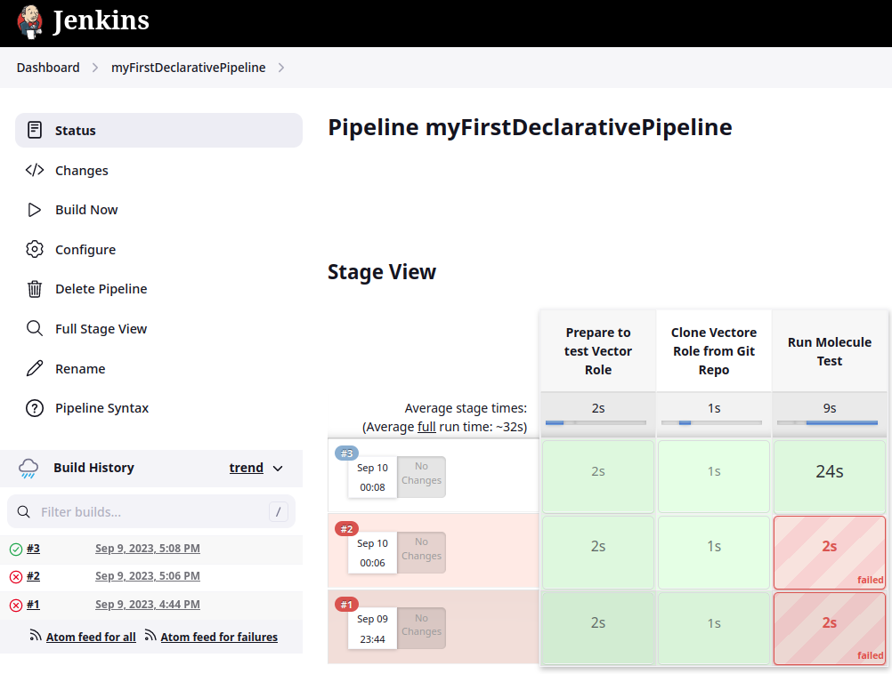

Написал `Pipeline script`:

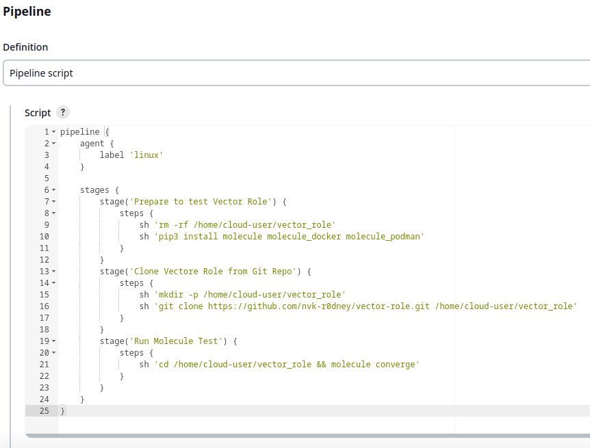

Ну и как видно на скриншоте выше - последний статус - Успешно выполнены все шаги пайплайна. Полный лог под спойлером ниже:

<details><summary>Консоль Jenkins</summary>

```
Started by user Rodney
[Pipeline] Start of Pipeline
[Pipeline] node
Running on jenkins-agent-01 in /opt/jenkins_agent/workspace/myFirstDeclarativePipeline
[Pipeline] {
[Pipeline] stage
[Pipeline] { (Prepare to test Vector Role)
[Pipeline] sh
+ rm -rf /home/cloud-user/vector_role
[Pipeline] sh
+ pip3 install molecule molecule_docker molecule_podman
Defaulting to user installation because normal site-packages is not writeable
Requirement already satisfied: molecule in /home/cloud-user/.local/lib/python3.6/site-packages (3.6.1)
Requirement already satisfied: molecule_docker in /home/cloud-user/.local/lib/python3.6/site-packages (1.1.0)
Requirement already satisfied: molecule_podman in /home/cloud-user/.local/lib/python3.6/site-packages (1.1.0)
Requirement already satisfied: paramiko<3,>=2.5.0 in /home/cloud-user/.local/lib/python3.6/site-packages (from molecule) (2.12.0)
Requirement already satisfied: ansible-compat>=1.0.0 in /home/cloud-user/.local/lib/python3.6/site-packages (from molecule) (1.0.0)
Requirement already satisfied: pluggy<2.0,>=0.7.1 in /home/cloud-user/.local/lib/python3.6/site-packages (from molecule) (1.0.0)
Requirement already satisfied: click-help-colors>=0.9 in /home/cloud-user/.local/lib/python3.6/site-packages (from molecule) (0.9.2)
Requirement already satisfied: importlib-metadata in /home/cloud-user/.local/lib/python3.6/site-packages (from molecule) (4.8.3)
Requirement already satisfied: cerberus!=1.3.3,!=1.3.4,>=1.3.1 in /home/cloud-user/.local/lib/python3.6/site-packages (from molecule) (1.3.5)
Requirement already satisfied: packaging in /usr/local/lib/python3.6/site-packages (from molecule) (21.3)
Requirement already satisfied: click<9,>=8.0 in /home/cloud-user/.local/lib/python3.6/site-packages (from molecule) (8.0.4)
Requirement already satisfied: enrich>=1.2.7 in /home/cloud-user/.local/lib/python3.6/site-packages (from molecule) (1.2.7)
Requirement already satisfied: rich>=9.5.1 in /home/cloud-user/.local/lib/python3.6/site-packages (from molecule) (12.6.0)
Requirement already satisfied: dataclasses in /home/cloud-user/.local/lib/python3.6/site-packages (from molecule) (0.8)
Requirement already satisfied: cookiecutter>=1.7.3 in /home/cloud-user/.local/lib/python3.6/site-packages (from molecule) (1.7.3)
Requirement already satisfied: PyYAML>=5.1 in /home/cloud-user/.local/lib/python3.6/site-packages (from molecule) (6.0.1)
Requirement already satisfied: Jinja2>=2.11.3 in /home/cloud-user/.local/lib/python3.6/site-packages (from molecule) (3.0.3)
Requirement already satisfied: requests in /home/cloud-user/.local/lib/python3.6/site-packages (from molecule_docker) (2.27.1)
Requirement already satisfied: selinux in /usr/lib64/python3.6/site-packages (from molecule_docker) (2.9)
Requirement already satisfied: docker>=4.3.1 in /home/cloud-user/.local/lib/python3.6/site-packages (from molecule_docker) (5.0.3)
Requirement already satisfied: cached-property~=1.5 in /home/cloud-user/.local/lib/python3.6/site-packages (from ansible-compat>=1.0.0->molecule) (1.5.2)
Requirement already satisfied: subprocess-tee>=0.3.5 in /home/cloud-user/.local/lib/python3.6/site-packages (from ansible-compat>=1.0.0->molecule) (0.3.5)
Requirement already satisfied: six>=1.10 in /usr/lib/python3.6/site-packages (from cookiecutter>=1.7.3->molecule) (1.11.0)
Requirement already satisfied: python-slugify>=4.0.0 in /home/cloud-user/.local/lib/python3.6/site-packages (from cookiecutter>=1.7.3->molecule) (6.1.2)
Requirement already satisfied: jinja2-time>=0.2.0 in /home/cloud-user/.local/lib/python3.6/site-packages (from cookiecutter>=1.7.3->molecule) (0.2.0)
Requirement already satisfied: poyo>=0.5.0 in /home/cloud-user/.local/lib/python3.6/site-packages (from cookiecutter>=1.7.3->molecule) (0.5.0)
Requirement already satisfied: binaryornot>=0.4.4 in /home/cloud-user/.local/lib/python3.6/site-packages (from cookiecutter>=1.7.3->molecule) (0.4.4)
Requirement already satisfied: websocket-client>=0.32.0 in /home/cloud-user/.local/lib/python3.6/site-packages (from docker>=4.3.1->molecule_docker) (1.3.1)
Requirement already satisfied: MarkupSafe>=2.0 in /home/cloud-user/.local/lib/python3.6/site-packages (from Jinja2>=2.11.3->molecule) (2.0.1)
Requirement already satisfied: pynacl>=1.0.1 in /home/cloud-user/.local/lib/python3.6/site-packages (from paramiko<3,>=2.5.0->molecule) (1.5.0)
Requirement already satisfied: bcrypt>=3.1.3 in /home/cloud-user/.local/lib/python3.6/site-packages (from paramiko<3,>=2.5.0->molecule) (4.0.1)
Requirement already satisfied: cryptography>=2.5 in /usr/lib64/python3.6/site-packages (from paramiko<3,>=2.5.0->molecule) (3.2.1)
Requirement already satisfied: typing-extensions>=3.6.4 in /home/cloud-user/.local/lib/python3.6/site-packages (from importlib-metadata->molecule) (4.1.1)
Requirement already satisfied: zipp>=0.5 in /home/cloud-user/.local/lib/python3.6/site-packages (from importlib-metadata->molecule) (3.6.0)
Requirement already satisfied: urllib3<1.27,>=1.21.1 in /usr/lib/python3.6/site-packages (from requests->molecule_docker) (1.24.2)
Requirement already satisfied: idna<4,>=2.5 in /usr/lib/python3.6/site-packages (from requests->molecule_docker) (2.5)
Requirement already satisfied: charset-normalizer~=2.0.0 in /home/cloud-user/.local/lib/python3.6/site-packages (from requests->molecule_docker) (2.0.12)
Requirement already satisfied: certifi>=2017.4.17 in /home/cloud-user/.local/lib/python3.6/site-packages (from requests->molecule_docker) (2023.7.22)
Requirement already satisfied: pygments<3.0.0,>=2.6.0 in /home/cloud-user/.local/lib/python3.6/site-packages (from rich>=9.5.1->molecule) (2.14.0)
Requirement already satisfied: commonmark<0.10.0,>=0.9.0 in /home/cloud-user/.local/lib/python3.6/site-packages (from rich>=9.5.1->molecule) (0.9.1)
Requirement already satisfied: pyparsing!=3.0.5,>=2.0.2 in /usr/local/lib/python3.6/site-packages (from packaging->molecule) (3.1.1)
Requirement already satisfied: chardet>=3.0.2 in /usr/lib/python3.6/site-packages (from binaryornot>=0.4.4->cookiecutter>=1.7.3->molecule) (3.0.4)
Requirement already satisfied: cffi!=1.11.3,>=1.8 in /usr/lib64/python3.6/site-packages (from cryptography>=2.5->paramiko<3,>=2.5.0->molecule) (1.11.5)
Requirement already satisfied: arrow in /home/cloud-user/.local/lib/python3.6/site-packages (from jinja2-time>=0.2.0->cookiecutter>=1.7.3->molecule) (1.2.3)
Requirement already satisfied: text-unidecode>=1.3 in /home/cloud-user/.local/lib/python3.6/site-packages (from python-slugify>=4.0.0->cookiecutter>=1.7.3->molecule) (1.3)
Requirement already satisfied: pycparser in /usr/lib/python3.6/site-packages (from cffi!=1.11.3,>=1.8->cryptography>=2.5->paramiko<3,>=2.5.0->molecule) (2.14)
Requirement already satisfied: python-dateutil>=2.7.0 in /home/cloud-user/.local/lib/python3.6/site-packages (from arrow->jinja2-time>=0.2.0->cookiecutter>=1.7.3->molecule) (2.8.2)
[Pipeline] }
[Pipeline] // stage
[Pipeline] stage
[Pipeline] { (Clone Vectore Role from Git Repo)
[Pipeline] sh
+ mkdir -p /home/cloud-user/vector_role
[Pipeline] sh
+ git clone https://github.com/nvk-r0dney/vector-role.git /home/cloud-user/vector_role
Cloning into '/home/cloud-user/vector_role'...
[Pipeline] }
[Pipeline] // stage
[Pipeline] stage
[Pipeline] { (Run Molecule Test)
[Pipeline] sh
+ cd /home/cloud-user/vector_role
+ molecule converge
INFO     default scenario test matrix: dependency, create, prepare, converge
INFO     Performing prerun...
INFO     Set ANSIBLE_LIBRARY=/home/cloud-user/.cache/ansible-compat/3e6bf2/modules:/home/cloud-user/.ansible/plugins/modules:/usr/share/ansible/plugins/modules
INFO     Set ANSIBLE_COLLECTIONS_PATH=/home/cloud-user/.cache/ansible-compat/3e6bf2/collections:/home/cloud-user/.ansible/collections:/usr/share/ansible/collections
INFO     Set ANSIBLE_ROLES_PATH=/home/cloud-user/.cache/ansible-compat/3e6bf2/roles:/home/cloud-user/.ansible/roles:/usr/share/ansible/roles:/etc/ansible/roles
INFO     Using /home/cloud-user/.ansible/roles/my_vector_role.vector_role symlink to current repository in order to enable Ansible to find the role using its expected full name.
INFO     Running default > dependency
WARNING  Skipping, missing the requirements file.
WARNING  Skipping, missing the requirements file.
INFO     Running default > create
WARNING  Skipping, instances already created.
INFO     Running default > prepare
WARNING  Skipping, prepare playbook not configured.
INFO     Running default > converge
INFO     Sanity checks: 'docker'
[DEPRECATION WARNING]: Ansible will require Python 3.8 or newer on the 
controller starting with Ansible 2.12. Current version: 3.6.8 (default, Aug 10 
2023, 17:01:17) [GCC 8.5.0 20210514 (Red Hat 8.5.0-20)]. This feature will be 
removed from ansible-core in version 2.12. Deprecation warnings can be disabled
 by setting deprecation_warnings=False in ansible.cfg.

PLAY [Converge] ****************************************************************

TASK [Gathering Facts] *********************************************************
ok: [Ubuntu_Latest]
ok: [CentOS_8_Stream]

TASK [Include vector_role] *****************************************************

TASK [vector_role : Install Vector | Create dir for dst] ***********************
ok: [Ubuntu_Latest]
ok: [CentOS_8_Stream]

TASK [vector_role : Install Vector | Download Vector distrib] ******************
ok: [CentOS_8_Stream]
ok: [Ubuntu_Latest]

TASK [vector_role : Install Vector | Unpack Vector distrib] ********************
ok: [CentOS_8_Stream]
ok: [Ubuntu_Latest]

TASK [vector_role : Install Vector | Copy Vector.bin file] *********************
ok: [CentOS_8_Stream]
ok: [Ubuntu_Latest]

TASK [vector_role : Install Vector | Copy Vector-config file] ******************
ok: [CentOS_8_Stream]
ok: [Ubuntu_Latest]

TASK [vector_role : Install Vector | Copy Vector systemd unit file] ************
ok: [CentOS_8_Stream]
ok: [Ubuntu_Latest]

TASK [vector_role : Install Vector | Check Vector install] *********************
skipping: [CentOS_8_Stream]
skipping: [Ubuntu_Latest]

PLAY RECAP *********************************************************************
CentOS_8_Stream            : ok=7    changed=0    unreachable=0    failed=0    skipped=1    rescued=0    ignored=0
Ubuntu_Latest              : ok=7    changed=0    unreachable=0    failed=0    skipped=1    rescued=0    ignored=0

[Pipeline] }
[Pipeline] // stage
[Pipeline] }
[Pipeline] // node
[Pipeline] End of Pipeline
Finished: SUCCESS
```
</details>

<br />

    3. Перенести Declarative Pipeline в репозиторий в файл Jenkinsfile.

Выполнено. Готовый файл находится в репозитории с Vector Role, ссылка ниже:

<a href="https://github.com/nvk-r0dney/vector-role/blob/main/Jenkinsfile" target=_blanc>Jenkinsfile</a>

    4. Создать Multibranch Pipeline на запуск Jenkinsfile из репозитория.

Создал Multibranch Pipeline

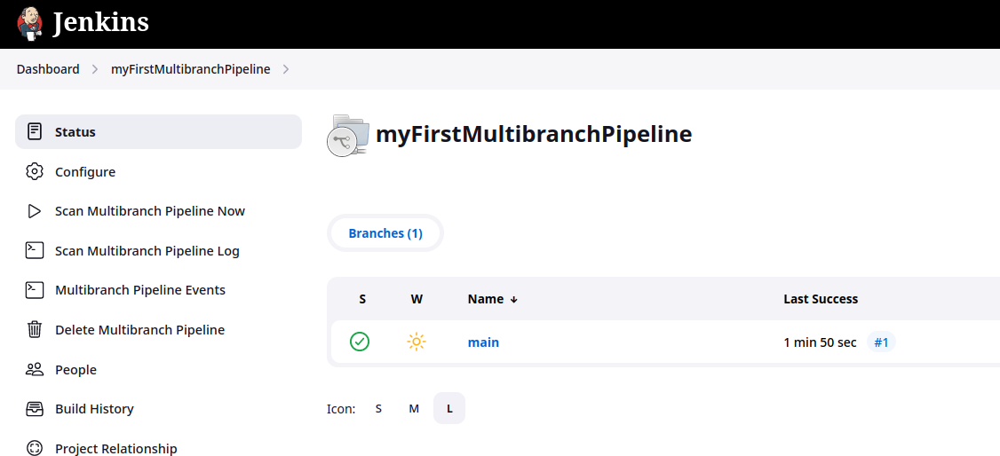

Настроил его на использование Github-репозитория с моей Vector Role. При сохранении настроек Jenkins просканировал репозиторий на наличие Jenkinsfile, лог сканирования ниже:

```bash
Started by user Rodney
[Sat Sep 09 18:10:24 UTC 2023] Starting branch indexing...
 > git --version # timeout=10
 > git --version # 'git version 2.39.3'
using GIT_ASKPASS to set credentials 
 > git ls-remote --symref -- https://github.com/nvk-r0dney/vector-role.git # timeout=10
Creating git repository in /var/lib/jenkins/caches/git-cf369020ce4ba9680990f918a4cf8b60
 > git init /var/lib/jenkins/caches/git-cf369020ce4ba9680990f918a4cf8b60 # timeout=10
Setting origin to https://github.com/nvk-r0dney/vector-role.git
 > git config remote.origin.url https://github.com/nvk-r0dney/vector-role.git # timeout=10
Fetching & pruning origin...
Listing remote references...
 > git config --get remote.origin.url # timeout=10
 > git --version # timeout=10
 > git --version # 'git version 2.39.3'
using GIT_ASKPASS to set credentials 
 > git ls-remote -h -- https://github.com/nvk-r0dney/vector-role.git # timeout=10
Fetching upstream changes from origin
 > git config --get remote.origin.url # timeout=10
using GIT_ASKPASS to set credentials 
 > git fetch --tags --force --progress --prune -- origin +refs/heads/*:refs/remotes/origin/* # timeout=10
Checking branches...
  Checking branch main
      ‘Jenkinsfile’ found
    Met criteria
Scheduled build for branch: main
Processed 1 branches
[Sat Sep 09 18:10:30 UTC 2023] Finished branch indexing. Indexing took 5.5 sec
Finished: SUCCESS
```

Стадии выполнения теперь выглядят следующим образом:

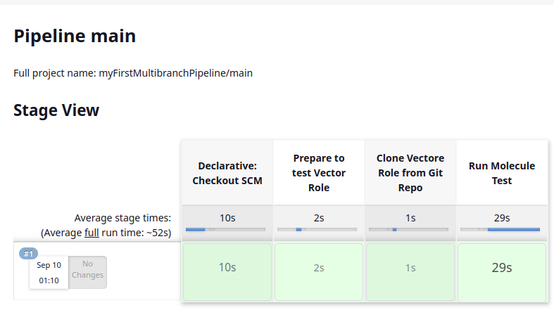

Pipeline успешно взял Jenkinsfile из репозитория и выполнил его на машине с агентом.

    5. Создать Scripted Pipeline, наполнить его скриптом из pipeline.

Готово.

    6. Внести необходимые изменения, чтобы Pipeline запускал ansible-playbook без флагов --check --diff, 
    если не установлен параметр при запуске джобы (prod_run = True). 
    По умолчанию параметр имеет значение False и запускает прогон с флагами --check --diff.

Добавил в Scripted Pipeline запуск с параметром, сам скрипт выглядит следующим образом:

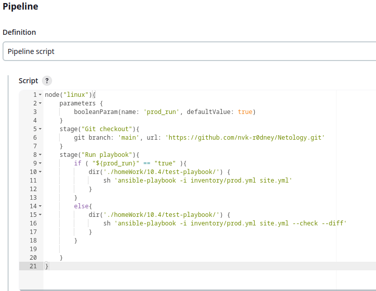

    7. Проверить работоспособность, исправить ошибки, 
    исправленный Pipeline вложить в репозиторий в файл ScriptedJenkinsfile.

Для проверки написал простой Playbook, устанавливающий утилиту `mc` локально на localhost (каталог `test-playbook`).
Прогнал выполнение pipeline дважды, со значением параметра `true` и `false`. Результаты ниже:

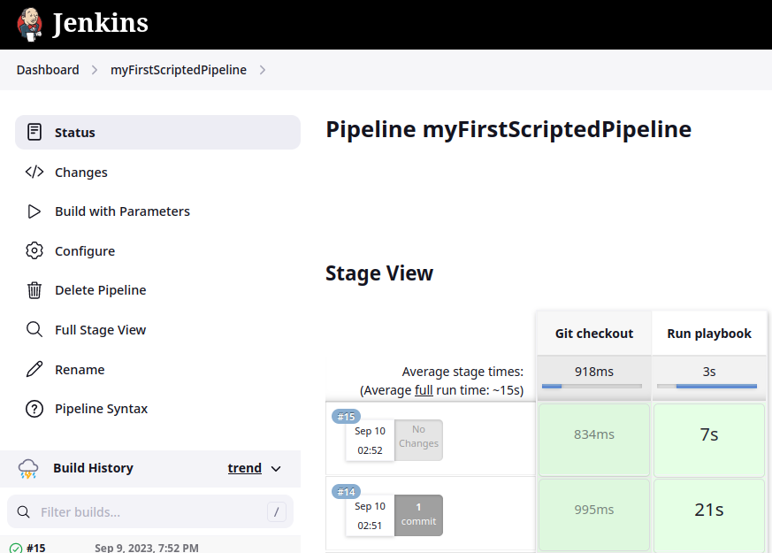

И взглянем на логи:

1 stage

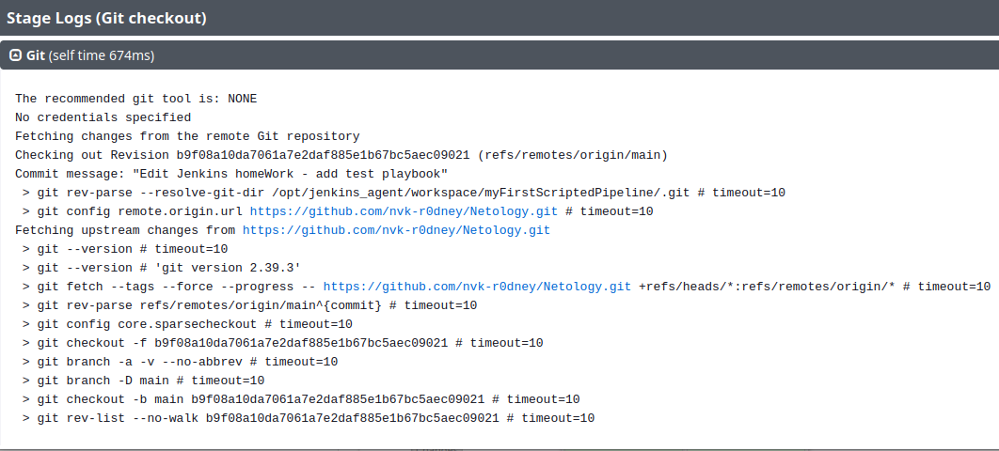

2 stage - `prod_run==true`

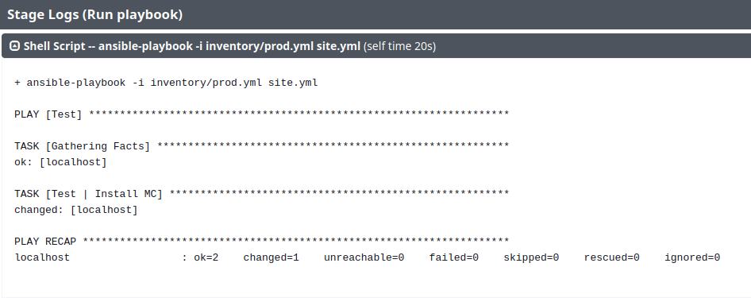

2 stage - `prod_run==false`

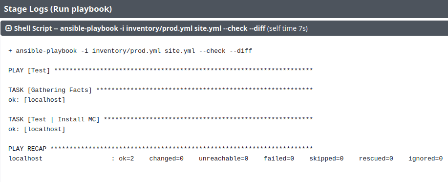

Как видно, флаги `--check` и `--diff` - появились. Pipeline успешно отработал.

    8. Отправить ссылку на репозиторий с ролью и Declarative Pipeline и Scripted Pipeline.

Репозиторий с ролью - <a href="https://github.com/nvk-r0dney/vector-role">ссылка</a>

Declarative Pipeline Jenkinsfile - <a href="https://github.com/nvk-r0dney/vector-role/blob/main/Jenkinsfile">ссылка</a>

Исправленный Scripted Pipeline Jenkinsfile - <a href="https://github.com/nvk-r0dney/Netology/blob/main/homeWork/10.4/pipeline/ScriptedJenkinsfile">ссылка</a>