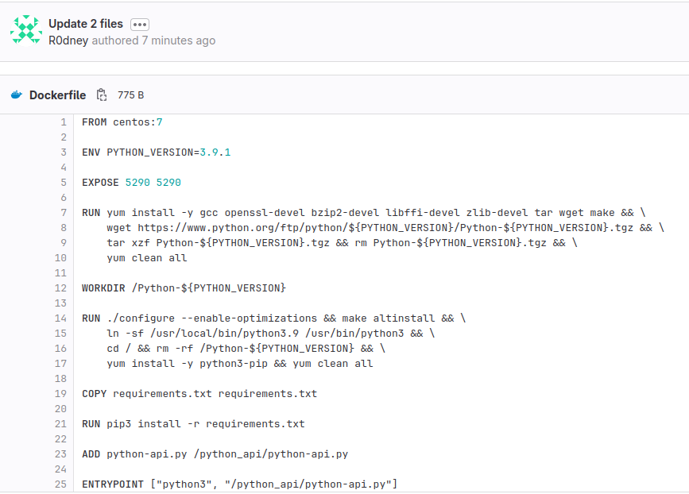
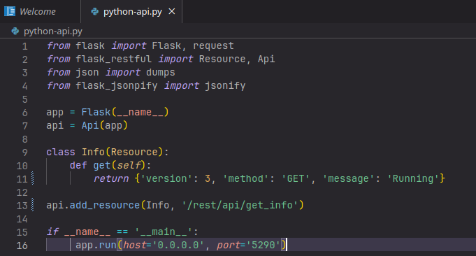

# Домашнее задание к занятию 12 «Gitlab»

## Выполнил студент группы DevOps-25 Шаповалов Кирилл

<br />

Подготовка к выполнению
-----------------------

<br />

    1. Подготовьте к работе GitLab по инструкции.

Создал виртуальные машины с помощью Terraform (все файлы проекта, как всегда, в каталоге `files.tf`):


Написал Playbook для установки `Docker`, `Gitlab` и `Gitlab-Runner` на созданных машинах (playbook находится в каталоге `playbook`):


Gitlab установлен, настроен и готов к работе:


    2. Создайте свой новый проект.

Создал новый публичный проект:


Активировал функционал `Container Registry` и подключил `Gitlab-Runner` к текущему проекту. Можно приступать к дальнейшей работе.

    3. Создайте новый репозиторий в GitLab, наполните его файлами.

Репозиторий создан, все файлы для проекта созданы:


    4. Проект должен быть публичным, остальные настройки по желанию.

Проект публичный. Из дополнительных настроек - к нему привязан Gitlab-Runner.

<br />

# Основная часть

## DevOps

<br />

В репозитории содержится код проекта на Python. Проект — RESTful API сервис. Ваша задача — автоматизировать сборку образа с выполнением python-скрипта:

1. Образ собирается на основе centos:7.
2. Python версии не ниже 3.7.
3. Установлены зависимости: flask flask-jsonpify flask-restful.
4. Создана директория /python_api.
5. Скрипт из репозитория размещён в /python_api.
6. Точка вызова: запуск скрипта.
7. При комите в любую ветку должен собираться docker image с форматом имени hello:gitlab-$CI_COMMIT_SHORT_SHA . Образ должен быть выложен в Gitlab registry или yandex registry.
8. (задание необязательное к выполению) При комите в ветку master после сборки должен подняться pod в kubernetes. Примерный pipeline для push в kubernetes по ссылке. Если вы еще не знакомы с k8s - автоматизируйте сборку и деплой приложения в docker на виртуальной машине.

Для выполнения данной части задания написан `Dockerfile`:



Зависимости указаны в файле `requirements.txt`:


Для автоматизации процесса сборки, загрузки образа в Registry и последующего деплоя приложения в docker на виртуальной машине написан следующий файл `.gitlab-ci.yml`:


Проверяем, что все работает, как мы ожидали:

1. Убедимся, что отработали `pipeline` по любым веткам:


2. Убедимся, что сам `pipeline` отработал корректно:

<details><summary>Лог Pipeline</summary>

```yaml
Running with gitlab-runner 16.3.1 (f5dfa4d1)
  on gitlab-runner-01.ru-central1.internal ksaw8hrWF, system ID: s_d58ef03b7162
Preparing the "shell" executor 00:00
Using Shell (bash) executor...
Preparing environment 00:00
Running on gitlab-runner-01.ru-central1.internal...
Getting source from Git repository 00:00
Fetching changes with git depth set to 20...
Reinitialized existing Git repository in /home/gitlab-runner/builds/ksaw8hrWF/0/devops/netology/.git/
Checking out 8b6063ec as detached HEAD (ref is test)...
Skipping Git submodules setup
Executing "step_script" stage of the job script
$ docker build --squash -t $CI_REGISTRY/$CI_PROJECT_PATH/hello:gitlab-$CI_COMMIT_SHORT_SHA .
WARNING: experimental flag squash is removed with BuildKit. You should squash inside build using a multi-stage Dockerfile for efficiency.
#0 building with "default" instance using docker driver
#1 [internal] load build definition from Dockerfile
#1 transferring dockerfile: 869B 0.0s done
#1 DONE 0.0s
#2 [internal] load .dockerignore
#2 transferring context: 2B done
#2 DONE 0.0s
#3 [internal] load metadata for docker.io/library/centos:7
#3 DONE 1.2s
#4 [1/7] FROM docker.io/library/centos:7@sha256:be65f488b7764ad3638f236b7b515b3678369a5124c47b8d32916d6487418ea4
#4 DONE 0.0s
#5 [internal] load build context
#5 transferring context: 180B done
#5 DONE 0.0s
#6 [2/7] RUN yum install -y gcc openssl-devel bzip2-devel libffi-devel zlib-devel tar wget make &&     wget https://www.python.org/ftp/python/3.9.1/Python-3.9.1.tgz &&     tar xzf Python-3.9.1.tgz && rm Python-3.9.1.tgz &&     yum clean all
#6 CACHED
#7 [3/7] WORKDIR /Python-3.9.1
#7 CACHED
#8 [5/7] COPY requirements.txt requirements.txt
#8 CACHED
#9 [4/7] RUN ./configure --enable-optimizations && make altinstall &&     ln -sf /usr/local/bin/python3.9 /usr/bin/python3 &&     cd / && rm -rf /Python-3.9.1 &&     yum install -y python3-pip && yum clean all
#9 CACHED
#10 [6/7] RUN pip3 install -r requirements.txt
#10 CACHED
#11 [7/7] ADD python-api.py /python_api/python-api.py
#11 CACHED
#12 exporting to image
#12 exporting layers done
#12 writing image sha256:c135bb483aac57b0b0e531b9e6ed4cfffc8966a2c06eb09ae4da683d473a2da9 done
#12 naming to 51.250.79.77:5005/devops/netology/hello:gitlab-8b6063ec done
#12 DONE 0.0s
$ docker login -u $CI_REGISTRY_USER -p $CI_REGISTRY_PASSWORD $CI_REGISTRY
WARNING! Using --password via the CLI is insecure. Use --password-stdin.
WARNING! Your password will be stored unencrypted in /home/gitlab-runner/.docker/config.json.
Configure a credential helper to remove this warning. See
https://docs.docker.com/engine/reference/commandline/login/#credentials-store
Login Succeeded
$ docker push $CI_REGISTRY/$CI_PROJECT_PATH/hello:gitlab-$CI_COMMIT_SHORT_SHA
The push refers to repository [51.250.79.77:5005/devops/netology/hello]
a9170a27f7b3: Preparing
204726188adb: Preparing
83504aeb54c6: Preparing
e91984687361: Preparing
5f70bf18a086: Preparing
5209700e178f: Preparing
174f56854903: Preparing
5209700e178f: Waiting
174f56854903: Waiting
5f70bf18a086: Pushed
83504aeb54c6: Pushed
a9170a27f7b3: Pushed
204726188adb: Pushed
5209700e178f: Pushed
174f56854903: Pushed
e91984687361: Pushed
gitlab-8b6063ec: digest: sha256:de5aa87cac159f19ac39f565a8160fe670c861ebb6b053743224e7428b10b8c0 size: 1784
Job succeeded
```
</details>

<br />

Лог первого запуска был много больше, поскольку происходила сборка Python версии 3.9.1

3. Проверяем наличие образов в Container Registry:


Образы на месте, причем имя образа для дальнейшего использования выглядит как требует задание - `51.250.79.77:5005/devops/netology/hello:gitlab-8b6063ec`

4. Убедимся, что по коммиту в ветку `main` так же происходит запуск приложения в docker на виртуальной машине:

Все стадии pipeline успешно выполняются:


При этом лог Job по запуску приложения выглядит так:


5. Проверяем работу контейнера на виртуальной машине

Контейнер создан:


Приложение отвечает:


<br />

**Итог** - DevOps-часть задания выполнена успешно, включая сборку приложения, загрузку образа в Registry, деплой и запуск приложения на основе собранного образа в docker на виртуальной машине.

<br />

## Product Owner

Вашему проекту нужна бизнесовая доработка: нужно поменять JSON ответа на вызов метода GET /rest/api/get_info, необходимо создать Issue в котором указать:

1. Какой метод необходимо исправить.
2. Текст с { "message": "Already started" } на { "message": "Running"}.
3. Issue поставить label: feature.

В качестве ответа на данное задание создан новый Issue:


## Developer

Пришёл новый Issue на доработку, вам нужно:

1. Создать отдельную ветку, связанную с этим Issue.
2. Внести изменения по тексту из задания.
3. Подготовить Merge Request, влить необходимые изменения в master, проверить, что сборка прошла успешно.

<br />

Создана отдельная ветка `issue1-edit-get`, которая связана с созданным ранее Issue:


Внесены следующие изменения:

* в файл приложения:



* в файле ci-cd изменили сборку по ветке main с добавлением :latest в имя образа:


Подготовлен Merge-request:


Pipeline после слияния по ветке main отработал успешно:


В registry появился образ с именем `51.250.79.77:5005/devops/netology/hello:latest`.

<br />

## Tester

Разработчики выполнили новый Issue, необходимо проверить валидность изменений:

1. Поднять докер-контейнер с образом python-api:latest и проверить возврат метода на корректность.
2. Закрыть Issue с комментарием об успешности прохождения, указав желаемый результат и фактически достигнутый.

<br />

В рамках данного задания поднимем контейнер из ранее собранного образа вручную (хоть у нас и написан автоматический деплой в прод):

запускаем контейнер


контейнер запущен


Проверяем работу приложения:


Все работает как и ожидалось. Issue можно закрывать.


<br />

# Итог

В качестве ответа пришлите подробные скриншоты по каждому пункту задания:

* файл gitlab-ci.yml;
* Dockerfile;
* лог успешного выполнения пайплайна;
* решённый Issue.

Скриншоты всех файлов и всех этапов выполнения заданий приложены выше по ходу выполнения самих заданий.
Так же отдельно `Dockerfile` и `gitlab-ci.yml` добавлены в каталог с данным ДЗ.

От себя добавлю - это было одно из самых интересных домашних заданий, которое меня многому научило. По факту, здесь практически выполнена и необязательная часть - процесс деплоя в прод автоматизирован, осталось только дописать тестирование командой `curl`, но на это уже нет сил :)