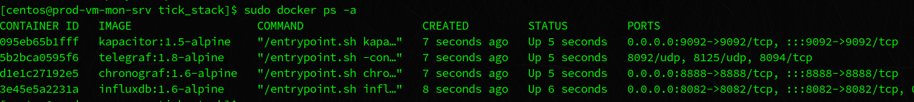
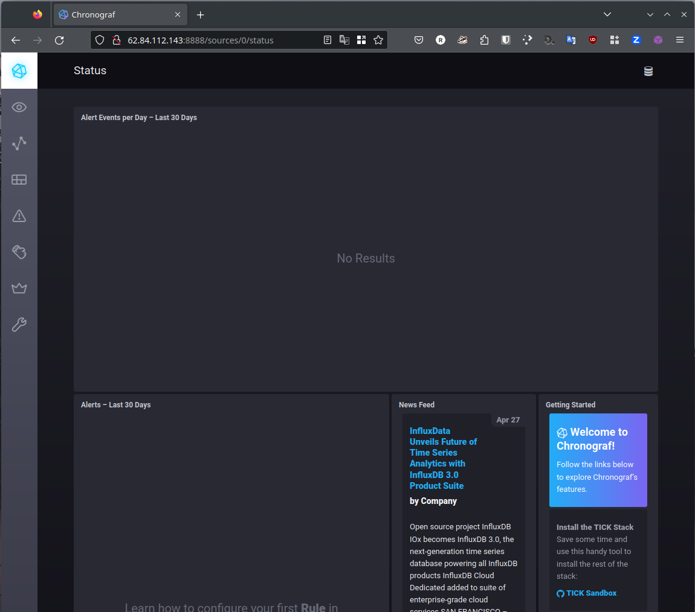
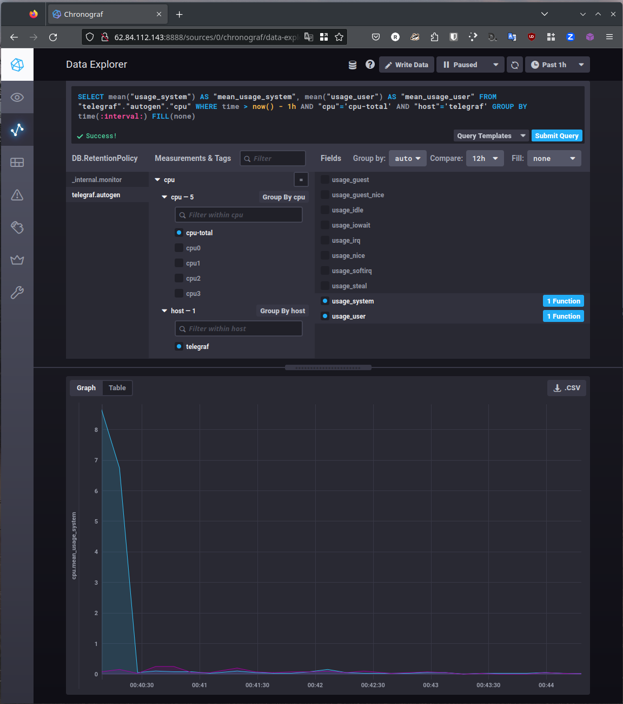
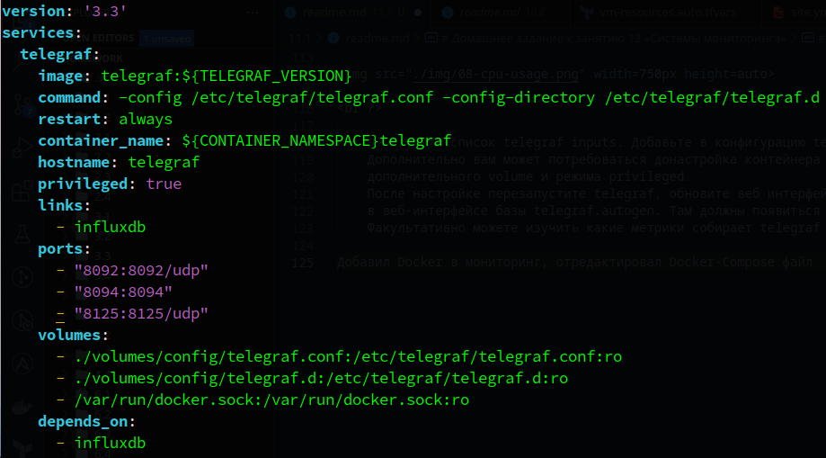
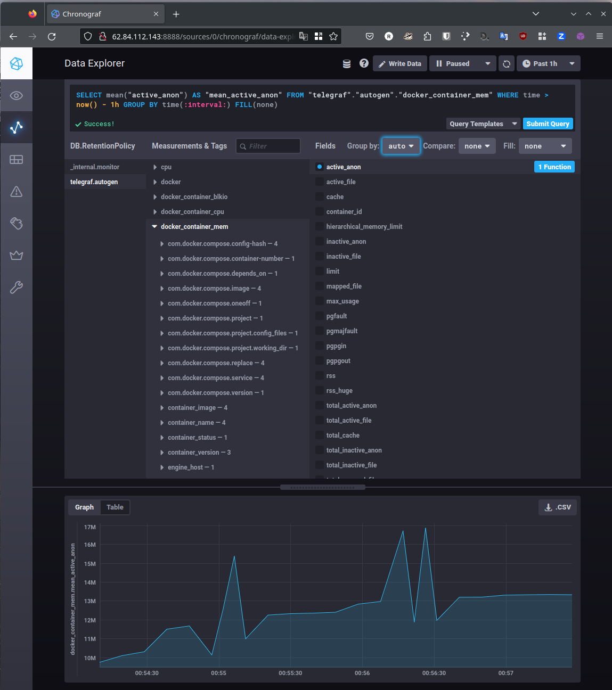
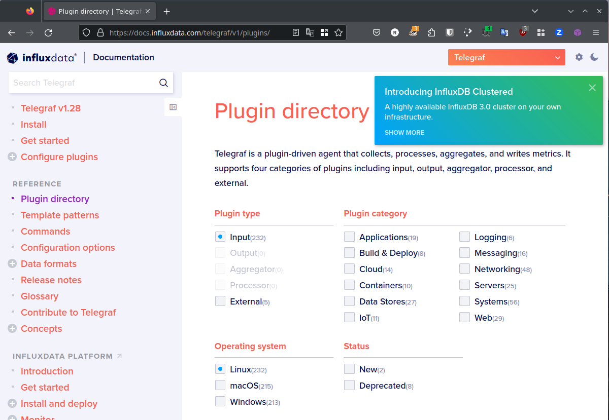

# Домашнее задание к занятию 13 «Системы мониторинга»

## Выполнил студент группы DevOps-25 Шаповалов Кирилл

 

Обязательные задания
--------------------

    1. Вас пригласили настроить мониторинг на проект. На онбординге вам рассказали, что проект 
    представляет из себя платформу для вычислений с выдачей текстовых отчетов, которые сохраняются 
    на диск. Взаимодействие с платформой осуществляется по протоколу http. Также вам отметили, что 
    вычисления загружают ЦПУ. Какой минимальный набор метрик вы выведите в мониторинг и почему?

В первую очередь конечно же нужно следовать главному правилу построения систем мониторинга - не насобирать лишнего, что может помешать распознать проблему в общем потоке огромного количества метрик.

1. С учетом того, что вычисления загружают ЦПУ - нужно мониторить загрузку ЦПУ, в данном случае нужна метрика **CPU load average**, дополнительно бы смотрел на метрику **CPU Idle**.
2. Так как отчеты пишутся на диск - обязательно нужно отслеживать количество индексных дескрипторов, чтобы в какой-то момент не упереться в то, что они кончились и ничего больше нельзя записать на диск. Отслеживание этого параметра поможет вовремя настроить, например, ротацию старых файлов или сброс неактуальных данных в архивные системы. Нужная метрика в данном случае - **inodes**.
3. Опять же, так как используется дисковая подсистема - нужно отслеживать качество ее работы. В этом могут помочь метрики **Disk IOPs** и **Disk Latency**. Эти метрики помогут распознать проблемы дисковой подсистемы, которые могут существенно сказаться на замедлении работы всей информационной системы.
4. Обязательно нужно отслеживать состояние оперативной памяти и swap. Нужные метрики в данном случае: **RAM Used**, **RAM Free**, **SWAP Used** и **SWAP Free**. Нужно стремиться к тому, чтобы **SWAP Used** было равно нулю, ведь в противном случае это будет означать, что системе не хватает оперативной памяти и рабочие данные начинают скидываться на диск, вместо того, чтобы находиться в ОЗУ, что в свою очередь тоже приведет к замедлению работы всей информационной системы.
5. Так как есть http-взаимодействие, значит нужно обязательно отслеживать состояние web-сервера. В зависимости от используемого веб-сервера, это могут быть метрики **Nginx Status (RPS)**, **Apache send no ddata**, **Apache Idle Workers**. Также нужно следить за количеством ошибок с помощью метрик **Apache/Nginx 4xx erros** и **Apache/Nginx 5xx errors**, и за процентным соотношением числа ошибок к общему числу запросов - **Apache/Nginx rate**.
6. В любом сетевом взаимодействии нужно мониторить и сеть, так как отказ приложения может быть вызван не самим приложением, а, например загрузкой сети, если в это время сеть начинает активно использоваться и канал забит что называется в полку. здесь помогут метрики **Bandwidth Usage**, **Latency** и **Packet Loss**.

Я думаю, это все основные метрики в данном случае.

    2. Менеджер продукта посмотрев на ваши метрики сказал, что ему непонятно что такое RAM/inodes/CPUla. 
    Также он сказал, что хочет понимать, насколько мы выполняем свои обязанности перед клиентами 
    и какое качество обслуживания. Что вы можете ему предложить?

**RAM** - в данном случае, скорее всего, это будет процент используемой оперативной памяти, если его значение достаточно велико и не меняется с течением времени - это знак, что пора задумываться либо о добавлении ресурсов в систему, либо о масштабировании приложения.

**inodes** - количество индексных дескрипторов. Напрямую влияет на возможность записывать новые файлы на диск. Если свободных дескрипторов нет - в системе нельзя будет создать ни одного файла, а это значит, что отчеты перестанут записываться на диск и информационная система встанет.

**CPUla** - средняя нагрузка CPU в виде процессов, ожидающих выполнения или выполняющихся в данный момент на CPU. Отдает значения на последнюю минуту, за последние 5 минут и за последние 15 минут. Значение не должно превышать количество ядер в CPU. По полученному значению оценивают загрузку ядер ЦПУ, так например значение "1" на четырехядерном процессоре означает загрузку в 25% CPU.

Если менеджер пришел с вопросом про качество обслуживания - скорее всего речь будет идти о SLI, SLO и SLA. В данном случае мы должны обеспечить показатели SLI на должном уровне. Для того, чтобы менеджер понимал все данные метрики и их значения - можно разработать дашборды в любой системе визуализации (Grafana, например), и в эту систему визуализации вывести требуемые метрики с понятными менеджеру формулировками, а далее дашборды можно уже выводить на мониторы, экраны, куда угодно, для того, чтобы менеджер наблюдал за состоянием здоровья сервиса и видел на сколько выполняется SLA.

    3. Вашей DevOps команде в этом году не выделили финансирование на построение системы сбора логов. 
    Разработчики в свою очередь хотят видеть все ошибки, которые выдают их приложения. 
    Какое решение вы можете предпринять в этой ситуации, чтобы разработчики получали ошибки приложения?

В данном случае можно спокойно обратиться к OpenSource программному обеспечению, которое сейчас сполна закрывает любые потребности по сбору и анализу логов и ошибок. Можно воспользоваться ELK-стеком, можно использовать Clickhouse+Vector, для отображения опять же можно использовать Kibana, Grafana Loki, тут уж кому что удобнее. Для перехвата ошибок можно использовать платформу Sentry. Ну и также можно настроить отправку уведомлений, например, в Telegram или Slack, большинство данных систем позволяет это сделать, тем самым разработчики будут оперативно получать уведомления о том, что что-то пошло не так.

    4. Вы, как опытный SRE, сделали мониторинг, куда вывели отображения выполнения SLA=99% по http кодам ответов.
    Вычисляете этот параметр по следующей формуле: summ_2xx_requests/summ_all_requests. 
    Данный параметр не поднимается выше 70%, но при этом в вашей системе нет кодов ответа 5xx и 4xx. Где у вас ошибка?

Данная формула говорит о том, что не такой уж и опытный SRE-специалист ее составлял :))))

В этой формуле не учтены 3хх ответы сервера, которые так же не являются ошибкой. Ответы с кодом 3хх свидетельствуют о наличии редиректов, то есть перенаправлений. С учетом этой информации формула должна выглядеть следующим образом:

`(summ_2xx_requests + summ_3xx_requests)/summ_all_requests`

    5. Опишите основные плюсы и минусы pull и push систем мониторинга.

Push-системы мониторинга:

* В Push-системах мониторинга можно настраивать отправку метрик агентами в несколько конечных точек, тем самым обеспечивая одновременно и репликацию данных и масштабирование.
* На каждом агенте можно более гибко настраивать параметры отправки метрик, например как часто будут отправляться метрики в систему мониторинга.
* Так как Push системы очень часто используют протокол UDP для сбора метрик, это значительно ускоряет доставку метрик до конечного пользователя. 
* Протокол UDP одновременно является и плюсом и минусом. Так как это протокол без гарантийной доставки пакетов - использование этого протокола не гарантирует, что пакеты с метриками вообще будут доставлены до системы мониторинга.
* Метрики сложней дебажить, поскольку они поступают только в указанную систему мониторинга и получить их куда-то еще самостоятельно - будет затруднительно.

Pull-системы мониторинга:

* Обеспечение большей надежности.
* Вертикальное масштабирование системы мониторинга за счет Proxy-сервера, куда будут поступать метрики до попадания в саму систему мониторинга.
* Метрики можно получить самостоятельно используя различные иструменты для опроса агентов.
* Из личного опыта на примере системы Zabbix - более долгий отклик с получением метрик. Была возможность сравнить TICK-стэк с коробочным решением Zabbix, Zabbix проиграл в скорости.

Ну и дополнительным минусом любых систем мониторинга с агентом - является наличие этого самого агента. Агент это еще одна дополнительная точка отказа. Всегда есть вероятность, что сама система мониторинга работает штатно, а с агентом что-то случилось и он больше не гарантирует доставку метрик до системы мониторинга.

    6. Какие из ниже перечисленных систем относятся к push модели, а какие к pull? А может есть гибридные? 
    Prometheus * TICK * Zabbix * VictoriaMetrics * Nagios

**Prometheus** работает в соответствии с Pull-моделью. Для того, чтобы он опрашивал сервера с метриками - эти самые метрики должны быть опубликованы на определенном порту с помощью определенного агента (Exporter).

**TICK** - работает в соответствии с Push-моделью. На каждой машине ставится Telegraf-агент, который настраивается для сбора и отправки метрик в систему мониторинга InfluxDB.

**Zabbix** - является гибридной системой мониторинга и может как самостоятельно опрашивать агентов, так и получать метрики, например, по SNMP.

**VictoriaMetrics** - также является гибридной системой мониторинга.

**Nagios** - работает в соответствии с Pull-моделью.

    7. Склонируйте себе репозиторий и запустите TICK-стэк, используя технологии docker и docker-compose. 
    В виде решения на это упражнение приведите скриншот веб-интерфейса ПО chronograf (http://localhost:8888). 
    P.S.: если при запуске некоторые контейнеры будут падать с ошибкой - проставьте им режим Z, 
    например ./data:/var/lib:Z

Для выполнения задания поднял две машины в Yandex.cloud на базе Centos 7, с помощью Ansible установил на машины Docker и все его компоненты.

Само задание делал на примере немного другого репозитория, но смысл тот же.

Контейнеры запущены:

Веб-интерфейс Chronograf:

 

    8. Перейдите в веб-интерфейс Chronograf (http://localhost:8888) и откройте вкладку Data explorer.
       Нажмите на кнопку Add a query. Изучите вывод интерфейса и выберите БД telegraf.autogen
       В measurments выберите cpu->host->telegraf-getting-started, а в fields выберите usage_system. 
       Внизу появится график утилизации cpu. Вверху вы можете увидеть запрос, аналогичный SQL-синтаксису
       Поэкспериментируйте с запросом, попробуйте изменить группировку и интервал наблюдений.
       Для выполнения задания приведите скриншот с отображением метрик утилизации cpu из веб-интерфейса.

Вывел утилизацию CPU системой и пользователем:

 

    9. Изучите список telegraf inputs. Добавьте в конфигурацию telegraf следующий плагин - docker. 
    Дополнительно вам может потребоваться донастройка контейнера telegraf в docker-compose.yml 
    дополнительного volume и режима privileged. 
    После настройке перезапустите telegraf, обновите веб интерфейс и приведите скриншотом список measurments 
    в веб-интерфейсе базы telegraf.autogen. Там должны появиться метрики, связанные с docker. 
    Факультативно можете изучить какие метрики собирает telegraf после выполнения данного задания.

Добавил Docker в мониторинг, отредактировал Docker-Compose файл следующим образом:

Проверим сами метрики в веб-интерфейсе Chronograf:

Если факультативно поизучать какие еще Input-плагины можно подключать, то это можно обратиться вот сюда:

Только для Linux здесь 232 плагина. А так набор богатый и по всему остальному :)

В работе приходилось использовать ранее в этой системе мониторинга плагины на VMWare, MSSSQL Server, ProxMox, MS AD Services и некоторые другие. 

Мне лично в использовании данный инструмент весьма понравился :)