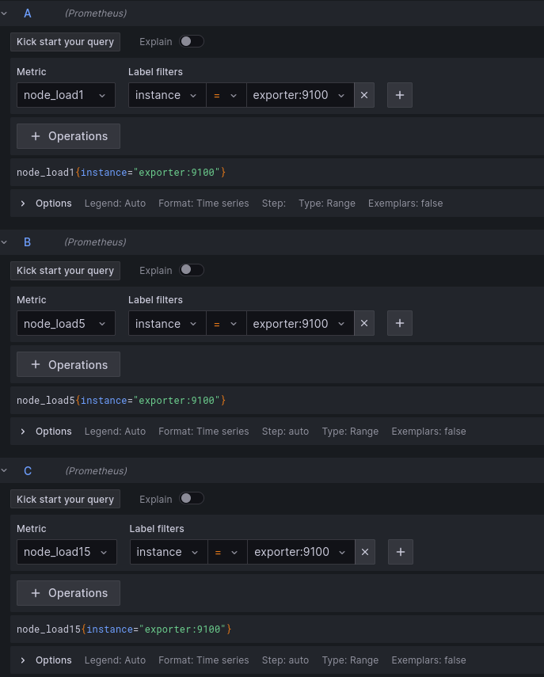

# Домашнее задание к занятию 14 «Средство визуализации Grafana»

## Выполнил студент группы DevOps-25 Шаповалов Кирилл

<br />

Так как мы не ищем легких путей, будем делать сразу по заданию повышенной сложности :))

Весь `prometheus_stack`: Prometheus, Grafana, Node_Exporter - находится в каталоге `prom_stack`. Уведомления на третьем шаге буду настраивать в Telegram.

<br />

Задание 1
---------

```
1. Запустите связку prometheus-grafana.
2. Зайдите в веб-интерфейс grafana, используя авторизационные данные, указанные в манифесте docker-compose.
3. Подключите поднятый вами prometheus, как источник данных.
4. Решение домашнего задания — скриншот веб-интерфейса grafana со списком подключенных Datasource.
```

### Решение

Запущенные контейнеры Prometheus_stack:


Prometheus подключен в качестве DataSource:


<br />

Задание 2
---------

```
Создайте Dashboard и в ней создайте Panels:

1. Утилизация CPU для nodeexporter (в процентах, 100-idle);
2. CPULA 1/5/15;
3. Количество свободной оперативной памяти;
4. Количество места на файловой системе.

Для решения этого задания приведите promql-запросы для выдачи этих метрик, а также скриншот получившейся Dashboard.
```

### Решение

В качестве теста был создан следующий dashboard:


Запросы строил следующим образом:

    * CPU Usage (В качестве Units выбраны проценты (0-100) для отображения графика именно в процентах)


    * CPU LA 1/5/15



    * MemFree (В качестве Units выбраны bytes)


    * Filesystem usage (В качестве Units выбраны bytes)


<br />

Задание 3
---------

```
1. Создайте для каждой Dashboard подходящее правило alert — можно обратиться к первой лекции в блоке «Мониторинг».
2. В качестве решения задания приведите скриншот вашей итоговой Dashboard.
```

### Решение

Dashboard с настроенными алертами:


Сами алерты:


Настройка отправки алертов в Telegram (естественно, нужно создать Telegram-бота):


Ну и подтверждение доставки алерта, а затем сообщения, что все ОК:


<br />

Задание 4
---------

```
1. Сохраните ваш Dashboard.Для этого перейдите в настройки Dashboard, выберите в боковом меню «JSON MODEL». Далее скопируйте отображаемое json-содержимое в отдельный файл и сохраните его.
2. В качестве решения задания приведите листинг этого файла.
```

### Решение

Файл с листингом приложил к данному ДЗ. Находится в корне, рядом с Readme.