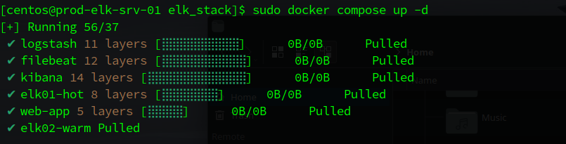
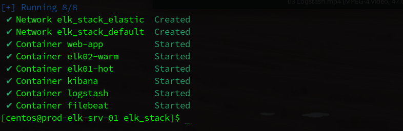
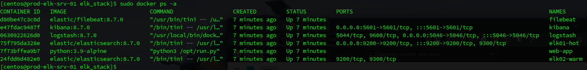
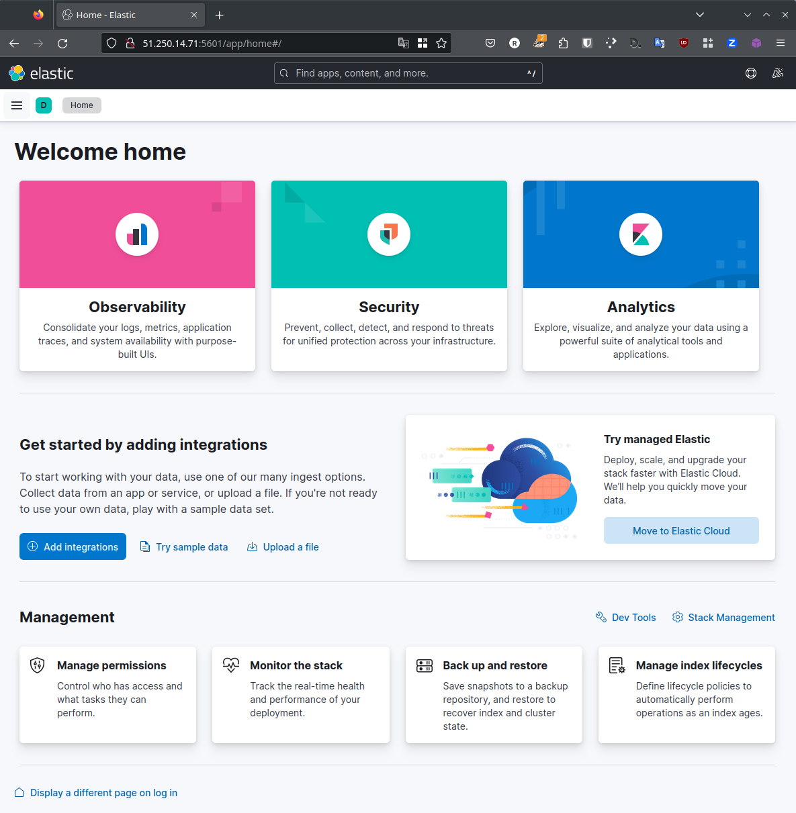
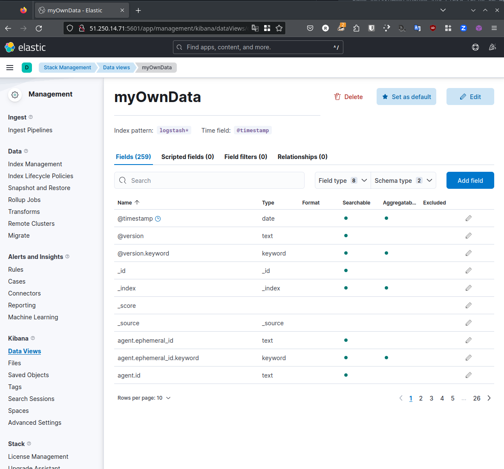
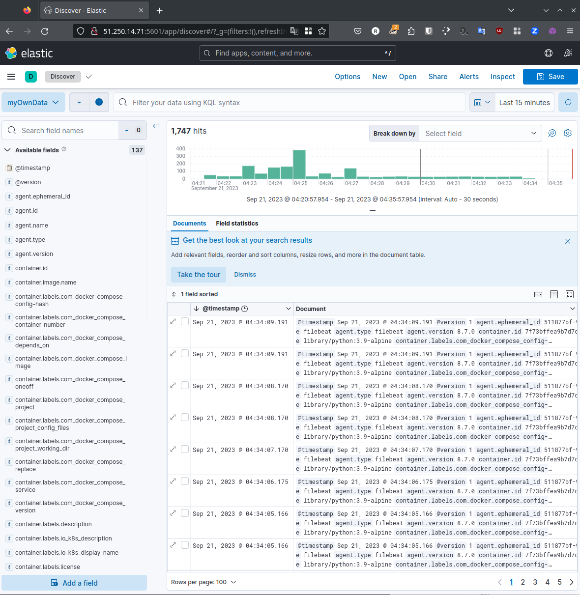
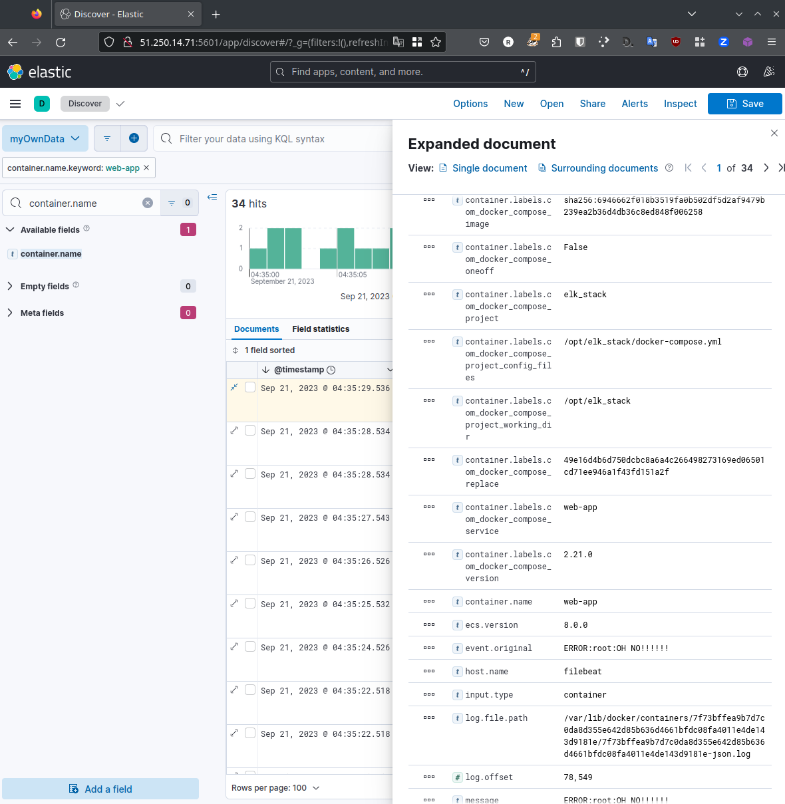

# Домашнее задание к занятию 15 «Система сбора логов Elastic Stack»

## Выполнил студент группы DevOps-25 Шаповалов Кирилл

<br />

Так как систему `ELK` я разворачиваю впервые в жизни - абсолютно честно признаю: Каталогом `help` пользовался, но пользовался как источником для собственного проекта.

Однако, пользовался я и другими ресурсами, в том числе и официальной документацией.

В итоге у меня получился собственный docker-compose манифест, написанный с использованием перечисленных выше источников.

Весь проект находится в каталоге `elk_stack`. 

<br />

Задание 1
---------

```
Вам необходимо поднять в докере и связать между собой:

* elasticsearch (hot и warm ноды);
* logstash;
* kibana;
* filebeat.

Logstash следует сконфигурировать для приёма по tcp json-сообщений.

Filebeat следует сконфигурировать для отправки логов docker вашей системы в logstash.

Результатом выполнения задания должны быть:

* скриншот docker ps через 5 минут после старта всех контейнеров (их должно быть 5);
* скриншот интерфейса kibana;
* docker-compose манифест (если вы не использовали директорию help);
* ваши yml-конфигурации для стека (если вы не использовали директорию help).
```

### Решение

Запустил контейнеры:





Ждем 5-7 минут - и проверяем:



Все контейнеры запущены и не упали (первоначально падали, пришлось немножко подебажить :)))

Интерфейс домашней страницы Kibana:



Docker-compose манифест и все конфиги лежат в каталоге `elk_stack`.

<br />

Задание 2
---------

```
Перейдите в меню создания index-patterns в kibana и создайте несколько index-patterns из имеющихся.

Перейдите в меню просмотра логов в kibana (Discover) и самостоятельно изучите, 
как отображаются логи и как производить поиск по логам.

В манифесте директории help также приведенно dummy-приложение, которое генерирует 
рандомные события в stdout-контейнера. Эти логи должны порождать индекс logstash-* в elasticsearch. 
Если этого индекса нет — воспользуйтесь советами и источниками из раздела «Дополнительные ссылки» этого задания.
```

### Решение

Создал свой собственный DataView, назначил ему паттерн `logstash-*`:



Посмотрим на новый DataView:



Сбор логов работает. 

Найдем логи dummy-приложения:

