# Домашнее задание к занятию «Хранение в K8s. Часть 2»

## Выполнил студент группы DevOps-25 Шаповалов Кирилл

<br />

Чеклист готовности к домашнему заданию
--------------------------------------

Как и в предыдущих заданиях всю работу буду выполнять в полноценном кластере k8s, используя локальный kubectl

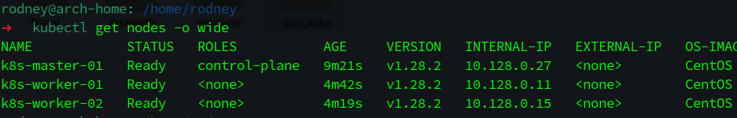

<br />

Задание 1. Создать Deployment приложения, использующего локальный PV, созданный вручную.
---------

    1. Создать Deployment приложения, состоящего из контейнеров busybox и multitool.
    2. Создать PV и PVC для подключения папки на локальной ноде, которая будет использована в поде.
    3. Продемонстрировать, что multitool может читать файл, в который busybox пишет каждые пять 
       секунд в общей директории.
    4. Удалить Deployment и PVC. Продемонстрировать, что после этого произошло с PV. Пояснить, почему.
    5. Продемонстрировать, что файл сохранился на локальном диске ноды. Удалить PV. 
       Продемонстрировать что произошло с файлом после удаления PV. Пояснить, почему.
    6. Предоставить манифесты, а также скриншоты или вывод необходимых команд.

### Решение

1. Для создания PV и PVC написан манифест (*листинг ниже*). Сам файл с манифестом находится рядом с выполненным ДЗ.

<details><summary>Манифест</summary>

```yaml
apiVersion: v1
kind: Namespace
metadata:
  name: pv-lesson
---
apiVersion: v1
kind: PersistentVolume
metadata:
  name: local-volume
spec:
  capacity:
    storage: 2Gi
  accessModes:
    - ReadWriteOnce
  persistentVolumeReclaimPolicy: Retain
  local:
    path: /opt/pv-local
  nodeAffinity:
    required:
      nodeSelectorTerms:
        - matchExpressions:
            - key: kubernetes.io/hostname
              operator: In
              values:
                - k8s-worker-01
                - k8s-worker-02
---
apiVersion: v1
kind: PersistentVolumeClaim
metadata:
  name: local-volume-clame
  namespace: pv-lesson
spec:
  resources:
    requests:
      storage: 2Gi
  accessModes:
    - ReadWriteOnce
  volumeName: local-volume
```

</details>

<br />

Что из важного я бы здесь отметил: во-первых, при создании локального PV нужно обязательно использовать **nodeAffinity**, без affinity создать Deployment не получится. Во-вторых, **ReclaimPolicy** - для локального PV возможны только два варианта **Retain** и **Delete**, если не указать никакой вариант - по умолчанию будет использован Retain. То есть данные будут сохранены в локальной папке даже после удаления PV и PVC. Ну и, в-третьих, конечно же указанная в манифесте локальная папка должна физически существовать на нодах кластера (или ноде, в случае привязки к одной ноде кластера).

2. Применил описанный выше манифест. Состояние кластера:

**ДО применения манифеста**

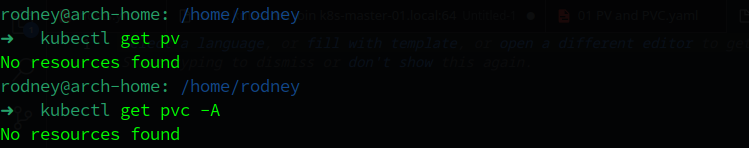

**ПОСЛЕ применения манифеста**

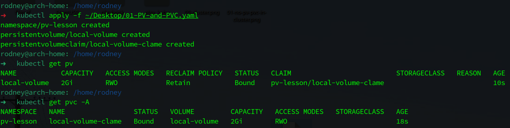

3. Создал манифест с деплойментом приложения, состоящего из двух контейнеров (*листинг ниже*), файл манифеста находится в папке с ДЗ.

<details><summary>Манифест</summary>

```yaml
apiVersion: apps/v1
kind: Deployment
metadata:
  name: webapp-local
  namespace: pv-lesson
  labels:
    app: my-webapp
    author: nvk-r0dney
spec:
  selector:
    matchLabels:
      app: webapp-local
  template:
    metadata:
      labels:
        app: webapp-local
    spec:
      containers:
        - name: busybox-app
          image: busybox:1.28
          command:
            [
              "sh",
              "-c",
              "while true; do echo 'Test to file' >> /mnt/logs/test.txt; sleep 5; done;",
            ]
          volumeMounts:
            - name: slow-volume
              mountPath: /mnt/logs
        - name: multitool-app
          image: wbitt/network-multitool
          env:
            - name: HTTP_PORT
              value: "8080"
          ports:
            - containerPort: 8080
              name: tool-http-port
              protocol: TCP
          volumeMounts:
            - name: slow-volume
              mountPath: /mnt/logs
      volumes:
        - name: slow-volume
          persistentVolumeClaim:
            claimName: local-volume-clame
```

</details>

<br />

Применил манифест, смотрим что получилось:

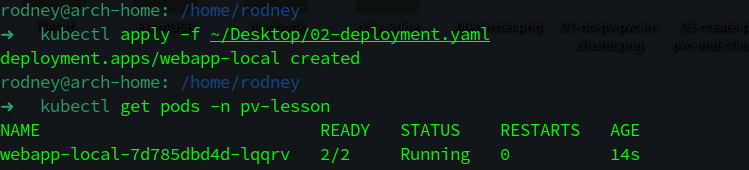

Здесь Volume монтируется в папку `/mnt/logs` в оба контейнера, задача busybox писать каждые 5 секунд определенный текст в файл в этой папке, а multitool должен прочитать этот файл. Пора проверять:

**Проверка записи данных в файл на локальном PV**

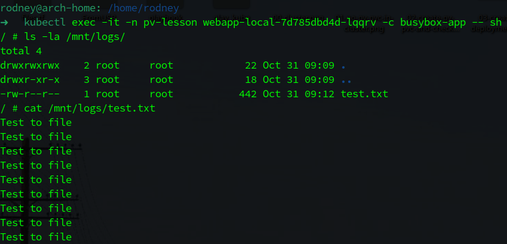

Как видно, busybox свою задачу выполняет и текст в файл пишет. Попробуем получить доступ к этим данным из контейнера с мультитулом:

**Проверка чтения данных из файла на локальном PV**

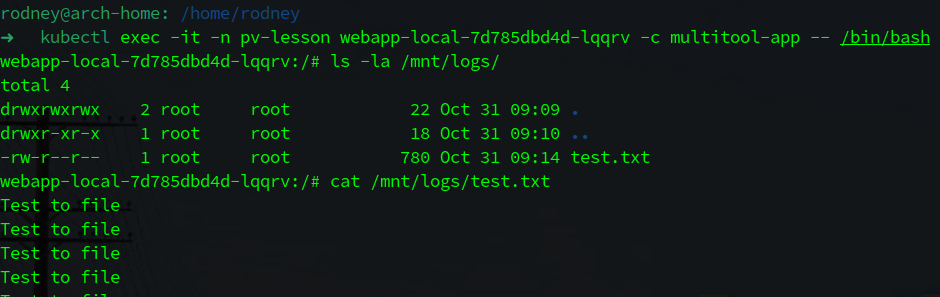

Отлично, файл доступен в указанной папке, данные из файла прочитать можно.

4. Удалил Deployment и PVC. Смотрим, что получилось:

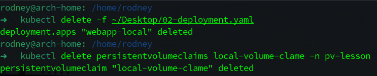

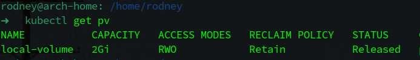

PV перешел в статус Released, что означает, что он более не используется и использовать его нельзя, но и он не удален, так как требуется ручная проверка администратором данных, хранящихся на данном PV. Нужно убедиться, что данные сохранены в локальной папке ноды кластера.

**Состояние данных в папке на ноде кластера:**

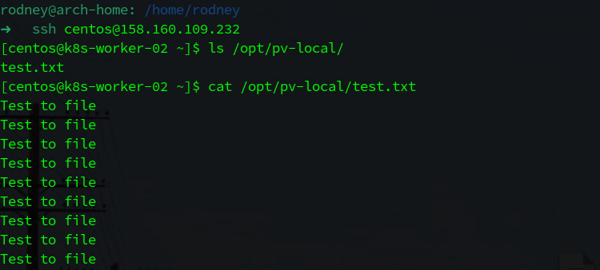

Данные на месте.

5. Удалил PV. Смотрим результат:

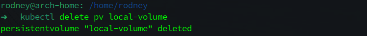

Проверяем данные на локальном диске.

**Состояние данных в папке на ноде кластера после удаления PV:**

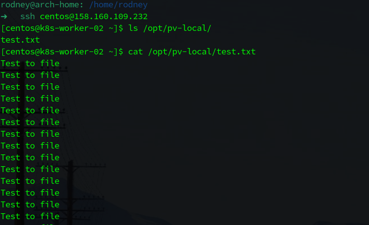

Данные все так же на месте. Вывод - удаление PV и PVC не удаляет фактические данные на диске в случае использования **local PV** и политики Retain.

**Итог: продемонстрирована работа local PV с записью данных в одном контейнере пода и чтением в другом. Проверена сохранность данных после удаления PV и PVC, сделаны выводы. Задание выполнено.**

<br />

Задание 2. Создать Deployment приложения, которое может хранить файлы на NFS с динамическим созданием PV.
----------

    1. Включить и настроить NFS-сервер на MicroK8S.
    2. Создать Deployment приложения состоящего из multitool, и подключить к нему PV, 
       созданный автоматически на сервере NFS.
    3. Продемонстрировать возможность чтения и записи файла изнутри пода.
    4. Предоставить манифесты, а также скриншоты или вывод необходимых команд.

### Решение

1. Так как я не использую MikroK8S - пришлось немного повозиться. Во-первых, поднял дополнительно еще одну машину, которая будет выполнять роль NFS сервера - имя машины **k8s-nfs-server**. Во-вторых, установил и настроил nfs-server, создал папку `/opt/nfs`, назначил на нее права 0777 и прописал ее в `/etc/exports` как NFS Shared folder с доступом только внутри локальной сети 10.128.0.0/16.

2. Для деплоя NFS Provisioner и Storage Class использовал проект с Github - <a href="https://github.com/kubernetes-sigs/nfs-subdir-external-provisioner/tree/master" target=_blank>Kubernetes NFS Subdir External Provisioner</a>. По сути, нужны только три файла: **rbac** - создает роли в кластере и все необходимое, **class** - создает сам StorageClass (его имя нужно запомнить для будущего использования) и **deployment** - создает деплоймент с подом, которому отдается вся папка NFS в виде PV и вся эта инфраструктура будет отвечать за динамическое создание и выделение PV создаваемым подам.

Все указанные файлы-манифесты находятся в папке <a href="./k8s-nfs/">/k8s-nfs/</a> с небольшими моими доработками под нужды конкретно этого проекта.

Применил по очереди все указанные манифесты. Результат ниже:

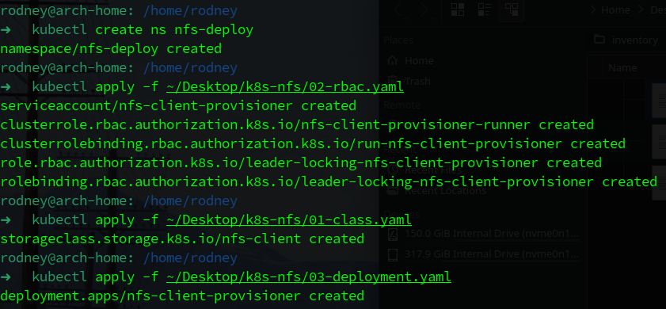

3. Написал манифест, создающий PVC (*листинг ниже*), файл манифеста находится в папке с ДЗ.

<details><summary>Манифест</summary>

```yaml
apiVersion: v1
kind: Namespace
metadata:
  name: nfs-lesson
---
apiVersion: v1
kind: PersistentVolumeClaim
metadata:
  name: nfs-volume-claim
  namespace: nfs-lesson
spec:
  storageClassName: "nfs-client"
  resources:
    requests:
      storage: 2Gi
  accessModes:
    - ReadWriteMany
```

</details>

<br />

Из важного - вот здесь как раз и нужно вспомнить storageClassName, который находится в атрибуте `name` в манифесте, создающем StorageClass.

Прменяем манифест и смотрим, что получилось:

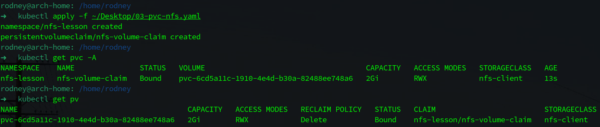

Как видно, создался PVC, а ему динамически был создан и просвоен PV с динамическим именем - это видно на скрине.

4. Написал манифест создающий app с контейнером мультитула (*листинг ниже*), файл манифеста также в папке с ДЗ.

<details><summary>Манифест</summary>

```yaml
apiVersion: apps/v1
kind: Deployment
metadata:
  name: local-webapp
  namespace: nfs-lesson
  labels:
    app: my-webapp
    author: nvk-r0dney
spec:
  selector:
    matchLabels:
      app: local-webapp
  template:
    metadata:
      labels:
        app: local-webapp
    spec:
      containers:
        - name: multitool-app
          image: wbitt/network-multitool
          resources:
            limits:
              memory: "128Mi"
              cpu: "500m"
          volumeMounts:
            - name: nfs-slow
              mountPath: /mnt/logs
      volumes:
        - name: nfs-slow
          persistentVolumeClaim:
            claimName: nfs-volume-claim
```

</details>

<br />

Применил манифест. Смотрим, что получилось:

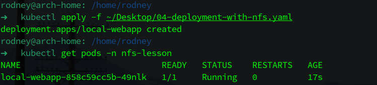

5. Подключился к контейнеру с мультитулом, нужно проверить может ли приложение записать что-то и прочитать из подключенного PV.

**Запись данных в файл:**

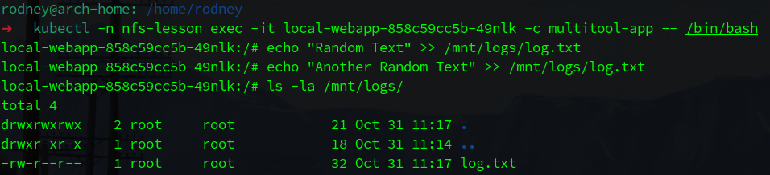

**Чтение данных из файла:**

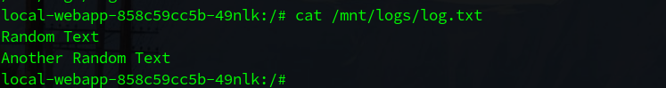

Отлично, подключенный PV доступен как на чтение, так и на запись для нашего приложения в контейнере.

6. Зашел на NFS сервер, нужно посмотреть что происходит на нем и сохранились ли записанные данные в nfs shared folder.

Проверяем:

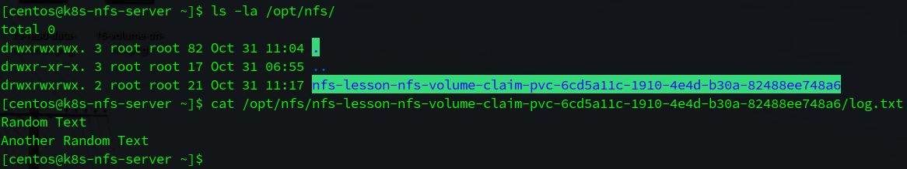

Как видно, в каталоге появился PV с динамически созданным именем, а внутри уже лежит файл, созданный приложением, ну а в файле - успешно записанные данные.

**Итог: Все пункты задания выполнены, все условия соблюдены. Задание выполнено.**