# Домашнее задание к занятию «Управление доступом»

## Выполнил студент группы DevOps-25 Шаповалов Кирилл

<br />

Чеклист готовности к домашнему заданию
--------------------------------------

Как и в предыдущих заданиях всю работу буду выполнять в полноценном кластере k8s, используя локальный kubectl

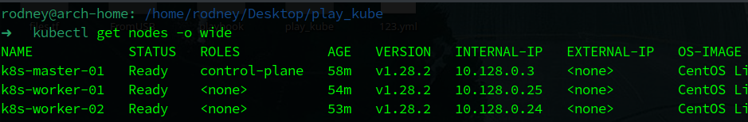

<br />

Задание 1. Создайте конфигурацию для подключения пользователя
---------

    1. Создайте и подпишите SSL-сертификат для подключения к кластеру.
    2. Настройте конфигурационный файл kubectl для подключения.
    3. Создайте роли и все необходимые настройки для пользователя.
    4. Предусмотрите права пользователя. Пользователь может просматривать логи подов и их конфигурацию 
       (kubectl logs pod <pod_id>, kubectl describe pod <pod_id>).
    5. Предоставьте манифесты и скриншоты и/или вывод необходимых команд.

### Решение

В данной задаче я воспроизведу реальную рабочую задачу в виде предоставления прав доступа новому сотруднику - DevOps - к отдельному Namespace кластера и ограничу его в правах, как того требует задача. Все конфигурационные файлы нового пользователя находятся в каталоге <a href="./new_user/">new_user</a>. В идеальном IT мире половину из этих шагов (готовит итоговый csr-файл) делает сам новый пользователь :)

**Создал ssl ключ для нового пользователя:**

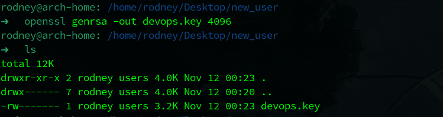

**Написал конфиг-файл, который будет использован при генерации csr:**

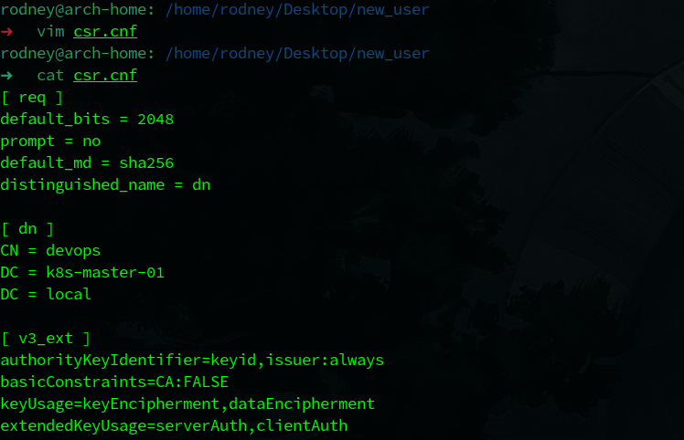

**Сгенерировал сам csr-файл:**

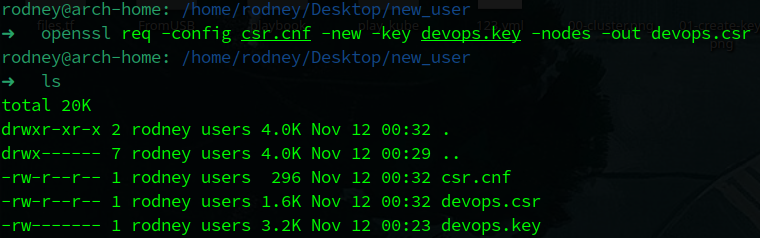

Далее необходимо провести некоторые манипуляции для обеспечения большего удобства в дальнейшей работе с файлом csr. 

**Записал в системную переменную значение файла csr в base64 кодировке:**

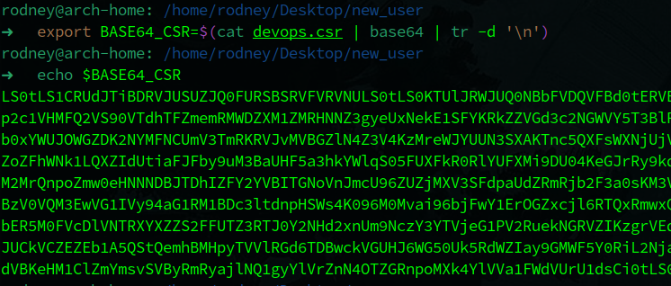

**Написал манифест для создания csr в кластере:**

```yaml
apiVersion: certificates.k8s.io/v1
kind: CertificateSigningRequest
metadata:
  name: devops-csr
spec:
  groups:
    - system:authenticated
  request: ${BASE64_CSR}
  usages:
    - digital signature
    - key encipherment
    - client auth
  signerName: kubernetes.io/kube-apiserver-client
```

Сам файл данного манифеста находится в каталоге <a href="./new_user/">new_user</a>.

**Создал запрос на выпуск клиентского сертификата в кластере:**

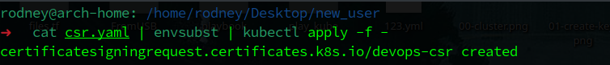

**Проверяю, что новый запрос есть в кластере:**

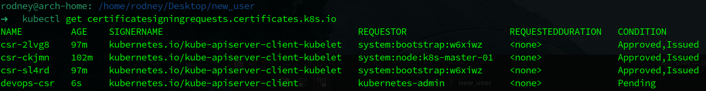

Отлично, запрос в кластере создан и находится в статусе `Pending`, то есть ожидает реакции администратора кластера.

**Как администратор кластера - подтверждаю запрос на выпуск сертификата:**

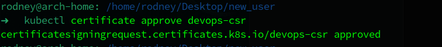

**Смотрим, что изменилось в списке запросов:**

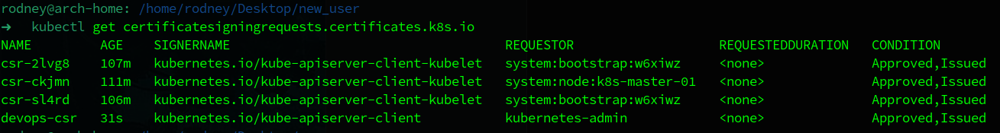

У созданного мной csr изменился статус на `Approved, Issued`, что означает, что администратор кластера утвердил запрос и был выпещен сертификат нового пользователя.

**Сохранил сертификат нового пользователя в файл:**

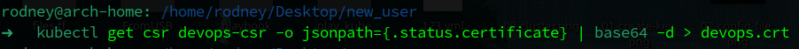

С помощью команды `openssl x509 -in devops.crt --text | less` можно взглянуть на сам сертификат:

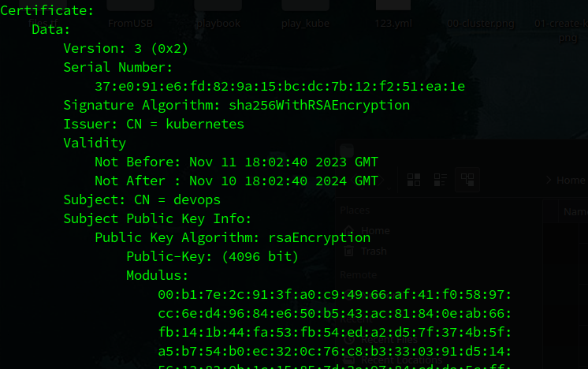

Здесь видно, какой алгоритм шифрования использовался, видно, для кого выпущен сертификат, кем выпущен ну и т.д. В данном случае сертификат полностью соответствует той конфигурации, что использовалась для его генерации.

Однако, передавать данный сертификат конечному пользователю еще рано, нужно сгенерировать конфиг-файл Kubernetes, который пользователь положит в свой домашний каталог по пути `~/.kube/config`, для того чтобы он вообще смог авторизоваться в кластере.

**Создал новый конфиг файл, в который записал CA-сертификат самого кластера, а также имя и адрес:**

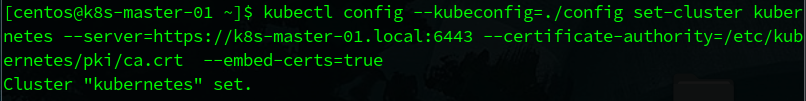

В принципе на данном этапе уже можно отдать файлы сертификата и конфиг пользователю (ключ у него уже есть, он же сам генерировал его :) ), но это не идеальный мир IT, а потому продолжаем.

**Добавил пользовательские параметры в конфиг (имя пользователя, сертификат и ключ):**

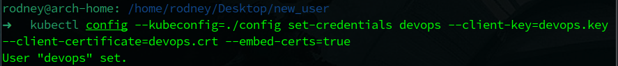

**Сопоставил пользователя с кластером путем добавления нового контекста:**

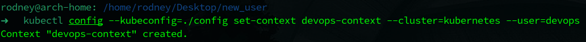

**Установил контекст по умолчанию для нового пользователя:**


<a href="./new_user/config">Ссылка на итоговый конфиг-файл нового пользователя</a>.

**Попробовал подключиться к кластеру с конфигом нового пользователя:**

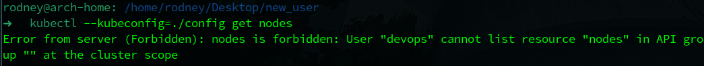

Отлично, пользователь смог авторизоваться в кластере со своим конфиг файлом, но никуда не получил доступа, потому что ему не назначено никаких прав.

**Написал манифест для Role и RoleBinding нового пользователя:**

```yaml
apiVersion: rbac.authorization.k8s.io/v1
kind: Role
metadata:
  name: devops-role
  namespace: rbac-lesson
rules:
  - apiGroups: [""]
    resources: ["pods", "pods/log"]
    verbs: ["get", "list", "watch"]
---
apiVersion: rbac.authorization.k8s.io/v1
kind: RoleBinding
metadata:
  name: devops-rb
  namespace: rbac-lesson
subjects:
  - kind: User
    name: devops
    apiGroup: rbac.authorization.k8s.io
roleRef:
  kind: Role
  name: devops-role
  apiGroup: rbac.authorization.k8s.io
```

Так как я использую именно роль, а не кластерную роль - обязательно указываю namespace, в котором и будет создаваться роль. Также указываю ресурсы и права, к которым будет иметь доступ новый пользователь в рамках своего namespace - в соответствии с условием задачи он должен иметь доступ к подам и логам подов.

**Применил данный манифест:**

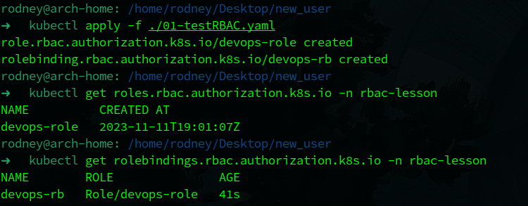

Как видно, и Role и RoleBinding успешно созданы.

Далее я взял простенький манифест из предыдущих заданий для создания Deployment с 2 репликами nginx, а также с созданием сервиса (сервис создавался исключительно для проверки прав доступа позже). Листинг манифеста приводить не буду, нет смысла, а готовый файл лежит ряддом с данным ДЗ - <a href="./02-appDeployment.yaml">ссылка</a>.

**Применил манифест с Deployment и Service:**

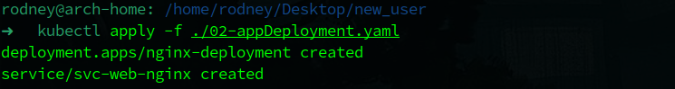

**Убедился, что все, что я создавал в Namespace - поднялось:**

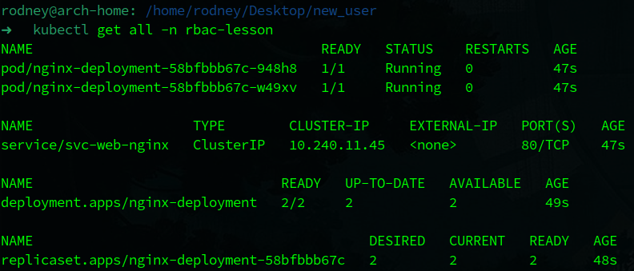

Все работы выполнены. Далее нужно проверить доступы нового пользователя в кластере.

**Проверка доступа к подам и логам конкретного пода:**

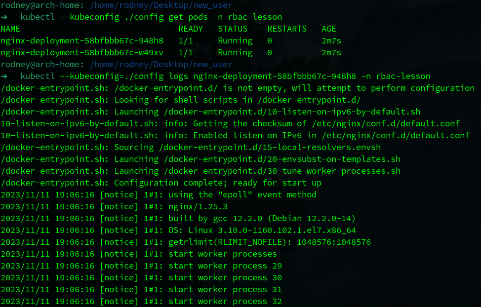

Отлично, пользователь получил доступ к списку подов и смог прочитать логи конкретного пода.

**Проверка доступа к прросмотру информации о конкретном поде:**

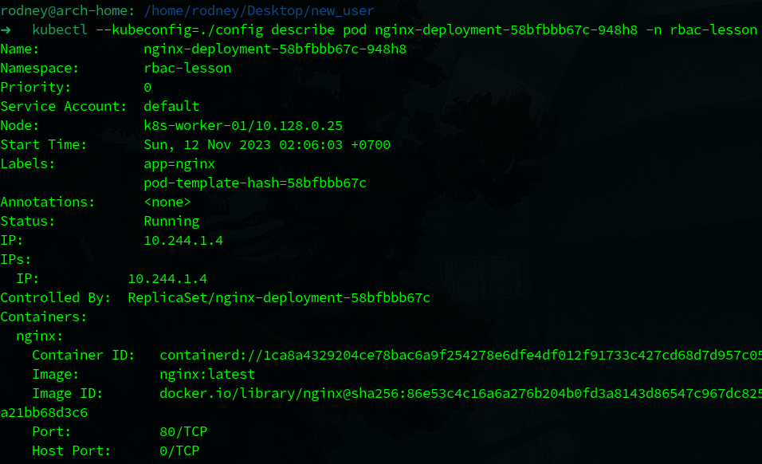

Отлично, новый пользователь выполнил команду describe и получил положительный ответ от API кластера.

**Проверка отсутствия доступа, например, к списку сервисов:**

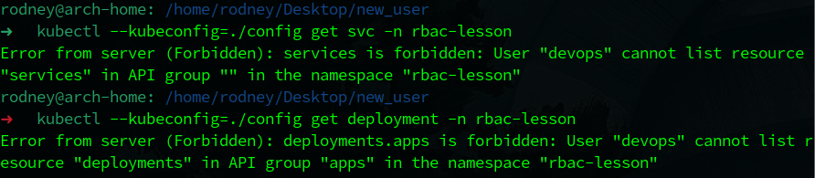

И здесь тоже все работает. Пользователю запрещено просматривать сервисы и деплойменты, о чем ему и сообщает кластер.

<br />

**Итог: Был выпущен сертификат для аутентификации нового пользователя в кластере, составлен конфиг файл кластера для нового пользователя, созданы Role и RoleBinding, предоставлены права в соответствии с условием задачи и данные права успешно проверены. Задача выполнена.**

