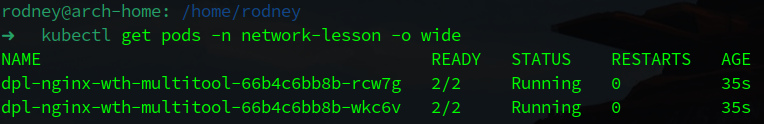
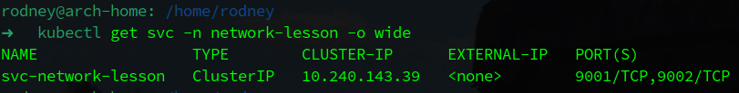
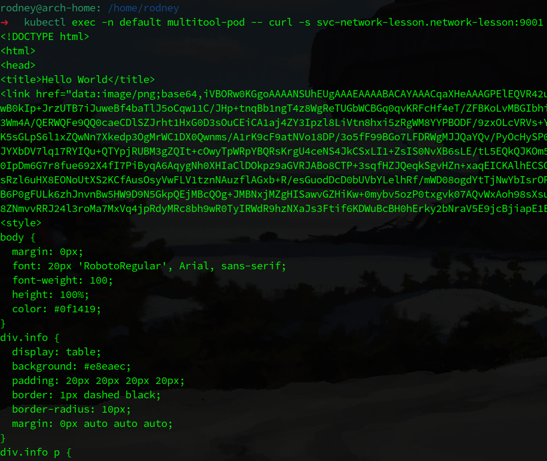
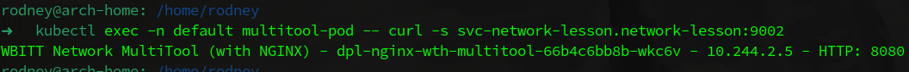
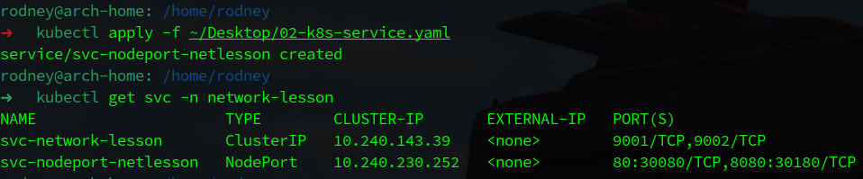
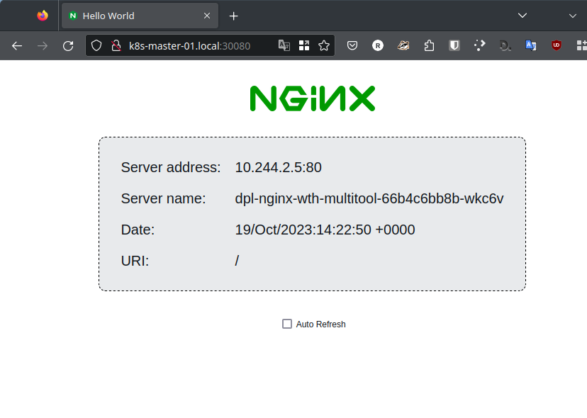
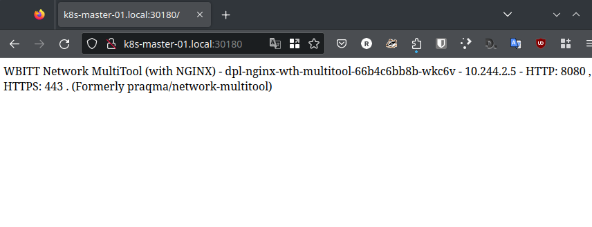

# Домашнее задание к занятию «Сетевое взаимодействие в K8S. Часть 1»

## Выполнил студент группы DevOps-25 Шаповалов Кирилл

<br />

Чеклист готовности к домашнему заданию
--------------------------------------

Как и в предыдущих заданиях всю работу буду выполнять в полноценном кластере k8s, используя локальный kubectl


<br />

Задание 1. Создать Deployment и обеспечить доступ к контейнерам приложения по разным портам из другого Pod внутри кластера
------------------------------


    1. Создать Deployment приложения, состоящего из двух контейнеров (nginx и multitool), с количеством реплик 3 шт.
    2. Создать Service, который обеспечит доступ внутри кластера до контейнеров приложения из п.1  
       по порту 9001 — nginx 80, по 9002 — multitool 8080.
    3. Создать отдельный Pod с приложением multitool и убедиться с помощью curl, что из пода есть 
       доступ до приложения из п.1 по разным портам в разные контейнеры.
    4. Продемонстрировать доступ с помощью curl по доменному имени сервиса.
    5. Предоставить манифесты Deployment и Service в решении, а также скриншоты или вывод команды п.4.

### Решение

Готовый манифест лежит в папке с ДЗ - [Манифест](./01-dpl-nginx.yaml)

Вместо образа Nginx использовал образ `nginxdemos/hello`, также поды, созданные в Deployment и отдельный под с Multitool размещены в разные Namespace - для будущей наглядности демонстрации доступов по DNS.

<details><summary>Манифест</summary>

```yaml
apiVersion: apps/v1
kind: Deployment
metadata:
  name: dpl-nginx-wth-multitool
  namespace: network-lesson
  labels:
    app: nginx
    author: nvk-r0dney
spec:
  replicas: 2
  selector:
    matchLabels:
      app: nginx
  template:
    metadata:
      labels:
        editor: vscode
        author: nvk-r0dney
        app: nginx
    spec:
      containers:
        - name: nginx
          image: nginxdemos/hello
          ports:
            - name: http-port
              containerPort: 80
              protocol: TCP
        - name: multitool
          image: wbitt/network-multitool
          env:
            - name: HTTP_PORT
              value: "8080"
          ports:
            - name: tool-http-port
              containerPort: 8080
              protocol: TCP
---
apiVersion: v1
kind: Service
metadata:
  name: svc-network-lesson
  namespace: network-lesson
  labels:
    author: nvk-r0dney
spec:
  selector:
    app: nginx
  ports:
    - port: 9001
      targetPort: http-port
      name: svc-nginx-port
    - port: 9002
      targetPort: tool-http-port
      name: svc-tool-port
---
apiVersion: v1
kind: Pod
metadata:
  name: multitool-pod
  namespace: default
  labels:
    author: nvk-r0dney
spec:
  containers:
    - name: multitool
      image: wbitt/network-multitool
```

</details>

<br />

Выполнил манифест:


Проверил, на месте ли поды, созданные в Deployment:



Проверил, создался ли Multiport Service:



Ну и проверил отдельый под в другом Namespace:


Все создалось корректно. Самое время проверить сетевую связность между подами.   
Подключился к `multitool-pod` и выполнил оттуда curl на разные порты созданного ранее сервиса по DNS:



По порту 9001 по DNS нашего сервиса ответил nginx hello-world.



По 9002 порту ответил Multitool.

**Итог: Сетевая связность есть, поды корректно могут взаимодействовать через DNS. Задание выполнено.**

<br />

Задание 2. Создать Service и обеспечить доступ к приложениям снаружи кластера
------------------------------

    1. Создать отдельный Service приложения из Задания 1 с возможностью доступа снаружи кластера к nginx, 
       используя тип NodePort.
    2. Продемонстрировать доступ с помощью браузера или curl с локального компьютера.
    3. Предоставить манифест и Service в решении, а также скриншоты или вывод команды п.2

### Решение

Готовый манифест лежит в папке с ДЗ - [Манифест](./02-k8s-service.yaml)

<details><summary>Манифест</summary>

```yaml
apiVersion: v1
kind: Service
metadata:
  name: svc-nodeport-netlesson
  namespace: network-lesson
  labels:
    author: nvk-r0dney
spec:
  type: NodePort
  selector:
    app: nginx
  ports:
    - port: 80
      targetPort: 80
      nodePort: 30080
      name: svc-nginx-http-port
    - port: 8080
      targetPort: 8080
      nodePort: 30180
      name: svc-tool-http-port
```

</details>

<br />

Выполнил манифест и проверил что Service создался корректно и нужного типа:



Сервис на месте, он требуемого в задании типа и открывает наружу порты 30080 и 30180.

Проверяем доступ по указанным портам через браузер:



На 30080 порту ответил nginx/hello-world.



На 30180 порту ответил Multitool.

**Итого: Сервис NodePort успешно функционирует, открывает наружу указанные порты. Приложения по указанным портам доступны. Задание выполнено.**