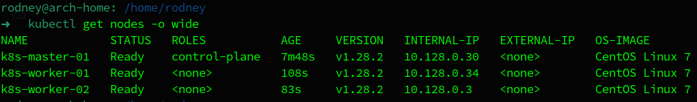
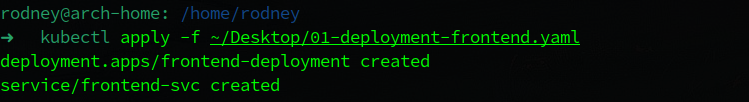
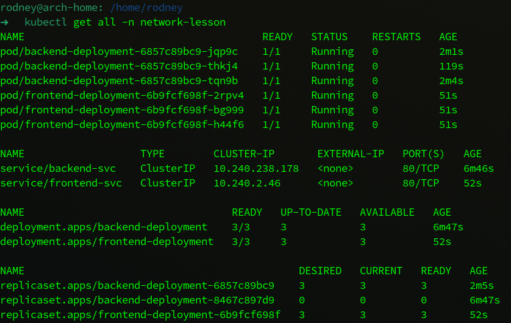
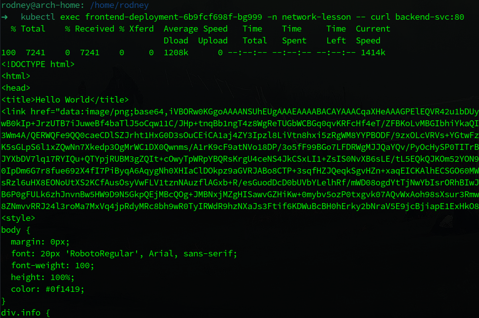
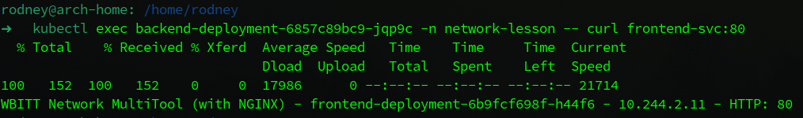
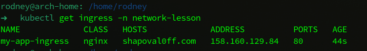
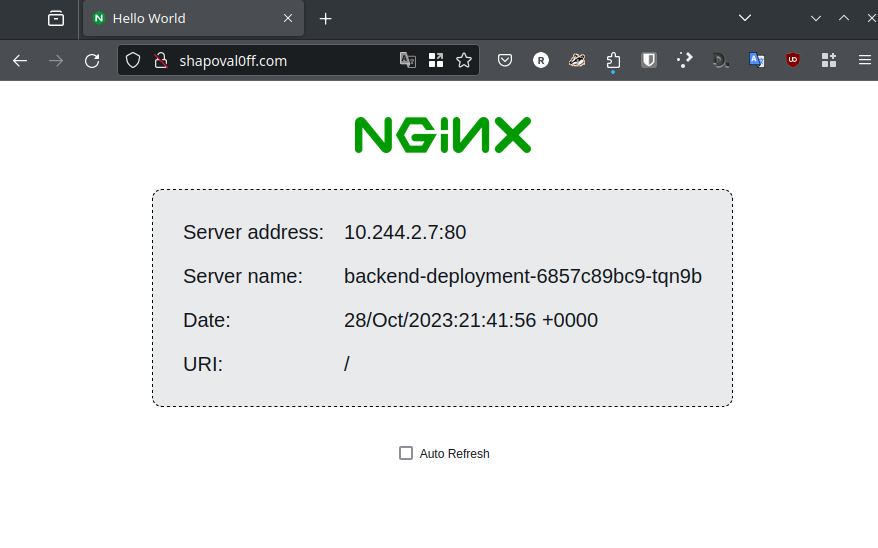
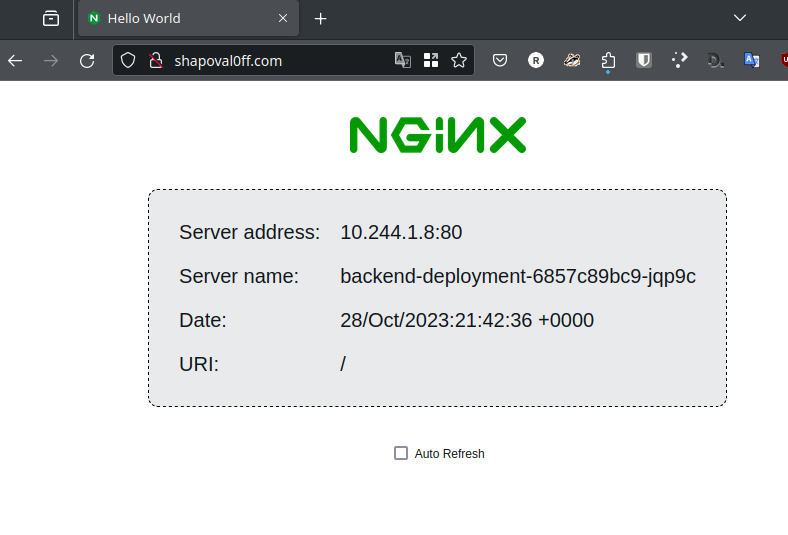
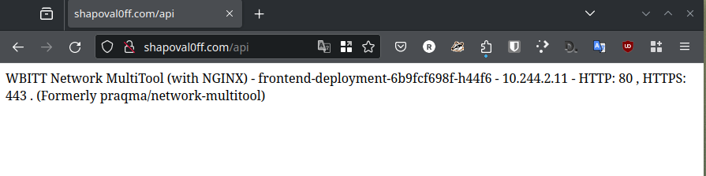
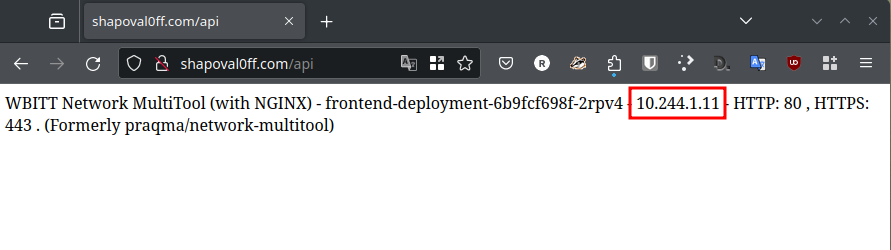

# Домашнее задание к занятию «Сетевое взаимодействие в K8S. Часть 2»

## Выполнил студент группы DevOps-25 Шаповалов Кирилл

<br />

Чеклист готовности к домашнему заданию
--------------------------------------

Как и в предыдущих заданиях всю работу буду выполнять в полноценном кластере k8s, используя локальный kubectl



<br />

Задание 1. Создать Deployment приложений backend и frontend
-----------

    1. Создать Deployment приложения frontend из образа nginx с количеством реплик 3 шт.
    2. Создать Deployment приложения backend из образа multitool.
    3. Добавить Service, которые обеспечат доступ к обоим приложениям внутри кластера.
    4. Продемонстрировать, что приложения видят друг друга с помощью Service.
    5. Предоставить манифесты Deployment и Service в решении, а также скриншоты или вывод команды п.4.

### Решение

1. Написан манифест с деплоем приложения `Multitool` - <a href="./01-deployment-frontend.yaml">ссылка</a>. Количество реплик - 3, файл манифеста находится в папке с выполненным ДЗ.

<details><summary>Манифест</summary>

```yaml
apiVersion: apps/v1
kind: Deployment
metadata:
  name: frontend-deployment
  namespace: network-lesson
  labels:
    app: frontend
    author: nvk-r0dney
spec:
  replicas: 3
  selector:
    matchLabels:
      app: frontend
  template:
    metadata:
      labels:
        editor: vscode
        author: nvk-r0dney
        app: frontend
    spec:
      containers:
        - name: frontend
          image: wbitt/network-multitool
          ports:
            - name: front-http-port
              containerPort: 80
              protocol: TCP
---
apiVersion: v1
kind: Service
metadata:
  name: frontend-svc
  namespace: network-lesson
  labels:
    author: nvk-r0dney
spec:
  selector:
    app: frontend
  ports:
    - port: 80
      targetPort: front-http-port
      name: svc-frontend-port
```

</details>

<br />



2. Написан манифест с деплоем приложения `nginx/hello-world` - <a href="./01-deployment-backend.yaml">ссылка</a>. Количество реплик - 3, файл манифеста находится в папке с выполненным ДЗ.

<details><summary>Манифест</summary>

```yaml
apiVersion: v1
kind: Namespace
metadata:
  name: network-lesson
---
apiVersion: apps/v1
kind: Deployment
metadata:
  name: backend-deployment
  namespace: network-lesson
  labels:
    app: backend
    author: nvk-r0dney
spec:
  replicas: 3
  selector:
    matchLabels:
      app: backend
  template:
    metadata:
      labels:
        editor: vscode
        author: nvk-r0dney
        app: backend
    spec:
      containers:
        - name: backend
          image: nginxdemos/hello
          ports:
            - name: back-http-port
              containerPort: 80
              protocol: TCP
---
apiVersion: v1
kind: Service
metadata:
  name: backend-svc
  namespace: network-lesson
  labels:
    author: nvk-r0dney
spec:
  selector:
    app: backend
  ports:
    - port: 80
      targetPort: back-http-port
      name: svc-backend-port
```

</details>

<br />


3. К обоим приложениям добавлены Service, описаны в тех же манифестах. Проверяем, что все создано в указанном Namespace:



Как видно, все реплики приложений на месте, сервисы созданы. Переходим к проверке связности.

4. Проверил связность между приложениями в рамках самого кластера.





Проверка пройдена. Поды backend приложения получают ответ от frontend и наоборот.

**Итог: Соблюдены все условия задания, развернуты 2 deployment, в каждом по одному приложению, состоящему из трех реплик, а также по service типа ClusterIP. Между подами внутри кластера есть связность. Задание выполнено.**

<br />

Задание 2. Создать Ingress и обеспечить доступ к приложениям снаружи кластера
-------------------

    1. Включить Ingress-controller в MicroK8S.
    2. Создать Ingress, обеспечивающий доступ снаружи по IP-адресу кластера MicroK8S так, 
       чтобы при запросе только по адресу открывался frontend а при добавлении /api - backend.
    3. Продемонстрировать доступ с помощью браузера или curl с локального компьютера.
    4. Предоставить манифесты и скриншоты или вывод команды п.2.

### Решение

1. Скачал официальный манифест nginx-ingress контроллера по ссылке `https://raw.githubusercontent.com/kubernetes/ingress-nginx/controller-v1.8.2/deploy/static/provider/cloud/deploy.yaml`. Немного доработал его - добавил externalIP для сервиса LoadBalancer. Применил:


2. Написал манифест для ingress-rules - <a href="./02-ingress.yaml">ссылка</a>. Файл манифеста находится в папке с выполненным ДЗ.

<details><summary>Манифест</summary>

```yaml
apiVersion: networking.k8s.io/v1
kind: Ingress
metadata:
  name: my-app-ingress
  namespace: network-lesson
  annotations:
    nginx.ingress.kubernetes.io/rewrite-target: /$1
spec:
  ingressClassName: nginx
  rules:
    - host: shapoval0ff.com
      http:
        paths:
          - path: /
            pathType: Prefix
            backend:
              service:
                name: backend-svc
                port:
                  number: 80
          - path: /api
            pathType: Prefix
            backend:
              service:
                name: frontend-svc
                port:
                  number: 80
```

</details>

<br />

Результат применения - появился новый ingress.



3. В файле `/etc/hosts` локальной машины прописал связь IP-адреса с выдуманным доменом. Пора проверить, работают ли ingress-rules.

Проверка `shapoval0ff.com`:





Специально сделал 2 скриншота, на них видно, что отвечают разные реплики приложения.

Проверка `shapoval0ff.com/api`





Мультитул так же отвечает разными репликами.

**Итог: Ingress установлен и успешно функционирует. Балансировка работает и перенаправляет запросы в полном соответствии с написанными правилами. Задание выполнено.**