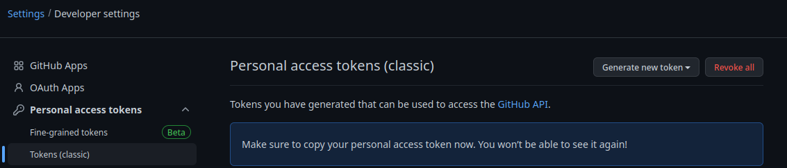
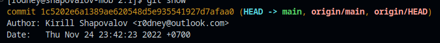
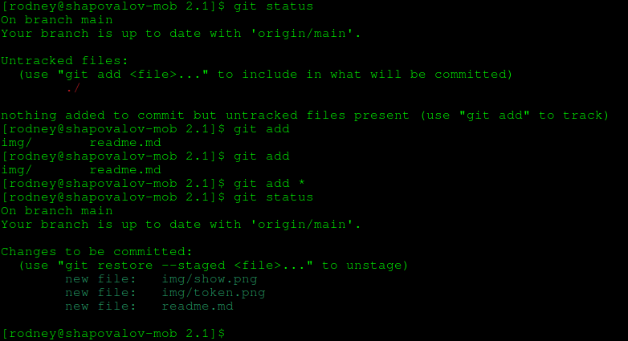
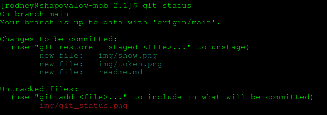
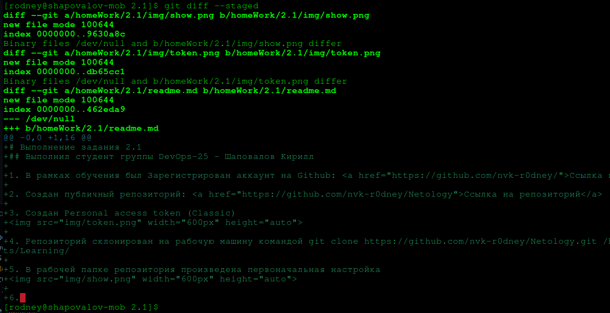
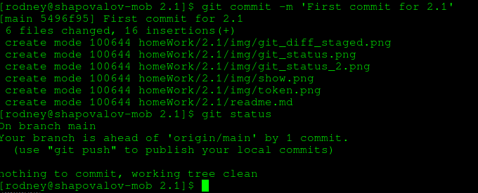

# Выполнение задания 2.1
## Выполнил студент группы DevOps-25 - Шаповалов Кирилл

1. В рамках обучения был Зарегистрирован аккаунт на Github: <a href="https://github.com/nvk-r0dney/">Ссылка на аккаунт</a>

2. Создан публичный репозиторий: <a href="https://github.com/nvk-r0dney/Netology">Ссылка на репозиторий</a>

3. Создан Personal access token (Classic)

4. Репозиторий склонирован на рабочую машину командой git clone https://github.com/nvk-r0dney/Netology.git /home/rodney/Documents/Learning/

5. В рабочей папке репозитория произведена первоначальная настройка

6. Произведены манипуляции с изменениями и командами git status и git diff

Вывод: команда git diff - отображает изменения в файлах еще не добавленных в коммит, при этом в это время команда git diff --staged не покажет ничего. После команды git add ситуация меняется, команда git diff --staged отображает изменения в файлах.

7. После этого осуществлен коммит

8. После коммита команда git status показывает, что главная ветка обновлена, а команды git diff и git diff --staged не показывают ничего, так как изменений больше нет.
