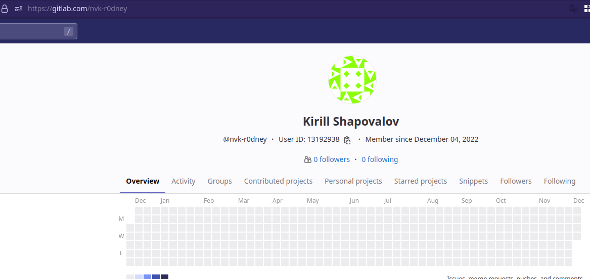
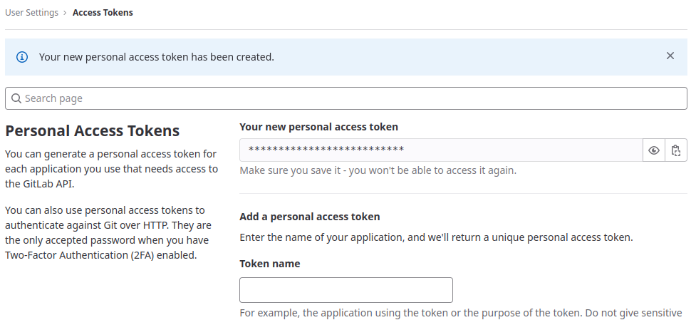
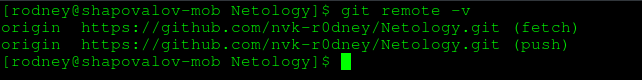
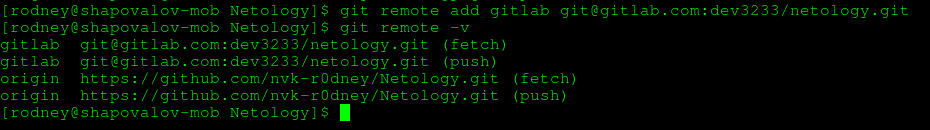
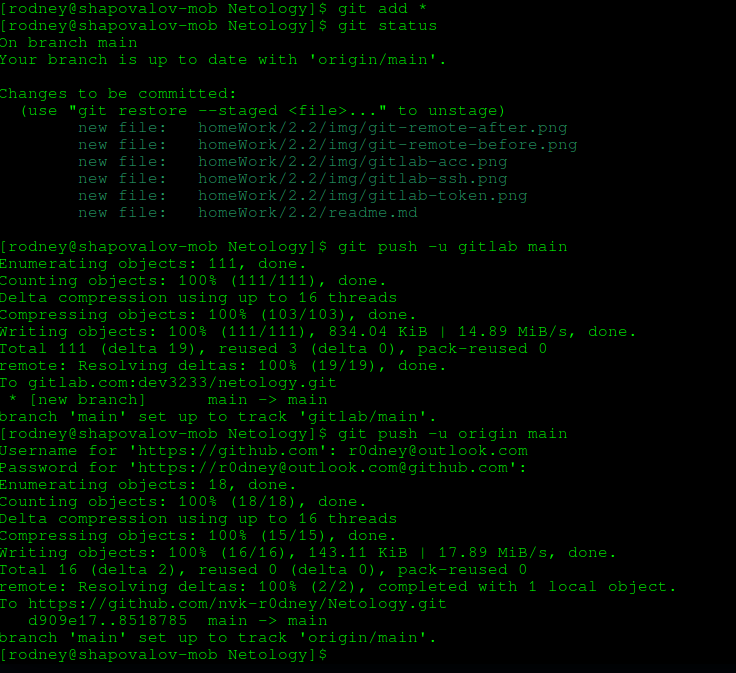
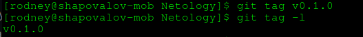
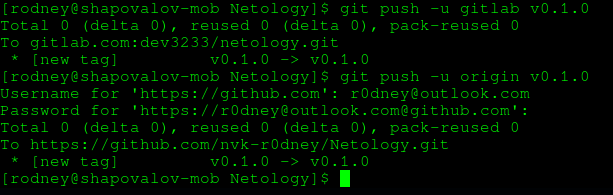
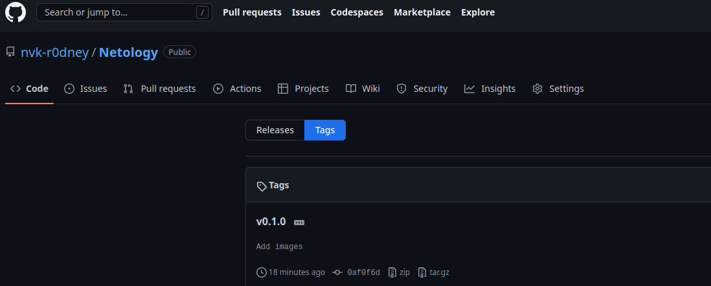
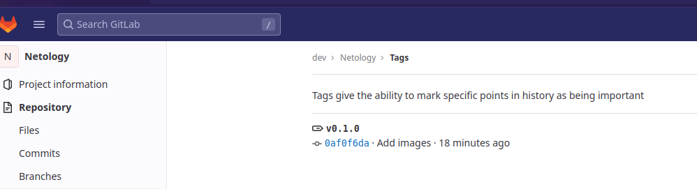

# Выполнение домашнего задания к занятию «2.2. Основы Git»

###  Выполнил студент группы DevOps-25 Шаповалов Кирилл

### Задание №1

1. В рамках данного задания был создан профиль на gitlab.com с использованием аккаунта на github.com. 

Для репозитория настроены персональный токен и SSH  ключ

2. Изучен синтаксис командной строки, выбран способ добавления репозитория на локальный ПК с использваонием SSH.

3. До добавления нового удаленного репозитория вывод команды git remote -v выглядит следующим образом:

4. После добавления нового удаленного репозитория повторный вывод команды git remote -v выглядит следующим образом:

5. Выполнено добавление файлов в коммит и выполнен коммит, после чего файлы были запушены в оба удаленных репозитория

6. История коммитов выглядит для всех репозиториев следующим образом:

### Задание №2

1. Добавлен легковесный тэг к коммиту

2. Выполнен пуш тэгов в оба репозитория:

Список тэгов на старницах репозиториев выглядит следующим образом:

для гитхаба:

для гитлаба:

