# Выполнение задания 2.3 по теме "Ветвления в Git"

### Выполнил студент группы DevOps-25 Шаповалов Кирилл

1. Создана папка branching, в которой расположены два скрипта

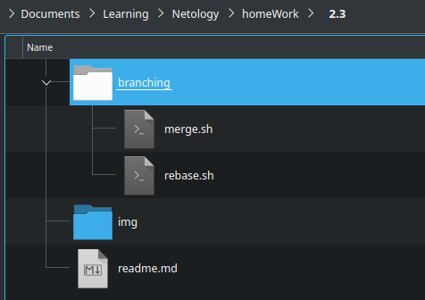

2. Добавлен коммит в ветку master и синхронизированы результаты с репозиторием на Гитхаб

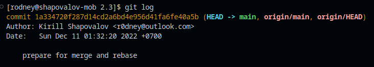

3. После всех произведенных имзенений с созданием веток - график стал таким (сравнение в git-lens в VSCode и на GitHub) - я немного накосячил и ветки у меня начинаются не с одного коммита, но на суть выполнения задания это никак не повлияло:

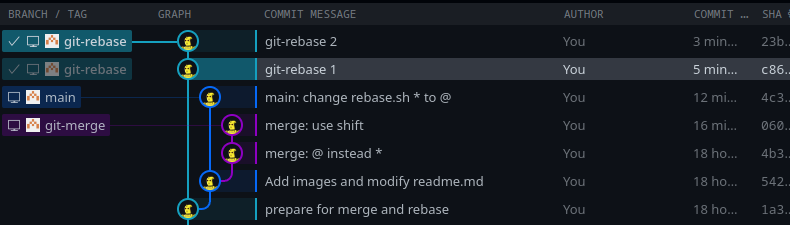

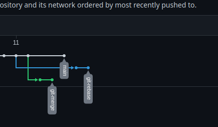

4. Git Merge был выполнен без каких-либо ошибок и конфликтов, в результате график стал выглядеть следующим образом

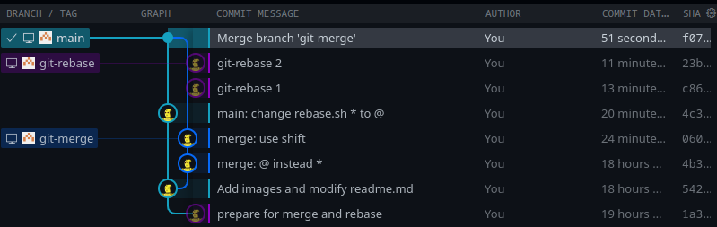

5. Находясь на ветке git-rebase команда git rebase -i main начала выдавать конфликты:

    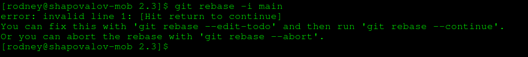

    В данном случае воспользовался командой fixup слева от коммита git-rebase 2 в сообщении.

    Далее был первый конфликт в файле rebase.sh

    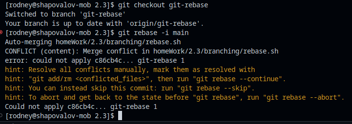

    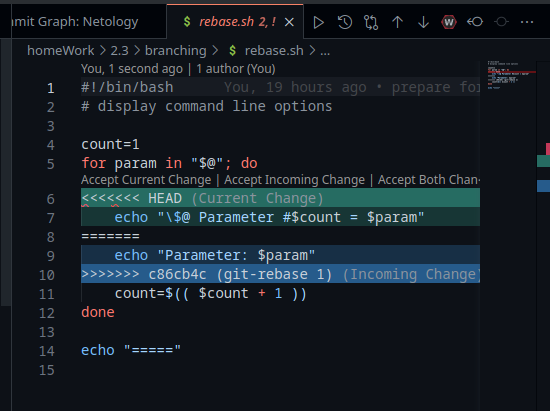

    Оставил выбор за строкой, указанной в задании, остальные были удалены, конфликт разрешен. Однако после git add и  git rebase --continue получаем второй конфликт:

    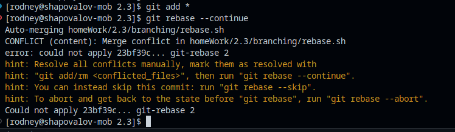

    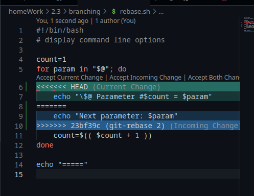

    Оставил выбор за строкой, содержащей "Next parameter",  выполнил git add и git rebase --continue.

    Все конфликты разрешены, операция rebase выполнена после закрытия сообщения с комментарием:

    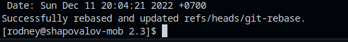

    Команда  git push так же завершилась с ошибкой, был применен флаг --force, после чего команда успешно завершилась.

Итоговый вид после Merge ветки git-rebase в ветку main приобрел полностью линейный вид:

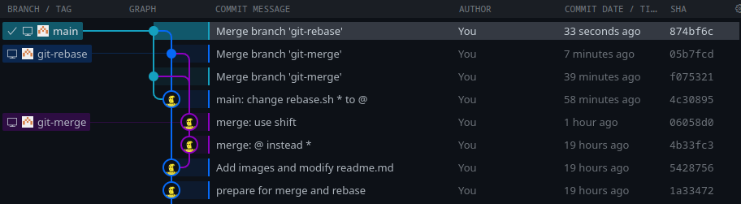