# Выполнение домашнего задания к занятию "2.4. Инструменты Git"

### Выполнил студент группы DevOps-25 Шаповалов Кирилл

> 00. Склонировать репозиторий Терраформ

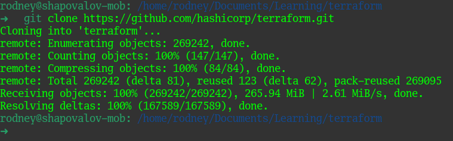

> 01. Найти полный хеш и комментарий коммита, хеш которого начинается на `aefea`.

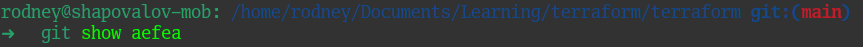
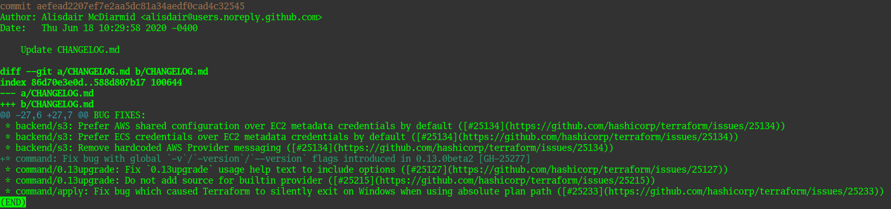

> 02. Какому тегу соответствует коммит `85024d3`?

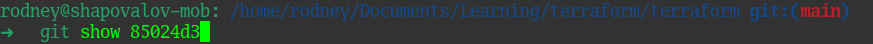
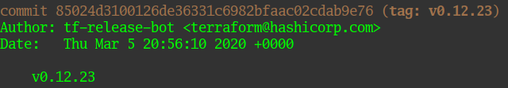

> 03. Сколько родителей у коммита `b8d720`? Напишите их хэши.

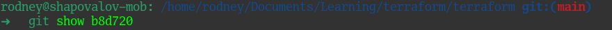
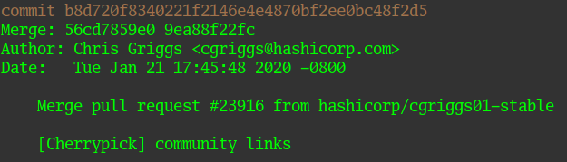

Видим, что это merge коммит с двумя родителями. Краткие хэши указаны на скриншоте выше, посмотрим полную информацию о предках данного коммита командами `git show b8d720^1` и `git show b8d720^2`:

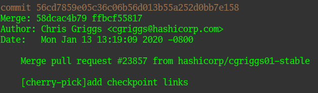
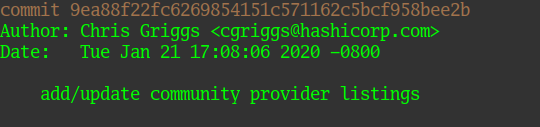

> 04. Перечислите хэши и комментарии всех коммитов, которые были сделаны между тегами `v0.12.23` и `v0.12.24`

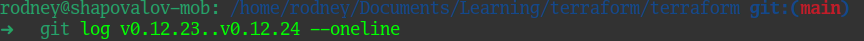
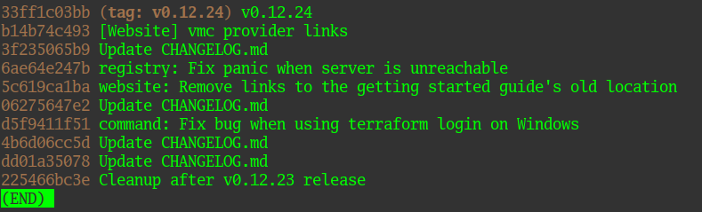

> 05. Найдите коммит, в котором была создана функция `func providerSource`

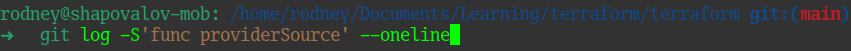
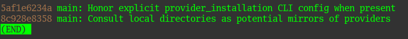

Коммит `8c928e8358` исторически был раньше, значит именно в нем и была создана функция. Убедимся в этом, просмотрев данный коммит:

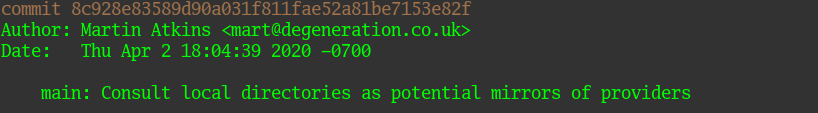
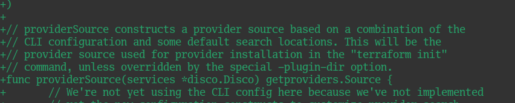

Как видно на последнем скриншоте - именно в этом коммите были добавлены строки, в которых объявлена искомая функция.

> 06. Найдите все коммиты, в которых была изменена функция `globalPluginDirs`

Сначала найдем файл, в котором была объявлена данная функция

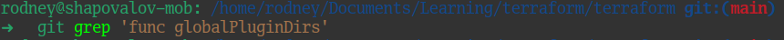
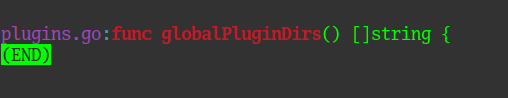

Ну и затем выведем все коммиты, в которых происходило изменение данной функции в данном файле

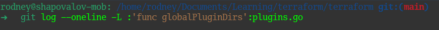

Вывод команды достаточно объемный, приложу часть его

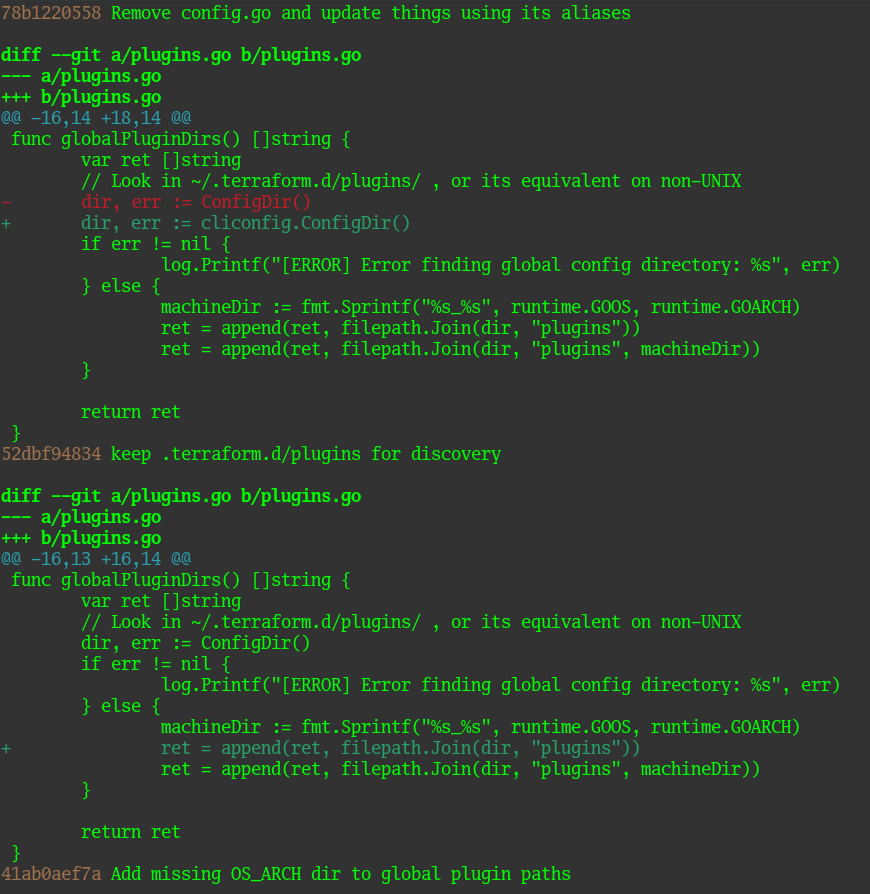

> 07. Кто автор функции `synchronizedWriters`?

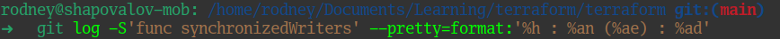
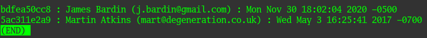

Коммит `5ac311e2a9` был раньше по дате, значит в нем была создана искомая функция и автор ее - Martin Atkins.