# Домашнее задание к занятию "Компьютерные сети. Лекция 1"

### Выполнил студент группы DevOps-25 Шаповалов Кирилл

> 01. Работа c HTTP через телнет.

Не стал делать подключение до stackoverflow, сделал до рандомной страницы, открытой в браузере.

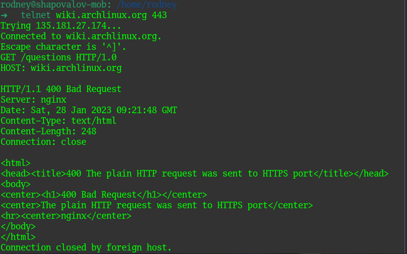

Специально сделал подключение по порту 443. При отправке HTTP запроса получил ответ с кодом `400 - Bad request`. Что в данном случае означает, что на клиенте был сформирован неверный запрос. И это действительно так, на `https` порт был отправлен `http` запрос.

Повторил то же самое на 80 порт.

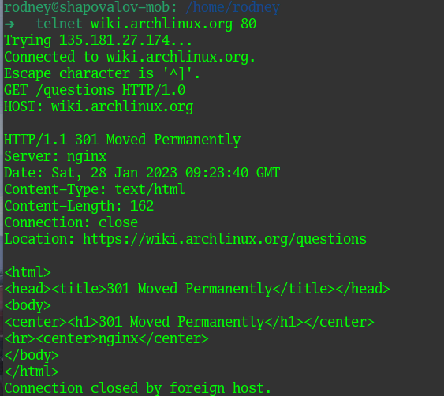

В данном случае веб-сервер nginx прислал ответ `301 - Moved permanently`, что означает, что запрашиваемый ресурс был окончательно перемещен по новому URL, указанному в поле Location - `https://wiki.archlinux.org/questions`.

> 02. Повторите задание 1 в браузере, используя консоль разработчика F12.

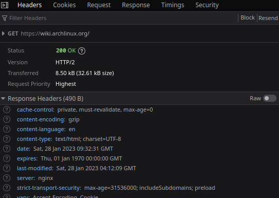

При обращении по адресу `https://wiki.archlinux.org` сервер прислал ответ с кодом `200 - ОК` и в браузере отобразилась страница. Если смотреть по времени ожидания - наиболее долго загружался именно документ с текстом главной страницы - 594мс.

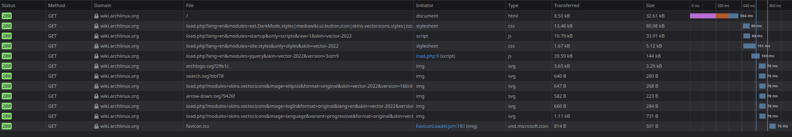

> 03. Какой IP адрес у вас в интернете?

Воспользовался сервисом 2IP для того, чтоб узнать свой адрес. Так как мне предоставлен провайдером белый адрес, а мой внутренний безопасник рекомендует не светить белый адрес в сети, часть адреса замажу в целях безопасности :)

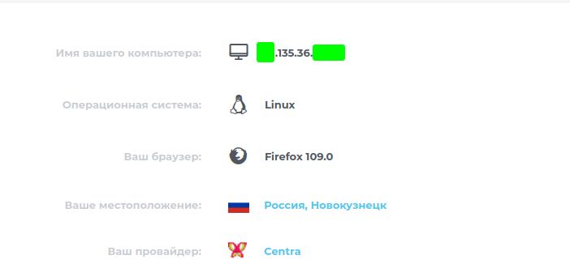

> 04. Какому провайдеру принадлежит ваш IP адрес? Какой автономной системе AS? Воспользуйтесь утилитой `whois`.

В принципе на скрине выше видно, что адрес принадлежит провайдеру Centra. С помощью утилиты whois определим автономную систему.

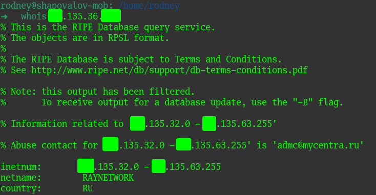

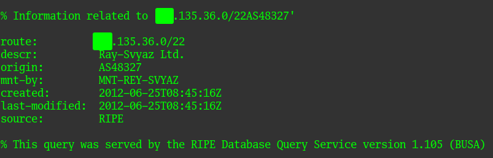

> 05. Через какие сети проходит пакет, отправленный с вашего компьютера на адрес 8.8.8.8? Через какие AS? Воспользуйтесь утилитой `traceroute`.

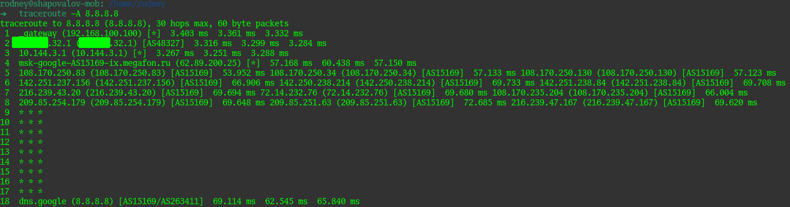

Утилита `traceroute` показала все подсети и автономные системы там, где смогла. Где стоят звездочки - на сетевом оборудовании закрыт `icmp`.

> 06. Повторите задание 5 в утилите `mtr`. На каком участке наибольшая задержка - delay?

Утилиту `mtr` использовал в режиме отчета с 5 циклами выполнения.

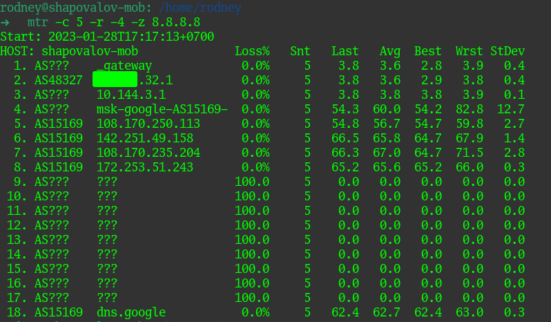

Если судить по средней задержке - максимальная задержка была на 7 хопе.

> 07. Какие DNS сервера отвечают за доменное имя dns.google? Какие A записи? Воспользуйтесь утилитой `dig`.

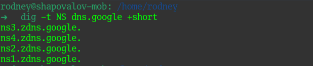

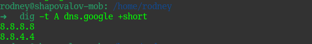

> 08. Проверьте PTR записи для IP адресов из задания 7. Какое доменное имя привязано к IP? Воспользуйтесь утилитой `dig`.

Для адреса 8.8.8.8:

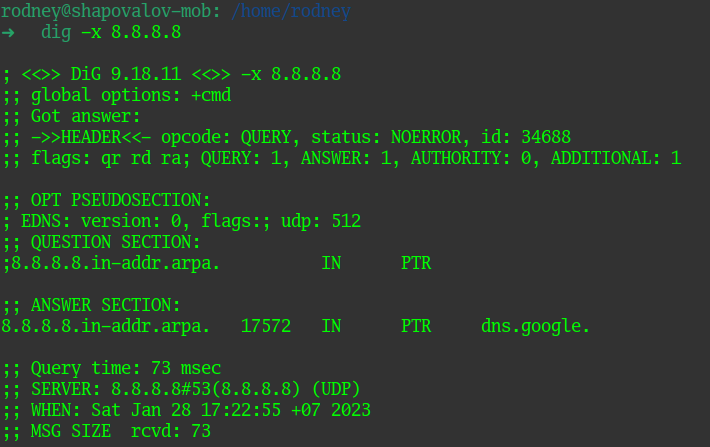

Для адреса 8.8.4.4:

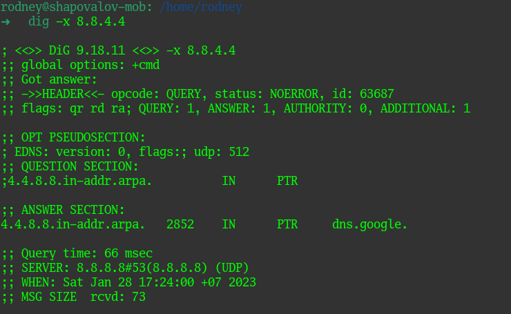

Обоим адресам соответсвует доменное имя dns.google