# Домашнее задание к занятию "Компьютерные сети. Лекция 3"

### Выполнил студент группы DevOps-25 Шаповалов Кирилл

> 01. Подключитесь к публичному маршрутизатору в интернет. Найдите маршрут к вашему публичному IP.

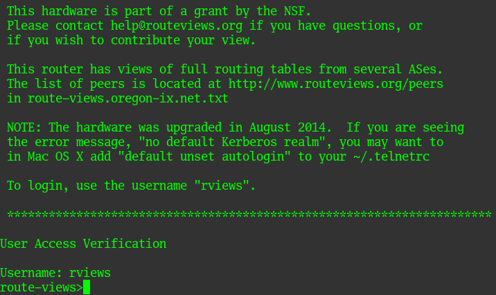

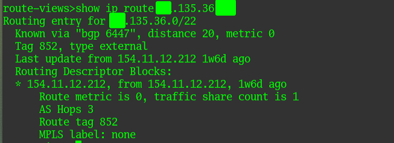

Вывод BGP слишком большой, приведу в пример часть вывода:

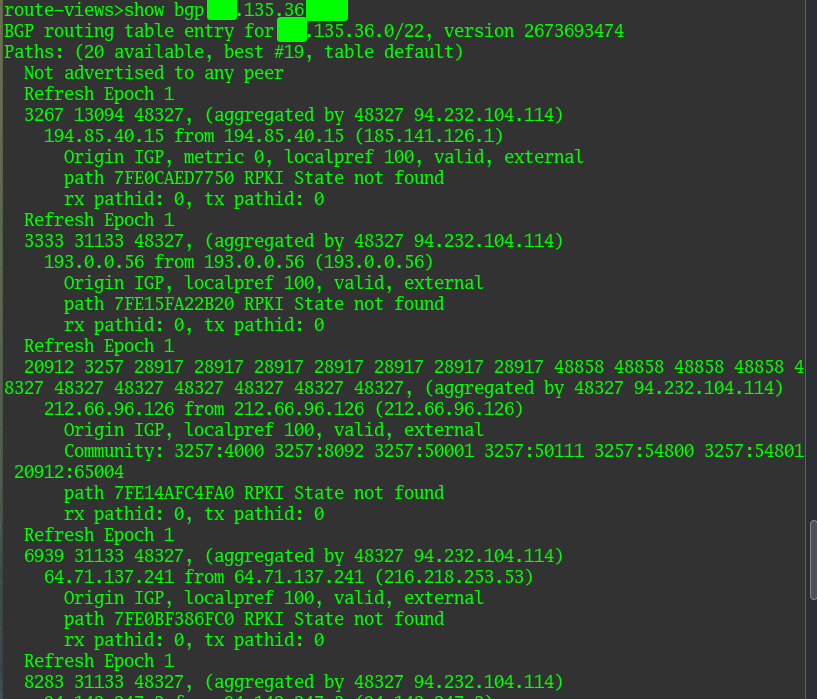

> 02. Создайте dummy0 интерфейс в Ubuntu. Добавьте несколько статических маршрутов. Проверьте таблицу маршрутизации.

В виртуальной машине с Ubuntu 22.04 добавим модуль ядра dummy и создадим интерфейс:

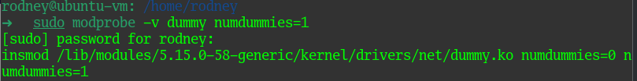

Убедимся, что модуль добавлен и интерфейс появился:

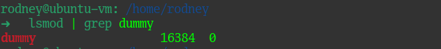

Задействуем интерфейс и назначим ему IP-адрес:

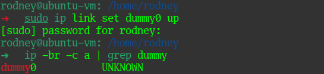

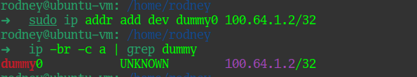

Посмотрим, какие интерфейсы есть в системе и какие заданы маршруты:

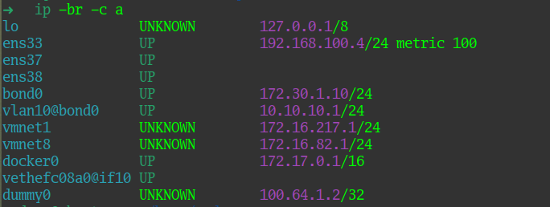

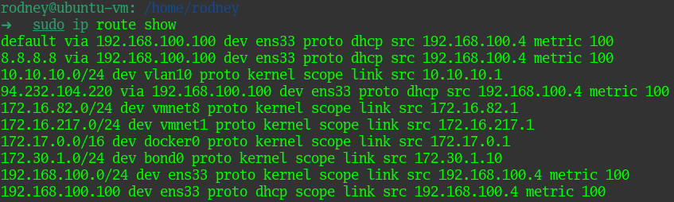

Добавим пару маршрутов через интерфейсы bond0 и виртуальный интерфейс с вланом:

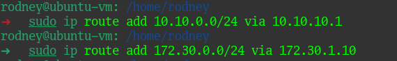

Убедимся, что маршруты добавлены:

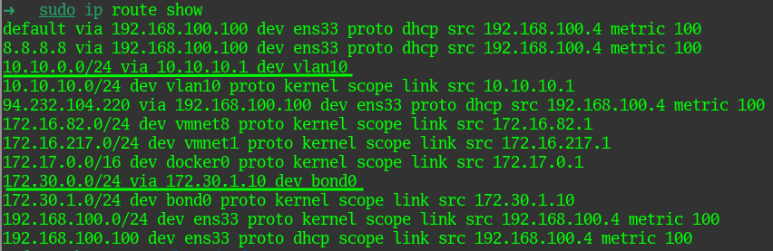

Искомые маршруты подчеркнуты.

После перезагрузки маршруты пропадут, решить данную задачу можно, добавив необходимые машруты в конфигурационный файл `netplan`.

> 03. Проверьте открытые TCP порты в Ubuntu, какие протоколы и приложения используют эти порты? Приведите несколько примеров.

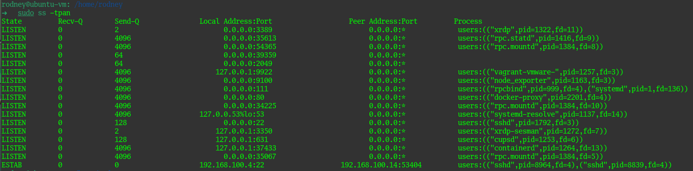

Для примера, на данном скриншоте:

<b>80</b> - порт веб-сервера;

<b>22</b> - порт службы ssh;

<b>3389</b> - порт для RDP подключений.

> 04. Проверьте используемые UDP сокеты в Ubuntu, какие протоколы и приложения используют эти порты?

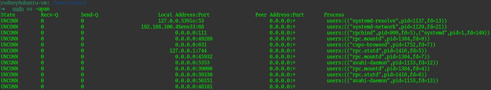

Здесь для примера:

<b>53</b> - порт DNS службы;

<b>631</b> - порт службы печати CUPS.

> 05. Используя diagrams.net, создайте L3 диаграмму вашей домашней сети или любой другой сети, с которой вы работали.

В достаточно упрощенном виде рабочая сеть, с которой сейчас работаю, выглядит следующим образом:

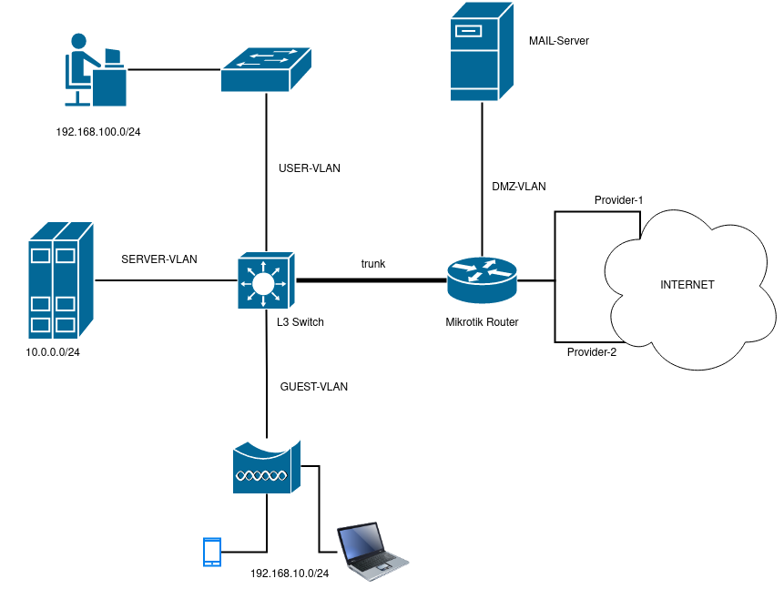