# Домашнее задание к занятию "Элементы безопасности информационных систем"

### Выполнил студент группы DevOps-25 Шаповалов Кирилл


> 01. Установите Bitwarden плагин для браузера. Зарегестрируйтесь и сохраните несколько паролей.


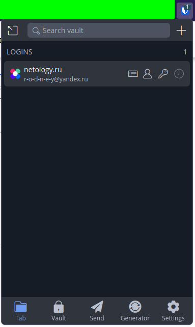

> 02. Установите Google authenticator на мобильный телефон. Настройте вход в Bitwarden акаунт через Google authenticator OTP.

В настройках аккаунта настроена авторизация через менеджер аутентификации.

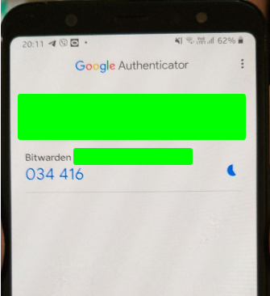

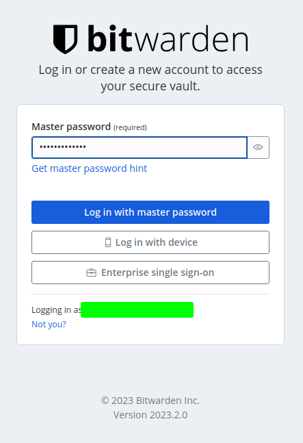

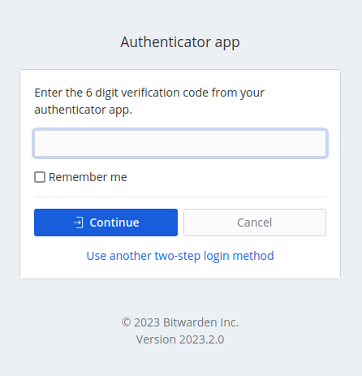

> 03. Установите apache2, сгенерируйте самоподписанный сертификат, настройте тестовый сайт для работы по HTTPS.

На сервере установлен Apache2 командой `sudo apt install -y apache2`

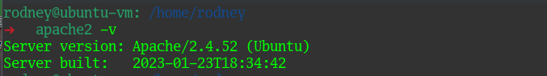

Настроен автозапуск сервиса и запущен сервис:

```
sudo systemctl enable apache2.service
sudo systemctl start apache2.service
```

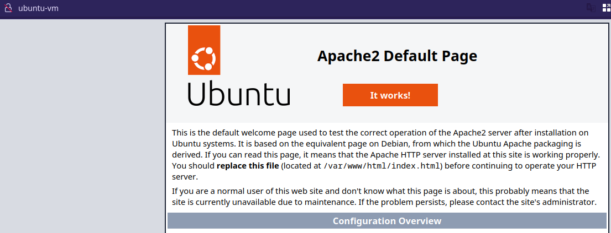

Стартовая страница сервиса говорит о том, что все успешно работает.

Добавим поддержку модуля SSL.

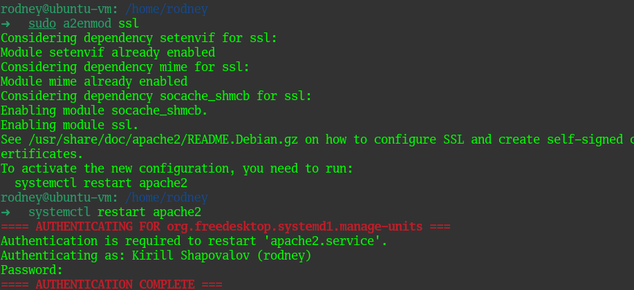

Сгенерировал самоподписанный сертификат и ключ:

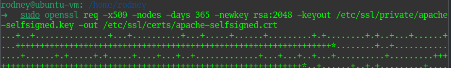

Конфигурацию файла Apache2 взял с https://ssl-config.mozilla.org/

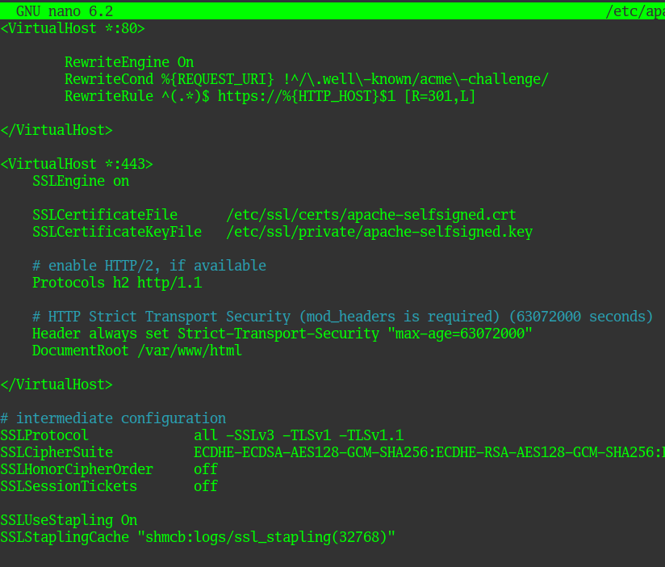

Для запуска сервиса с данным конфигурационным файлом потребовалось доустановить модули `rewrite и headers`. После этого сервис успешно запустился.

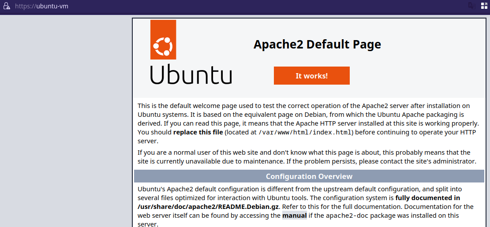

Как видно, теперь дефолтная страница Apache2 открывается по протоколу `https`. Посмотрим информацию о сертификате:

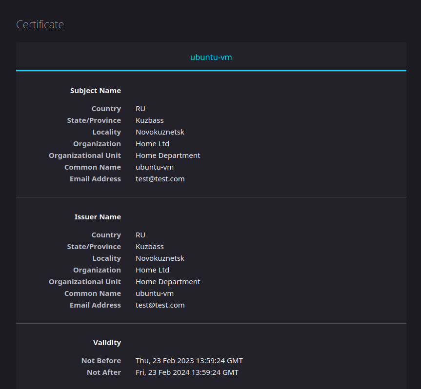

Все работает верно. Страница открывается с использованием сгенерированного ранее сертификата.

> 04. Проверьте на TLS уязвимости произвольный сайт в интернете (кроме сайтов МВД, ФСБ, МинОбр, НацБанк, РосКосмос, РосАтом, РосНАНО и любых госкомпаний, объектов КИИ, ВПК ... и тому подобное).

Склонировал с гит репозитория необходимый скрипт для проверки. Проверял известный всем поисковик yahoo.com:

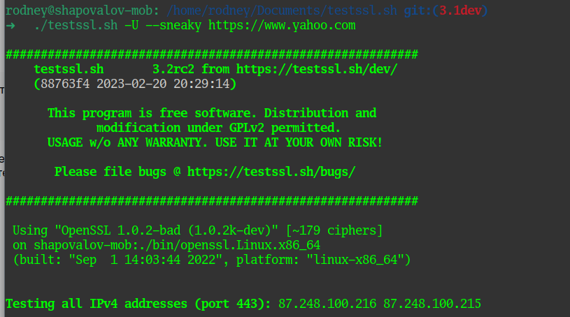

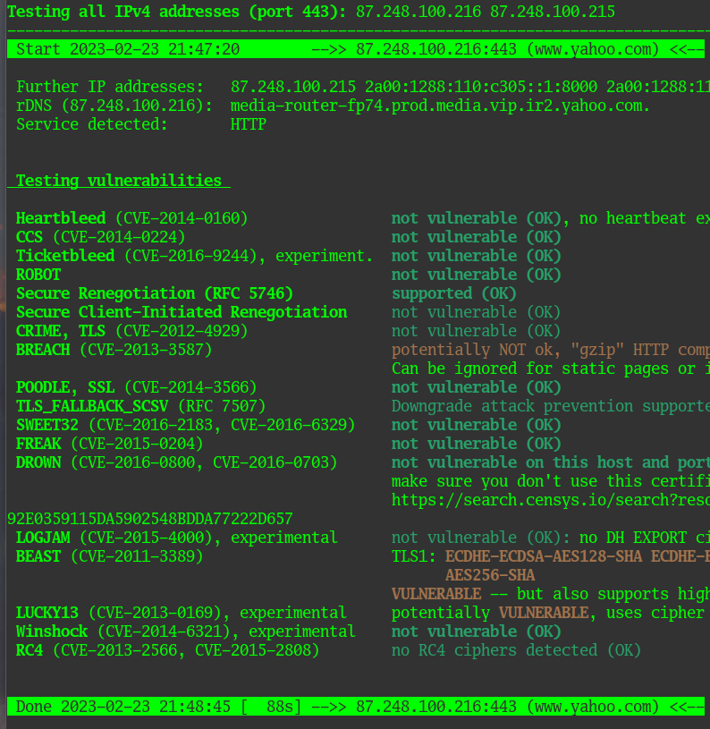

В принципе, как видно из скриншотов - все проверки пройдены успешно и уязвимости закрыты.

> 05. Установите на Ubuntu ssh сервер, сгенерируйте новый приватный ключ. Скопируйте свой публичный ключ на другой сервер. Подключитесь к серверу по SSH-ключу.

На рабочем ноутбуке установлена ОС Arch Linux, установлен пакет openSSL, с помощью которого и были сгенерированы ssh ключи, с которыми я подключаюсь к виртуальным машинам.

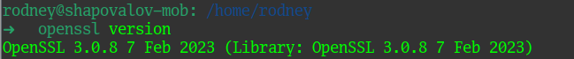

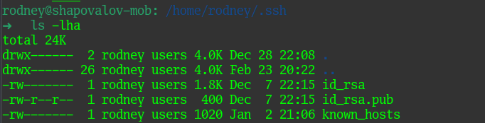

Все машины с ключами прописаны в файле known_hosts:

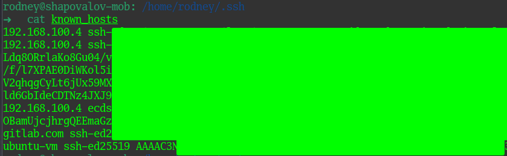

Проверим подключение:


> 06. Переименуйте файлы ключей из задания 5. Настройте файл конфигурации SSH клиента, так чтобы вход на удаленный сервер осуществлялся по имени сервера.

В моем случае благодаря содержимому файла `known_hosts` подключение к виртуальной машине и так осуществляется по имени. Если бы ключ был сгенерирован для IP-адреса, то для того, чтобы к машине можно было подключиться по имени - нужно было бы создать файл `~/.ssh/config` с примерно таким содержанием:

```
Host ubuntu-vm
  HostName 192.168.100.4
  IdentityFile ~/.ssh/id_rsa
  User rodney 
```

> 07. Соберите дамп трафика утилитой tcpdump в формате pcap, 100 пакетов. Откройте файл pcap в Wireshark.

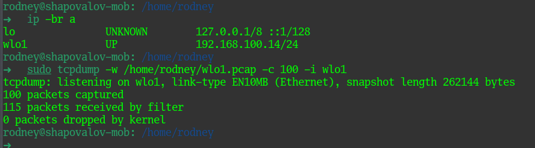

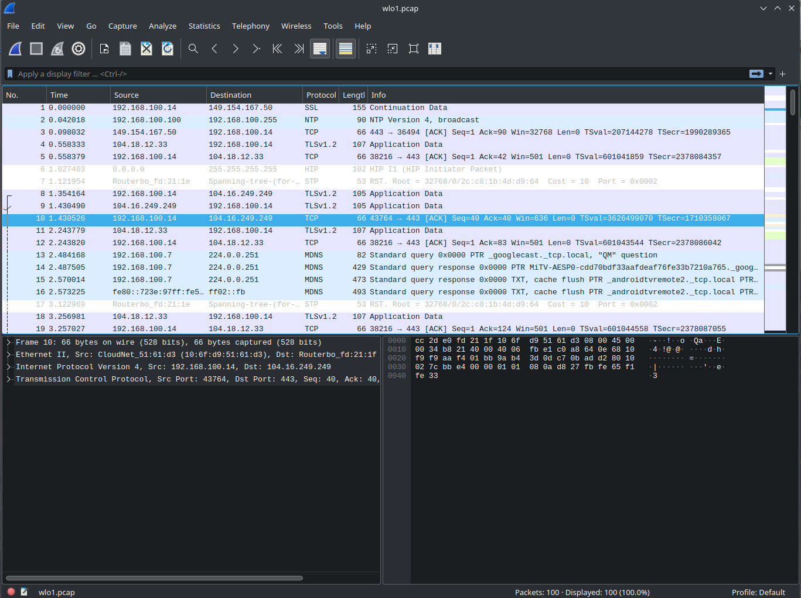