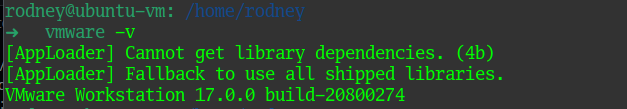
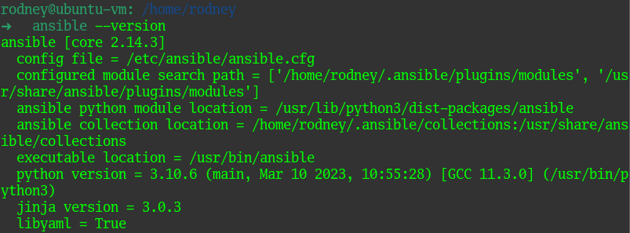
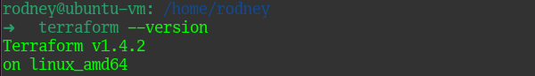
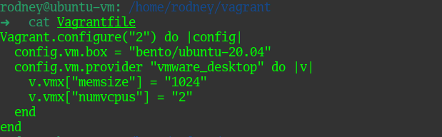
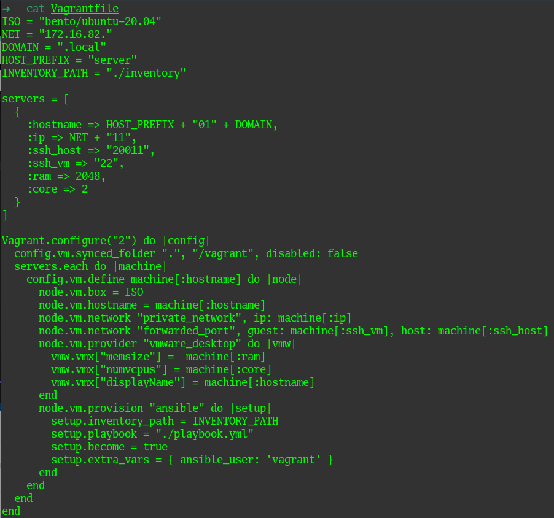
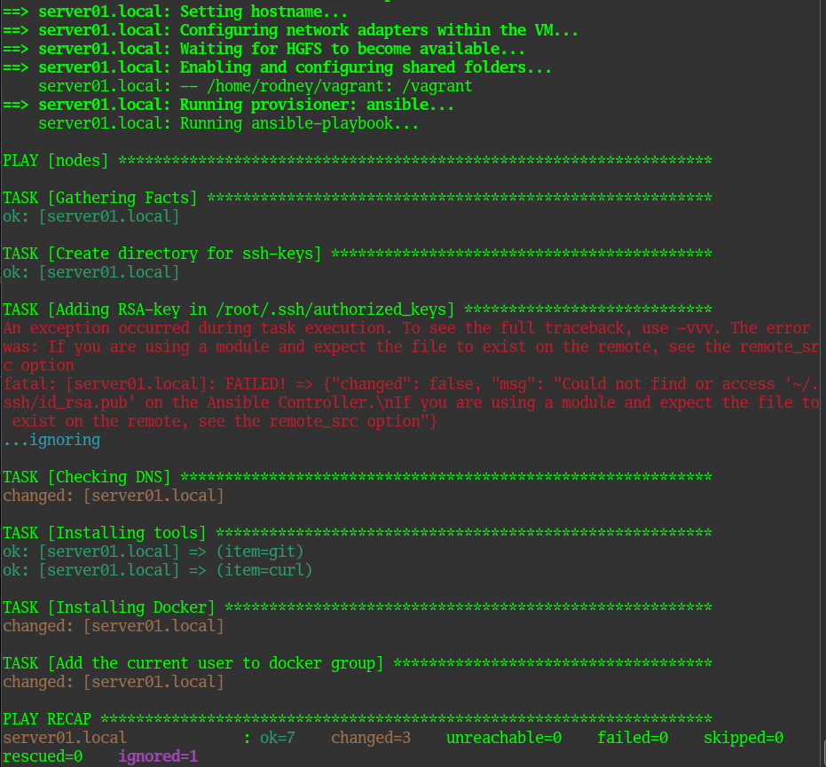
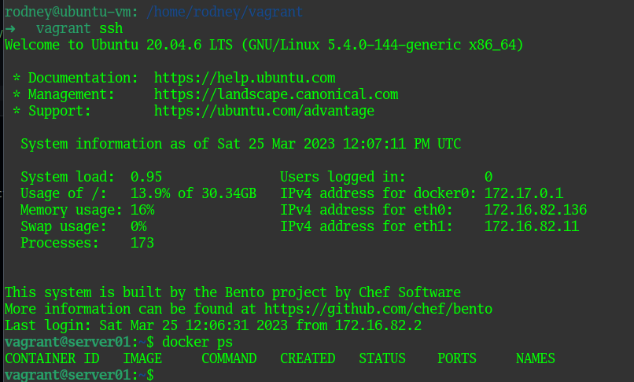

# Домашнее задание к занятию 2. «Применение принципов IaaC в работе с виртуальными машинами»

### Выполнил студент группы DevOps-25 Шаповалов Кирилл

> 01. Задача 1. Опишите основные преимущества применения на практике IaaC-паттернов. Какой из принципов IaaC является основополагающим?

Основными преимуществами применения на практике паттернов "Инфраструктуры как код" являются (опишу их так, как если бы каждое преимущество вытекало из предыдущего, на мой взгляд):

1. Создание идентичных конфигураций. Методология "Инфраструктура как код" позволяет создавать каждый раз идентичные среды и конфигураций без отличий друг от друга за минимальное количество времени.
2. Благодаря быстрому созданию одинаковых конфигураций - ускоряются процессы разработки и тестирования. К примеру, если в процессе тестирования упала тестовая среда - благодаря применению IaaC ее можно пересоздать заново в очень короткие сроки и возобновить работу на проектом.
3. Минизируется количество ошибок в процессе разработки и тестирования. Одинаковая инфраструктура дает возможность вести процесс разработки, тестирования и выкатки в прод в абсолютно идентичных условиях, а это значительно сокращает вероятность появления ошибок в прод среде, если их не было в среде разработки или тестирования. 
4. Из п.2 и п.3 можно вывести четвертое преимущество - так как сокращаются сроки разработки, тестирования и дебага, сокращается и время доставки приложения до конечного пользователя и заказчика.

Основополагающим же принципом IaaC является Идемпотентность. То самое создание каждый раз одинаковых конфигураций при любом количестве выполнений. То есть, результат выполнения будет всегда идентичен результату выполнения на предыдущей итерации.

> 02. Задача 2. Чем Ansible выгодно отличается от других систем управление конфигурациями? Какой, на ваш взгляд, метод работы систем конфигурации более надёжный — push или pull?

Ansible очень выгодно отличается от многих других систем управления конфигурациями, во-первых, тем, что он написан и использует язык Python, который сам по себе является языком с наименьшим порогом вхождения. Во-вторых, Ansible использует метод `push`, то есть на управляемых нодах не требуется установка никаких агентов, достаточно чтоб был установлен Python (в большинстве Linux-систем установлен по умолчанию). В-третьих, Ansible использует для подключения к управляемым нодам SSH, что значительно упрощает и ускоряет работу данного инструмента.

На мой взгляд, удобней, конечно, метод `push`, но надежней - `pull`. Например, сервер резервного копирования должен сам собирать в холодное хранилище последние актуальные резервные копии, а к самому серверу должны быть закрыты все порты, включая и 22 тоже. Также, если в руки к вредителю попадут ssh-ключи, он сможет получить доступ ко всем управляемым нодам. Потому выбор метода на практике очень сильно зависит от условий задачи.

> 03. Задача 3. Установите на личный компьютер Vagrant, VirtualBox, Terraform, Ansible. Приложите вывод команд установленных версий каждой из программ, оформленный в Markdown.

В заданиях из блока 1 мы уже устанавливали Vagrant и VirtualBox, однако у меня уже был установлен гипервизор VMWare Workstation и все упражнения с Vagrant я выполнял на установленном у меня гипервизоре, естественно установив соответсвую плагин для Vagrant - Vagrant VMWare Desktop.

Позднее обновил Vagrant до последней актуальной версии, но скрин уже был сделан на старой версии, а машину с Ubuntu уже погасил)))

> 04. Задача 4. Воспроизведите практическую часть лекции самостоятельно.

Опять же, машину с помощью Vagrant мы создавали в заданиях первого блока. Тогда мой Vagrantfile под VMWare выглядел следующим образом:

С учетом всех изменений, воспроизведенных на практике, привел Vagrantfile к следующему виду:

Листинг плейбука и конфигурационных файлов Ansible приводить не буду, они все есть в практической части лекции. С помощью команды `vagrant up` запустил создание виртуальной машины. Часть листинга создания машины на скриншоте ниже:

Видно, что у Ansible возникла проблема с получением доступов к файлу `~/.ssh/id_rsa.pub`, что однако не помешало выполнить все оставшиеся таски и завершить сценарий.

Ну и итоговый скрин созданной машины:

