# Домашнее задание к занятию 3. «MySQL»

### Выполнил студент группы DevOps-25 Шаповалов Кирилл


> 01. Задача 1. Используя Docker, поднимите инстанс MySQL (версию 8). Данные БД сохраните в volume.

```
Изучите бэкап БД и восстановитесь из него.
Перейдите в управляющую консоль mysql внутри контейнера.
Используя команду \h, получите список управляющих команд.
Найдите команду для выдачи статуса БД и приведите в ответе из её вывода версию сервера БД.
Подключитесь к восстановленной БД и получите список таблиц из этой БД.
Приведите в ответе количество записей с price > 300.
В следующих заданиях мы будем продолжать работу с этим контейнером.
```

Бэкап БД изучен, основное, что нам необходимо понять сразу же - то, что база данных должна называться test_db.

Традиционно создаем `docker-compose` файл (сам файл как всегда в папке с ДЗ, листинг ниже):

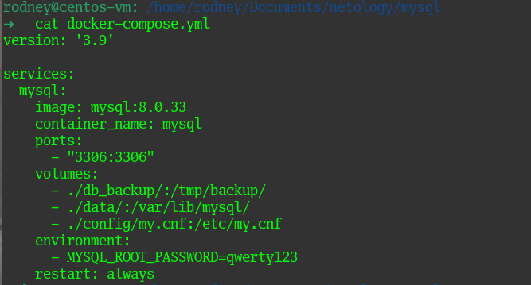

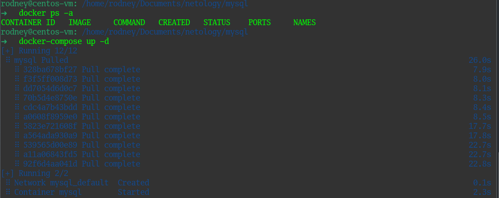

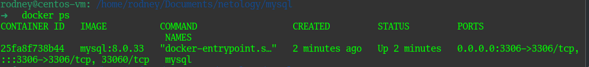

Контейнер с MySQL версии 8.0.33 запущен, самое время подключиться к нему и создать необходимую БД, чтобы затем восстановиться в нее. Используем команду `docker exec -it container_id /bin/bash`, далее по скринам:


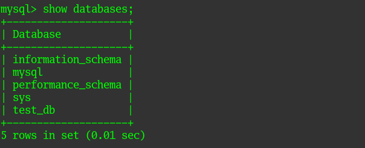

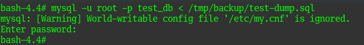

Подключаемся к mysql серверу и производим дальнейшие манипуляции.

<b>Используя команду \h, получите список управляющих команд.</b>

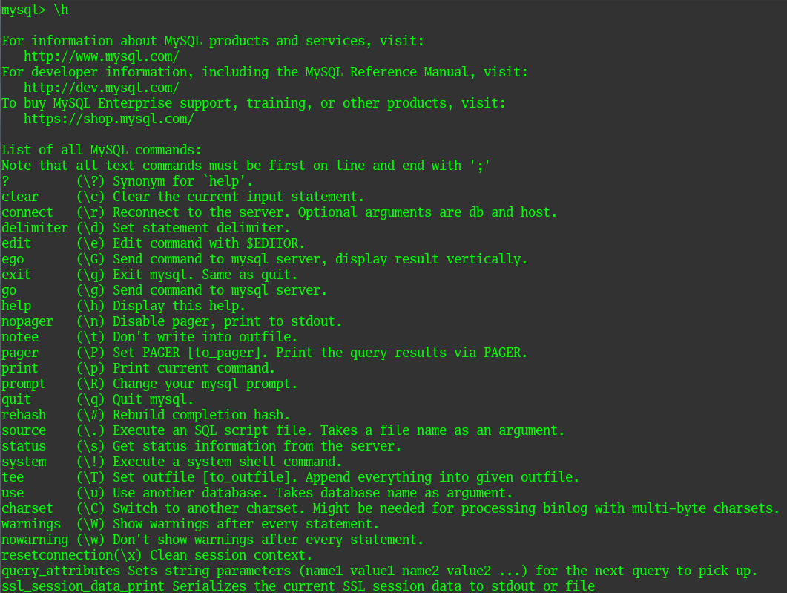

<b>Найдите команду для выдачи статуса БД и приведите в ответе из её вывода версию сервера БД</b>

Нужная нам команда выглядит так `\s`

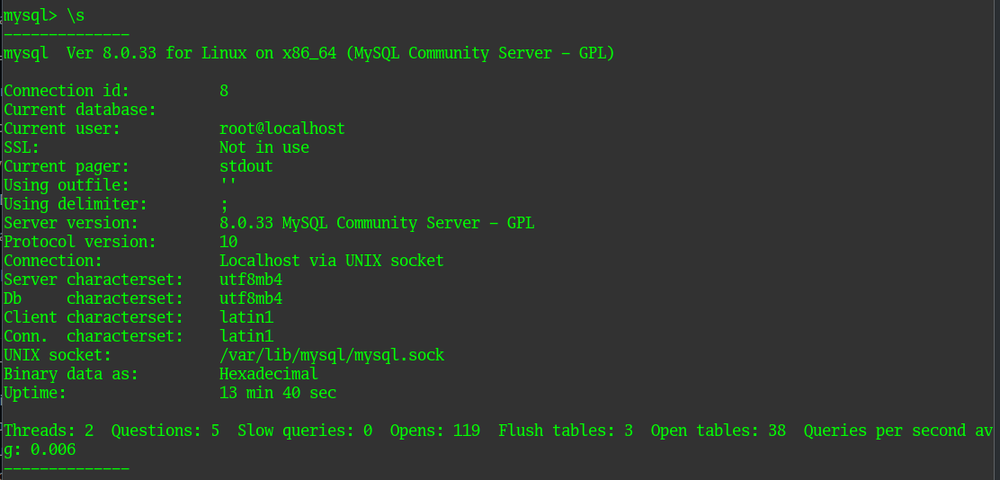

<b>Подключитесь к восстановленной БД и получите список таблиц из этой БД.</b>

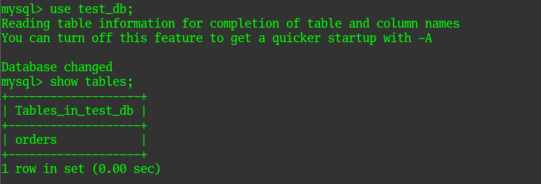

<b>Приведите в ответе количество записей с price > 300.</b>

Посмотрим на поля в нашей таблице `orders`:

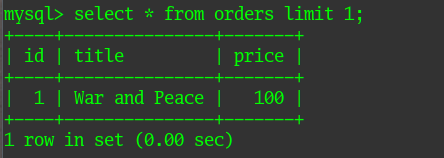

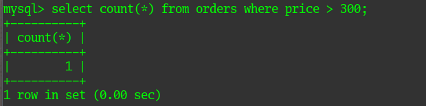

Как видно, в таблице одна запись, где цена больше 300, проверим и убедимся что это так:

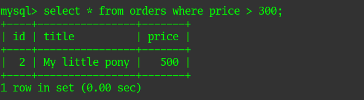


> 02. Задача 2. Создайте пользователя test в БД c паролем test-pass.

```
Нужно использовать:
- плагин авторизации mysql_native_password
- срок истечения пароля — 180 дней
- количество попыток авторизации — 3
- максимальное количество запросов в час — 100
- аттрибуты пользователя:
    - Фамилия "Pretty"
    - Имя "James".

Предоставьте привелегии пользователю test на операции SELECT базы test_db.
```

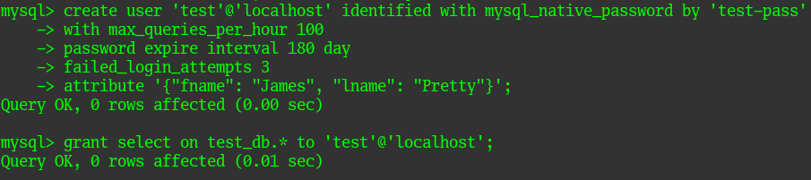

<b>Используя таблицу INFORMATION_SCHEMA.USER_ATTRIBUTES, получите данные по пользователю test и приведите в ответе к задаче.</b>

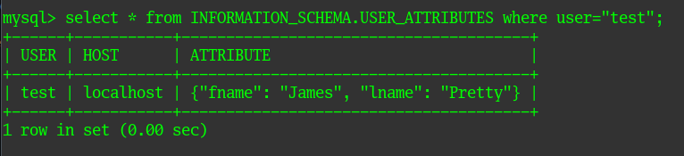


> 03. Задача 3. Установите профилирование SET profiling = 1. Изучите вывод профилирования команд SHOW PROFILES;. Исследуйте, какой engine используется в таблице БД test_db и приведите в ответе. Измените engine и приведите время выполнения и запрос на изменения из профайлера в ответе (на MyISAM, на InnoDB).


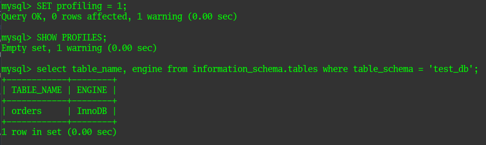

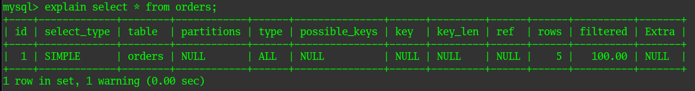

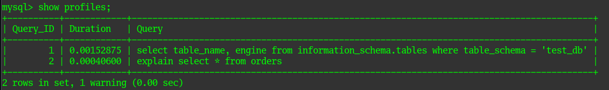

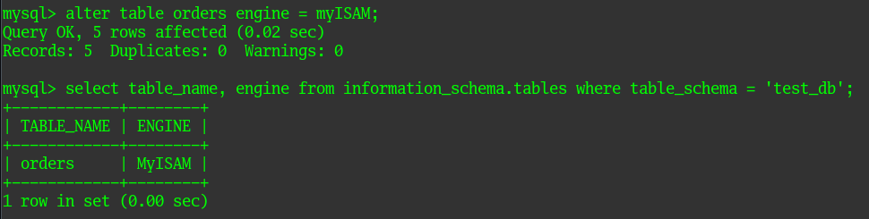

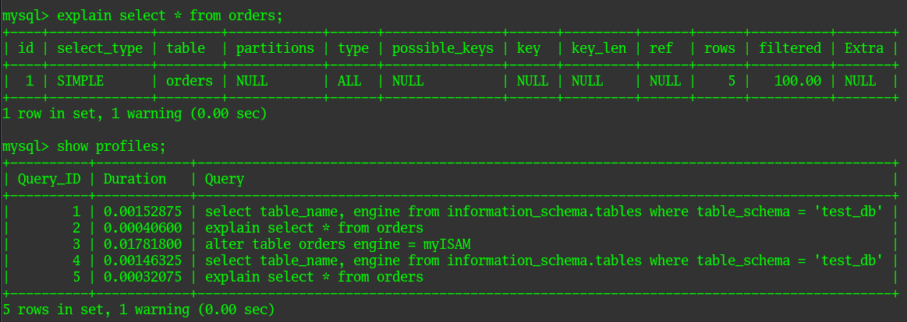

Как видно даже на незначительном наборе данных, MyISAM быстрее отрабатывает на чтение данных (строки 4 и 5 против 1 и 2), нежели InnoDB, потому на больших системах разумно строить распределенную структуру в виде Мастер-сервера и Слэйв-сервера, на мастере например оставлять InnoDB и пускать только запись, а на реплике на слэйве - использовать MyISAM и оставлять только чтение.


> 04. Задача 4. Изучите файл my.cnf в директории /etc/mysql. Измените его согласно ТЗ (движок InnoDB).

```
ТЗ:
- скорость IO важнее сохранности данных;
- нужна компрессия таблиц для экономии места на диске;
- размер буффера с незакомиченными транзакциями 1 Мб;
- буффер кеширования 30% от ОЗУ;
- размер файла логов операций 100 Мб.
```
Дефолтный файл выглядит примерно следующим образом:

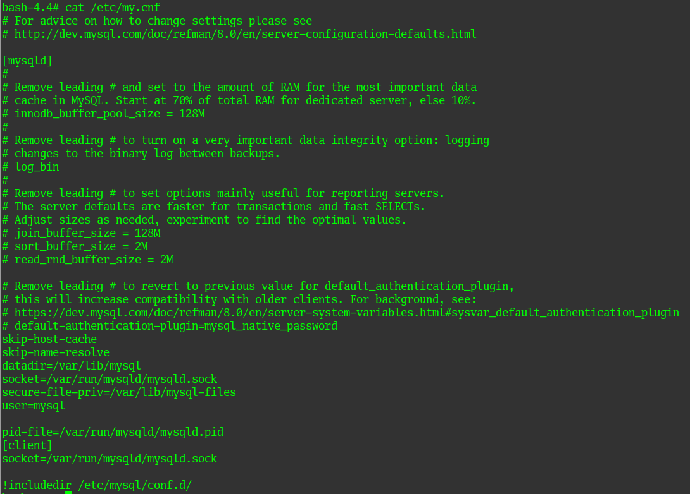

И находится он по пути `/etc/my.cnf`

Изменим его в соответствии с условиями ТЗ:

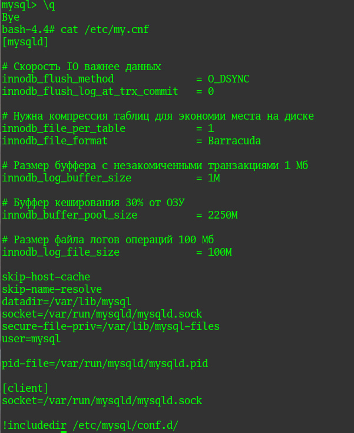

На размерах буффера не стоит останавливаться, там все понятно, а вот с первыми двумя пунктами нужно остановиться подробней:

- <b>innodb_flush_method</b> - определяет, каким методом данные будут сбрасываться на диск, данный параметр играет очень важную роль в системе ввода-вывода. В основном используется одно из двух значений - O_DIRECT или O_DSYNC. В нашем случае нужно использовать значение O_DSYNC, так как он жертвует согласованностью в обмен на скорость.
- <b>innodb_flush_log_at_trx_commit</b> - может быть установлено значение 0, 1 или 2. Выбирается метод сброса данных на диск. В нашем случае нужен параметр 0 или можно поставить 2, но при нуле наивысшая производительность, однако и риск потерять данные при неожиданной остановке инстанса - значительно выше.
- <b>innodb_file_per_table</b> - значение 1 позволяет хранить данные в нескольких файлах. Если используется один файл (значение 0) - рано или поздно он начинает разрастаться занимая большее место на диске.
- <b>innodb_file_format</b> - как говорит мануал - при использовании значения 1 в предыдущем параметре, лучше всего подходит формат файлов Barracuda (по умолчанию MySQL использует формат Antilope).