# Домашнее задание к занятию 4. «PostgreSQL»

### Выполнил студент группы DevOps-25 Шаповалов Кирилл


> 01. Задача 1. Используя Docker, поднимите инстанс PostgreSQL (версию 13). Данные БД сохраните в volume. Подключитесь к БД PostgreSQL, используя `psql`. Воспользуйтесь командой `\?` для вывода подсказки по имеющимся в psql управляющим командам.

Воспользовался `docker-compose` файлом, созданном пару домашек назад:

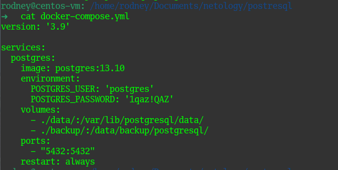

Запускаем и проверяем:

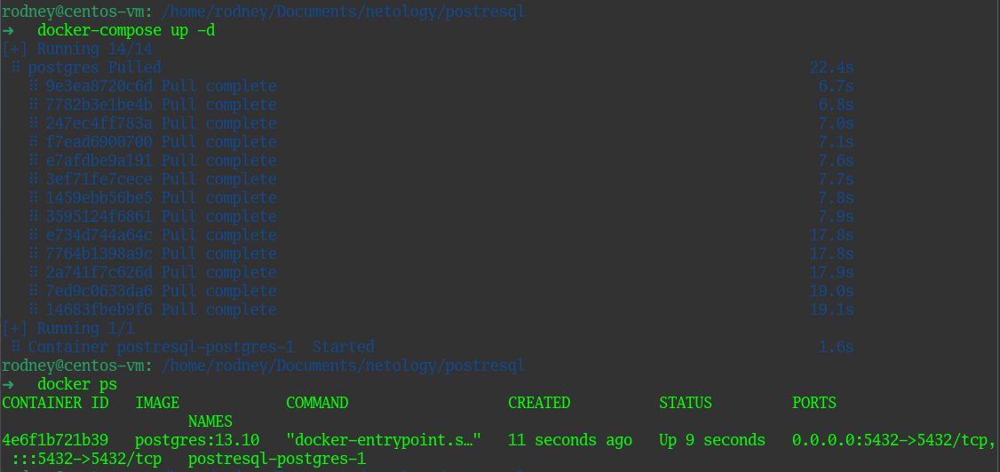

Команда `\?` выведет справку по огромной куче управляющих команд, найдем среди них нужные нам по заданию:

* <b>вывода списка БД:</b>
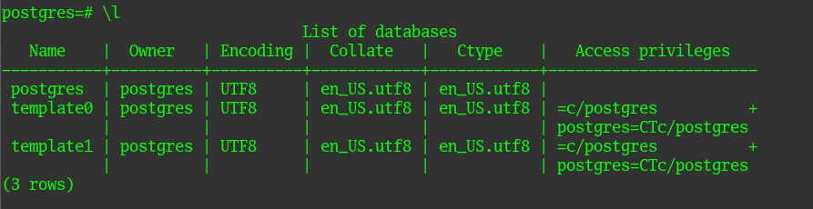
* <b>подключения к БД:</b>
  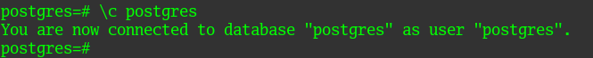
* <b>вывода списка таблиц:</b>
  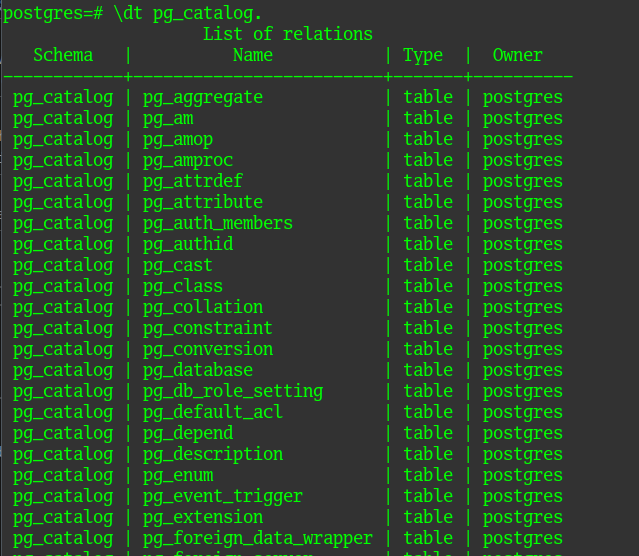
  В любой пользовательской БД достаточно будет команды `\d` чтобы просмотреть список таблиц, далее в 3-м задании мы это увидим.
* <b>вывода описания содержимого таблиц:</b>
  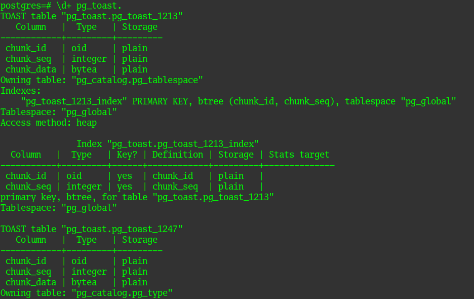
* <b>выхода из psql:</b>
  
  чтобы выйти из `psql` можно ввести `\q` или просто `exit`.


> 02. Задача 2. Используя psql, создайте БД test_database. Изучите бэкап БД.

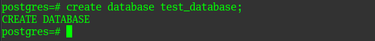

Бэкап БД изучил :)

<b>Восстановите бэкап БД в `test_database`:</b>

Благодаря нашему разделу с бэкапами, примонтированному внутрь контейнера, дамп базы доступен напрямую в контейнере, восстановим его в созданную БД

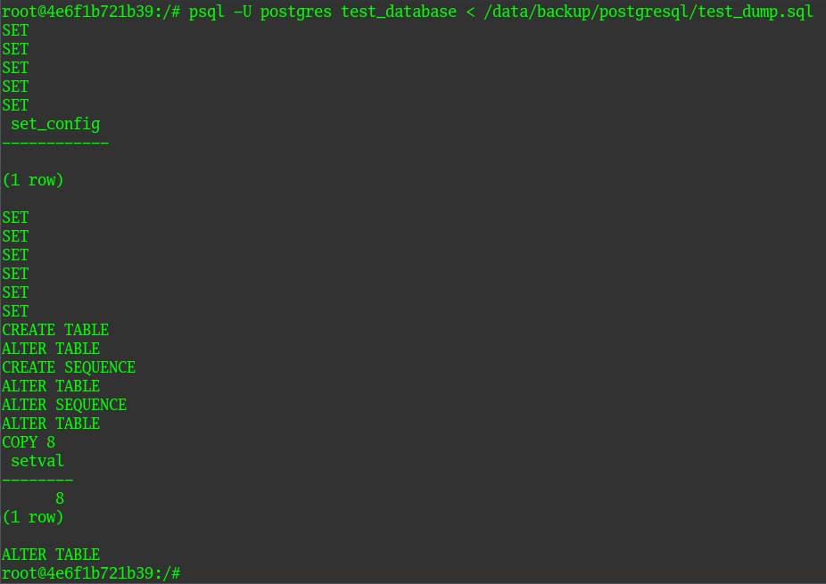

<b>Подключитесь к восстановленной БД и проведите операцию ANALYZE для сбора статистики по таблице.</b>

Зашел в контейнер командой `docker exec -it container_id /bin/bash`

Перешел в управляющую консоль PostreSQL командой `psql -U postgres`

Проверяю наличие базы данных в списке и подключаюсь к ней:

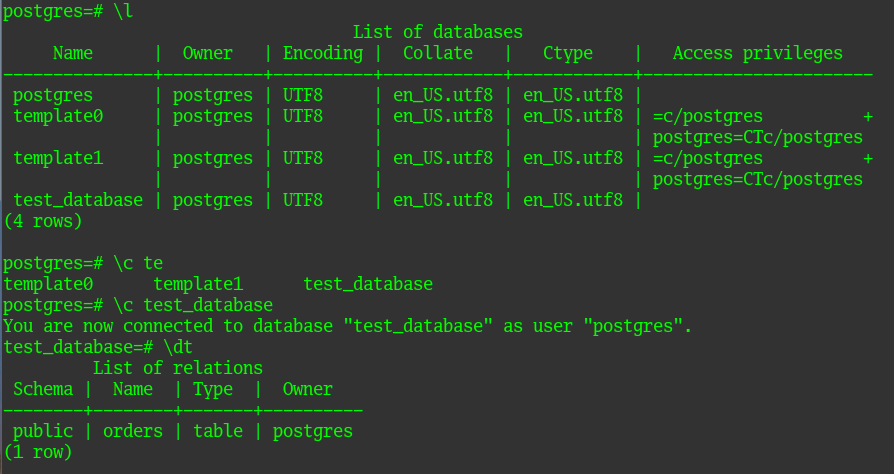

Результат работы операции ANALYZE:

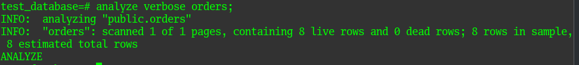

<b>Используя таблицу pg_stats, найдите столбец таблицы `orders` с наибольшим средним значением размера элементов в байтах.</b>

Знаю, что есть несколько способов достичь искомый результат, включая построение сложных запросов с подзапросами, я пошел более простым путем:

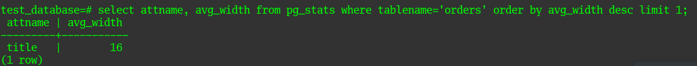


> 03. Задача 3. Архитектор и администратор БД выяснили, что ваша таблица orders разрослась до невиданных размеров и поиск по ней занимает долгое время. Вам как успешному выпускнику курсов DevOps в Нетологии предложили провести разбиение таблицы на 2: шардировать на orders_1 - price>499 и orders_2 - price<=499.

Тут я немного накосячил, не прочитал внимательно задание дальше, и сделал шардирование не в виде транзакции, покажу как сделал я, потом опишу это же в виде транзакции.

Создаем наши подтаблицы orders_1, orders_2 с проверкой по диапазону цены:

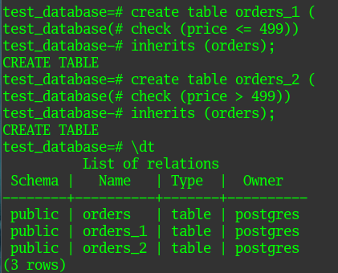

Пробуем заполнить наши таблицы значениями из таблицы `orders`:

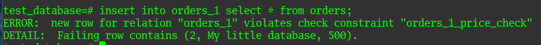

Возникает логичная ошибка, ведь поле `price` у нас теперь ограничено и запихнуть туда все данные уже не получится. Ограничим вставку:

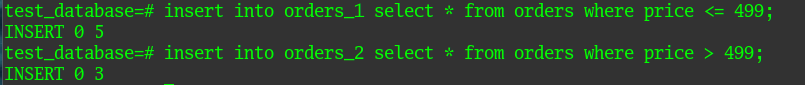

Проверяем:

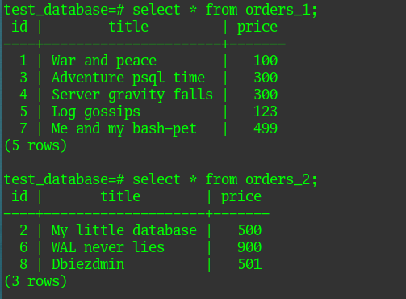

Однако, из-за того, что мы заполняли вручную подтаблицы значениями из родительской таблицы, у нас в родительской таблице появились дубли значений:

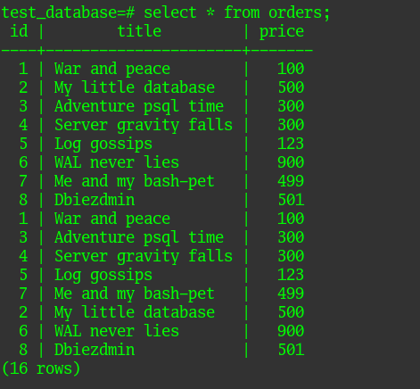

Как решить данную проблему в принципе рассмотрено в 4 задаче этой домашки :)

Как можно было бы сделать это в виде транзакции:

```
start transaction;
create table orders_1 (check(price <= 499)) inherits (orders);
create table orders_2 (check(price > 499)) inherits (orders);
insert into orders_1 select * from orders where price <= 499;
insert into orders_2 select * from orders where price > 499;
commit;
```

Как избежать ручного шардирования на этапе разработки?

Во-первых, сразу создавать подтаблицы orders_1 и orders_2 с заданными ограничениями.

Во-вторых, при создании родительской таблицы указать `partition by range (price)`, чтобы выглядело это вот так:

```
create table public.orders (
    id integer NOT NULL,
    title character varying(80) NOT NULL,
    price integer DEFAULT 0
)
partition by range (price);
```

> 04. Задача 4. Используя утилиту pg_dump, создайте бекап БД test_database. Как бы вы доработали бэкап-файл, чтобы добавить уникальность значения столбца title для таблиц test_database?

Создаю дамп БД на примонтированный раздел в контейнере:

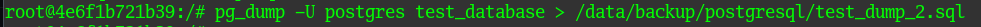

Добавить ограничение уникальности к нашей таблице можно следующим образом.

Берем исходную таблицу:

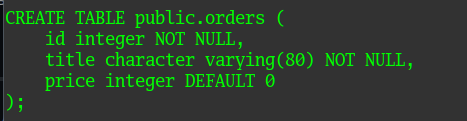

И для колонки `title` добавляем в конце опцию `UNIQUE`.