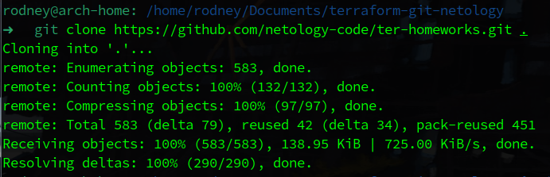
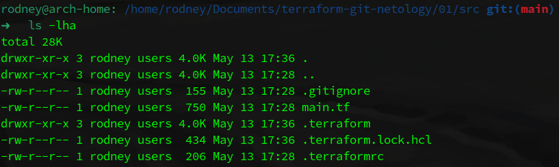
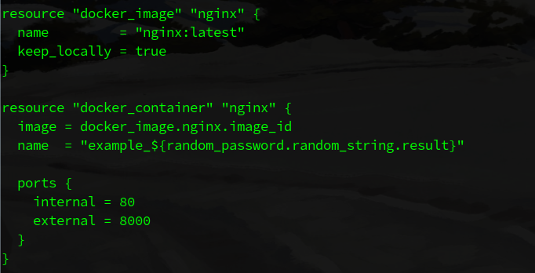

# Домашнее задание к занятию «Введение в Terraform»

### Выполнил студент группы DevOps-25 Шаповалов Кирилл

Пройдем по чек-листу к заданию:

1. Скачайте и установите актуальную версию terraform (не менее 1.3.7). Приложите скриншот вывода команды `terraform --version`.

    

2. Скачайте на свой ПК данный git репозиторий. Исходный код для выполнения задания расположен в директории <b>01/src</b>.

    <b>Клонируем репозиторий:</b>

    

3. Убедитесь, что в вашей ОС установлен docker.

    <b>Убеждаемся, что docker действительно установлен:</b>

    

Чек-лист к заданиям выполнен, самое время перейти к выполнению заданий!

> <b>Задание 1. Знакомство с Terraform</b>

    1. Перейдите в каталог src. Скачайте все необходимые зависимости, использованные в проекте.

Все зависимости скачаются при выполнении команды `terraform init`. Выполняем:

Убеждаемся, что нужные дополнительные файлы появились в каталоге:

    2. Изучите файл .gitignore. В каком terraform файле согласно этому .gitignore допустимо сохранить личную, секретную информацию?

Изучим `.gitignore`:

Согласно содержимому файла `.gitignore` - личную и секретную информацию допустимо хранить в файле `personal.auto.tfvars`

    3. Выполните код проекта. Найдите в State-файле секретное содержимое созданного ресурса random_password. Пришлите его в качестве ответа.

Выполнить код можно командой `terraform apply`:

Рандомный пароль можно найти в State-файле в следующей строке:

    4. Раскомментируйте блок кода, примерно расположенный на строчках 29-42 файла main.tf. Выполните команду `terraform validate`. Объясните в чем заключаются намеренно допущенные ошибки? Исправьте их.

Закомментирован был данный код:

Убрал комментарий, выполнил команду `terraform validate`:

Проверка валидности кода сообщает нам о двух ошибках. Во-первых, для первого `resource` блока задан только один label, а должно быть два, во-вторых, во втором `resource` блоке допущена опечатка - 1nginx.

Исправленный код:

Выполним валидацию заново:

Как видно, после исправлений код стал абсолютно валидным и готов к применению.

    5. Выполните код. В качестве ответа приложите вывод команды docker ps

Выполняем код:

Проверяем:

Вторым ресурсом, который добавила команда `terraform apply` является образ nginx:latest.

    6. Замените имя docker-контейнера в блоке кода на hello_world, выполните команду terraform apply -auto-approve. Объясните своими словами, в чем может быть опасность применения ключа -auto-approve ?

Заменил имя контейнера на `hello_world`, выполнил команду `terraform apply -auto-approve`.

Результат выполнения:

Команда `terraform apply -auto-approve` исключает необходимость ввода подтверждения выполнения от пользователя. Таким образом, действия Terraform переходят от этапа Plan на этап Apply без всякого воздействия пользователя.

Опасность данного ключа заключается в том, что не требуется подтверждение администратора на создание или изменение инфраструктуры, а это значит, что в процессе применения инфраструктуры можно что-нибудь потерять из важного или насоздавать лишнего, если в процессе создания кода были допущены ошибки в инфраструктуре.

    7. Уничтожьте созданные ресурсы с помощью terraform. Убедитесь, что все ресурсы удалены. Приложите содержимое файла terraform.tfstate.

Команда `terraform destroy` уничтожит все наши созданные ресурсы:

Содержимое файла `terraform.tfstate`:

    8. Объясните, почему при этом не был удален docker образ nginx:latest ?(Ответ найдите в коде проекта или документации).

Для начала убедимся, что образ действительно не был удален:

Да, образ действительно остался в локальном хранилище. Это произошло потому что в файле `main.tf` указано - Хранить образ локально:

> <b>Задание 2. Потренироваться в применении инструмента Terraform. Дополнительное задание со звездочкой</b>

Сразу скажу - я не очень люблю работать с `VirtualBox`, предпочитаю с ней не работать от слова совсем и за виртуализацию как таковую не особо-то и считаю ее. Все ДЗ ранее (Vagrant и т.д.) были выполнены на `VMWare`. Попробуем и это задание выполнить там же.

У меня используется `VMware Workstation Pro 16`, есть ВПН, а потому проблем с доступами до `registry.terraform.io` я не испытываю.

Все файлы `*.tf`, которые я готовил под эту задачу - лежат в папке `files.tf` к данному ДЗ.

Для VMWare Workstation необходимо активировать доступ по API, это было сделано за гранью выполнения данной задачи. Цель была - получить URL для подключения по API.

В качестве провайдера был использован `elsudano/vmworkstation`. Изучив документацию по использованию данного провайдера - как раз и составил необходимые `*.tf` файлы.

Выполним `terraform init` для скачивания провайдера и всех необходимых зависимостей:

Почитав документацию дальше, я увидел что есть версия данного провайдера значительно свежее, чем та, которую я указал изначально.

Изменил файлы, выполняем `terraform init -upgrade`:

Инициализация успешно пройдена. Выполним валидацию кода проекта:

Минус использования именно данной технологии (VMWare Workstation) в том, что здесь Terraform не создает новую машину, с помощью данного провайдера она может создать новую машину путем клонирования какой-либо из уже существующих машин (*из официальной страницы провайдера в registry.terraform.io).

Попробуем выполнить команду `terraform plan`, дабы посмотреть, а будет ли оно вообще работать:

Как видим, да, оно работает и даже планирует добавить одну виртуальную машину, используя ID другой машины, которую я указал для клонирования.

Не будем затягивать и переходим к выполнению проекта:

И вот тут я столкнулся с проблемой. Либо какие-то проблемы с поддержкой данного провайдера (мне так и не удалось найти официальную информацию о поддержке данного провайдера Terraform), либо у Terraform возникли проблемы в доступах по API до моей VMWare, но суть в том, что я менял версии провайдера, менял адреса, менял дефолтные порты для API, я менял все, что только мог поменять. Изучение логов также к особому успеху меня не привело.

Будем считать, что отрицательный результат - тоже результат, а так как задача со звездочкой - цель была именно потренироваться в работе с инструментом. Считаю, что данная цель достигнута :)