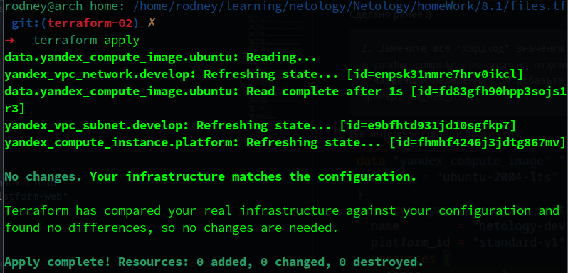

# Домашнее задание к занятию «Основы Terraform. Yandex Cloud»

### Выполнил студент группы DevOps-25 Шаповалов Кирилл

Согласно требованию к выполнению данного ДЗ - создал отдельную ветку командой `git branch terraform-02`, после переключился в нее командой `git checkout terraform-02`. Дальнейшая работа будет вестись в данной ветке:


Чек-лист:

1. Аккаунт в Яндекс.Облаке зарегистрирован, промокод на грант использован.
2. Инструмент Yandex Cloud CLI утснаовлен:

    
3. Исходный код для выполнения задания расположен в директории 02/src.

    

Скопировал все файлы из данного каталога в свой гит в данное ДЗ, все редактирование буду вести тут.

> <b>Задание 0. Группы безопасности в Yandex.Cloud</b>

Функционал групп безопасности изучил, по мере необходимости буду изучать и возвращаться к данному вопросу. Пока понял, что это своего рода фаервол, в котором путем навешивания разных групп можно открывать или запрещать разный трафик а также устанавливать ограничения на сессии и т.д.

Запрос в техпод на подключение данного функционала оформил. Возможность создавать и управлять группами безопасности добавлена к моему облаку.

> <b>Задание 1. Изучить проект, создать первую машину</b>

    1. Изучите проект. В файле variables.tf объявлены переменные для yandex provider.

Изучил.

    2. Переименуйте файл personal.auto.tfvars_example в personal.auto.tfvars. 
    Заполните переменные (идентификаторы облака, токен доступа). 
    Благодаря .gitignore этот файл не попадет в публичный репозиторий. 
    Вы можете выбрать иной способ безопасно передать секретные данные в terraform.

Файл переименовал, данными для своего облака заполнил. Благодаря тому, что данный файл содержится в `.gitignore`, у него изменился статус, если у всех других файлов стоит статус - Untracked, у данного файла пропал какой-либо статус, гит его просто игнорирует.

    3. Сгенерируйте или используйте свой текущий ssh ключ. 
    Запишите его открытую часть в переменную vms_ssh_root_key.

Ключ у меня сгененирован давно, публичную часть ключа записал в переменную `vms_ssh_root_key`:


    4. Инициализируйте проект, выполните код. 
    Исправьте возникшую ошибку. Ответьте в чем заключается ее суть?

Инициализируем проект командой `terraform init`.

Выполняем командой `terraform apply`. Получаем ошибку:


За что я полюбил Terraform, так это за вывод его ошибок - они АБСОЛЮТНО понятны и легко исправимы, он сам тебе говорит - Вот в этой строке ты допустил ошибку. Что касается данной ошибки - в файле `main.tf` для нашего инстанса указано одно ядро vCPU, а платформа `standard-v1` поддерживает либо 2, либо 4 (при `core_fraction = 5`), о чем нам и говорит описание ошибки.

Исправляем, ставим параметр `cores = 2`:


Уничтожим все, что успел насоздавать Terraform, пока не споткнулся об ошибку. Воспользуемся командой `terraform destroy`, а затем заново запустим выполнение проекта.

В этот раз выполнение проекта завершается успешно:


    5. Ответьте, как в процессе обучения могут пригодиться параметры
    preemptible = true и core_fraction=5 в параметрах ВМ? 
    Ответ в документации Yandex cloud.

Скриншот работающей ВМ из консоли Yandex.Cloud:


Скриншот подключения к созданной машине по SSH:


Параметр `preemptible = true` означает, что машина будет прерываемой. То есть она может быть принудительно остановлена в какой-то момент времени (например, когда отработает 24 часа или когда в выбранной зоне доступности обнаружится нехватка ресурсов).

Параметр `core_fraction = 5` отвечает за использование ресурсов ЦПУ. Конкретно в данном случае мы имеем производительность в 5%. Виртуальные машины, у которых задана 100% производительность - получают непрерывный доступ к вычислительным ресурсам процессора, но и стоят дороже.

В сумме два данных параметра влияют на стоимость. Прерываемые виртуальные машины и машины, не использующие 100% доступ к вычислительным ресурсам ЦПУ, стоят у Яндекса дешевле.

> <b>Задание 2. Заменить хардкод переменными</b>

    1. Изучите файлы проекта.

Сделано ранее :)

    2. Замените все "хардкод" значения для ресурсов yandex_compute_image 
    и yandex_compute_instance на отдельные переменные. 
    К названиям переменных ВМ добавьте в начало префикс vm_web_ . 
    Пример: vm_web_name.

Нас интересует вот эти блоки кода:


Все, что здесь задано хардкодом - переведем в переменные (пока в простые, в сложные будем переводить в 6-м задании :) ).

Создал все новые переменные (не стал отдельно упражняться с булевыми переменными, такими как `preemptible = true`, такие вещи как правило все же задаются индивидуально на каждую машину, на мо взгляд).

Список переменных:


Итоговый вид файла `main.tf` (старые значения не удалял, закоментил):


Ну и осталось все это проверить:



Как видим, никаких изменений наш терраформ делать не планирует, а значит замена хардкода на переменные произошла успешно.


> <b>Задание 3. Добавление новой машины в инфраструктуру</b>

    1. Создайте в корне проекта файл 'vms_platform.tf'. 
    Перенесите в него все переменные первой ВМ.


Файл создал, перенес все переменные в данный файл. Листинг приводить не буду (слишком большие скрины получаются :) ), сам файл лежит в папке с файлами проекта ДЗ. При выполнении команды `terrafrom apply` - никакиз изменений, что еще раз доказывает, что Терраформ читает все файлы и слепит их в один.

    2. Скопируйте блок ресурса и создайте с его помощью вторую ВМ
    (в файле main.tf): "netology-develop-platform-db", 
    cores = 2, memory = 2, core_fraction = 20. 
    Объявите ее переменные с префиксом vm_db_ в том же файле ('vms_platform.tf').

Добавляем новый ресурс:


Все переменные прописываем в файле `vms_platform.tf`.

    3. Примените изменения.

Применяем `terraform apply`, видим, что Terraform готов добавить еще одну машину:


Соглашаемся с планом изменений, ждем и проверяем:


В интерфейсе Yandex.Cloud появилась новая машина с заданными параметрами:


> <b>Задание 4. Работа с output.tf</b>

    1. Объявите в файле outputs.tf output типа map, 
    содержащий { instance_name = external_ip } для каждой из ВМ.

    2. Примените изменения.

В качестве решения приложите вывод значений ip-адресов команды `terraform output`.


> <b>Задание 5. Работа с locals.tf</b>

    1. В файле locals.tf опишите в одном local-блоке имя каждой ВМ, 
    используйте интерполяцию ${..} с несколькими переменными по примеру из лекции.

Зададим имя виртуальным машинам, используя интерполяцию:


Теперь в файле `main.tf` имена машинам можно задать так:

```
name = local.vm_web
...
name = local.vm_db
```

    2. Замените переменные с именами ВМ из файла variables.tf на созданные вами local переменные.

Как я писал выше - меняем имена машин в файле `main.tf` и проверяем.

    3. Примените изменения.


Ничего не поменялось, значит все было сделано корректно.


> <b>Задание 6. Использование переменных типа map.</b>

    1. Вместо использования 3-х переменных ".._cores",".._memory",".._core_fraction" 
    в блоке resources {...}, объедените их в переменные типа map 
    с именами "vm_web_resources" и "vm_db_resources".

    2. Так же поступите с блоком metadata {serial-port-enable, ssh-keys}, 
    эта переменная должна быть общая для всех ваших ВМ.

Немного оптимизировал файл `vms_platform.tf`, добавив в общие переменные еще и семейство дистрибутива и версию платформы. Общий вид файла стал такой:


    3. Найдите и удалите все более не используемые переменные проекта.

Нашел. Безжалостно удалил.

    4. Проверьте terraform plan (изменений быть не должно).

Вызов переменных типа `map` на примере одного ресурса:


Проверяем командой `terraform apply`:


Абсолютно ни одного изменения. Вся инфраструктура создана корректно.

ДЗ и так получилось большое, на задачу со * не осталось сил :)