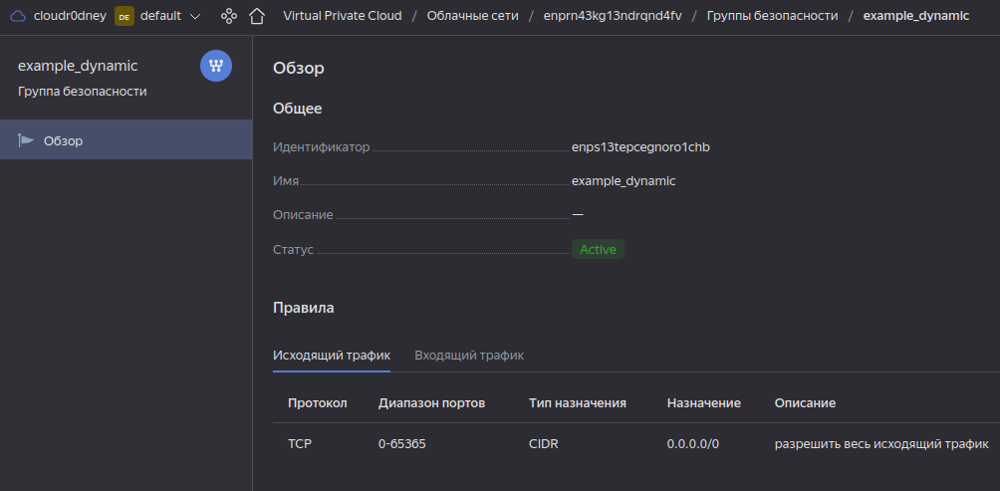
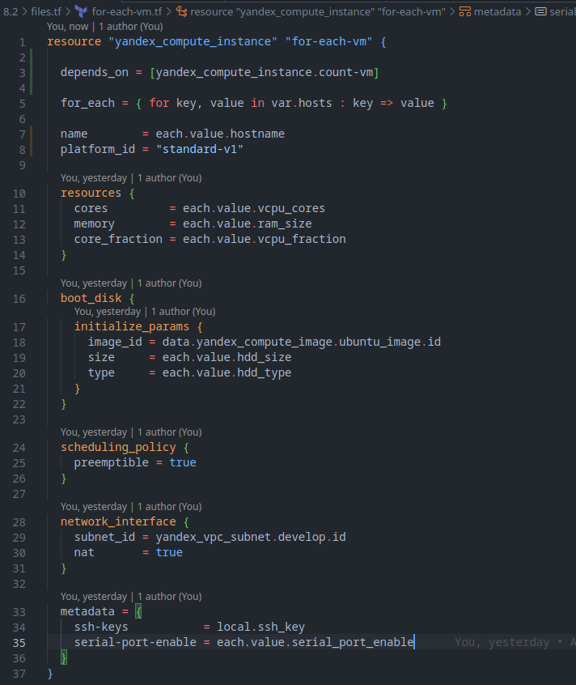

# Домашнее задание к занятию «Управляющие конструкции в коде Terraform»

### Выполнил студент группы DevOps-25 Шаповалов Кирилл

Задание выполнено в ветке `terraform-03`, как того требуют условия выполнения задания.

По чек-листу проходить не будем, он не изменился :) 

Единственное - 4 пункт, условие - Все машины должны быть прерываемые. Это достигается тем, что в коде в блоке `resource` нужно будет добавлять параметр `preemptible = true`.

 

> <b>Задание 1. Инициализация проекта, группы безопасности Yandex.Cloud</b>

    1. Изучите проект.

Изучил, в теории при инициализации и выполнении - у нас должны создаться две группы безопасности с правилами для входящего и исходящего трафика. Проверим это.

    2. Заполните файл personal.auto.tfvars

Заполнил значения `token`, `cloud_id` и `folder_id` своими значениями. Предварительно файл `personal.auto.tfvars` добавлен в файл `.gitignore`.

    3. Инициализируйте проект, выполните код.

`terraform init`

`terraform apply`

    Приложите скриншот входящих правил "Группы безопасности" в ЛК Yandex Cloud 
    или скриншот отказа в предоставлении доступа к preview версии.

Правила для исходящего трафика:

Правила для входящего трафика:

 

> <b>Задание 2. Создание ВМ с помощью count loop и for_each loop.</b>

Выполним подготовительные настройки для данного ДЗ:

* создан файл `locals.tf`, в который с использованием функции `file` записан ssh публичный ключ:

* создан файл `data.tf`, в который записан образ ОС для создаваемых инстансов:

Далее приступаем к самому заданию.

    1. Создайте файл count-vm.tf. Опишите в нем создание двух одинаковых 
    виртуальных машин с минимальными параметрами, 
    используя мета-аргумент count loop.

Опишем создание виртуальных машин в файле `count-vm.tf`:

    2. Создайте файл for_each-vm.tf. Опишите в нем создание 2 разных 
    по cpu/ram/disk виртуальных машин, используя мета-аргумент for_each loop. 
    Используйте переменную типа list(object({ vm_name=string, cpu=number, 
    ram=number, disk=number })). 
    При желании внесите в переменную все возможные параметры.

В файле `for-each-vm.tf` объявил переменную типа `list(object({..}))`, в которую записал все параметры ВМ, которые придумал:

Сам манифест для создания инстансов выглядит следующим образом:

    3. ВМ из пункта 2.2 должны создаваться после создания ВМ из пункта 2.1.

Для выполнения данного условия в манифесте указан мета-аргумент `depends_on` - 7-ая строка кода:

`depends_on = [yandex_compute_instance.count-vm]`

    4. Используйте функцию file в local переменной для считывания ключа ~/.ssh/id_rsa.pub 
    и его последующего использования в блоке metadata, взятому из ДЗ №2.

Для передачи ssh-ключа создан файл `locals.tf`, ssh ключ описан в блоке `locals` и передан с помощью функции `file` (скрин представлен выше в подготовительной части к данному заданию).

    5. Инициализируйте проект, выполните код.

Проект инициализирован, выполняем `terraform apply`:

Проверяем резулььтаты в консоли Yandex.Cloud:

Машины успешно созданы именно с теми ресурсами, которые им были назначены.

 

> <b>Задание 3. Работа с виртуальными дисками</b>

    1. Создайте 3 одинаковых виртуальных диска, размером 1 Гб с помощью ресурса 
    yandex_compute_disk и мета-аргумента count в файле disk_vm.tf .

Создал файл `disk_vm.tf`, изучив документацию Yandex.Cloud - описал создание 3-х дисков:

Выполнил `terraform plan`, чтобы посмотреть что изменилось:

Отлично, Terraform планирует добавить диски именно так, как они были описаны. Выполняем `terraform apply` и проверяем в консоли Yandex.Cloud:

Ошибок в процессе выполнения не происходит и диски успешно созданы, что можно видеть в интерфейсе управления Yandex.Cloud.

    2. Создайте в том же файле одну ВМ c именем "storage". 
    Используйте блок dynamic secondary_disk{..} и мета-аргумент for_each 
    для подключения созданных вами дополнительных дисков.

Опишем создание новой виртуальной машины, обязательно нужно указать параметр `depends_on = [yandex_compute_disk.new-vm-disk]`, для того чтобы новая машина не создалась раньше нужных дисков.

Выполняем код `terraform apply` и идем проверять все в консоли управления Yandex.Cloud.

Убедимся, что машина создалась:

Убедимся, что диски примонтировались к нужной машине:

Как видно, все диски по 1Гб успешно примонтировались к ВМ `storage`. Нужно в этом убедиться окончательно :)

Подключимся к машине `storage` по ssh и командой `fdisk -l` проверим наличие дисков:

Диски успешно подключились. Задание выполнено.

 

> <b>Задание 4. Подготовка inventory-файла для Ansible с использованием Terraform</b>

    1. В файле ansible.tf создайте inventory-файл для ansible. 
    Используйте функцию tepmplatefile и файл-шаблон для создания ansible inventory-файла из лекции. 
    Готовый код возьмите из демонстрации к лекции demonstration2. 
    Передайте в него в качестве переменных группы виртуальных машин из задания 2.1, 2.2 и 3.2.(т.е. 5 ВМ)

Для данного задания создан файл `ansible.tf` следующего содержания:

И файл-шаблон для герации будущего `inventory` файла:

    2. Инвентарь должен содержать 3 группы [webservers], [databases], [storage] 
    и быть динамическим, т.е. обработать как группу из 2-х ВМ так и 999 ВМ.

Для выполнения данного условия файл-шаблон разбит на три группы, в группы `webservers` и `databases` хосты добавляются динамически в зависимости от количества созданных машин в соответствующих файлах, в группу `storage` в данном конкретном примере статически добавляется одна машина, потому что она по условию была создана одна. Если машин-хранилищ несколько - данная группа переписывается аналогично двум предыдущим.

    3. Выполните код. Приложите скриншот получившегося файла.

`terraform apply`

Получившийся файл `inventory`:

 

На этом основная часть заданий выполнена.

### Дополнительные задания

> <b>Задание 5. Написать output, который выведет информацию о созданных ВМ в виде словарей</b>

Для выполнения этого задания создан файл `output.tf` следующего содержания:

Проект инициализирован заново, код выполнен. Вывод команды `terraform output`:

 
К сожалению, никак не успеваю выполнить второе дополнительное задание, сроки начинают поджимать, но я обязательно вникну в него и попробую реализовать потом отдельно :)

 

P.S.: Все файлы, скрины к которым использовались в ДЗ - лежат в папке `files.tf`