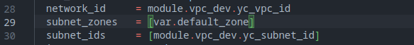

# Домашнее задание к занятию «Продвинутые методы работы с Terraform»

## Выполнил студент группы DevOps-25 Шаповалов Кирилл

 

### Задание 1. Создание ВМ с помощью remote-модуля

    1. Возьмите из демонстрации к лекции готовый код для создания ВМ с помощью remote модуля.

Взял код из примера, добавил его в файл `main.tf` после блоков создания сети и подсети. Отредактировал под свой проект:

    2. Создайте 1 ВМ, используя данный модуль. 
    В файле cloud-init.yml необходимо использовать переменную для ssh ключа вместо хардкода. 
    Передайте ssh-ключ в функцию template_file в блоке vars ={}. 
    Воспользуйтесь примером. Обратите внимание что ssh-authorized-keys 
    принимает в себя список, а не строку!

В файле `variables.tf` задал переменную, содержащую путь до ключа:

В блоке `vars` получил значение ключа и записал его в переменную для передачи в файл `cloud-init`.

    3. Добавьте в файл cloud-init.yml установку nginx.

В файле `cloud-init.yml` прописал в виде переменной имя пользователя и ssh-ключ. Также додбавил установку пакета `nginx`:

    4. Предоставьте скриншот подключения к консоли и вывод команды sudo nginx -t.

Выполнил код - `terraform apply`. Провеярем машину в консоли управления Yandex.Cloud:

Машина создалась. Подключаемся к машине по `ssh` и проверяем наличие установленного пакета `nginx`:

 

### Задание 2. Создание локального модуля для сети и подсети, генерация документации к модулю.

    1. Напишите локальный модуль vpc, который будет создавать 2 ресурса: 
    одну сеть и одну подсеть в зоне, объявленной при вызове модуля. например: ru-central1-a.

Для данного задания написал отдельный локальный модуль `vpc`: 

Описал вызов модуля в главном файле `main.tf`, заменив в нем создание сети и подсети:

Изменил необходимые значения в вызове модуля создания виртуальной машины:

Написал файл `outputs.tf`, он понадобится нам для получения ID сети и подсети немного дальше:

    2. Модуль должен возвращать значения vpc.id и subnet.id

Для этого и был написан файл `outputs.tf` внутри модуля. Осталось только получить значения из данного файла. Написал файл `outputs.tf` для основного кода:

Как видно, здесь происходит получение значений из файла `outputs.tf` модуля `vpc`.

Проверяем, как работает вызов `terraform output` после инициализации и выполнения проекта:

Для генерации файла документации в формате `markdown` нужна утилита `terraform-docs`, которую нужно установить доплнительно. Для моего Linux Arch с подключенным YAY все делается в одну команду:

Проверим:

Вот теперь можно сгенерировать файл документации:

Генерация прошла успешно, файл `README.md` доступен в папке модуля.

 

### Задание 3. Упражнения со state-файлом

    1. Выведите список ресурсов в стейте.

    2. Удалите из стейта модуль vpc.

    3. Импортируйте его обратно. Проверьте terraform plan - изменений быть не должно. 
    Приложите список выполненных команд и вывод.

 

P.S.: Как обычно, все файлы использовавшиеся в проекте, находятся в папке `files.tf`.