# Домашнее задание к занятию 1 «Введение в Ansible»

## Выполнил студент группы DevOps-25 Шаповалов Кирилл

 

### Подготовка к выполнению

    1. Установите Ansible версии 2.10 или выше.

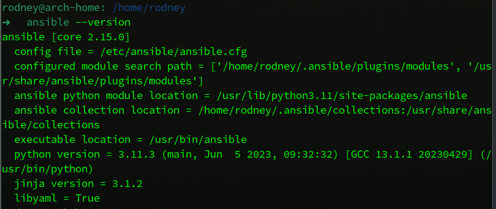

    2. Создайте свой публичный репозиторий на GitHub с произвольным именем.

<a href="https://github.com/nvk-r0dney/Netology" target=_blank>Ссылка на мой GitHub репозиторий  с домашними работами</a>

    3. Скачайте Playbook из репозитория с домашним заданием и перенесите его в свой репозиторий.

Скачал и перенес:

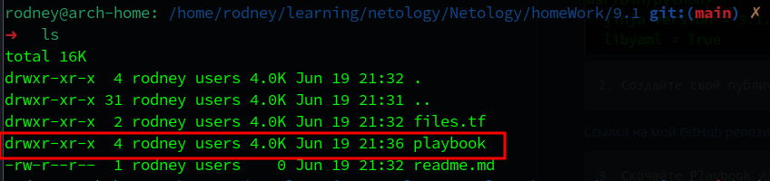

 

### Основная часть

    1. Попробуйте запустить playbook на окружении из test.yml, зафиксируйте значение, 
    которое имеет факт some_fact для указанного хоста при выполнении playbook.

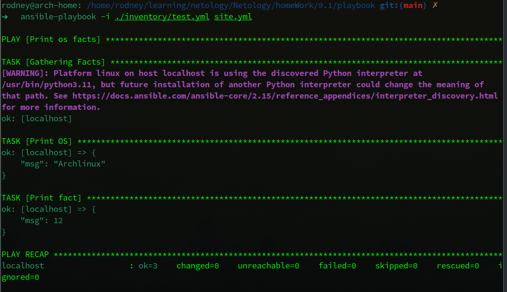

    2. Найдите файл с переменными (group_vars), в котором задаётся найденное в первом пункте значение,
     и поменяйте его на all default fact.

Переменная `some_fact` для всех хостов задана в файле `./group_vars/all/examp.yml` и изначально имеет значение `12`. Меняем значение на нужное по заданию:

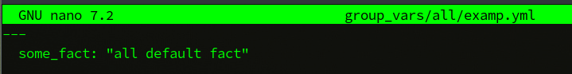

Проверяем:

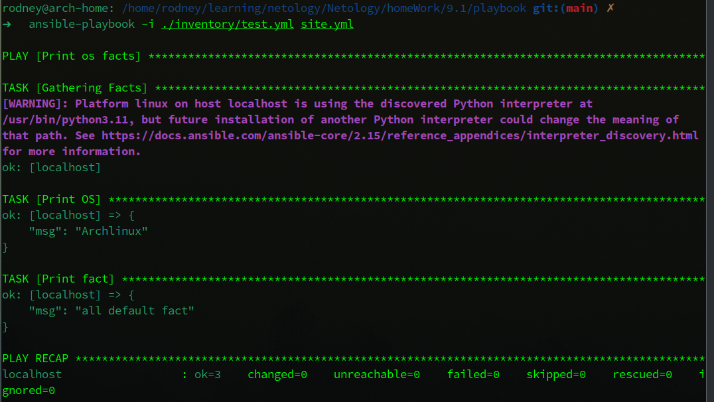

    3. Воспользуйтесь подготовленным (используется docker) или создайте собственное окружение для проведения дальнейших испытаний.

Не стал пользоваться Docker, создал рабочее окружение в Yandex.CLoud при помощи Terraform и локальных модулей (заодно повторил предыдущие темы), получилось так:

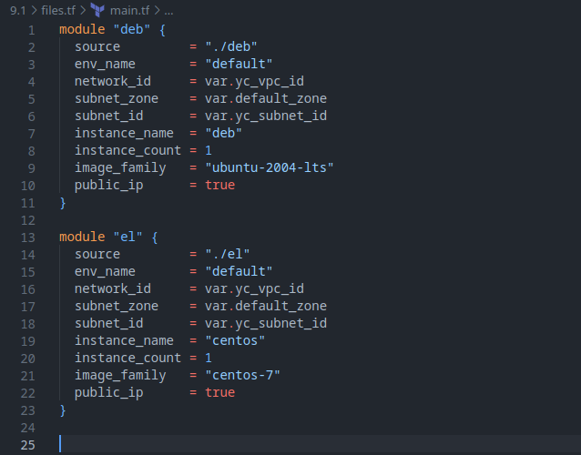

Далее, скопировал публичные адреса машин и внес их в inventory-файл, так же добавил пользователя `ansible_user`:

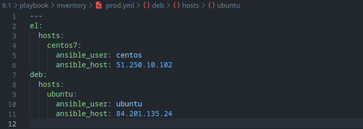

Ну и в самом `playbook` теперь нужно указать `become: true` для получения необходимых привилегий для выполнения `playbook`:

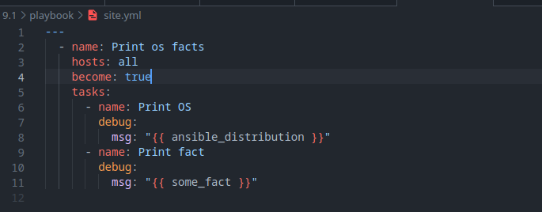

    4. Проведите запуск playbook на окружении из prod.yml. 
    Зафиксируйте полученные значения some_fact для каждого из managed host.

Запустил, `playbook` корректно отработал:

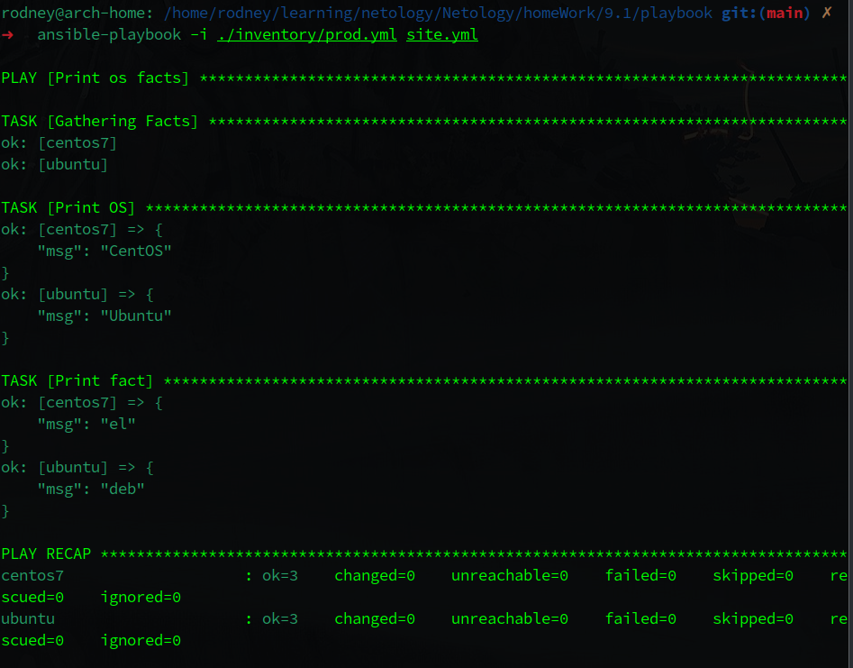

В настоящий момент переменная  `some_fact` вывела значения `el` и `deb` для centos и ubuntu соответственно.

    5. Добавьте факты в group_vars каждой из групп хостов так, чтобы для some_fact получились значения: 
    для deb — deb default fact, для el — el default fact.

Изменил значение переменной `some_fact` в папке `group_vars` в соответствии с условием задачи.

    6. Повторите запуск playbook на окружении prod.yml. 
    Убедитесь, что выдаются корректные значения для всех хостов.

Повторно запустил выполнение `playbook`:

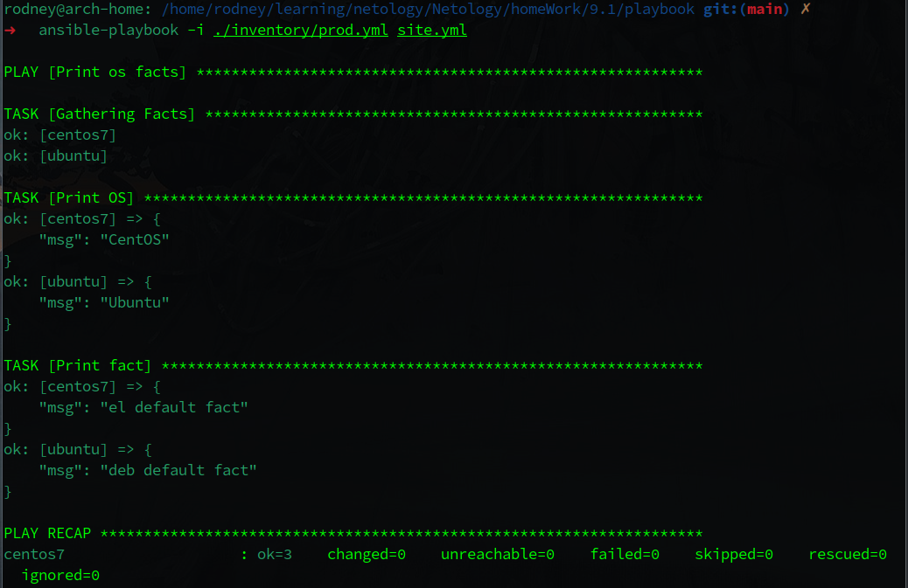

При выполнении были получены требуемые значения.

    7. При помощи ansible-vault зашифруйте факты в group_vars/deb и group_vars/el с паролем netology.

Если я правильно понял условие данной задачи - требуется зашифровать сами файлы `examp.yml` в нужных группах. 

Выполнил шифрование с указанным паролем нужных файлов:

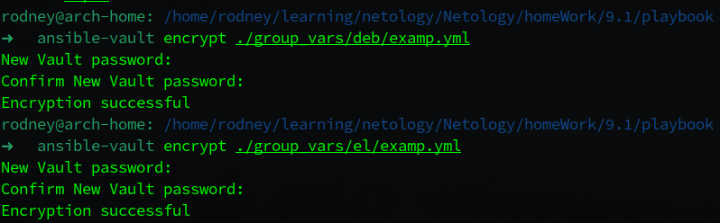

Шифрованные файлы приобрели следующий вид (на примере файла `./group_vars/deb/examp.yml`):

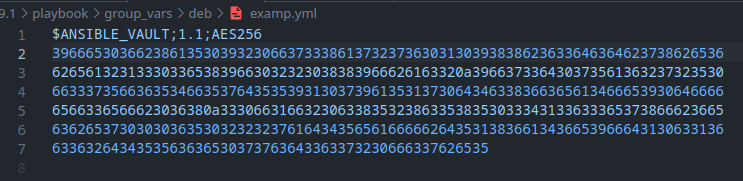

    8. Запустите playbook на окружении prod.yml. При запуске ansible должен запросить у вас пароль. 
    Убедитесь в работоспособности.

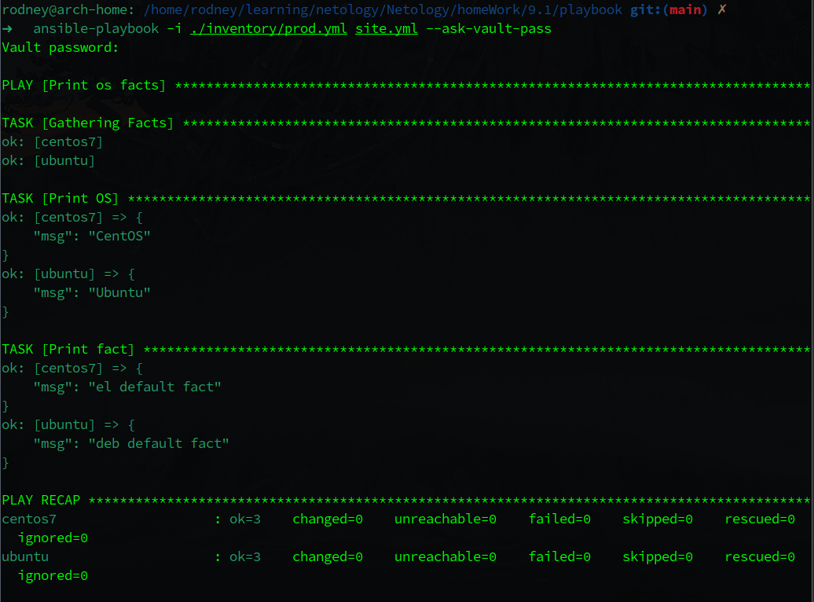

После ввода пароля - `playbook` так же прекрасно выполнился.

    9. Посмотрите при помощи ansible-doc список плагинов для подключения. 
    Выберите подходящий для работы на control node.

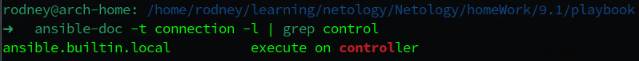

    10. В prod.yml добавьте новую группу хостов с именем local, в ней разместите localhost с необходимым типом подключения.

Отредактировал inventory-файл для prod следубщим образом:

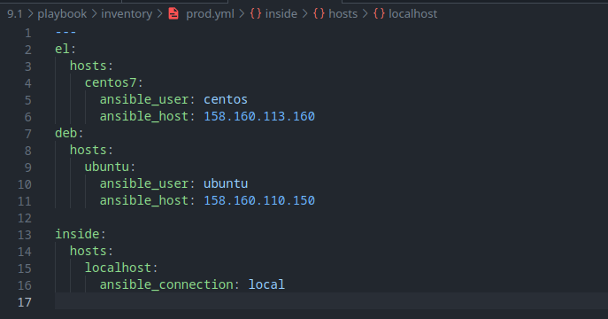

    11. Запустите playbook на окружении prod.yml. При запуске ansible должен запросить у вас пароль. 
    Убедитесь, что факты some_fact для каждого из хостов определены из верных group_vars.

Так как для группы с localhost не задано персональных `group_vars`, Ansible взял значения из all group_vars.

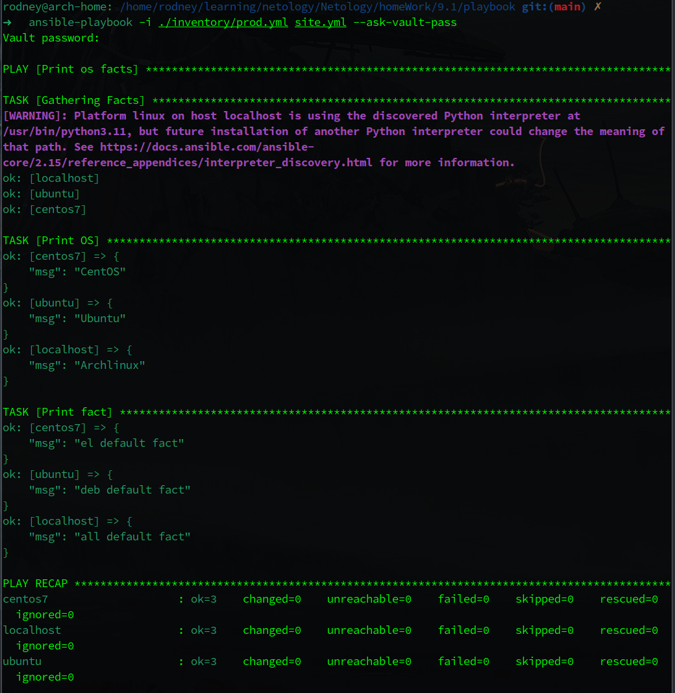

    12. Заполните README.md ответами на вопросы. Сделайте git push в ветку master. 
    В ответе отправьте ссылку на ваш открытый репозиторий с изменённым playbook и заполненным README.md.

Непременно. :)

 

### Необязательная часть

 

    1. При помощи ansible-vault расшифруйте все зашифрованные файлы с переменными.

Расшифровка ранее зашифрованных файлов:

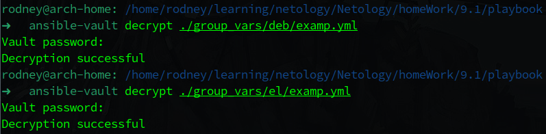

Файлы приняли свой исходный вид.

    2. Зашифруйте отдельное значение PaSSw0rd для переменной some_fact паролем netology. 
    Добавьте полученное значение в group_vars/all/exmp.yml.

Шифруем строку:

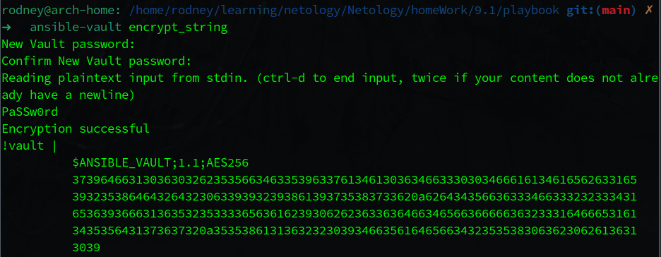

Теперь нужно добавить полученное значение `group_vars` для группы хостов `localhost`:

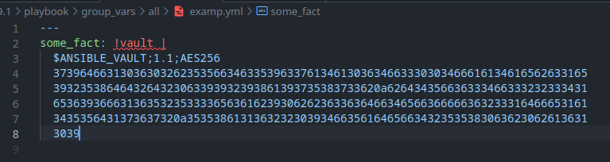

    3. Запустите playbook, убедитесь, что для нужных хостов применился новый fact.

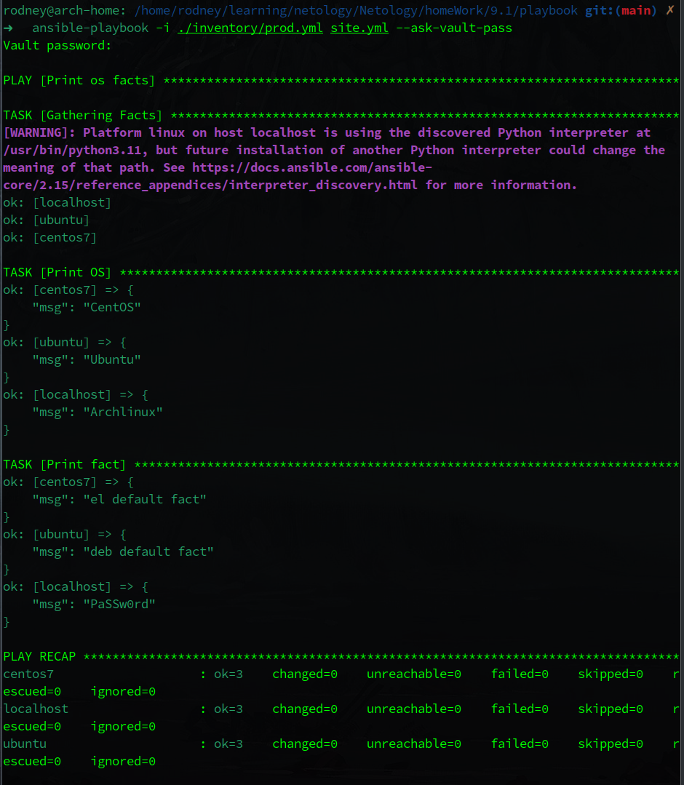

После ввода пароля Ansible показал зашифрованную строку.

    4. Добавьте новую группу хостов fedora, самостоятельно придумайте для неё переменную. 
    В качестве образа можно использовать этот вариант.

Дописал еще один модуль Terraform для создания машины на Fedora:

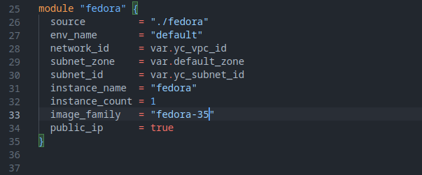

Применил `terraform apply`, идем проверять в консоль управления облаком:

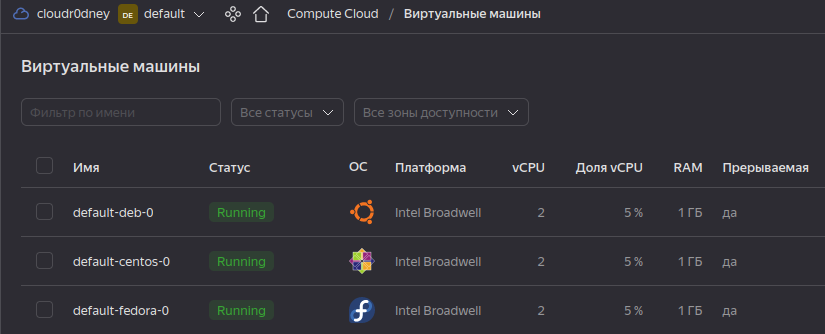

Новая машина с Fedora успешно появилась. Теперь ее нужно включить в inventory-файл и описать для нее group_vars.

Отредактировал inventory-файл:

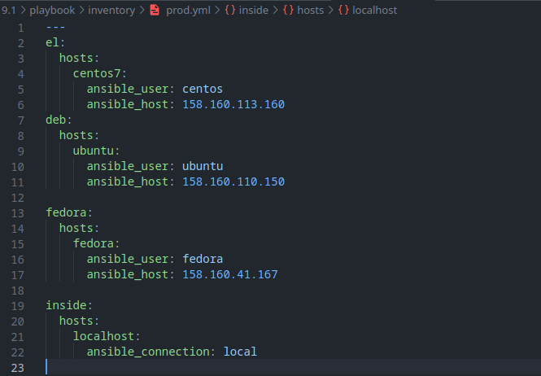

Написал `group_vars` для новой группы с новым хостом по пути `./group_vars/fedora/examp.yml`:

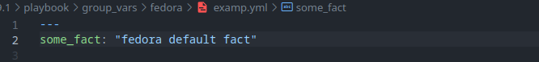

Ну и самое время теперь запустить `playbook`:

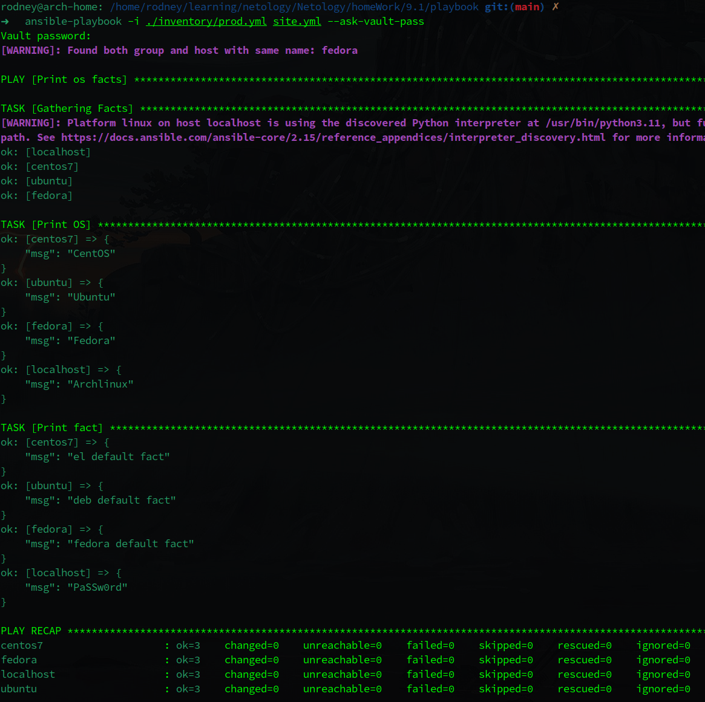

Все прекрасно выполнено.

 

На этом я закончу, позволю себе не выполнять 5 необязательное задание :)

В текущем моем окружении в Terraform необходимо писать формирование inventory-файла по шаблону в самом terraform, поскольку при выполнении скрипта в `bash` машины в облаке будут пересоздаваться с другими IP-адресами, а значит их нужно будет обновлять в inventory-файле.

 

P.S.: Все файлы проекта находятся в своих папках: файлы Terraform - в папке `files.tf`, файлы Ansible - в папке `playbook`