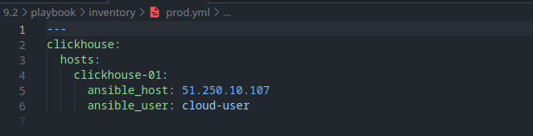
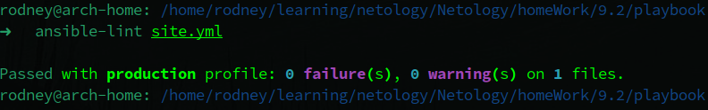
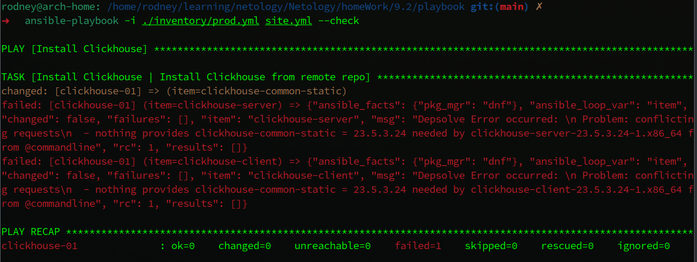
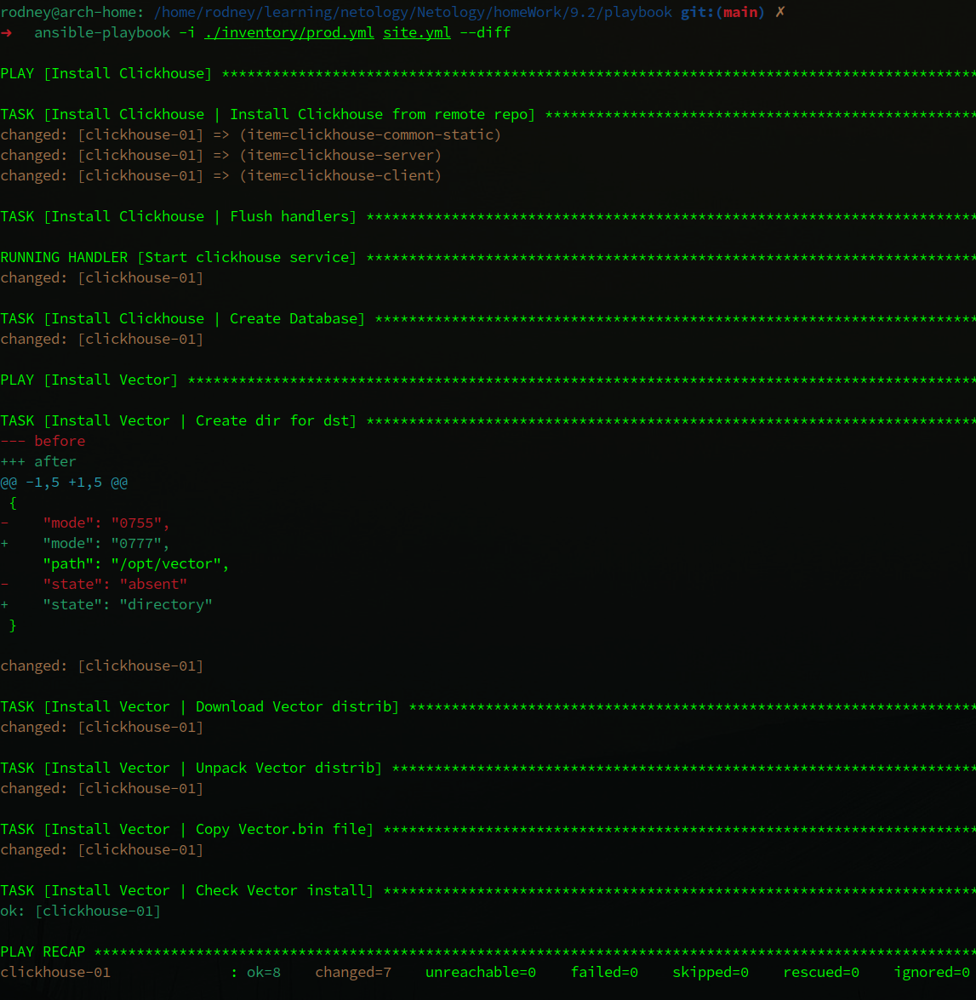
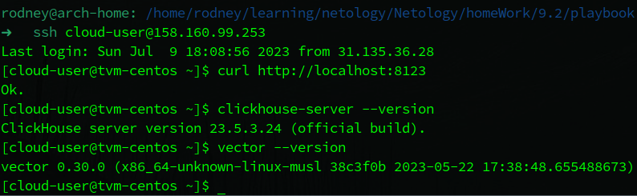
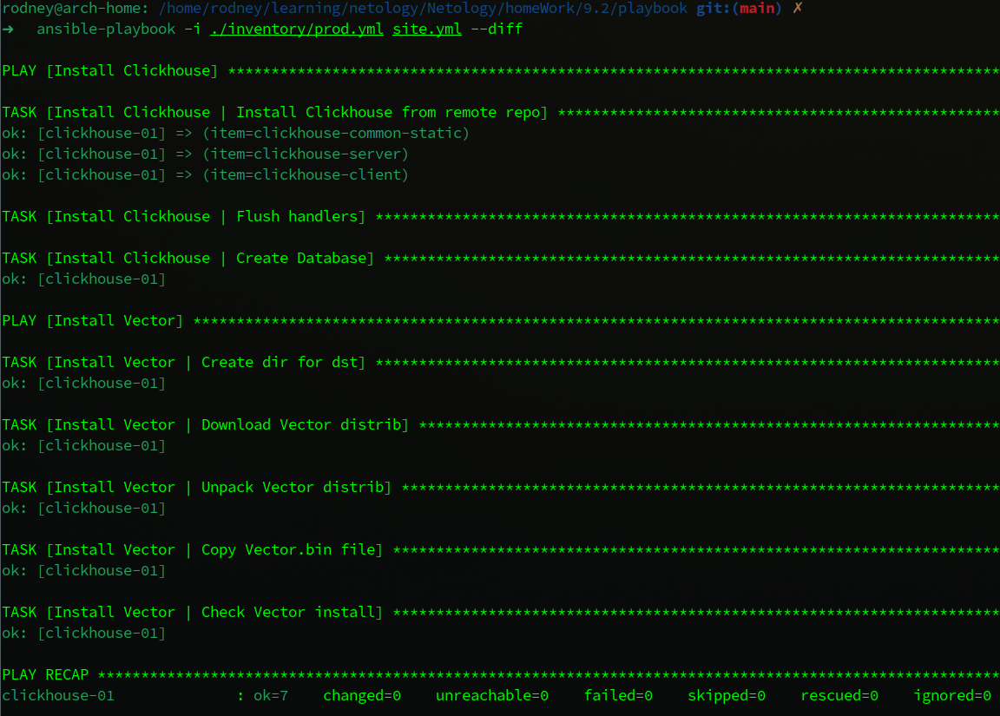

# Домашнее задание к занятию 2 «Работа с Playbook»

## Выполнил студент группы DevOps-25 Шаповалов Кирилл

 

### Основная часть

 

    1. Подготовьте свой inventory-файл prod.yml

В качестве ресурса для виртуальной среды использовал Yandex.Cloud, машина была создана с помощью Terraform. Все файлы приложены в папке `files.tf`.

Inventory-файл `prod.yml` приведен к следующему виду:

    2. Допишите playbook: нужно сделать еще один play, который устанавливает и настраивает vector.

<a href="./playbook/site.yml">Playbook</a> дописан и находится в папке `Playbook`. Так же переписал ту часть, которая устанавливает `Clickhouse` под используемую операционную систему. Использовал установку из удаленных официальных репозиториев `Clickhouse`. Полностью написан `play` по загрузке, распаковке и установке `Vector`.

    3. При создании tasks рекомендую использовать модули: get_url, template, unarchive, file.

Были использованы модули:
* `file` - для создания папки под дистрибутивы;
* `get_url` - для загрузки дистрибутива по указанной ссылке;
* `unarchive` - для распаковки исполняемых файлов;
* `copy` - для копирования файла в нужное расположение;
* `command` - для выполнения команды проверки версии Vector.

 
    
    4. Tasks должны: скачать дистрибутив нужной версии, выполнить распаковку в выбранную директорию, установить vector.

Все это выполняется написанными тасками.

    5. Запустите ansible-lint site.yml и исправьте ошибки, если они есть.

Ошибок не обнаружено.

    6. Попробуйте запустить playbook на этом окружении с флагом --check.

В режиме `--check` получаем закономерную ошибку. Данный режим является симуляцией и не выполняет фактических изменений на клиенте. Для пакетов Clickhouse необходимо наличие пакета `clickhouse-common-static`, и если он не установлен - возникнет ошибка, как в данном случае, так как Ansible не может проверить установку двух других пакетов без наличия указанного выше.

    7. Запустите playbook на prod.yml окружении с флагом --diff. Убедитесь, что изменения на системе произведены.

Режим `--diff` показывает состояние системы `до` и `после`. Это отлично видно на этапе создания папки для дистрибутива, где использование данного режима вывело полный путь до создаваемой папки и права на нее. С учетом того, что использование данного режима может вывести в консоль конфиденциальные данные - использовать его необходимо крайне осторожно, а там где его использовать не нужно - лучше принудительно ограничить, указав в таске `diff: false`.

Зайдем на удаленный сервер и убедимся в том, что необходимые изменения произведены:

Как видно, clickhouse-server успешно установлен и запущен, он откликается по адресу `http://localhost:8123`, Vector необходимой версии также установлен.

    8. Повторно запустите playbook с флагом --diff и убедитесь, что playbook идемпотентен.

Повторный запуск playbook показал, что он полностью идемпотентен.

    9. Подготовьте README.md-файл по своему playbook. В нём должно быть описано: что делает playbook, какие у него есть параметры и теги.

<a href="./playbook/readme.md">Readme</a> по Playbook подготовлен, в нем описано все, что требуется в задании.

    10. Готовый playbook выложите в свой репозиторий, поставьте тег 08-ansible-02-playbook на фиксирующий коммит, в ответ предоставьте ссылку на него.

Выполнено.