# Домашнее задание к занятию 3 «Использование Ansible»

## Выполнил студент группы DevOps-25 Шаповалов Кирилл

 

### Основная часть

 

    1. Допишите playbook: нужно сделать ещё один play, который устанавливает и настраивает LightHouse.

<a href="./playbook/playbook.yml">Playbook</a> для загрузки, установки и настройки Clickhouse, Lighthouse и Vector написан и находится в папке `playbook`.

    2. При создании tasks рекомендую использовать модули: get_url, template, yum, apt.

Были использованы модули: `get_url, dnf, unarchive, template, file, systemd, command, shell, git, service, meta`.

    3. Tasks должны: скачать статику LightHouse, установить Nginx или любой другой веб-сервер, 
    настроить его конфиг для открытия LightHouse, запустить веб-сервер.

Установка и конфигурирование нужных пакетов и самого веб-сервера выполняется в разделе pre_tasks:

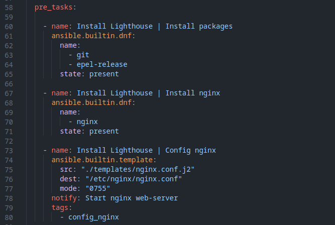

Клонирование репозитория, установка и настройка Lighthouse выполняется в разделе tasks:

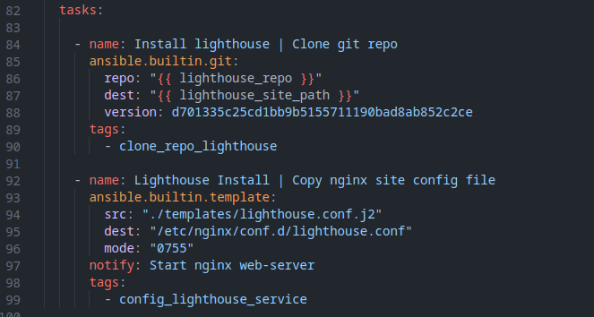

Перезапуск nginx достигается за счет handlers:

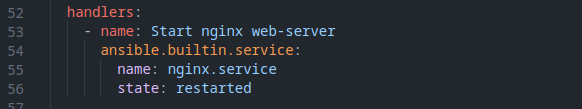

    4. Подготовьте свой inventory-файл prod.yml.

inventory-файл:

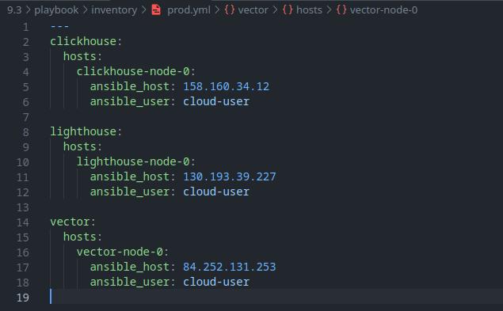

    5. Запустите ansible-lint site.yml и исправьте ошибки, если они есть.

Ошибок не возникло.

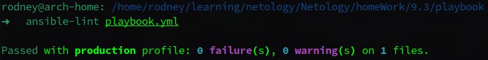

    6. Попробуйте запустить playbook на этом окружении с флагом --check.

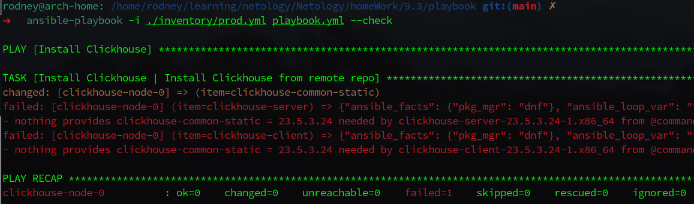

В режиме `--check` получаем закономерную ошибку. Данный режим является симуляцией и не выполняет фактических изменений на клиенте. Для пакетов Clickhouse необходимо наличие пакета `clickhouse-common-static`, и если он не установлен - возникнет ошибка, как в данном случае, так как Ansible не может проверить установку двух других пакетов без наличия указанного выше.

    7. Запустите playbook на prod.yml окружении с флагом --diff. 
    Убедитесь, что изменения на системе произведены.

Режим `--diff` показывает состояние системы `до` и `после`. С учетом того, что playbook формирует конфиг-файлы по заданным шаблонам, вывод исполнения плейбука с ключом `--diff` получился просто огромным, приведу немного из вывода:

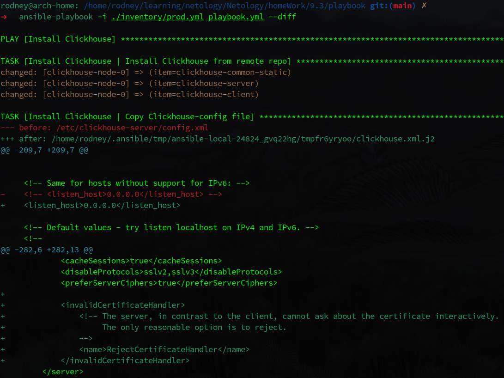
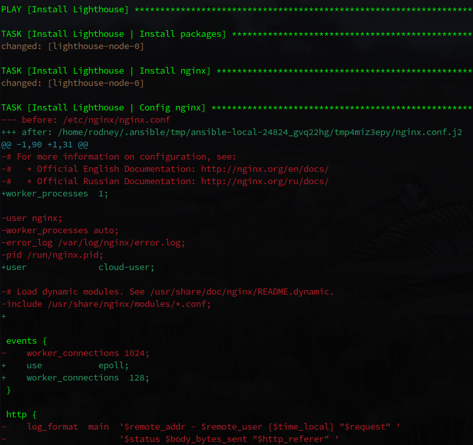
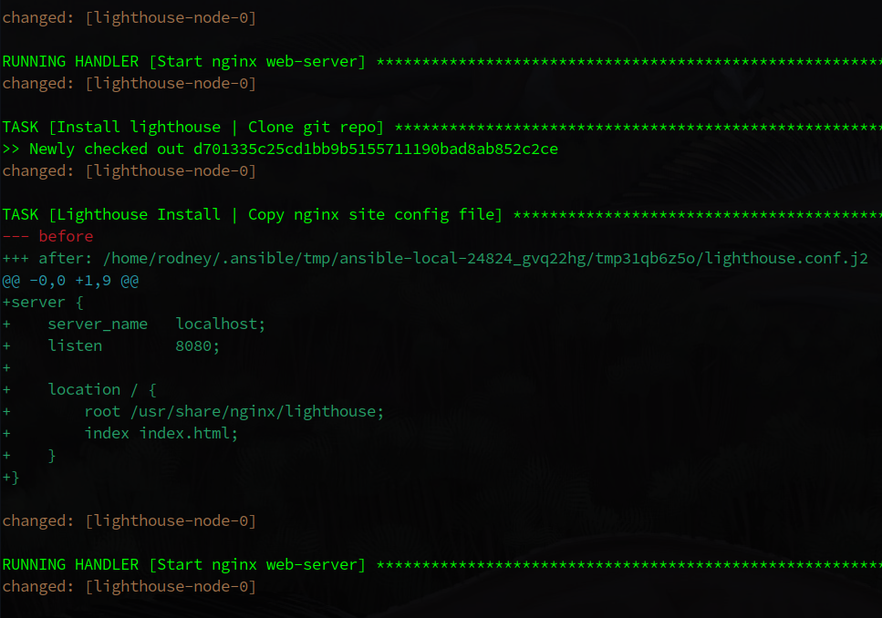
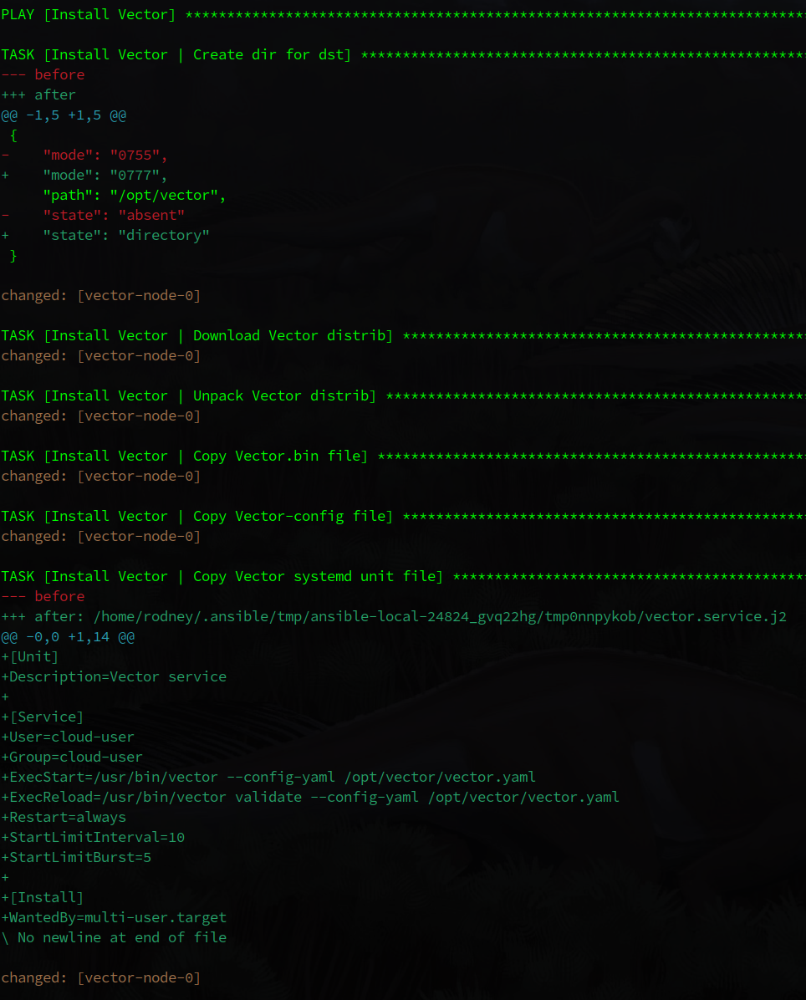
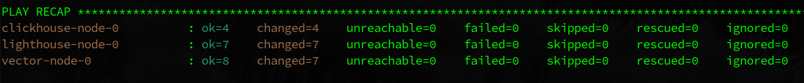

С учетом того, что использование данного режима может вывести в консоль конфиденциальные данные - использовать его необходимо крайне осторожно, а там где его использовать не нужно - лучше принудительно ограничить, указав в таске `diff: false`.

    8. Повторно запустите playbook с флагом --diff и убедитесь, что playbook идемпотентен.

Повторный запуск команды показывает, что плейбук полностью идемпотентен.

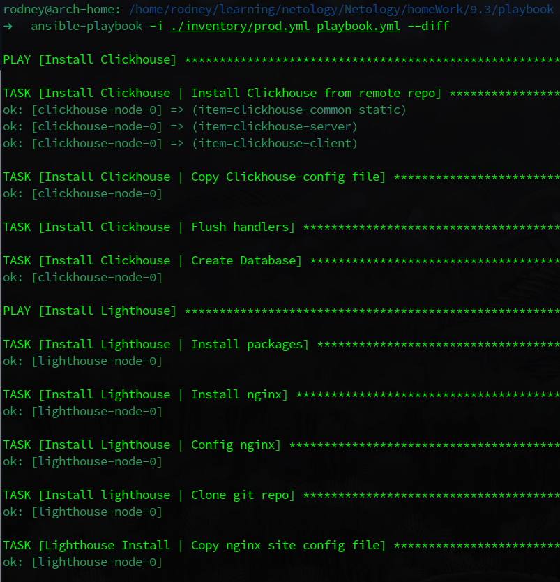
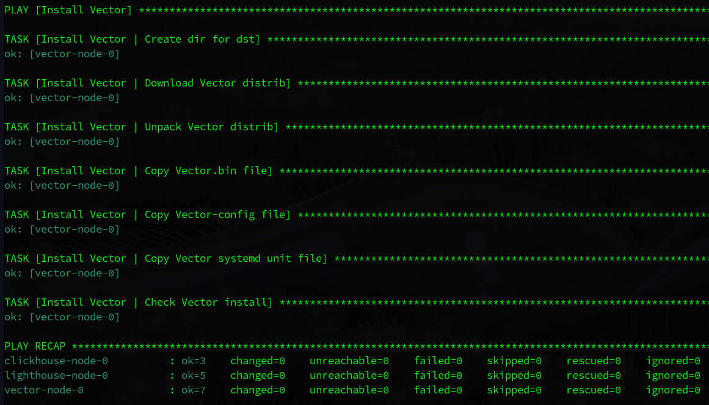

    9. Подготовьте README.md-файл по своему playbook. 
    В нём должно быть описано: что делает playbook, какие у него есть параметры и теги.

<a href="./playbook/readme.md">Readme</a> по Playbook подготовлен, в нем описано все, что требуется в задании.

    10. Готовый playbook выложите в свой репозиторий, 
    поставьте тег 08-ansible-03-yandex на фиксирующий коммит, в ответ предоставьте ссылку на него.

Выполнено.

 

P.S.: Все машины для данного задания создавались в Yandex.Cloud с помощью Terraform и цикла for_each (стараюсь повторять предыдущие уроки :) ). Все файлы Terraform находятся в папке files.tf.