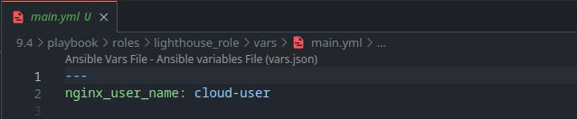

# Домашнее задание к занятию 4 «Работа с Roles»

## Выполнил студент группы DevOps-25 Шаповалов Кирилл

 

Подготовка к выполнению
-----------------------

1. С Lighthouse познакомился при выполнении предыдущего задания.
2. Публичные репозитории создал (ссылки будут в конце задания):

3. Публичный ключ SSH к аккаунту на Github добавлен:

 

Основная часть
--------------

 

### Основная цель - разбить `playbook` на отдельные `roles`.

### Задача - сделать `roles` для `ClickHouse, Vector и LightHouse` и написать `playbook` для использования этих ролей.

### Ожидаемый результат - существуют три ваших репозитория: два с `roles` и один с `playbook`.

 

    1. Создайте в старой версии playbook файл requirements.yml и заполните его содержимым:

    2. При помощи ansible-galaxy скачайте себе эту роль.

    3. Создайте новый каталог с ролью при помощи ansible-galaxy role init vector-role.

    4. На основе tasks из старого playbook заполните новую role. Разнесите переменные между vars и default.

Все переменные разнесены. В `defaults` вынесены переменные, которые можно переопределить пользователю, например, с помощью `group_vars`, в `vars` - те, которые ассоциированы с этой ролью. 

Tasks и Handlers разнесены в `tasks/main.yml` и `handlers/main.yml` соответственно.

    5. Перенести нужные шаблоны конфигов в templates.

Готово.

    6. Опишите в README.md обе роли и их параметры. Пример качественной документации ansible role по ссылке.

<a href='./playbook/roles/vector_role/README.md'>Vector Readme</a> - файл Readme для роли установки и настройки Vector.

<a href='./playbook/roles/lighthouse_role/README.md'>Lighthouse Readme</a> - файл Readme для роли установки и настройки Lighthouse.

    7. Повторите шаги 3–6 для LightHouse. Помните, что одна роль должна настраивать один продукт.

Выполнено.

    8. Выложите все roles в репозитории. Проставьте теги, используя семантическую нумерацию. 
    Добавьте roles в requirements.yml в playbook.

Роли добавлены в соответствующие репозитории. Итоговый вид файла `requirements.yml`:

Проверим скачивание ролей:

    9. Переработайте playbook на использование roles. 
    Не забудьте про зависимости LightHouse и возможности совмещения roles с tasks.

Playbook переработан, приведен к следующему виду:

    10. Выложите playbook в репозиторий.

<a href='./playbook/install.yml'>Playbook</a>

    11. В ответе дайте ссылки на оба репозитория с roles и одну ссылку на репозиторий с playbook.

Репозиторий с Vector-role - <a href='https://github.com/nvk-r0dney/vector-role'>ссылка</a>

Репозиторий с Lighthouse-role - <a href='https://github.com/nvk-r0dney/lighthouse-role'>ссылка</a>

Репозиторий с Playbook - <a href='https://github.com/nvk-r0dney/Netology/tree/main/homeWork/9.4/playbook'>ссылка</a>